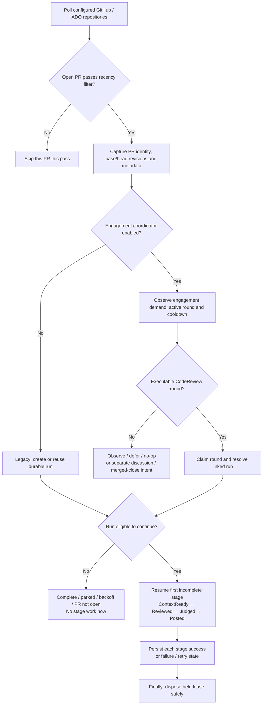
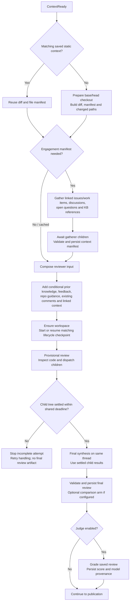
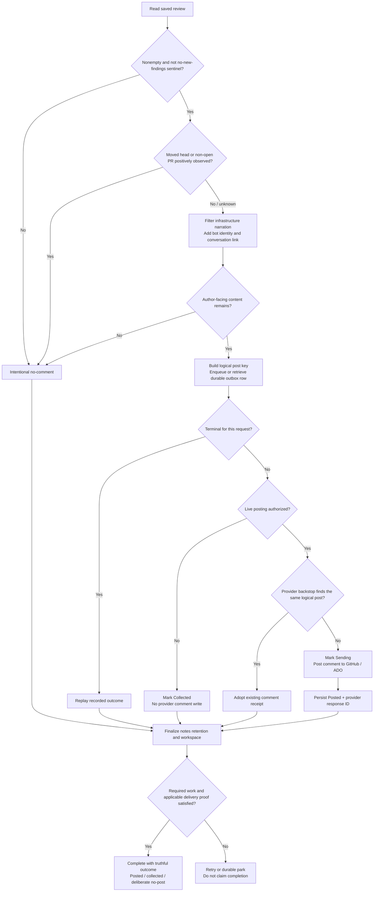
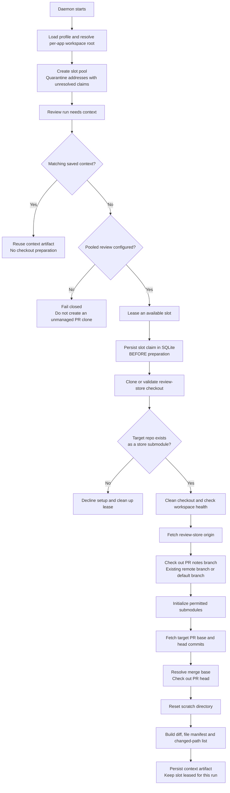
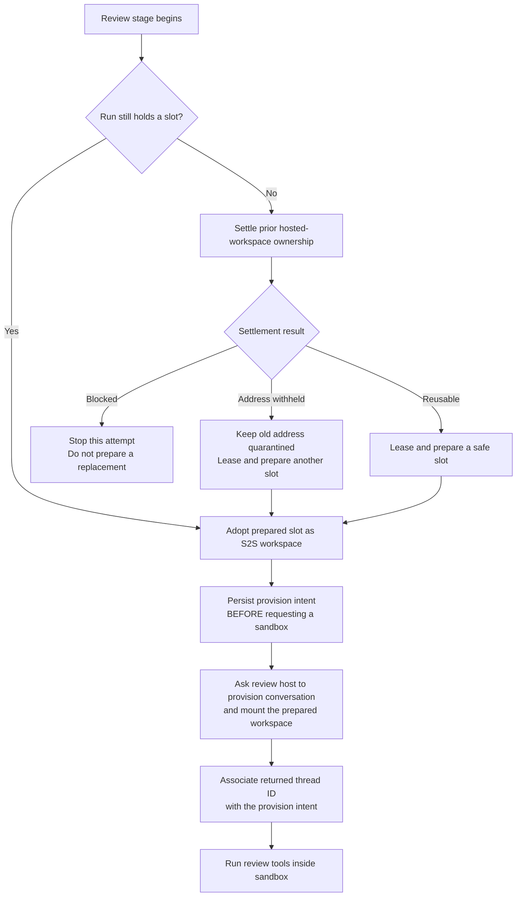
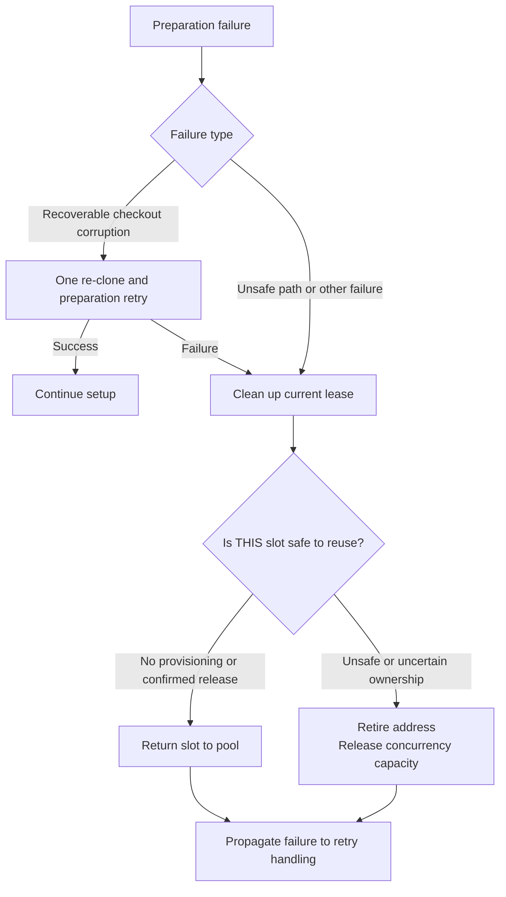

# Review daemon — PR lifecycle, review and workspace setup

Source: commit `48310974`. Production S2S path. Source inspection, not a live-service trace.

**The daemon prepares Git on the host first. The review host mounts it into a sandbox later.**

## PR lifecycle — discovery and admission

- **PR**: the provider's pull request. It can receive new commits and discussion over time.
- **Engagement**: durable per-PR coordination state. **Round**: one admitted intent.
- **Run**: persisted execution record for a particular review identity. Repeated polling need not create new work.
- Both legacy and engagement CodeReview paths use the same five-stage machine.
- Engagement execution requires rollout eligibility, cutover seeding and shadow mode off. Optional paths shown are not claims about deployed configuration.
- Stage failures resume from the last completed stage. Governed failures use backoff and durable limits; persistent governed failure can park the run.

## Context and review — inputs before findings

- Saved static context matches **schema + BaseSha + HeadSha**, not directory existence or a live mount.
- Dynamic gathering is engagement-only and skips a matching saved manifest. It does not publish the review.
- Failure to fetch existing PR comments marks dedup context lost and later withdraws live posting authorization.
- A provisional answer is a **checkpoint**, not the final review. Synthesis waits for the child-completion barrier.
- Checkpoints match workspace/model/modality/tool mode/input generations. Resume preserves the absolute deadline and accepted-turn identity where compatible.
- A first-review lone no-new-findings sentinel is rejected rather than silently accepted.
- Optional grading is **not a score-based publication veto** in this stage executor. It can be self-graded when the effective judge and generator models match.
- Context-exhaustion recovery may use fresh attempt threads; it does not reset the shared deadline.

## Publication — comment delivery versus completion

- The head/lifecycle guards suppress only **positively observed** change. Unknown reads continue; they do not prove freshness. ADO head state can lag a push.
- **ReviewPoster uses the outbox for the PR comment itself.** It is not just a notes-push mechanism.
- Live posting authorization requires posting enabled and dedup context not lost. Current restrictions are not overridden by a run's original mode.
- `Posted` rows are replay-terminal. `Collected` rows are terminal only while still unauthorized; later authorization can reopen the request.
- The provider backstop handles a crash after a comment landed but before its local receipt was saved.
- `Sending` is not proof of delivery. An authorized post-mode attempt must have a proven outcome; replay requires a Posted row and receipt.
- Finalization retains notes and settles workspace ownership **after** the provider boundary. Its failure remains retryable/governed without reposting the same logical comment.
- **Posted is a stage name, not a guarantee of a new public comment.** Collect-only and intentional no-post outcomes can complete truthfully.
- Errors before finalization propagate through orchestration; the graph shows the normal decision paths, not every exception edge.

### PR-flow source references

All below are under `samples/CodeReviewDaemon.Sample/`:

- `Orchestration/PrPollingService.cs:265` — discovery and routing.
- `Orchestration/PrEngagementCoordinator.cs:41` — per-PR admission.
- `Orchestration/EngagementRoundExecutionPolicy.cs:24` — rollout/shadow gates.
- `Orchestration/PrOrchestrator.cs:125` — stage resume, retry and completion.
- `Orchestration/DaemonReviewStageExecutor.cs:1154,1372` — static and dynamic context.
- Same executor `:4314,4888,4908,4935` — checkpoint, provisional turn, barrier and synthesis.
- Same executor `:5644,5899,5993,6148` — optional judge, posting, finalization and public body.
- `Orchestration/ReviewPoster.cs:37` — comment outbox, authorization, backstop and receipt.

## 1. Choose and prepare a workspace

## 2. Mount the prepared workspace for review

## 3. If preparation fails

Recovery is simplified here: repeated generic preparation failures can also trigger the existing recovery escalator. Unsafe-path and unanswered-probe failures are excluded from blind re-cloning.

## What the fix changes

Uncertainty about an **old slot** no longer forces retirement of a **fresh, never-provisioned slot**. Claim identity, conflicting ownership and physical-path safety still gate reuse.

The **host-retention checkout** is separate. It stores/pushes review artifacts. It is not a pooled slot and is not mounted into the review sandbox.

## Source references

Paths relative to the repository root:

- `samples/CodeReviewDaemon.Sample/Program.cs:712` — pool wiring.
- `samples/CodeReviewDaemon.Sample/Orchestration/DaemonReviewStageExecutor.cs:1561` — lease and durable claim.
- `samples/CodeReviewDaemon.Sample/Workspace/ReviewSlotPreparer.cs:230` — checkout preparation.
- `samples/CodeReviewDaemon.Sample/Orchestration/DaemonReviewStageExecutor.cs:1733` — failed-setup cleanup.
- `samples/CodeReviewDaemon.Sample/Agents/S2SReviewAgent.cs:349` — intent before provisioning.

Companion: [Offline HTML diagrams](workspace-setup.html).
