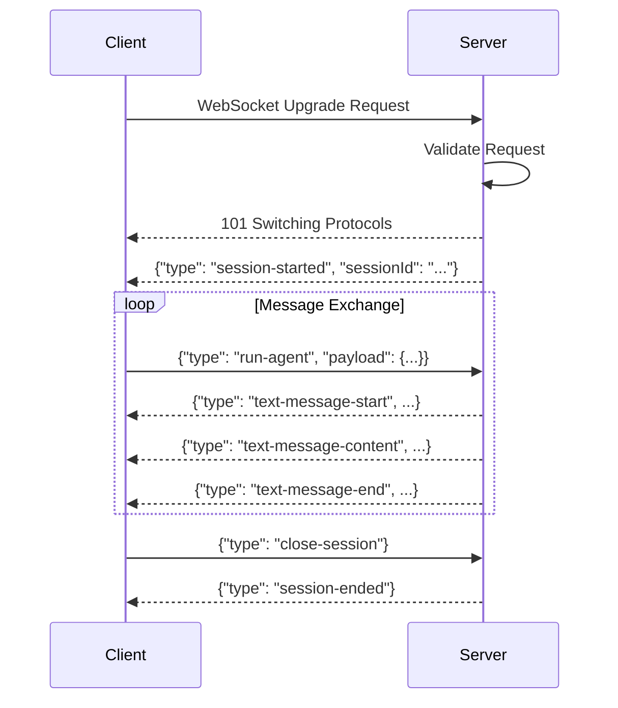

# AG-UI API Reference

Comprehensive API documentation for all public interfaces, services, and extension methods in the AG-UI integration.

## Table of Contents
1. [Protocol Layer APIs](#protocol-layer-apis)
2. [ASP.NET Core Layer APIs](#aspnetcore-layer-apis)
3. [WebSocket Endpoints](#websocket-endpoints)
4. [Service Interfaces](#service-interfaces)
5. [Extension Methods](#extension-methods)
6. [Configuration APIs](#configuration-apis)

## Protocol Layer APIs

### IAgUiProtocolHandler

Primary interface for handling AG-UI protocol requests.

```csharp
namespace AchieveAi.LmDotnetTools.AgUi.Protocol
{
    /// <summary>
    /// Handles AG-UI protocol requests and orchestrates agent execution
    /// </summary>
    public interface IAgUiProtocolHandler
    {
        /// <summary>
        /// Processes a RunAgentInput request and streams AG-UI events
        /// </summary>
        /// <param name="request">The run agent input request</param>
        /// <param name="sessionId">Optional session ID for continuity</param>
        /// <param name="ct">Cancellation token</param>
        /// <returns>Async enumerable of AG-UI events</returns>
        IAsyncEnumerable<AgUiEventBase> ProcessRequestAsync(
            RunAgentInput request,
            string? sessionId = null,
            CancellationToken ct = default);

        /// <summary>
        /// Validates a request before processing
        /// </summary>
        /// <param name="request">The request to validate</param>
        /// <returns>Validation result with any errors</returns>
        ValidationResult ValidateRequest(RunAgentInput request);

        /// <summary>
        /// Gets the current session state
        /// </summary>
        /// <param name="sessionId">Session identifier</param>
        /// <param name="ct">Cancellation token</param>
        /// <returns>Session state dictionary or null if not found</returns>
        Task<Dictionary<string, object>?> GetSessionStateAsync(
            string sessionId,
            CancellationToken ct = default);

        /// <summary>
        /// Ends a session and performs cleanup
        /// </summary>
        /// <param name="sessionId">Session identifier</param>
        /// <param name="ct">Cancellation token</param>
        Task EndSessionAsync(string sessionId, CancellationToken ct = default);
    }
}
```

### IEventStreamingService

Service for converting LmCore messages to AG-UI events.

```csharp
namespace AchieveAi.LmDotnetTools.AgUi.Protocol
{
    /// <summary>
    /// Converts LmCore message streams to AG-UI event streams
    /// </summary>
    public interface IEventStreamingService
    {
        /// <summary>
        /// Converts an async enumerable of IMessage to AG-UI events
        /// </summary>
        /// <param name="messages">Source message stream from LmCore</param>
        /// <param name="sessionId">Session identifier for correlation</param>
        /// <param name="options">Streaming options</param>
        /// <param name="ct">Cancellation token</param>
        /// <returns>Stream of AG-UI events</returns>
        IAsyncEnumerable<AgUiEventBase> StreamEventsAsync(
            IAsyncEnumerable<IMessage> messages,
            string sessionId,
            StreamingOptions? options = null,
            CancellationToken ct = default);

        /// <summary>
        /// Subscribes to events for a specific session
        /// </summary>
        /// <param name="sessionId">Session to subscribe to</param>
        /// <param name="ct">Cancellation token</param>
        /// <returns>Stream of events for the session</returns>
        IAsyncEnumerable<AgUiEventBase> SubscribeToSessionAsync(
            string sessionId,
            CancellationToken ct = default);
    }

    /// <summary>
    /// Options for event streaming
    /// </summary>
    public class StreamingOptions
    {
        /// <summary>
        /// Maximum chunk size for text streaming (default: 4096)
        /// </summary>
        public int MaxChunkSize { get; set; } = 4096;

        /// <summary>
        /// Enable event batching (default: false)
        /// </summary>
        public bool EnableBatching { get; set; }

        /// <summary>
        /// Batch size when batching is enabled (default: 10)
        /// </summary>
        public int BatchSize { get; set; } = 10;

        /// <summary>
        /// Batch timeout in milliseconds (default: 100)
        /// </summary>
        public int BatchTimeoutMs { get; set; } = 100;

        /// <summary>
        /// Include metadata in events (default: true)
        /// </summary>
        public bool IncludeMetadata { get; set; } = true;
    }
}
```

### IToolCallTracker

Tracks and correlates tool calls across the session.

```csharp
namespace AchieveAi.LmDotnetTools.AgUi.Protocol
{
    /// <summary>
    /// Tracks tool call state and correlation
    /// </summary>
    public interface IToolCallTracker
    {
        /// <summary>
        /// Gets or creates a tool call ID
        /// </summary>
        /// <param name="internalId">Internal LmCore tool call ID</param>
        /// <returns>AG-UI tool call ID</returns>
        string GetOrCreateToolCallId(string internalId);

        /// <summary>
        /// Gets an existing tool call ID
        /// </summary>
        /// <param name="internalId">Internal LmCore tool call ID</param>
        /// <returns>AG-UI tool call ID or null if not found</returns>
        string? GetToolCallId(string internalId);

        /// <summary>
        /// Tracks tool call start
        /// </summary>
        /// <param name="toolCallId">Tool call identifier</param>
        /// <param name="toolName">Name of the tool being called</param>
        /// <param name="sessionId">Session identifier</param>
        Task TrackToolCallStartAsync(
            string toolCallId,
            string toolName,
            string sessionId);

        /// <summary>
        /// Tracks tool call completion
        /// </summary>
        /// <param name="toolCallId">Tool call identifier</param>
        /// <param name="result">Tool execution result</param>
        /// <param name="success">Whether execution succeeded</param>
        Task TrackToolCallCompleteAsync(
            string toolCallId,
            object? result,
            bool success);

        /// <summary>
        /// Gets pending tool calls for a session
        /// </summary>
        /// <param name="sessionId">Session identifier</param>
        /// <returns>Collection of pending tool call IDs</returns>
        IEnumerable<string> GetPendingToolCalls(string sessionId);

        /// <summary>
        /// Clears tracking data for a session
        /// </summary>
        /// <param name="sessionId">Session identifier</param>
        void ClearSession(string sessionId);
    }
}
```

## ASP.NET Core Layer APIs

### WebSocket Handler

```csharp
namespace AchieveAi.LmDotnetTools.AgUi.AspNetCore
{
    /// <summary>
    /// Handles WebSocket connections for AG-UI protocol
    /// </summary>
    public class AgUiWebSocketHandler
    {
        /// <summary>
        /// Handles incoming WebSocket connection
        /// </summary>
        /// <param name="context">HTTP context containing the WebSocket</param>
        /// <param name="ct">Cancellation token</param>
        public async Task HandleWebSocketAsync(
            HttpContext context,
            CancellationToken ct = default)
        {
            // Implementation
        }

        /// <summary>
        /// Validates WebSocket upgrade request
        /// </summary>
        /// <param name="context">HTTP context</param>
        /// <returns>True if request is valid</returns>
        public bool ValidateWebSocketRequest(HttpContext context)
        {
            // Implementation
        }
    }
}
```

### Middleware Configuration

```csharp
namespace AchieveAi.LmDotnetTools.AgUi.AspNetCore
{
    /// <summary>
    /// ASP.NET Core middleware for AG-UI protocol
    /// </summary>
    public class AgUiMiddleware
    {
        private readonly RequestDelegate _next;
        private readonly AgUiWebSocketHandler _handler;
        private readonly AgUiOptions _options;

        public AgUiMiddleware(
            RequestDelegate next,
            AgUiWebSocketHandler handler,
            IOptions<AgUiOptions> options)
        {
            _next = next;
            _handler = handler;
            _options = options.Value;
        }

        /// <summary>
        /// Processes HTTP requests for AG-UI endpoints
        /// </summary>
        public async Task InvokeAsync(HttpContext context)
        {
            if (context.Request.Path.StartsWithSegments(_options.EndpointPath))
            {
                if (context.WebSockets.IsWebSocketRequest)
                {
                    await _handler.HandleWebSocketAsync(context);
                }
                else
                {
                    context.Response.StatusCode = StatusCodes.Status400BadRequest;
                    await context.Response.WriteAsync("WebSocket connection required");
                }
            }
            else
            {
                await _next(context);
            }
        }
    }
}
```

## WebSocket Endpoints

### Connection Endpoint

**URL**: `/ag-ui/ws`
**Protocol**: WebSocket
**Authentication**: Optional (configurable)

#### Connection Flow



### Message Types

#### Client → Server Messages

```typescript
interface ClientMessage {
    type: "run-agent" | "get-state" | "close-session" | "ping";
    payload?: any;
    id?: string;
}

interface RunAgentMessage extends ClientMessage {
    type: "run-agent";
    payload: {
        message: string;
        history?: Message[];
        context?: Record<string, any>;
        configuration?: {
            temperature?: number;
            maxTokens?: number;
            model?: string;
            enabledTools?: string[];
        };
    };
}
```

#### Server → Client Events

All events follow the AG-UI protocol specification. See [Data Models](./data-models.md) for complete event definitions.

## Service Interfaces

### Dependency Injection Configuration

```csharp
namespace Microsoft.Extensions.DependencyInjection
{
    public static class AgUiServiceCollectionExtensions
    {
        /// <summary>
        /// Adds AG-UI services to the service collection
        /// </summary>
        /// <param name="services">Service collection</param>
        /// <param name="configureOptions">Options configuration delegate</param>
        /// <returns>Service collection for chaining</returns>
        public static IServiceCollection AddAgUi(
            this IServiceCollection services,
            Action<AgUiOptions>? configureOptions = null)
        {
            // Configure options
            if (configureOptions != null)
            {
                services.Configure(configureOptions);
            }

            // Register core services
            services.AddSingleton<IAgUiProtocolHandler, AgUiProtocolHandler>();
            services.AddSingleton<IEventStreamingService, EventStreamingService>();
            services.AddSingleton<IToolCallTracker, ToolCallTracker>();
            services.AddSingleton<IEventPublisher, ChannelEventPublisher>();
            services.AddSingleton<IMessageConverter, MessageToAgUiConverter>();

            // Register WebSocket handler
            services.AddSingleton<AgUiWebSocketHandler>();

            // Register optional persistence
            services.AddSingleton<ISessionManager, SessionManager>();

            return services;
        }

        /// <summary>
        /// Adds AG-UI with SQLite persistence
        /// </summary>
        public static IServiceCollection AddAgUiWithSqlite(
            this IServiceCollection services,
            string connectionString,
            Action<AgUiOptions>? configureOptions = null)
        {
            services.AddAgUi(configureOptions);

            // Add SQLite repositories
            services.AddSingleton<IDbConnectionFactory>(sp =>
                new SqliteConnectionFactory(connectionString));

            services.AddSingleton<ISessionRepository, SqliteSessionRepository>();
            services.AddSingleton<IEventRepository, SqliteEventRepository>();
            services.AddSingleton<IMessageRepository, SqliteMessageRepository>();

            // Add migration service
            services.AddSingleton<IDatabaseMigrator, SqliteMigrator>();

            return services;
        }
    }
}
```

### Application Builder Extensions

```csharp
namespace Microsoft.AspNetCore.Builder
{
    public static class AgUiApplicationBuilderExtensions
    {
        /// <summary>
        /// Adds AG-UI middleware to the pipeline
        /// </summary>
        public static IApplicationBuilder UseAgUi(this IApplicationBuilder app)
        {
            // Enable WebSockets if not already enabled
            app.UseWebSockets(new WebSocketOptions
            {
                KeepAliveInterval = TimeSpan.FromSeconds(30)
            });

            // Add AG-UI middleware
            app.UseMiddleware<AgUiMiddleware>();

            return app;
        }

        /// <summary>
        /// Maps AG-UI endpoints
        /// </summary>
        public static IEndpointRouteBuilder MapAgUi(
            this IEndpointRouteBuilder endpoints,
            string pattern = "/ag-ui/ws")
        {
            endpoints.Map(pattern, async context =>
            {
                var handler = context.RequestServices.GetRequiredService<AgUiWebSocketHandler>();
                await handler.HandleWebSocketAsync(context);
            });

            return endpoints;
        }

        /// <summary>
        /// Runs database migrations for AG-UI persistence
        /// </summary>
        public static async Task<IApplicationBuilder> MigrateAgUiDatabaseAsync(
            this IApplicationBuilder app)
        {
            using var scope = app.ApplicationServices.CreateScope();
            var migrator = scope.ServiceProvider.GetService<IDatabaseMigrator>();

            if (migrator != null)
            {
                await migrator.MigrateAsync();
            }

            return app;
        }
    }
}
```

## Extension Methods

### Agent Extensions

```csharp
namespace AchieveAi.LmDotnetTools.AgUi.Extensions
{
    public static class AgentExtensions
    {
        /// <summary>
        /// Configures an agent for AG-UI streaming
        /// </summary>
        public static IStreamingAgent WithAgUiSupport(
            this IStreamingAgent agent,
            IServiceProvider services)
        {
            var middleware = services.GetRequiredService<AgUiStreamingMiddleware>();
            return agent.WithMiddleware(middleware);
        }

        /// <summary>
        /// Creates an AG-UI enabled agent from a base agent
        /// </summary>
        public static IStreamingAgent CreateAgUiAgent(
            this IStreamingAgent baseAgent,
            Action<AgUiAgentBuilder>? configure = null)
        {
            var builder = new AgUiAgentBuilder(baseAgent);
            configure?.Invoke(builder);
            return builder.Build();
        }
    }

    /// <summary>
    /// Builder for configuring AG-UI agents
    /// </summary>
    public class AgUiAgentBuilder
    {
        private readonly IStreamingAgent _baseAgent;
        private readonly List<IStreamingMiddleware> _middlewares = new();
        private AgUiMiddlewareOptions _options = new();

        public AgUiAgentBuilder(IStreamingAgent baseAgent)
        {
            _baseAgent = baseAgent;
        }

        /// <summary>
        /// Configures AG-UI middleware options
        /// </summary>
        public AgUiAgentBuilder WithOptions(Action<AgUiMiddlewareOptions> configure)
        {
            configure(_options);
            return this;
        }

        /// <summary>
        /// Adds custom middleware to the pipeline
        /// </summary>
        public AgUiAgentBuilder WithMiddleware(IStreamingMiddleware middleware)
        {
            _middlewares.Add(middleware);
            return this;
        }

        /// <summary>
        /// Builds the configured agent
        /// </summary>
        public IStreamingAgent Build()
        {
            var agent = _baseAgent;

            // Add standard middleware chain
            agent = agent
                .WithMiddleware(new JsonFragmentUpdateMiddleware())
                .WithMiddleware(CreateAgUiMiddleware());

            // Add custom middleware
            foreach (var middleware in _middlewares)
            {
                agent = agent.WithMiddleware(middleware);
            }

            // Add message joiner last
            agent = agent.WithMiddleware(new MessageUpdateJoinerMiddleware());

            return agent;
        }

        private AgUiStreamingMiddleware CreateAgUiMiddleware()
        {
            // Create middleware with configured options
            // Implementation details...
            throw new NotImplementedException();
        }
    }
}
```

### WebSocket Extensions

```csharp
namespace AchieveAi.LmDotnetTools.AgUi.Extensions
{
    public static class WebSocketExtensions
    {
        /// <summary>
        /// Sends an AG-UI event over WebSocket
        /// </summary>
        public static async Task SendEventAsync(
            this WebSocket webSocket,
            AgUiEventBase evt,
            CancellationToken ct = default)
        {
            var json = JsonSerializer.Serialize(evt, AgUiJsonOptions.Default);
            var bytes = Encoding.UTF8.GetBytes(json);

            await webSocket.SendAsync(
                new ArraySegment<byte>(bytes),
                WebSocketMessageType.Text,
                endOfMessage: true,
                ct);
        }

        /// <summary>
        /// Receives and deserializes a message from WebSocket
        /// </summary>
        public static async Task<T?> ReceiveMessageAsync<T>(
            this WebSocket webSocket,
            CancellationToken ct = default) where T : class
        {
            using var buffer = new ArrayPoolBuffer<byte>(4096);
            var result = await webSocket.ReceiveAsync(buffer.Memory, ct);

            if (result.MessageType == WebSocketMessageType.Close)
            {
                return null;
            }

            var json = Encoding.UTF8.GetString(buffer.Memory.Span[..result.Count]);
            return JsonSerializer.Deserialize<T>(json, AgUiJsonOptions.Default);
        }

        /// <summary>
        /// Streams events to a WebSocket connection
        /// </summary>
        public static async Task StreamEventsAsync(
            this WebSocket webSocket,
            IAsyncEnumerable<AgUiEventBase> events,
            CancellationToken ct = default)
        {
            await foreach (var evt in events.WithCancellation(ct))
            {
                await webSocket.SendEventAsync(evt, ct);
            }
        }
    }
}
```

## Configuration APIs

### AgUiOptions

```csharp
namespace AchieveAi.LmDotnetTools.AgUi.Configuration
{
    /// <summary>
    /// Configuration options for AG-UI integration
    /// </summary>
    public class AgUiOptions
    {
        /// <summary>
        /// WebSocket endpoint path (default: "/ag-ui/ws")
        /// </summary>
        public string EndpointPath { get; set; } = "/ag-ui/ws";

        /// <summary>
        /// Enable authentication (default: false)
        /// </summary>
        public bool RequireAuthentication { get; set; }

        /// <summary>
        /// Authentication scheme to use when RequireAuthentication is true
        /// </summary>
        public string? AuthenticationScheme { get; set; }

        /// <summary>
        /// Maximum message size in bytes (default: 64KB)
        /// </summary>
        public int MaxMessageSize { get; set; } = 65536;

        /// <summary>
        /// WebSocket keep-alive interval (default: 30 seconds)
        /// </summary>
        public TimeSpan KeepAliveInterval { get; set; } = TimeSpan.FromSeconds(30);

        /// <summary>
        /// Session timeout (default: 1 hour)
        /// </summary>
        public TimeSpan SessionTimeout { get; set; } = TimeSpan.FromHours(1);

        /// <summary>
        /// Enable session persistence (default: false)
        /// </summary>
        public bool EnablePersistence { get; set; }

        /// <summary>
        /// Enable detailed logging (default: false)
        /// </summary>
        public bool EnableDetailedLogging { get; set; }

        /// <summary>
        /// CORS origins to allow (null = allow all)
        /// </summary>
        public string[]? AllowedOrigins { get; set; }

        /// <summary>
        /// Rate limiting configuration
        /// </summary>
        public RateLimitOptions? RateLimit { get; set; }

        /// <summary>
        /// Custom event handlers
        /// </summary>
        public EventHandlers Handlers { get; set; } = new();
    }

    /// <summary>
    /// Rate limiting configuration
    /// </summary>
    public class RateLimitOptions
    {
        /// <summary>
        /// Enable rate limiting (default: false)
        /// </summary>
        public bool Enabled { get; set; }

        /// <summary>
        /// Maximum requests per minute (default: 60)
        /// </summary>
        public int RequestsPerMinute { get; set; } = 60;

        /// <summary>
        /// Maximum concurrent connections per IP (default: 10)
        /// </summary>
        public int MaxConcurrentConnections { get; set; } = 10;
    }

    /// <summary>
    /// Custom event handlers for extensibility
    /// </summary>
    public class EventHandlers
    {
        /// <summary>
        /// Called when a session starts
        /// </summary>
        public Func<SessionStartedContext, Task>? OnSessionStarted { get; set; }

        /// <summary>
        /// Called when a session ends
        /// </summary>
        public Func<SessionEndedContext, Task>? OnSessionEnded { get; set; }

        /// <summary>
        /// Called before processing a request
        /// </summary>
        public Func<RequestContext, Task<bool>>? OnBeforeRequest { get; set; }

        /// <summary>
        /// Called after processing a request
        /// </summary>
        public Func<RequestContext, Task>? OnAfterRequest { get; set; }

        /// <summary>
        /// Called when an error occurs
        /// </summary>
        public Func<ErrorContext, Task>? OnError { get; set; }
    }
}
```

### Configuration in appsettings.json

```json
{
  "AgUi": {
    "EndpointPath": "/ag-ui/ws",
    "RequireAuthentication": false,
    "MaxMessageSize": 65536,
    "KeepAliveInterval": "00:00:30",
    "SessionTimeout": "01:00:00",
    "EnablePersistence": true,
    "EnableDetailedLogging": false,
    "AllowedOrigins": ["http://localhost:3000", "https://myapp.com"],
    "RateLimit": {
      "Enabled": true,
      "RequestsPerMinute": 60,
      "MaxConcurrentConnections": 10
    }
  },
  "ConnectionStrings": {
    "AgUiDatabase": "Data Source=agui.db;Cache=Shared"
  }
}
```

### Programmatic Configuration

```csharp
public class Startup
{
    public void ConfigureServices(IServiceCollection services)
    {
        // Configure from appsettings.json
        services.Configure<AgUiOptions>(Configuration.GetSection("AgUi"));

        // Or configure programmatically
        services.AddAgUi(options =>
        {
            options.EndpointPath = "/api/ag-ui";
            options.RequireAuthentication = true;
            options.AuthenticationScheme = JwtBearerDefaults.AuthenticationScheme;
            options.EnablePersistence = true;
            options.EnableDetailedLogging = true;

            options.Handlers.OnSessionStarted = async context =>
            {
                // Custom session start logic
                await LogSessionStart(context);
            };

            options.Handlers.OnError = async context =>
            {
                // Custom error handling
                await LogError(context);
            };
        });

        // Add with SQLite persistence
        var connectionString = Configuration.GetConnectionString("AgUiDatabase");
        services.AddAgUiWithSqlite(connectionString);
    }

    public void Configure(IApplicationBuilder app)
    {
        app.UseAuthentication();
        app.UseAuthorization();

        app.UseAgUi();

        app.UseEndpoints(endpoints =>
        {
            endpoints.MapAgUi("/ag-ui/ws");
        });

        // Run migrations
        app.MigrateAgUiDatabaseAsync().Wait();
    }
}
```

## Error Handling

### Error Codes

```csharp
public static class AgUiErrorCodes
{
    public const string InvalidRequest = "INVALID_REQUEST";
    public const string SessionNotFound = "SESSION_NOT_FOUND";
    public const string AuthenticationRequired = "AUTH_REQUIRED";
    public const string RateLimitExceeded = "RATE_LIMIT_EXCEEDED";
    public const string InternalError = "INTERNAL_ERROR";
    public const string WebSocketError = "WEBSOCKET_ERROR";
    public const string SerializationError = "SERIALIZATION_ERROR";
    public const string AgentError = "AGENT_ERROR";
    public const string ToolCallError = "TOOL_CALL_ERROR";
    public const string PersistenceError = "PERSISTENCE_ERROR";
}
```

### Exception Types

```csharp
public class AgUiException : Exception
{
    public string ErrorCode { get; }
    public Dictionary<string, object>? Details { get; }

    public AgUiException(string errorCode, string message, Dictionary<string, object>? details = null)
        : base(message)
    {
        ErrorCode = errorCode;
        Details = details;
    }
}

public class SessionNotFoundException : AgUiException
{
    public SessionNotFoundException(string sessionId)
        : base(AgUiErrorCodes.SessionNotFound, $"Session {sessionId} not found")
    {
    }
}

public class RateLimitExceededException : AgUiException
{
    public RateLimitExceededException(string clientId, int limit)
        : base(AgUiErrorCodes.RateLimitExceeded,
            $"Rate limit of {limit} requests per minute exceeded for {clientId}")
    {
    }
}
```

## References

- [AG-UI Protocol Specification](https://docs.ag-ui.com)
- [ASP.NET Core WebSocket Documentation](https://docs.microsoft.com/aspnet/core/fundamentals/websockets)
- [LmCore API Documentation](../../LmCore/README.md)