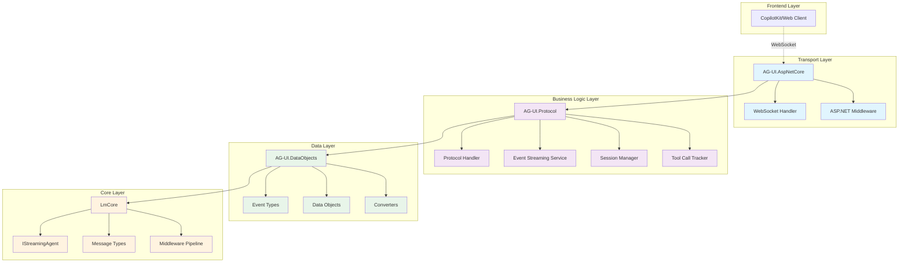
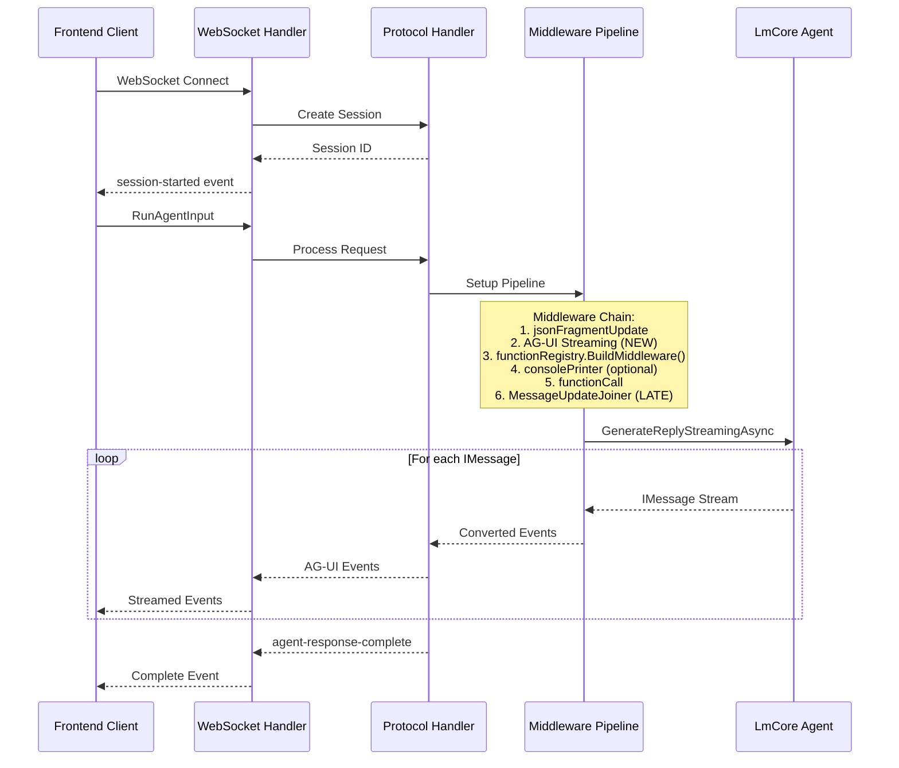
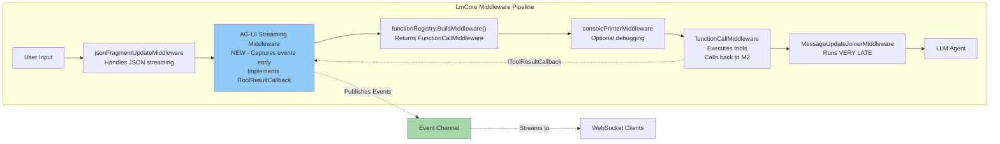
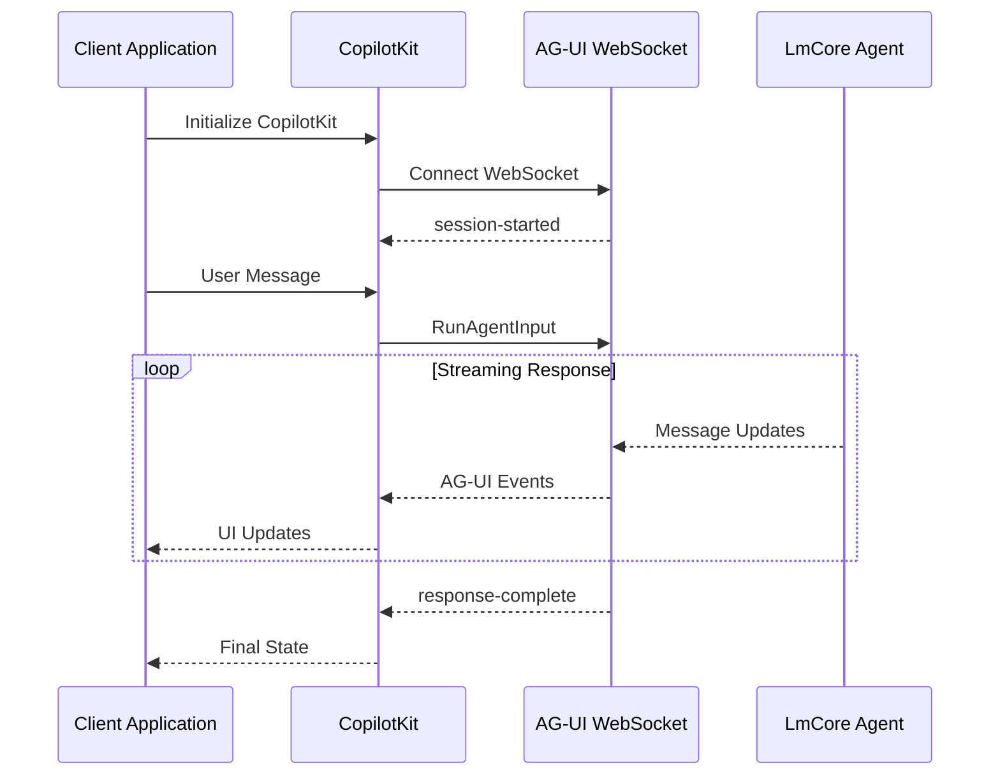

# AG-UI Protocol Integration - Design Document

## Executive Summary

This design document outlines the architecture for integrating AG-UI protocol support into LmDotnetTools, enabling real-time communication between LmCore agents and web-based frontends (particularly CopilotKit). The implementation provides a WebSocket-based streaming interface that converts LmCore message streams into AG-UI protocol events.

### Key Design Principles

- **Modularity**: Layered architecture with clear separation of concerns
- **Performance**: Streaming throughout with minimal allocations and backpressure support
- **Extensibility**: Plugin architecture supporting custom events and middleware hooks
- **Reliability**: Graceful error handling, automatic reconnection, and session recovery
- **Security**: Built-in authentication hooks, input validation, and rate limiting

### Related Documentation

- [Data Models](./data-models.md) - Detailed event types and schemas
- [Middleware Architecture](./middleware-architecture.md) - Pipeline implementation details
- [Persistence](./persistence.md) - SQLite storage and session management
- [API Reference](./api-reference.md) - Complete API surfaces and interfaces
- [Code Examples](./code-examples.md) - Implementation samples and usage patterns

## Architecture Overview

The integration consists of four main components organized in a layered architecture:



## Data Flow Architecture

### Request/Response Flow



### Middleware Pipeline Architecture

The AG-UI streaming middleware integrates into the existing LmCore middleware pipeline at a specific position to capture and convert message updates in real-time:



**Key Middleware Chain Corrections:**
- `jsonFragmentUpdateMiddleware` runs first to handle JSON streaming
- AG-UI Streaming Middleware is placed early (after JSON fragment processing) to capture deltas
- AG-UI Middleware implements `IToolResultCallback` to receive tool execution notifications from FunctionCallMiddleware
- `functionRegistry.BuildMiddleware()` returns a `FunctionCallMiddleware` instance (not a separate "FunctionRegistry Middleware")
- FunctionCallMiddleware calls back to AG-UI middleware when tools are executed, providing real-time status updates
- `MessageUpdateJoinerMiddleware` runs VERY LATE to preserve delta streaming for interactive platforms
- The middleware publishes events to a channel without modifying the message flow

## Component Design Overview

### AG-UI.DataObjects
Defines the data structures and conversion logic for AG-UI protocol events. Contains 16 event types, data transfer objects, and transformation utilities.

**Key Responsibilities:**
- Event type definitions (text-chunk, tool-call-begin, etc.)
- LmCore to AG-UI message conversion
- JSON serialization contracts

[Detailed specifications →](./data-models.md)

### AG-UI.Protocol
Business logic layer handling protocol semantics, session management, and event orchestration.

**Key Responsibilities:**
- Request processing and validation
- Session state management
- Tool call correlation and tracking
- Event stream transformation

[Detailed specifications →](./api-reference.md#protocol-layer)

### AG-UI.AspNetCore
ASP.NET Core integration providing WebSocket transport and middleware integration.

**Key Responsibilities:**
- WebSocket connection management
- ASP.NET Core middleware pipeline integration
- Dependency injection configuration
- Connection lifecycle management

[Detailed specifications →](./api-reference.md#aspnetcore-layer)

### AG-UI Streaming Middleware
Custom LmCore middleware that intercepts message streams and publishes AG-UI events.

**Key Responsibilities:**
- Non-invasive event capture
- Real-time conversion to AG-UI events
- Channel-based event distribution
- Preservation of original message flow

[Detailed implementation →](./middleware-architecture.md)

## Key Design Decisions

### 1. Early Middleware Placement
The AG-UI streaming middleware is placed early in the chain (after JSON fragment processing) to capture message deltas before they are joined. This enables real-time streaming to interactive frontends.

**Rationale:** Interactive platforms need incremental updates, not complete messages. Late message joining would prevent real-time streaming.

### 2. Channel-Based Event Distribution
Events are published to channels rather than directly to WebSocket connections, enabling multiple consumers and decoupling the middleware from transport concerns.

**Rationale:** Supports multiple simultaneous clients, testing scenarios, and future transport mechanisms beyond WebSockets.

### 3. Non-Invasive Middleware Design
The AG-UI middleware observes and publishes events without modifying the message stream, ensuring compatibility with existing middleware.

**Rationale:** Maintains compatibility with the existing LmCore ecosystem while adding new capabilities.

### 4. Session-Based State Management
Each client connection maintains its own session with isolated state, history, and tool call tracking.

**Rationale:** Enables multi-tenant scenarios, session recovery, and proper isolation between concurrent clients.

### 5. SQLite for Persistence
Optional SQLite persistence provides session recovery, history management, and audit capabilities.

**Rationale:** Lightweight, embedded database suitable for development and small deployments with easy migration path to other databases.

## Integration Patterns

### ASP.NET Core Integration

```mermaid
flowchart LR
    subgraph "ASP.NET Core Application"
        Startup[Program.cs/<br/>Startup.cs]
        Services[Service Registration]
        Pipeline[Middleware Pipeline]
        Endpoints[Endpoint Mapping]

        Startup --> Services
        Services --> Pipeline
        Pipeline --> Endpoints
    end

    subgraph "AG-UI Components"
        Config[Configuration]
        Handler[Protocol Handler]
        WS[WebSocket Handler]

        Config --> Handler
        Handler --> WS
    end

    Services -.->|AddAgUi()| Config
    Pipeline -.->|UseAgUi()| Handler
    Endpoints -.->|MapAgUi()| WS
```

### Client Integration Flow



## Implementation Considerations

### Performance
- Streaming architecture with backpressure support
- Channel-based pub/sub for efficient event distribution
- Minimal allocations using ArrayPool and object pooling
- Configurable buffer sizes and timeout values

### Security
- WebSocket authentication hooks
- Input validation and sanitization
- Rate limiting and DoS protection
- Configurable CORS policies

### Reliability
- Automatic reconnection with exponential backoff
- Session recovery from persistence
- Graceful degradation without persistence
- Comprehensive error handling and logging

### Monitoring
- Structured logging with correlation IDs
- Performance metrics collection
- Health check endpoints
- Diagnostic event counters

## Testing Strategy

Comprehensive testing approach covering:
- Unit tests for all components
- Integration tests for middleware pipeline
- WebSocket protocol tests
- Performance benchmarks
- Load testing scenarios

[Detailed testing guide →](./code-examples.md#testing)

## Sample Application

A complete sample application demonstrates the integration:

```
AgUiSampleApp/
├── Program.cs           # ASP.NET Core setup
├── appsettings.json    # Configuration
├── wwwroot/
│   └── index.html      # Test client
└── Services/
    └── CustomAgent.cs  # Sample agent
```

[Complete sample code →](./code-examples.md#sample-application)

## Conclusion

This design provides a robust, scalable integration of AG-UI protocol support into LmDotnetTools. The layered architecture ensures modularity and testability while the streaming design enables real-time, interactive experiences.

### Next Steps

1. Implement core components following this design
2. Create comprehensive test suite
3. Build sample applications
4. Document deployment patterns
5. Gather feedback and iterate

### References

- [AG-UI Protocol Specification](https://github.com/CopilotKit/ag-ui)
- [LmCore Documentation](../../../README.md)
- [CopilotKit Integration Guide](https://docs.copilotkit.ai)