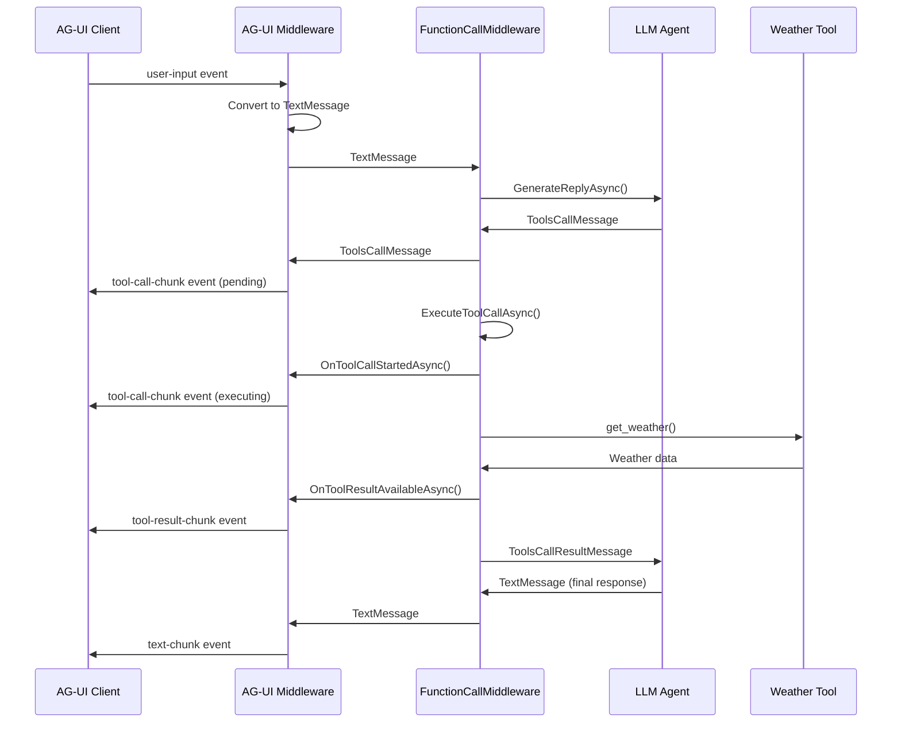
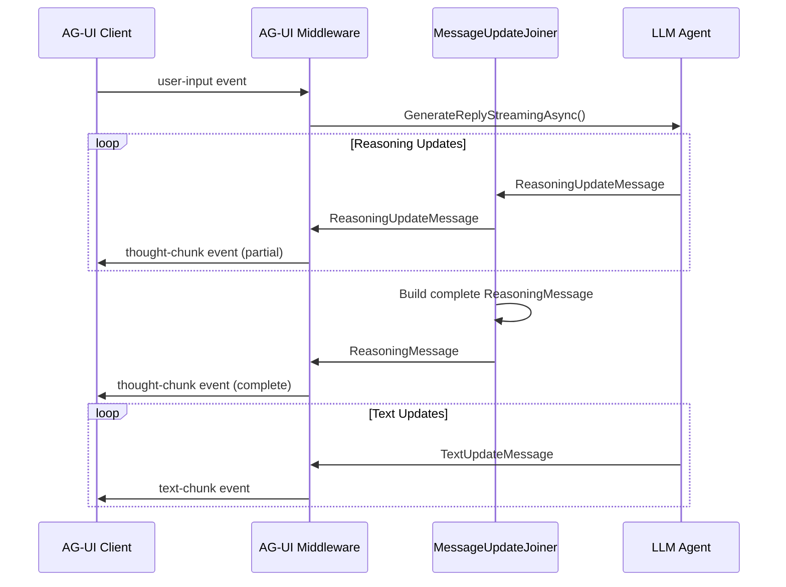
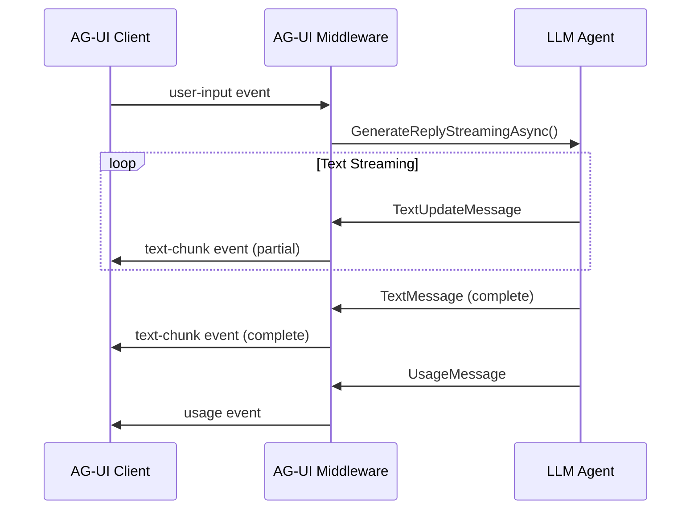
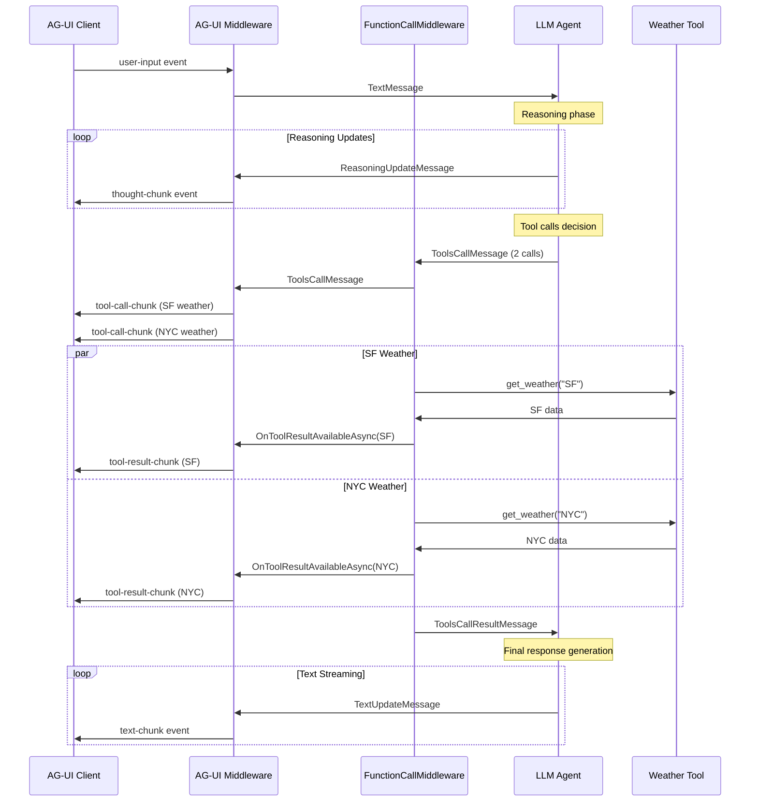
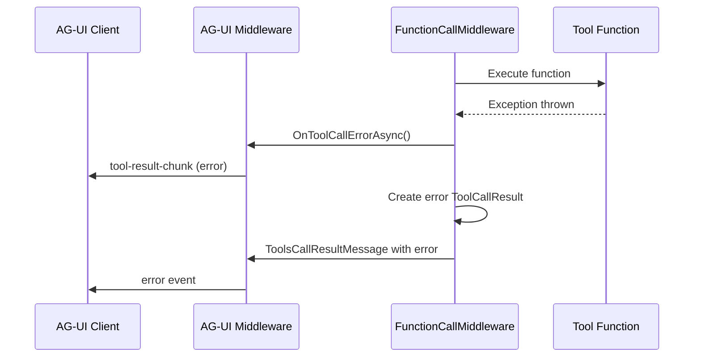

# AG-UI Integration Flow Validation

This document provides comprehensive walkthroughs of all message flows in the AG-UI integration, validating that the design handles all scenarios correctly.

## 1. Tool Call Flow - End to End

### Scenario
User sends: "What's the weather in San Francisco?"

### Detailed Step-by-Step Flow

#### Step 1: User Message Input
- **Input**: User message via AG-UI client
- **AG-UI Event**: `user-input` event
- **Conversion**: AG-UI middleware converts to `TextMessage`
- **Message**:
  ```csharp
  TextMessage {
    Text = "What's the weather in San Francisco?",
    Role = Role.User,
    FromAgent = "user"
  }
  ```

#### Step 2: Message Processing Through Middleware Chain
- **Flow**: TextMessage → AG-UI Middleware → FunctionCallMiddleware → LLM Agent
- **AG-UI Action**: Stores message in SQLite, publishes `message-received` event

#### Step 3: LLM Decides to Call Tool
- **LLM Output**: Generates `ToolsCallMessage` with weather function call
- **Message**:
  ```csharp
  ToolsCallMessage {
    ToolCalls = [
      ToolCall {
        ToolCallId = "call_123",
        FunctionName = "get_weather",
        FunctionArgs = "{\"location\": \"San Francisco\"}"
      }
    ],
    Role = Role.Assistant
  }
  ```

#### Step 4: AG-UI Middleware Intercepts Tool Call
- **Detection**: AG-UI middleware detects `ToolsCallMessage`
- **AG-UI Events Generated**:
  ```json
  {
    "type": "tool-call-chunk",
    "sessionId": "session_456",
    "data": {
      "id": "call_123",
      "name": "get_weather",
      "arguments": "{\"location\": \"San Francisco\"}",
      "status": "pending"
    }
  }
  ```
- **Channel**: Event published to SSE channel

#### Step 5: FunctionCallMiddleware Executes Tool
- **Callback**: FunctionCallMiddleware calls `OnToolCallStartedAsync()` on AG-UI middleware
- **AG-UI Event Generated**:
  ```json
  {
    "type": "tool-call-chunk",
    "sessionId": "session_456",
    "data": {
      "id": "call_123",
      "status": "executing"
    }
  }
  ```
- **Execution**: Tool function runs, returns weather data

#### Step 6: Tool Result Available
- **Callback**: FunctionCallMiddleware calls `OnToolResultAvailableAsync()` on AG-UI middleware
- **Tool Result**:
  ```csharp
  ToolCallResult {
    ToolCallId = "call_123",
    Result = "{\"temperature\": 68, \"condition\": \"sunny\"}"
  }
  ```
- **AG-UI Event Generated**:
  ```json
  {
    "type": "tool-result-chunk",
    "sessionId": "session_456",
    "data": {
      "id": "call_123",
      "result": "{\"temperature\": 68, \"condition\": \"sunny\"}",
      "isError": false
    }
  }
  ```

#### Step 7: Tool Result Flows Back to LLM
- **Message**: FunctionCallMiddleware creates `ToolsCallResultMessage`
- **Flow**: ToolsCallResultMessage → LLM Agent for final response generation

#### Step 8: LLM Generates Final Response
- **LLM Output**: `TextMessage` with weather summary
- **Message**:
  ```csharp
  TextMessage {
    Text = "The weather in San Francisco is currently sunny with a temperature of 68°F.",
    Role = Role.Assistant
  }
  ```

#### Step 9: AG-UI Middleware Sends Final Response
- **Detection**: AG-UI middleware intercepts `TextMessage`
- **AG-UI Event Generated**:
  ```json
  {
    "type": "text-chunk",
    "sessionId": "session_456",
    "data": {
      "text": "The weather in San Francisco is currently sunny with a temperature of 68°F.",
      "isComplete": true
    }
  }
  ```
- **Persistence**: Message stored in SQLite

### Sequence Diagram



## 2. Thinking/Reasoning Deltas Flow (Streaming)

### Scenario
User asks: "Explain quantum computing step by step"

### Detailed Step-by-Step Flow

#### Step 1: User Input
- **Message**: TextMessage with user's question
- **Flow**: Client → AG-UI Middleware → LLM

#### Step 2: LLM Starts Reasoning (Streaming)
- **LLM Output**: Stream of `ReasoningUpdateMessage` objects
- **First Update**:
  ```csharp
  ReasoningUpdateMessage {
    Reasoning = "Let me break down quantum",
    IsUpdate = true,
    Visibility = ReasoningVisibility.Plain
  }
  ```

#### Step 3: AG-UI Middleware Processes Reasoning Updates
- **Detection**: AG-UI middleware detects `ReasoningUpdateMessage`
- **AG-UI Event Generated** (per update):
  ```json
  {
    "type": "thought-chunk",
    "sessionId": "session_456",
    "data": {
      "thought": "Let me break down quantum",
      "isPartial": true,
      "visibility": "plain"
    }
  }
  ```

#### Step 4: Reasoning Accumulation
- **Builder**: MessageUpdateJoinerMiddleware uses `ReasoningMessageBuilder`
- **Updates**: Multiple `ReasoningUpdateMessage` objects accumulate
- **AG-UI Events**: Continuous stream of `thought-chunk` events

#### Step 5: Reasoning Complete
- **Final Message**: `ReasoningMessage` with complete reasoning
- **AG-UI Event**:
  ```json
  {
    "type": "thought-chunk",
    "sessionId": "session_456",
    "data": {
      "thought": "[Complete reasoning text]",
      "isPartial": false,
      "isComplete": true
    }
  }
  ```

#### Step 6: Text Response Follows
- **LLM Output**: Stream of `TextUpdateMessage` objects with actual response
- **Flow**: Similar to text streaming (see next section)

### Sequence Diagram



## 3. Text Streaming Flow

### Scenario
User asks: "Write a short story about a robot"

### Detailed Step-by-Step Flow

#### Step 1: User Input
- **Message**: TextMessage with user's request
- **Flow**: Client → AG-UI Middleware → LLM

#### Step 2: LLM Starts Streaming Response
- **LLM Output**: Stream of `TextUpdateMessage` objects
- **First Update**:
  ```csharp
  TextUpdateMessage {
    Text = "Once upon a time",
    IsUpdate = true,
    Role = Role.Assistant
  }
  ```

#### Step 3: AG-UI Middleware Processes Text Updates
- **Detection**: AG-UI middleware detects `TextUpdateMessage`
- **AG-UI Event Generated** (per update):
  ```json
  {
    "type": "text-chunk",
    "sessionId": "session_456",
    "data": {
      "text": "Once upon a time",
      "isPartial": true,
      "delta": "Once upon a time"
    }
  }
  ```

#### Step 4: Continuous Streaming
- **Updates**: Multiple `TextUpdateMessage` objects stream
- **Accumulation**: Text accumulates: "Once upon a time" → "Once upon a time, in a" → etc.
- **AG-UI Events**: Each update generates a `text-chunk` event

#### Step 5: Stream Complete
- **Final Message**: Complete `TextMessage` or final `TextUpdateMessage`
- **AG-UI Event**:
  ```json
  {
    "type": "text-chunk",
    "sessionId": "session_456",
    "data": {
      "text": "[Complete story text]",
      "isPartial": false,
      "isComplete": true
    }
  }
  ```

#### Step 6: Usage Information
- **Usage Message**: `UsageMessage` with token counts
- **AG-UI Event**:
  ```json
  {
    "type": "usage",
    "sessionId": "session_456",
    "data": {
      "promptTokens": 15,
      "completionTokens": 250,
      "totalTokens": 265
    }
  }
  ```

### Sequence Diagram



## 4. Complex Flow: Multiple Tool Calls with Reasoning

### Scenario
User asks: "Compare the weather in SF and NYC, then recommend which city to visit"

### Combined Flow



## 5. Error Handling Flows

### Tool Call Error



## Critical Design Validations

### ✅ Tool Result Callback Coverage
- **Validated**: FunctionCallMiddleware callback mechanism fully addresses tool result publishing
- **Solution**: AG-UI middleware implements `IToolResultCallback` interface
- **Events Generated**: `tool-call-chunk` (start), `tool-result-chunk` (result/error)

### ✅ Thinking/Reasoning Delta Handling
- **Validated**: `ReasoningUpdateMessage` streams are properly handled
- **Solution**: Convert each update to `thought-chunk` event
- **Aggregation**: MessageUpdateJoinerMiddleware handles accumulation

### ✅ Text Streaming Coverage
- **Validated**: `TextUpdateMessage` streams are properly handled
- **Solution**: Convert each update to `text-chunk` event
- **Completion**: Final message marked with `isComplete: true`

### ✅ Message Flow Completeness
- **All Paths Covered**: Tool calls, reasoning, text, errors
- **Event Generation**: Every message type has corresponding AG-UI event
- **Persistence Points**: Messages stored at appropriate points

## Persistence Strategy Decision

### Decision: Persist LmCore Messages + Event Metadata

After analysis, the recommended approach is:

1. **Primary Storage**: Persist LmCore messages in SQLite
   - Messages are the source of truth
   - Smaller storage footprint
   - Can regenerate events if needed

2. **Event Metadata**: Store minimal event metadata
   - Event type mapping
   - Timestamps
   - Session associations

3. **Session Recovery**:
   - Reload messages from SQLite
   - Replay through AG-UI middleware to regenerate events
   - Maintain event ordering via timestamps

### Rationale
- **Single Source of Truth**: Messages are authoritative
- **Storage Efficiency**: Avoids duplicating content
- **Flexibility**: Can change event format without data migration
- **Recovery**: Can reconstruct full session state

## Implementation Checklist

- [x] Tool result callback mechanism designed
- [x] All message types mapped to AG-UI events
- [x] Streaming flows validated
- [x] Error handling flows defined
- [x] Persistence strategy decided
- [ ] Integration tests needed for each flow
- [ ] Performance benchmarks for streaming scenarios
- [ ] Client reconnection handling

## Conclusion

The AG-UI integration design is **complete and valid** for all identified flows:

1. **Tool Calls**: Fully handled via `IToolResultCallback` implementation
2. **Reasoning/Thinking**: Streaming updates properly converted to events
3. **Text Streaming**: Full support for partial and complete messages
4. **Error Handling**: Comprehensive error event generation
5. **Persistence**: Clear strategy using message-based storage

The design successfully addresses all requirements including the critical missing piece of FunctionCallMiddleware callback handling.