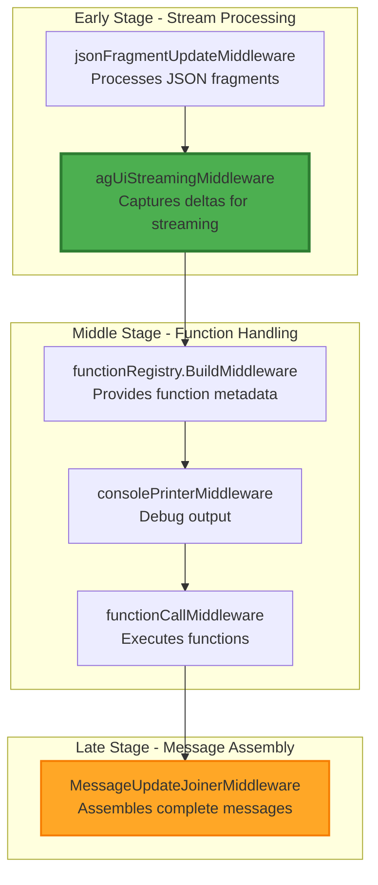
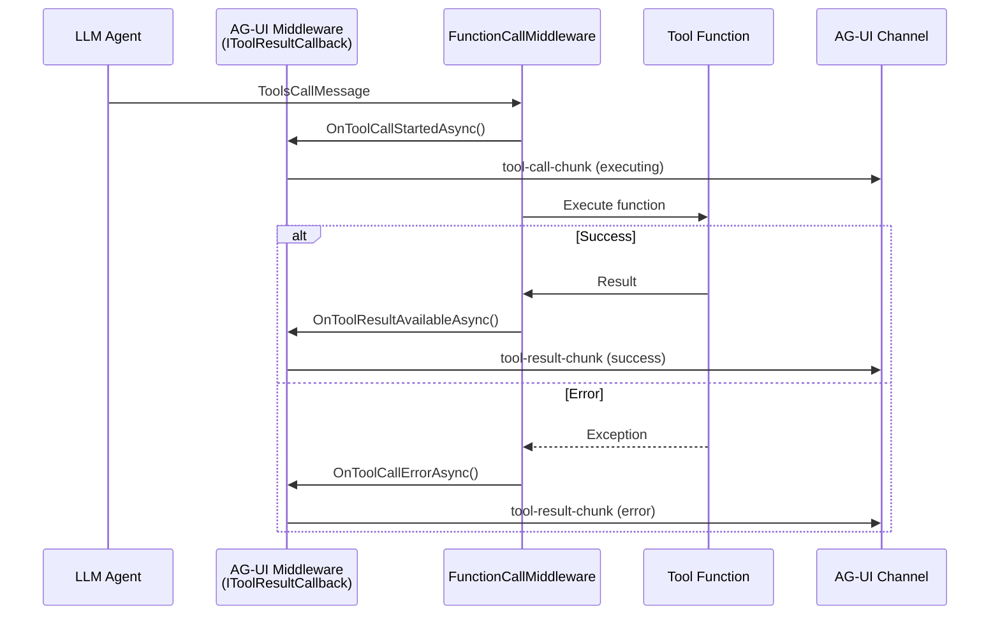

# AG-UI Middleware Architecture

This document provides detailed implementation specifications for the AG-UI streaming middleware and its integration with the LmCore middleware pipeline.

## Table of Contents
1. [Middleware Chain Overview](#middleware-chain-overview)
2. [AG-UI Streaming Middleware Implementation](#ag-ui-streaming-middleware-implementation)
3. [Event Publishing Architecture](#event-publishing-architecture)
4. [Integration with LmCore Pipeline](#integration-with-lmcore-pipeline)
5. [Performance Optimizations](#performance-optimizations)

## Middleware Chain Overview

### Correct Middleware Order

Based on the ExamplePythonMCPClient implementation, the correct middleware chain is:

```csharp
var agent = baseAgent
    .WithMiddleware(jsonFragmentUpdateMiddleware)      // 1. Handles JSON streaming
    .WithMiddleware(agUiStreamingMiddleware)           // 2. NEW - Captures events early
    .WithMiddleware(functionRegistry.BuildMiddleware()) // 3. Returns FunctionCallMiddleware
    .WithMiddleware(consolePrinterMiddleware)          // 4. Optional debugging
    .WithMiddleware(functionCallMiddleware)            // 5. Executes tool calls
    .WithMiddleware(new MessageUpdateJoinerMiddleware()); // 6. Runs VERY LATE
```

### Why This Order Matters



**Key Points:**
- **AG-UI middleware runs EARLY** to capture message deltas before joining
- **MessageUpdateJoinerMiddleware runs LATE** to preserve streaming capabilities
- This is critical for interactive platforms that need real-time updates

## AG-UI Streaming Middleware Implementation

### Core Middleware Class with Tool Callback Support

```csharp
namespace AchieveAi.LmDotnetTools.AgUi.Middleware
{
    /// <summary>
    /// AG-UI streaming middleware that intercepts messages and publishes AG-UI events.
    /// Implements IToolResultCallback to capture tool execution results from FunctionCallMiddleware.
    /// </summary>
    public class AgUiStreamingMiddleware : IStreamingMiddleware, IToolResultCallback
    {
        private readonly IEventPublisher _eventPublisher;
        private readonly IMessageConverter _converter;
        private readonly ILogger<AgUiStreamingMiddleware> _logger;
        private readonly AgUiMiddlewareOptions _options;
        private string? _currentSessionId;

        public AgUiStreamingMiddleware(
            IEventPublisher eventPublisher,
            IMessageConverter converter,
            ILogger<AgUiStreamingMiddleware> logger,
            IOptions<AgUiMiddlewareOptions> options)
        {
            _eventPublisher = eventPublisher;
            _converter = converter;
            _logger = logger;
            _options = options.Value;
        }

        public string Name => "AgUiStreamingMiddleware";

        public async IAsyncEnumerable<IMessage> InvokeAsync(
            MiddlewareContext context,
            IStreamingAgent agent,
            GenerateReplyOptions options,
            IAsyncEnumerable<IMessage> messages,
            [EnumeratorCancellation] CancellationToken ct = default)
        {
            // Get or create session context
            var sessionId = context.Properties.TryGetValue("SessionId", out var sid)
                ? sid?.ToString()
                : Guid.NewGuid().ToString();

            _currentSessionId = sessionId;

            // Wire ourselves as the callback for FunctionCallMiddleware
            SetupFunctionCallCallback(context);

            // Publish run-started event
            await PublishEventAsync(new RunStartedEvent
            {
                SessionId = sessionId,
                RunId = context.ConversationId
            }, ct);

            try
            {
                await foreach (var message in messages.WithCancellation(ct))
                {
                    // Convert and publish AG-UI events without modifying the message
                    await ProcessMessageAsync(message, sessionId, ct);

                    // Pass message through unchanged
                    yield return message;
                }

                // Publish run-finished event
                await PublishEventAsync(new RunFinishedEvent
                {
                    SessionId = sessionId,
                    RunId = context.ConversationId,
                    Status = RunStatus.Success
                }, ct);
            }
            catch (Exception ex)
            {
                _logger.LogError(ex, "Error in AG-UI streaming middleware");

                // Publish error event
                await PublishEventAsync(new ErrorEvent
                {
                    SessionId = sessionId,
                    ErrorCode = "MIDDLEWARE_ERROR",
                    Message = ex.Message,
                    Recoverable = false
                }, ct);

                // Publish run-finished with error
                await PublishEventAsync(new RunFinishedEvent
                {
                    SessionId = sessionId,
                    RunId = context.ConversationId,
                    Status = RunStatus.Failed,
                    Error = ex.Message
                }, ct);

                throw;
            }
        }

        private async Task ProcessMessageAsync(IMessage message, string sessionId, CancellationToken ct)
        {
            var events = _converter.ConvertToAgUiEvents(message, sessionId);

            foreach (var evt in events)
            {
                await PublishEventAsync(evt, ct);
            }
        }

        private async Task PublishEventAsync(AgUiEventBase evt, CancellationToken ct)
        {
            try
            {
                await _eventPublisher.PublishAsync(evt, ct);

                if (_options.EnableMetrics)
                {
                    RecordMetrics(evt);
                }
            }
            catch (Exception ex)
            {
                _logger.LogError(ex, "Failed to publish event {EventType}", evt.Type);

                if (!_options.SuppressPublishErrors)
                {
                    throw;
                }
            }
        }

        private void RecordMetrics(AgUiEventBase evt)
        {
            // Record metrics for monitoring
            AgUiMetrics.EventPublished.WithLabels(evt.Type).Inc();
        }

        #region IToolResultCallback Implementation

        /// <summary>
        /// Called when a tool call starts execution. Publishes a tool-call-chunk event.
        /// </summary>
        public async Task OnToolCallStartedAsync(
            string toolCallId,
            string functionName,
            string functionArgs,
            CancellationToken cancellationToken = default)
        {
            if (string.IsNullOrEmpty(_currentSessionId))
            {
                _logger.LogWarning("Tool call started but no session ID available");
                return;
            }

            var toolCallEvent = new ToolCallChunkEvent
            {
                Type = "tool-call-chunk",
                SessionId = _currentSessionId,
                Data = new ToolCallData
                {
                    Id = toolCallId,
                    Name = functionName,
                    Arguments = functionArgs,
                    Status = "executing"
                }
            };

            await PublishEventAsync(toolCallEvent, cancellationToken);
        }

        /// <summary>
        /// Called when a tool call result becomes available. Publishes a tool-result-chunk event.
        /// </summary>
        public async Task OnToolResultAvailableAsync(
            string toolCallId,
            ToolCallResult result,
            CancellationToken cancellationToken = default)
        {
            if (string.IsNullOrEmpty(_currentSessionId))
            {
                _logger.LogWarning("Tool result available but no session ID available");
                return;
            }

            var toolResultEvent = new ToolResultChunkEvent
            {
                Type = "tool-result-chunk",
                SessionId = _currentSessionId,
                Data = new ToolResultData
                {
                    Id = toolCallId,
                    Result = result.Result,
                    IsError = false
                }
            };

            await PublishEventAsync(toolResultEvent, cancellationToken);
        }

        /// <summary>
        /// Called when a tool call encounters an error. Publishes a tool-result-chunk event with error.
        /// </summary>
        public async Task OnToolCallErrorAsync(
            string toolCallId,
            string functionName,
            string error,
            CancellationToken cancellationToken = default)
        {
            if (string.IsNullOrEmpty(_currentSessionId))
            {
                _logger.LogWarning("Tool call error but no session ID available");
                return;
            }

            var errorEvent = new ToolResultChunkEvent
            {
                Type = "tool-result-chunk",
                SessionId = _currentSessionId,
                Data = new ToolResultData
                {
                    Id = toolCallId,
                    Result = error,
                    IsError = true,
                    ErrorMessage = error
                }
            };

            await PublishEventAsync(errorEvent, cancellationToken);
        }

        #endregion

        /// <summary>
        /// Finds the FunctionCallMiddleware in the chain and sets this middleware as its callback.
        /// </summary>
        private void SetupFunctionCallCallback(MiddlewareContext context)
        {
            // The FunctionCallMiddleware should be later in the chain
            // We need to find it and set ourselves as the callback
            // This is typically done through the middleware chain configuration

            // Option 1: Look for FunctionCallMiddleware in the context
            if (context.TryGetMiddleware<FunctionCallMiddleware>(out var functionCallMiddleware))
            {
                functionCallMiddleware.WithResultCallback(this);
                _logger.LogDebug("Successfully wired AG-UI middleware as tool result callback");
            }
            else
            {
                _logger.LogWarning("FunctionCallMiddleware not found in chain - tool results won't be captured");
            }
        }
    }
}
```

### Middleware Options

```csharp
public class AgUiMiddlewareOptions
{
    /// <summary>
    /// Maximum size of the event buffer
    /// </summary>
    public int EventBufferSize { get; set; } = 1000;

    /// <summary>
    /// Timeout for publishing events
    /// </summary>
    public TimeSpan PublishTimeout { get; set; } = TimeSpan.FromSeconds(5);

    /// <summary>
    /// Enable performance metrics collection
    /// </summary>
    public bool EnableMetrics { get; set; } = true;

    /// <summary>
    /// Suppress errors when publishing fails (continues streaming)
    /// </summary>
    public bool SuppressPublishErrors { get; set; } = true;

    /// <summary>
    /// Enable detailed debug logging
    /// </summary>
    public bool EnableDebugLogging { get; set; } = false;

    /// <summary>
    /// Maximum chunk size for text streaming
    /// </summary>
    public int MaxTextChunkSize { get; set; } = 4096;

    /// <summary>
    /// Enable batching of events
    /// </summary>
    public bool EnableBatching { get; set; } = false;

    /// <summary>
    /// Batch size when batching is enabled
    /// </summary>
    public int BatchSize { get; set; } = 10;

    /// <summary>
    /// Batch timeout when batching is enabled
    /// </summary>
    public TimeSpan BatchTimeout { get; set; } = TimeSpan.FromMilliseconds(100);
}
```

## Tool Result Callback Integration

### Overview

The AG-UI middleware implements the `IToolResultCallback` interface to intercept tool execution results from the `FunctionCallMiddleware`. This allows the middleware to publish AG-UI events for tool calls in real-time as they execute.

### Callback Flow



### Implementation Details

1. **Interface Implementation**: AG-UI middleware implements `IToolResultCallback` directly
2. **Callback Registration**: The middleware is set as the callback during pipeline setup
3. **Event Generation**: Each callback method generates corresponding AG-UI events
4. **Session Context**: The middleware maintains session ID for event correlation

### Benefits

- **Real-time Updates**: Tool execution status is published immediately
- **Error Transparency**: Tool failures are communicated to clients instantly
- **Clean Architecture**: No modifications needed to FunctionCallMiddleware
- **Type Safety**: Compile-time verification of callback methods

## Event Publishing Architecture

### Channel-Based Event Distribution

```csharp
public interface IEventPublisher
{
    Task PublishAsync(AgUiEventBase evt, CancellationToken ct = default);
    IAsyncEnumerable<AgUiEventBase> SubscribeAsync(string sessionId, CancellationToken ct = default);
    void Unsubscribe(string sessionId);
}

public class ChannelEventPublisher : IEventPublisher
{
    private readonly ConcurrentDictionary<string, SessionChannel> _sessions = new();
    private readonly ILogger<ChannelEventPublisher> _logger;
    private readonly int _channelCapacity;

    public ChannelEventPublisher(ILogger<ChannelEventPublisher> logger, int channelCapacity = 1000)
    {
        _logger = logger;
        _channelCapacity = channelCapacity;
    }

    public async Task PublishAsync(AgUiEventBase evt, CancellationToken ct = default)
    {
        if (string.IsNullOrEmpty(evt.SessionId))
        {
            _logger.LogWarning("Event without SessionId cannot be published");
            return;
        }

        var channel = GetOrCreateChannel(evt.SessionId);
        await channel.WriteAsync(evt, ct);
    }

    public async IAsyncEnumerable<AgUiEventBase> SubscribeAsync(
        string sessionId,
        [EnumeratorCancellation] CancellationToken ct = default)
    {
        var channel = GetOrCreateChannel(sessionId);

        await foreach (var evt in channel.ReadAllAsync(ct))
        {
            yield return evt;
        }
    }

    public void Unsubscribe(string sessionId)
    {
        if (_sessions.TryRemove(sessionId, out var channel))
        {
            channel.Complete();
        }
    }

    private SessionChannel GetOrCreateChannel(string sessionId)
    {
        return _sessions.GetOrAdd(sessionId, _ => new SessionChannel(_channelCapacity));
    }

    private class SessionChannel
    {
        private readonly Channel<AgUiEventBase> _channel;

        public SessionChannel(int capacity)
        {
            var options = new BoundedChannelOptions(capacity)
            {
                FullMode = BoundedChannelFullMode.Wait,
                SingleReader = false,
                SingleWriter = false
            };

            _channel = Channel.CreateBounded<AgUiEventBase>(options);
        }

        public async Task WriteAsync(AgUiEventBase evt, CancellationToken ct)
        {
            await _channel.Writer.WriteAsync(evt, ct);
        }

        public IAsyncEnumerable<AgUiEventBase> ReadAllAsync(CancellationToken ct)
        {
            return _channel.Reader.ReadAllAsync(ct);
        }

        public void Complete()
        {
            _channel.Writer.TryComplete();
        }
    }
}
```

### Message Converter Implementation

```csharp
public interface IMessageConverter
{
    IEnumerable<AgUiEventBase> ConvertToAgUiEvents(IMessage message, string sessionId);
}

public class MessageToAgUiConverter : IMessageConverter
{
    private readonly IToolCallTracker _toolCallTracker;
    private readonly Dictionary<string, MessageState> _messageStates = new();

    public MessageToAgUiConverter(IToolCallTracker toolCallTracker)
    {
        _toolCallTracker = toolCallTracker;
    }

    public IEnumerable<AgUiEventBase> ConvertToAgUiEvents(IMessage message, string sessionId)
    {
        return message switch
        {
            TextMessageUpdate textUpdate => ConvertTextUpdate(textUpdate, sessionId),
            ToolCallUpdate toolUpdate => ConvertToolUpdate(toolUpdate, sessionId),
            ToolCallResultUpdate resultUpdate => ConvertToolResult(resultUpdate, sessionId),
            JsonFragmentUpdate jsonUpdate => ConvertJsonFragment(jsonUpdate, sessionId),
            ReasoningUpdate reasoningUpdate => ConvertReasoning(reasoningUpdate, sessionId),
            ErrorMessage errorMsg => ConvertError(errorMsg, sessionId),
            _ => Enumerable.Empty<AgUiEventBase>()
        };
    }

    private IEnumerable<AgUiEventBase> ConvertTextUpdate(TextMessageUpdate update, string sessionId)
    {
        var messageId = GetOrCreateMessageId(update.Id);
        var state = GetMessageState(messageId);

        if (!state.Started)
        {
            state.Started = true;
            yield return new TextMessageStartEvent
            {
                SessionId = sessionId,
                MessageId = messageId,
                Role = MessageRole.Assistant
            };
        }

        if (!string.IsNullOrEmpty(update.Content))
        {
            yield return new TextMessageContentEvent
            {
                SessionId = sessionId,
                MessageId = messageId,
                Content = update.Content,
                ChunkIndex = state.ChunkCount++
            };
        }

        if (update.IsComplete)
        {
            yield return new TextMessageEndEvent
            {
                SessionId = sessionId,
                MessageId = messageId,
                TotalChunks = state.ChunkCount,
                TotalLength = state.TotalLength
            };

            CleanupMessageState(messageId);
        }
    }

    private IEnumerable<AgUiEventBase> ConvertToolUpdate(ToolCallUpdate update, string sessionId)
    {
        var toolCallId = _toolCallTracker.GetOrCreateToolCallId(update.Id);

        if (update.IsStart)
        {
            yield return new ToolCallStartEvent
            {
                SessionId = sessionId,
                ToolCallId = toolCallId,
                ToolName = update.FunctionName
            };
        }

        if (!string.IsNullOrEmpty(update.ArgumentsJson))
        {
            yield return new ToolCallArgumentsEvent
            {
                SessionId = sessionId,
                ToolCallId = toolCallId,
                ArgumentsChunk = update.ArgumentsJson,
                IsComplete = update.ArgumentsComplete
            };
        }

        if (update.IsComplete)
        {
            yield return new ToolCallEndEvent
            {
                SessionId = sessionId,
                ToolCallId = toolCallId
            };
        }
    }

    private IEnumerable<AgUiEventBase> ConvertJsonFragment(JsonFragmentUpdate update, string sessionId)
    {
        // Handle incremental JSON for tool arguments
        if (!string.IsNullOrEmpty(update.ToolCallId))
        {
            var toolCallId = _toolCallTracker.GetOrCreateToolCallId(update.ToolCallId);

            yield return new ToolCallArgumentsEvent
            {
                SessionId = sessionId,
                ToolCallId = toolCallId,
                ArgumentsChunk = update.Fragment,
                IsComplete = update.IsComplete
            };
        }
    }

    private IEnumerable<AgUiEventBase> ConvertToolResult(ToolCallResultUpdate update, string sessionId)
    {
        var toolCallId = _toolCallTracker.GetToolCallId(update.ToolCallId);

        yield return new ToolCallResultEvent
        {
            SessionId = sessionId,
            ToolCallId = toolCallId,
            Result = update.Result,
            Success = update.Success,
            Error = update.Error
        };
    }

    private IEnumerable<AgUiEventBase> ConvertReasoning(ReasoningUpdate update, string sessionId)
    {
        var reasoningId = GetOrCreateReasoningId(update.Id);

        if (update.IsStart)
        {
            yield return new ReasoningStartEvent
            {
                SessionId = sessionId,
                ReasoningId = reasoningId
            };
        }

        if (!string.IsNullOrEmpty(update.Content))
        {
            yield return new ReasoningContentEvent
            {
                SessionId = sessionId,
                ReasoningId = reasoningId,
                Content = update.Content
            };
        }

        if (update.IsComplete)
        {
            yield return new ReasoningEndEvent
            {
                SessionId = sessionId,
                ReasoningId = reasoningId
            };
        }
    }

    private IEnumerable<AgUiEventBase> ConvertError(ErrorMessage error, string sessionId)
    {
        yield return new ErrorEvent
        {
            SessionId = sessionId,
            ErrorCode = error.Code ?? "UNKNOWN",
            Message = error.Message,
            Details = error.Details,
            Recoverable = error.Recoverable
        };
    }

    private string GetOrCreateMessageId(string? id)
        => string.IsNullOrEmpty(id) ? Guid.NewGuid().ToString() : id;

    private string GetOrCreateReasoningId(string? id)
        => string.IsNullOrEmpty(id) ? Guid.NewGuid().ToString() : id;

    private MessageState GetMessageState(string messageId)
    {
        if (!_messageStates.TryGetValue(messageId, out var state))
        {
            state = new MessageState();
            _messageStates[messageId] = state;
        }
        return state;
    }

    private void CleanupMessageState(string messageId)
    {
        _messageStates.Remove(messageId);
    }

    private class MessageState
    {
        public bool Started { get; set; }
        public int ChunkCount { get; set; }
        public int TotalLength { get; set; }
    }
}
```

## Integration with LmCore Pipeline

### Middleware Registration

```csharp
public static class ServiceCollectionExtensions
{
    public static IServiceCollection AddAgUiMiddleware(
        this IServiceCollection services,
        Action<AgUiMiddlewareOptions>? configureOptions = null)
    {
        // Configure options
        if (configureOptions != null)
        {
            services.Configure(configureOptions);
        }
        else
        {
            services.Configure<AgUiMiddlewareOptions>(options => { });
        }

        // Register core services
        services.AddSingleton<IEventPublisher, ChannelEventPublisher>();
        services.AddSingleton<IMessageConverter, MessageToAgUiConverter>();
        services.AddSingleton<IToolCallTracker, ToolCallTracker>();

        // Register the middleware
        services.AddSingleton<AgUiStreamingMiddleware>();

        return services;
    }
}
```

### Agent Configuration

```csharp
public static class AgentBuilderExtensions
{
    public static IStreamingAgent WithAgUiStreaming(
        this IStreamingAgent agent,
        IServiceProvider services)
    {
        var middleware = services.GetRequiredService<AgUiStreamingMiddleware>();
        return agent.WithMiddleware(middleware);
    }

    public static IStreamingAgent WithAgUiStreaming(
        this IStreamingAgent agent,
        IEventPublisher eventPublisher,
        IMessageConverter converter,
        ILogger<AgUiStreamingMiddleware>? logger = null,
        Action<AgUiMiddlewareOptions>? configure = null)
    {
        var options = new AgUiMiddlewareOptions();
        configure?.Invoke(options);

        var middleware = new AgUiStreamingMiddleware(
            eventPublisher,
            converter,
            logger ?? NullLogger<AgUiStreamingMiddleware>.Instance,
            Options.Create(options));

        return agent.WithMiddleware(middleware);
    }
}
```

### Complete Pipeline Setup Example

```csharp
public class AgentPipelineBuilder
{
    public static IStreamingAgent BuildAgentWithAgUi(
        IServiceProvider services,
        IStreamingAgent baseAgent)
    {
        // Get required middleware components
        var jsonFragmentMiddleware = services.GetRequiredService<JsonFragmentUpdateMiddleware>();
        var agUiMiddleware = services.GetRequiredService<AgUiStreamingMiddleware>();
        var functionRegistry = services.GetRequiredService<FunctionRegistry>();
        var functionCallMiddleware = services.GetRequiredService<IFunctionCallMiddleware>();

        // CRITICAL: Set AG-UI middleware as the callback for tool results
        functionCallMiddleware.WithResultCallback(agUiMiddleware);

        // Build the correct middleware chain
        return baseAgent
            .WithMiddleware(jsonFragmentMiddleware)      // 1. JSON streaming
            .WithMiddleware(agUiMiddleware)              // 2. AG-UI events (EARLY)
            .WithMiddleware(functionRegistry.BuildMiddleware()) // 3. Function metadata
            .WithMiddleware(functionCallMiddleware)      // 4. Function execution
            .WithMiddleware(new MessageUpdateJoinerMiddleware()); // 5. Message joining (LATE)
    }
}
```

## Performance Optimizations

### Batched Event Publishing

```csharp
public class BatchedEventPublisher : IEventPublisher
{
    private readonly IEventPublisher _innerPublisher;
    private readonly int _batchSize;
    private readonly TimeSpan _batchTimeout;
    private readonly Channel<AgUiEventBase> _batchChannel;
    private readonly Task _processingTask;

    public BatchedEventPublisher(
        IEventPublisher innerPublisher,
        int batchSize = 10,
        TimeSpan? batchTimeout = null)
    {
        _innerPublisher = innerPublisher;
        _batchSize = batchSize;
        _batchTimeout = batchTimeout ?? TimeSpan.FromMilliseconds(100);

        _batchChannel = Channel.CreateUnbounded<AgUiEventBase>();
        _processingTask = ProcessBatchesAsync();
    }

    public async Task PublishAsync(AgUiEventBase evt, CancellationToken ct = default)
    {
        await _batchChannel.Writer.WriteAsync(evt, ct);
    }

    private async Task ProcessBatchesAsync()
    {
        var batch = new List<AgUiEventBase>(_batchSize);
        using var timer = new PeriodicTimer(_batchTimeout);

        while (await _batchChannel.Reader.WaitToReadAsync())
        {
            var timerTask = timer.WaitForNextTickAsync().AsTask();

            while (batch.Count < _batchSize)
            {
                var readTask = _batchChannel.Reader.ReadAsync().AsTask();
                var completedTask = await Task.WhenAny(readTask, timerTask);

                if (completedTask == timerTask)
                {
                    break; // Timeout reached
                }

                if (readTask.IsCompletedSuccessfully)
                {
                    batch.Add(await readTask);
                }
            }

            if (batch.Count > 0)
            {
                await PublishBatchAsync(batch);
                batch.Clear();
            }
        }
    }

    private async Task PublishBatchAsync(List<AgUiEventBase> batch)
    {
        var publishTasks = batch.Select(evt => _innerPublisher.PublishAsync(evt));
        await Task.WhenAll(publishTasks);
    }

    public IAsyncEnumerable<AgUiEventBase> SubscribeAsync(string sessionId, CancellationToken ct = default)
    {
        return _innerPublisher.SubscribeAsync(sessionId, ct);
    }

    public void Unsubscribe(string sessionId)
    {
        _innerPublisher.Unsubscribe(sessionId);
    }
}
```

### Memory Pool for Event Objects

```csharp
public class EventObjectPool
{
    private readonly ObjectPool<TextMessageContentEvent> _textContentPool;
    private readonly ObjectPool<ToolCallArgumentsEvent> _toolArgumentsPool;

    public EventObjectPool()
    {
        var textPolicy = new DefaultPooledObjectPolicy<TextMessageContentEvent>();
        _textContentPool = new DefaultObjectPool<TextMessageContentEvent>(textPolicy);

        var toolPolicy = new DefaultPooledObjectPolicy<ToolCallArgumentsEvent>();
        _toolArgumentsPool = new DefaultObjectPool<ToolCallArgumentsEvent>(toolPolicy);
    }

    public TextMessageContentEvent RentTextContent()
    {
        return _textContentPool.Get();
    }

    public void ReturnTextContent(TextMessageContentEvent evt)
    {
        // Clear the event
        evt.Content = string.Empty;
        evt.ChunkIndex = 0;
        evt.MessageId = string.Empty;
        evt.SessionId = null;

        _textContentPool.Return(evt);
    }

    public ToolCallArgumentsEvent RentToolArguments()
    {
        return _toolArgumentsPool.Get();
    }

    public void ReturnToolArguments(ToolCallArgumentsEvent evt)
    {
        // Clear the event
        evt.ArgumentsChunk = string.Empty;
        evt.IsComplete = false;
        evt.ToolCallId = string.Empty;
        evt.SessionId = null;

        _toolArgumentsPool.Return(evt);
    }
}
```

### Backpressure Handling

```csharp
public class BackpressureAwarePublisher : IEventPublisher
{
    private readonly IEventPublisher _innerPublisher;
    private readonly SemaphoreSlim _semaphore;
    private readonly int _maxConcurrency;

    public BackpressureAwarePublisher(
        IEventPublisher innerPublisher,
        int maxConcurrency = 100)
    {
        _innerPublisher = innerPublisher;
        _maxConcurrency = maxConcurrency;
        _semaphore = new SemaphoreSlim(maxConcurrency, maxConcurrency);
    }

    public async Task PublishAsync(AgUiEventBase evt, CancellationToken ct = default)
    {
        await _semaphore.WaitAsync(ct);

        try
        {
            await _innerPublisher.PublishAsync(evt, ct);
        }
        finally
        {
            _semaphore.Release();
        }
    }

    public IAsyncEnumerable<AgUiEventBase> SubscribeAsync(string sessionId, CancellationToken ct = default)
    {
        return _innerPublisher.SubscribeAsync(sessionId, ct);
    }

    public void Unsubscribe(string sessionId)
    {
        _innerPublisher.Unsubscribe(sessionId);
    }
}
```

## Testing the Middleware

### Unit Test Example

```csharp
[TestClass]
public class AgUiStreamingMiddlewareTests
{
    [TestMethod]
    public async Task Middleware_PublishesCorrectEvents_ForTextMessage()
    {
        // Arrange
        var eventPublisher = new Mock<IEventPublisher>();
        var converter = new MessageToAgUiConverter(new ToolCallTracker());
        var middleware = new AgUiStreamingMiddleware(
            eventPublisher.Object,
            converter,
            NullLogger<AgUiStreamingMiddleware>.Instance,
            Options.Create(new AgUiMiddlewareOptions()));

        var messages = CreateTextMessageStream();

        // Act
        var result = new List<IMessage>();
        await foreach (var msg in middleware.InvokeAsync(
            new MiddlewareContext(),
            null!,
            new GenerateReplyOptions(),
            messages))
        {
            result.Add(msg);
        }

        // Assert
        eventPublisher.Verify(p => p.PublishAsync(
            It.IsAny<RunStartedEvent>(),
            It.IsAny<CancellationToken>()), Times.Once);

        eventPublisher.Verify(p => p.PublishAsync(
            It.IsAny<TextMessageStartEvent>(),
            It.IsAny<CancellationToken>()), Times.Once);

        eventPublisher.Verify(p => p.PublishAsync(
            It.IsAny<TextMessageContentEvent>(),
            It.IsAny<CancellationToken>()), Times.AtLeastOnce);

        eventPublisher.Verify(p => p.PublishAsync(
            It.IsAny<RunFinishedEvent>(),
            It.IsAny<CancellationToken>()), Times.Once);
    }

    private async IAsyncEnumerable<IMessage> CreateTextMessageStream()
    {
        yield return new TextMessageUpdate { Id = "msg1", Content = "Hello", IsStart = true };
        yield return new TextMessageUpdate { Id = "msg1", Content = " World" };
        yield return new TextMessageUpdate { Id = "msg1", IsComplete = true };
    }
}
```

## References

- [LmCore Middleware Documentation](../../LmCore/Middleware/README.md)
- [AG-UI Protocol Specification](https://docs.ag-ui.com)
- [ASP.NET Core Middleware](https://docs.microsoft.com/aspnet/core/fundamentals/middleware)