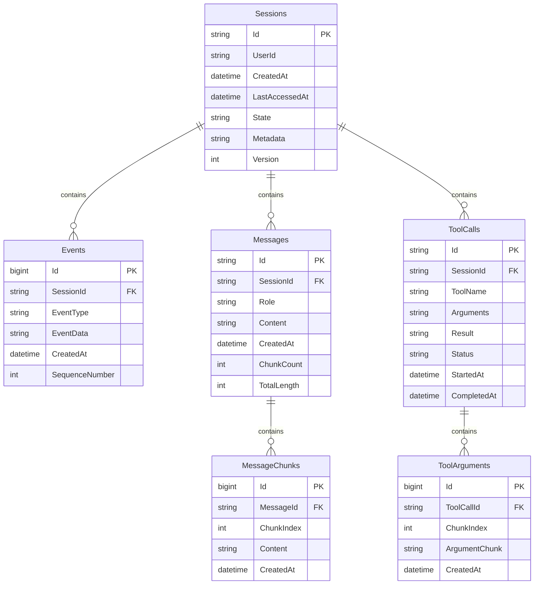

# AG-UI Persistence Layer

This document provides detailed specifications for the optional SQLite persistence layer that enables session recovery, history management, and audit capabilities.

## Table of Contents
1. [Overview](#overview)
2. [Database Schema](#database-schema)
3. [Repository Interfaces](#repository-interfaces)
4. [SQLite Implementation](#sqlite-implementation)
5. [Session Management](#session-management)
6. [History Management](#history-management)
7. [Migration Strategy](#migration-strategy)

## Overview

The persistence layer provides optional durability for AG-UI sessions, enabling:
- Session recovery after disconnections
- Conversation history management
- Audit trails for compliance
- Analytics and usage metrics
- Debugging and troubleshooting

### Design Principles

- **Optional**: System works without persistence
- **Lightweight**: SQLite for easy deployment
- **Scalable**: Repository pattern for database abstraction
- **Performant**: Async operations with connection pooling
- **Secure**: Parameterized queries, encrypted storage option

### Persistence Strategy: Messages vs Events

After careful analysis, the design uses a **hybrid approach**:

1. **Primary Storage: LmCore Messages**
   - Messages are the authoritative source of truth
   - Stored in their native format for accuracy
   - Can regenerate AG-UI events if needed
   - Smaller storage footprint

2. **Event Metadata Storage**
   - Minimal event metadata for correlation
   - Event sequence numbers for ordering
   - Timestamps for temporal queries
   - Session associations

3. **Benefits of This Approach**
   - **Single Source of Truth**: Messages are canonical
   - **Storage Efficiency**: No content duplication
   - **Format Flexibility**: Can change event format without migration
   - **Recovery Capability**: Replay messages through middleware to regenerate events

## Database Schema

### Entity Relationship Diagram



### SQL Schema Definition

```sql
-- Sessions table
CREATE TABLE Sessions (
    Id TEXT PRIMARY KEY,
    UserId TEXT,
    CreatedAt TEXT NOT NULL,
    LastAccessedAt TEXT NOT NULL,
    State TEXT,
    Metadata TEXT,
    Version INTEGER DEFAULT 1,
    IsActive INTEGER DEFAULT 1
);

CREATE INDEX idx_sessions_user ON Sessions(UserId);
CREATE INDEX idx_sessions_lastaccess ON Sessions(LastAccessedAt);

-- Events table (for event sourcing)
CREATE TABLE Events (
    Id INTEGER PRIMARY KEY AUTOINCREMENT,
    SessionId TEXT NOT NULL,
    EventType TEXT NOT NULL,
    EventData TEXT NOT NULL,
    CreatedAt TEXT NOT NULL,
    SequenceNumber INTEGER NOT NULL,
    FOREIGN KEY (SessionId) REFERENCES Sessions(Id) ON DELETE CASCADE
);

CREATE INDEX idx_events_session ON Events(SessionId);
CREATE INDEX idx_events_sequence ON Events(SessionId, SequenceNumber);

-- Messages table
CREATE TABLE Messages (
    Id TEXT PRIMARY KEY,
    SessionId TEXT NOT NULL,
    Role TEXT NOT NULL,
    Content TEXT,
    CreatedAt TEXT NOT NULL,
    ChunkCount INTEGER DEFAULT 0,
    TotalLength INTEGER DEFAULT 0,
    FOREIGN KEY (SessionId) REFERENCES Sessions(Id) ON DELETE CASCADE
);

CREATE INDEX idx_messages_session ON Messages(SessionId);
CREATE INDEX idx_messages_created ON Messages(CreatedAt);

-- Message chunks for streaming
CREATE TABLE MessageChunks (
    Id INTEGER PRIMARY KEY AUTOINCREMENT,
    MessageId TEXT NOT NULL,
    ChunkIndex INTEGER NOT NULL,
    Content TEXT NOT NULL,
    CreatedAt TEXT NOT NULL,
    FOREIGN KEY (MessageId) REFERENCES Messages(Id) ON DELETE CASCADE
);

CREATE INDEX idx_chunks_message ON MessageChunks(MessageId, ChunkIndex);

-- Tool calls table
CREATE TABLE ToolCalls (
    Id TEXT PRIMARY KEY,
    SessionId TEXT NOT NULL,
    ToolName TEXT NOT NULL,
    Arguments TEXT,
    Result TEXT,
    Status TEXT NOT NULL,
    StartedAt TEXT NOT NULL,
    CompletedAt TEXT,
    ErrorMessage TEXT,
    FOREIGN KEY (SessionId) REFERENCES Sessions(Id) ON DELETE CASCADE
);

CREATE INDEX idx_toolcalls_session ON ToolCalls(SessionId);
CREATE INDEX idx_toolcalls_status ON ToolCalls(Status);

-- Tool arguments for streaming
CREATE TABLE ToolArguments (
    Id INTEGER PRIMARY KEY AUTOINCREMENT,
    ToolCallId TEXT NOT NULL,
    ChunkIndex INTEGER NOT NULL,
    ArgumentChunk TEXT NOT NULL,
    CreatedAt TEXT NOT NULL,
    FOREIGN KEY (ToolCallId) REFERENCES ToolCalls(Id) ON DELETE CASCADE
);

CREATE INDEX idx_toolargs_call ON ToolArguments(ToolCallId, ChunkIndex);

-- Audit log table
CREATE TABLE AuditLog (
    Id INTEGER PRIMARY KEY AUTOINCREMENT,
    SessionId TEXT,
    Action TEXT NOT NULL,
    Details TEXT,
    UserId TEXT,
    IpAddress TEXT,
    UserAgent TEXT,
    CreatedAt TEXT NOT NULL
);

CREATE INDEX idx_audit_session ON AuditLog(SessionId);
CREATE INDEX idx_audit_user ON AuditLog(UserId);
CREATE INDEX idx_audit_created ON AuditLog(CreatedAt);
```

## Repository Interfaces

### Base Repository Interface

```csharp
public interface IRepository<T> where T : class
{
    Task<T?> GetByIdAsync(string id, CancellationToken ct = default);
    Task<IEnumerable<T>> GetAllAsync(CancellationToken ct = default);
    Task<T> AddAsync(T entity, CancellationToken ct = default);
    Task UpdateAsync(T entity, CancellationToken ct = default);
    Task DeleteAsync(string id, CancellationToken ct = default);
    Task<bool> ExistsAsync(string id, CancellationToken ct = default);
}
```

### Session Repository

```csharp
public interface ISessionRepository : IRepository<Session>
{
    Task<Session?> GetActiveSessionAsync(string userId, CancellationToken ct = default);
    Task<IEnumerable<Session>> GetUserSessionsAsync(string userId, int limit = 10, CancellationToken ct = default);
    Task<Session> CreateSessionAsync(string userId, Dictionary<string, object>? metadata = null, CancellationToken ct = default);
    Task UpdateLastAccessAsync(string sessionId, CancellationToken ct = default);
    Task<bool> IsSessionActiveAsync(string sessionId, TimeSpan timeout, CancellationToken ct = default);
    Task CleanupInactiveSessionsAsync(TimeSpan inactivityThreshold, CancellationToken ct = default);
}

public class Session
{
    public string Id { get; set; } = Guid.NewGuid().ToString();
    public string? UserId { get; set; }
    public DateTime CreatedAt { get; set; } = DateTime.UtcNow;
    public DateTime LastAccessedAt { get; set; } = DateTime.UtcNow;
    public Dictionary<string, object>? State { get; set; }
    public Dictionary<string, object>? Metadata { get; set; }
    public int Version { get; set; } = 1;
    public bool IsActive { get; set; } = true;
}
```

### Event Repository

```csharp
public interface IEventRepository
{
    Task StoreEventAsync(string sessionId, AgUiEventBase evt, CancellationToken ct = default);
    Task<IEnumerable<AgUiEventBase>> GetSessionEventsAsync(string sessionId, int? limit = null, CancellationToken ct = default);
    Task<IEnumerable<AgUiEventBase>> GetEventsSinceAsync(string sessionId, int sequenceNumber, CancellationToken ct = default);
    Task<int> GetLatestSequenceNumberAsync(string sessionId, CancellationToken ct = default);
    Task PurgeEventsAsync(string sessionId, CancellationToken ct = default);
}

public class StoredEvent
{
    public long Id { get; set; }
    public string SessionId { get; set; }
    public string EventType { get; set; }
    public string EventData { get; set; }
    public DateTime CreatedAt { get; set; }
    public int SequenceNumber { get; set; }
}
```

### Message Repository

```csharp
public interface IMessageRepository
{
    Task<Message> StoreMessageAsync(Message message, CancellationToken ct = default);
    Task StoreMessageChunkAsync(string messageId, int chunkIndex, string content, CancellationToken ct = default);
    Task<Message?> GetMessageAsync(string messageId, CancellationToken ct = default);
    Task<IEnumerable<Message>> GetSessionMessagesAsync(string sessionId, int? limit = null, CancellationToken ct = default);
    Task<string> GetCompleteMessageContentAsync(string messageId, CancellationToken ct = default);
}
```

## SQLite Implementation

### Connection Management

```csharp
public class SqliteConnectionFactory : IDbConnectionFactory
{
    private readonly string _connectionString;
    private readonly SemaphoreSlim _semaphore;

    public SqliteConnectionFactory(string connectionString, int maxConcurrency = 10)
    {
        _connectionString = connectionString;
        _semaphore = new SemaphoreSlim(maxConcurrency, maxConcurrency);
    }

    public async Task<IDbConnection> CreateConnectionAsync(CancellationToken ct = default)
    {
        await _semaphore.WaitAsync(ct);

        try
        {
            var connection = new SqliteConnection(_connectionString);
            await connection.OpenAsync(ct);

            // Enable WAL mode for better concurrency
            using var walCommand = connection.CreateCommand();
            walCommand.CommandText = "PRAGMA journal_mode=WAL;";
            await walCommand.ExecuteNonQueryAsync(ct);

            // Enable foreign keys
            using var fkCommand = connection.CreateCommand();
            fkCommand.CommandText = "PRAGMA foreign_keys=ON;";
            await fkCommand.ExecuteNonQueryAsync(ct);

            return new ManagedConnection(connection, _semaphore);
        }
        catch
        {
            _semaphore.Release();
            throw;
        }
    }

    private class ManagedConnection : IDbConnection
    {
        private readonly SqliteConnection _connection;
        private readonly SemaphoreSlim _semaphore;

        public ManagedConnection(SqliteConnection connection, SemaphoreSlim semaphore)
        {
            _connection = connection;
            _semaphore = semaphore;
        }

        public void Dispose()
        {
            _connection?.Dispose();
            _semaphore?.Release();
        }

        // Delegate all other IDbConnection members to _connection
        public string ConnectionString
        {
            get => _connection.ConnectionString;
            set => _connection.ConnectionString = value;
        }

        public int ConnectionTimeout => _connection.ConnectionTimeout;
        public string Database => _connection.Database;
        public ConnectionState State => _connection.State;

        public IDbTransaction BeginTransaction() => _connection.BeginTransaction();
        public IDbTransaction BeginTransaction(IsolationLevel il) => _connection.BeginTransaction(il);
        public void ChangeDatabase(string databaseName) => _connection.ChangeDatabase(databaseName);
        public void Close() => _connection.Close();
        public IDbCommand CreateCommand() => _connection.CreateCommand();
        public void Open() => _connection.Open();
    }
}
```

### SQLite Session Repository

```csharp
public class SqliteSessionRepository : ISessionRepository
{
    private readonly IDbConnectionFactory _connectionFactory;
    private readonly ILogger<SqliteSessionRepository> _logger;

    public SqliteSessionRepository(IDbConnectionFactory connectionFactory, ILogger<SqliteSessionRepository> logger)
    {
        _connectionFactory = connectionFactory;
        _logger = logger;
    }

    public async Task<Session?> GetByIdAsync(string id, CancellationToken ct = default)
    {
        using var connection = await _connectionFactory.CreateConnectionAsync(ct);
        using var command = connection.CreateCommand();

        command.CommandText = @"
            SELECT Id, UserId, CreatedAt, LastAccessedAt, State, Metadata, Version, IsActive
            FROM Sessions
            WHERE Id = @Id";

        command.Parameters.Add(new SqliteParameter("@Id", id));

        using var reader = await command.ExecuteReaderAsync(ct);

        if (await reader.ReadAsync(ct))
        {
            return MapSession(reader);
        }

        return null;
    }

    public async Task<Session> CreateSessionAsync(string userId, Dictionary<string, object>? metadata = null, CancellationToken ct = default)
    {
        var session = new Session
        {
            Id = Guid.NewGuid().ToString(),
            UserId = userId,
            CreatedAt = DateTime.UtcNow,
            LastAccessedAt = DateTime.UtcNow,
            Metadata = metadata,
            IsActive = true
        };

        using var connection = await _connectionFactory.CreateConnectionAsync(ct);
        using var command = connection.CreateCommand();

        command.CommandText = @"
            INSERT INTO Sessions (Id, UserId, CreatedAt, LastAccessedAt, State, Metadata, Version, IsActive)
            VALUES (@Id, @UserId, @CreatedAt, @LastAccessedAt, @State, @Metadata, @Version, @IsActive)";

        command.Parameters.Add(new SqliteParameter("@Id", session.Id));
        command.Parameters.Add(new SqliteParameter("@UserId", session.UserId ?? (object)DBNull.Value));
        command.Parameters.Add(new SqliteParameter("@CreatedAt", session.CreatedAt.ToString("O")));
        command.Parameters.Add(new SqliteParameter("@LastAccessedAt", session.LastAccessedAt.ToString("O")));
        command.Parameters.Add(new SqliteParameter("@State", JsonSerializer.Serialize(session.State) ?? (object)DBNull.Value));
        command.Parameters.Add(new SqliteParameter("@Metadata", JsonSerializer.Serialize(session.Metadata) ?? (object)DBNull.Value));
        command.Parameters.Add(new SqliteParameter("@Version", session.Version));
        command.Parameters.Add(new SqliteParameter("@IsActive", session.IsActive ? 1 : 0));

        await command.ExecuteNonQueryAsync(ct);

        _logger.LogInformation("Created new session {SessionId} for user {UserId}", session.Id, userId);

        return session;
    }

    public async Task UpdateLastAccessAsync(string sessionId, CancellationToken ct = default)
    {
        using var connection = await _connectionFactory.CreateConnectionAsync(ct);
        using var command = connection.CreateCommand();

        command.CommandText = @"
            UPDATE Sessions
            SET LastAccessedAt = @LastAccessedAt
            WHERE Id = @Id";

        command.Parameters.Add(new SqliteParameter("@Id", sessionId));
        command.Parameters.Add(new SqliteParameter("@LastAccessedAt", DateTime.UtcNow.ToString("O")));

        await command.ExecuteNonQueryAsync(ct);
    }

    public async Task<bool> IsSessionActiveAsync(string sessionId, TimeSpan timeout, CancellationToken ct = default)
    {
        using var connection = await _connectionFactory.CreateConnectionAsync(ct);
        using var command = connection.CreateCommand();

        var cutoffTime = DateTime.UtcNow - timeout;

        command.CommandText = @"
            SELECT COUNT(1)
            FROM Sessions
            WHERE Id = @Id
              AND IsActive = 1
              AND LastAccessedAt > @CutoffTime";

        command.Parameters.Add(new SqliteParameter("@Id", sessionId));
        command.Parameters.Add(new SqliteParameter("@CutoffTime", cutoffTime.ToString("O")));

        var count = Convert.ToInt32(await command.ExecuteScalarAsync(ct));
        return count > 0;
    }

    public async Task CleanupInactiveSessionsAsync(TimeSpan inactivityThreshold, CancellationToken ct = default)
    {
        using var connection = await _connectionFactory.CreateConnectionAsync(ct);
        using var command = connection.CreateCommand();

        var cutoffTime = DateTime.UtcNow - inactivityThreshold;

        command.CommandText = @"
            UPDATE Sessions
            SET IsActive = 0
            WHERE IsActive = 1
              AND LastAccessedAt < @CutoffTime";

        command.Parameters.Add(new SqliteParameter("@CutoffTime", cutoffTime.ToString("O")));

        var affected = await command.ExecuteNonQueryAsync(ct);

        _logger.LogInformation("Marked {Count} sessions as inactive", affected);
    }

    private static Session MapSession(IDataReader reader)
    {
        return new Session
        {
            Id = reader.GetString(0),
            UserId = reader.IsDBNull(1) ? null : reader.GetString(1),
            CreatedAt = DateTime.Parse(reader.GetString(2)),
            LastAccessedAt = DateTime.Parse(reader.GetString(3)),
            State = reader.IsDBNull(4) ? null : JsonSerializer.Deserialize<Dictionary<string, object>>(reader.GetString(4)),
            Metadata = reader.IsDBNull(5) ? null : JsonSerializer.Deserialize<Dictionary<string, object>>(reader.GetString(5)),
            Version = reader.GetInt32(6),
            IsActive = reader.GetInt32(7) == 1
        };
    }

    // Implement remaining ISessionRepository methods...
}
```

## Session Management

### Session Manager Implementation

```csharp
public interface ISessionManager
{
    Task<Session> GetOrCreateSessionAsync(string? sessionId, string? userId, CancellationToken ct = default);
    Task<Session> RecoverSessionAsync(string sessionId, CancellationToken ct = default);
    Task SaveSessionStateAsync(string sessionId, Dictionary<string, object> state, CancellationToken ct = default);
    Task<Dictionary<string, object>?> GetSessionStateAsync(string sessionId, CancellationToken ct = default);
    Task EndSessionAsync(string sessionId, CancellationToken ct = default);
}

public class SessionManager : ISessionManager
{
    private readonly ISessionRepository _sessionRepository;
    private readonly IEventRepository _eventRepository;
    private readonly ILogger<SessionManager> _logger;
    private readonly SessionManagerOptions _options;
    private readonly MemoryCache _cache;

    public SessionManager(
        ISessionRepository sessionRepository,
        IEventRepository eventRepository,
        ILogger<SessionManager> logger,
        IOptions<SessionManagerOptions> options)
    {
        _sessionRepository = sessionRepository;
        _eventRepository = eventRepository;
        _logger = logger;
        _options = options.Value;
        _cache = new MemoryCache(new MemoryCacheOptions
        {
            SizeLimit = _options.CacheSize
        });
    }

    public async Task<Session> GetOrCreateSessionAsync(string? sessionId, string? userId, CancellationToken ct = default)
    {
        // Try to get from cache first
        if (!string.IsNullOrEmpty(sessionId) && _cache.TryGetValue(sessionId, out Session? cachedSession))
        {
            await _sessionRepository.UpdateLastAccessAsync(sessionId, ct);
            return cachedSession!;
        }

        // Try to get from database
        if (!string.IsNullOrEmpty(sessionId))
        {
            var session = await _sessionRepository.GetByIdAsync(sessionId, ct);
            if (session != null)
            {
                await _sessionRepository.UpdateLastAccessAsync(sessionId, ct);
                CacheSession(session);
                return session;
            }
        }

        // Create new session
        var newSession = await _sessionRepository.CreateSessionAsync(userId, null, ct);
        CacheSession(newSession);
        return newSession;
    }

    public async Task<Session> RecoverSessionAsync(string sessionId, CancellationToken ct = default)
    {
        var session = await _sessionRepository.GetByIdAsync(sessionId, ct);

        if (session == null)
        {
            throw new SessionNotFoundException($"Session {sessionId} not found");
        }

        // PRIMARY APPROACH: Recover from stored messages
        var messages = await _messageRepository.GetSessionMessagesAsync(sessionId, ct: ct);

        // Replay messages through AG-UI middleware to regenerate events
        var state = await ReplayMessagesAsync(messages, sessionId, ct);

        // FALLBACK: If no messages, try event metadata
        if (!messages.Any())
        {
            var events = await _eventRepository.GetSessionEventsAsync(sessionId, ct: ct);
            state = ReplayEvents(events);
        }

        session.State = state;
        await _sessionRepository.UpdateAsync(session, ct);

        CacheSession(session);

        _logger.LogInformation("Recovered session {SessionId} with {MessageCount} messages", sessionId, messages.Count());

        return session;
    }

    private async Task<Dictionary<string, object>> ReplayMessagesAsync(
        IEnumerable<Message> messages,
        string sessionId,
        CancellationToken ct)
    {
        var state = new Dictionary<string, object>();

        // Create a temporary AG-UI middleware instance for replay
        var replayPublisher = new InMemoryEventPublisher();
        var converter = new MessageToAgUiConverter();
        var middleware = new AgUiStreamingMiddleware(replayPublisher, converter, NullLogger.Instance, Options.Create(new AgUiMiddlewareOptions()));

        // Process each message through the middleware
        foreach (var message in messages.OrderBy(m => m.CreatedAt))
        {
            // Convert LmCore message to AG-UI events
            var lmCoreMessage = ConvertToLmCoreMessage(message);
            var events = converter.ConvertToAgUiEvents(lmCoreMessage, sessionId);

            // Apply events to state
            foreach (var evt in events)
            {
                ApplyEventToState(state, evt);
            }
        }

        return state;
    }

    private Dictionary<string, object> ReplayEvents(IEnumerable<AgUiEventBase> events)
    {
        var state = new Dictionary<string, object>();

        foreach (var evt in events)
        {
            ApplyEventToState(state, evt);
        }

        return state;
    }

    private void ApplyEventToState(Dictionary<string, object> state, AgUiEventBase evt)
    {
        // Apply event to state based on event type
        switch (evt)
        {
            case TextMessageContentEvent textEvent:
                if (!state.ContainsKey("messages"))
                {
                    state["messages"] = new List<string>();
                }
                ((List<string>)state["messages"]).Add(textEvent.Content);
                break;

            case ToolCallStartEvent toolStart:
                if (!state.ContainsKey("toolCalls"))
                {
                    state["toolCalls"] = new List<string>();
                }
                ((List<string>)state["toolCalls"]).Add(toolStart.ToolName);
                break;

            // Handle other event types...
        }
    }

    private void CacheSession(Session session)
    {
        var cacheOptions = new MemoryCacheEntryOptions
        {
            Size = 1,
            SlidingExpiration = _options.CacheExpiration
        };

        _cache.Set(session.Id, session, cacheOptions);
    }

    // Implement remaining methods...
}

public class SessionManagerOptions
{
    public int CacheSize { get; set; } = 1000;
    public TimeSpan CacheExpiration { get; set; } = TimeSpan.FromMinutes(15);
    public TimeSpan SessionTimeout { get; set; } = TimeSpan.FromHours(1);
}
```

## History Management

### Conversation History Service

```csharp
public interface IConversationHistoryService
{
    Task<IEnumerable<Message>> GetConversationHistoryAsync(string sessionId, int? limit = null, CancellationToken ct = default);
    Task AppendMessageAsync(string sessionId, Message message, CancellationToken ct = default);
    Task<string> ExportConversationAsync(string sessionId, ExportFormat format, CancellationToken ct = default);
    Task PurgeHistoryAsync(string sessionId, CancellationToken ct = default);
}

public class ConversationHistoryService : IConversationHistoryService
{
    private readonly IMessageRepository _messageRepository;
    private readonly IEventRepository _eventRepository;
    private readonly ILogger<ConversationHistoryService> _logger;

    public ConversationHistoryService(
        IMessageRepository messageRepository,
        IEventRepository eventRepository,
        ILogger<ConversationHistoryService> logger)
    {
        _messageRepository = messageRepository;
        _eventRepository = eventRepository;
        _logger = logger;
    }

    public async Task<IEnumerable<Message>> GetConversationHistoryAsync(string sessionId, int? limit = null, CancellationToken ct = default)
    {
        return await _messageRepository.GetSessionMessagesAsync(sessionId, limit, ct);
    }

    public async Task<string> ExportConversationAsync(string sessionId, ExportFormat format, CancellationToken ct = default)
    {
        var messages = await GetConversationHistoryAsync(sessionId, ct: ct);

        return format switch
        {
            ExportFormat.Json => ExportAsJson(messages),
            ExportFormat.Markdown => ExportAsMarkdown(messages),
            ExportFormat.Html => ExportAsHtml(messages),
            _ => throw new NotSupportedException($"Export format {format} not supported")
        };
    }

    private string ExportAsJson(IEnumerable<Message> messages)
    {
        return JsonSerializer.Serialize(messages, new JsonSerializerOptions
        {
            WriteIndented = true,
            PropertyNamingPolicy = JsonNamingPolicy.CamelCase
        });
    }

    private string ExportAsMarkdown(IEnumerable<Message> messages)
    {
        var sb = new StringBuilder();
        sb.AppendLine("# Conversation History");
        sb.AppendLine();

        foreach (var message in messages)
        {
            sb.AppendLine($"## {message.Role} - {message.Timestamp:yyyy-MM-dd HH:mm:ss}");
            sb.AppendLine();
            sb.AppendLine(message.Content);
            sb.AppendLine();
        }

        return sb.ToString();
    }

    private string ExportAsHtml(IEnumerable<Message> messages)
    {
        var sb = new StringBuilder();
        sb.AppendLine("<!DOCTYPE html>");
        sb.AppendLine("<html><head><title>Conversation History</title></head><body>");
        sb.AppendLine("<h1>Conversation History</h1>");

        foreach (var message in messages)
        {
            sb.AppendLine($"<div class='message {message.Role.ToString().ToLower()}'>");
            sb.AppendLine($"<h3>{message.Role} - {message.Timestamp:yyyy-MM-dd HH:mm:ss}</h3>");
            sb.AppendLine($"<p>{System.Net.WebUtility.HtmlEncode(message.Content)}</p>");
            sb.AppendLine("</div>");
        }

        sb.AppendLine("</body></html>");
        return sb.ToString();
    }
}

public enum ExportFormat
{
    Json,
    Markdown,
    Html
}
```

## Migration Strategy

### Database Migrations

```csharp
public interface IDatabaseMigrator
{
    Task MigrateAsync(CancellationToken ct = default);
    Task<int> GetCurrentVersionAsync(CancellationToken ct = default);
}

public class SqliteMigrator : IDatabaseMigrator
{
    private readonly IDbConnectionFactory _connectionFactory;
    private readonly ILogger<SqliteMigrator> _logger;
    private readonly List<IMigration> _migrations;

    public SqliteMigrator(IDbConnectionFactory connectionFactory, ILogger<SqliteMigrator> logger)
    {
        _connectionFactory = connectionFactory;
        _logger = logger;
        _migrations = new List<IMigration>
        {
            new Migration001_InitialSchema(),
            new Migration002_AddAuditLog(),
            // Add more migrations as needed
        };
    }

    public async Task MigrateAsync(CancellationToken ct = default)
    {
        using var connection = await _connectionFactory.CreateConnectionAsync(ct);

        // Create migrations table if it doesn't exist
        await CreateMigrationsTableAsync(connection, ct);

        var currentVersion = await GetCurrentVersionAsync(ct);

        foreach (var migration in _migrations.Where(m => m.Version > currentVersion).OrderBy(m => m.Version))
        {
            _logger.LogInformation("Applying migration {Version}: {Description}", migration.Version, migration.Description);

            using var transaction = connection.BeginTransaction();

            try
            {
                await migration.UpAsync(connection, transaction, ct);
                await RecordMigrationAsync(connection, transaction, migration, ct);
                transaction.Commit();

                _logger.LogInformation("Migration {Version} completed successfully", migration.Version);
            }
            catch (Exception ex)
            {
                _logger.LogError(ex, "Migration {Version} failed", migration.Version);
                transaction.Rollback();
                throw;
            }
        }
    }

    private async Task CreateMigrationsTableAsync(IDbConnection connection, CancellationToken ct)
    {
        using var command = connection.CreateCommand();
        command.CommandText = @"
            CREATE TABLE IF NOT EXISTS Migrations (
                Version INTEGER PRIMARY KEY,
                Description TEXT NOT NULL,
                AppliedAt TEXT NOT NULL
            )";

        await command.ExecuteNonQueryAsync(ct);
    }

    public async Task<int> GetCurrentVersionAsync(CancellationToken ct = default)
    {
        using var connection = await _connectionFactory.CreateConnectionAsync(ct);
        using var command = connection.CreateCommand();

        command.CommandText = "SELECT MAX(Version) FROM Migrations";

        var result = await command.ExecuteScalarAsync(ct);
        return result == DBNull.Value ? 0 : Convert.ToInt32(result);
    }

    private async Task RecordMigrationAsync(IDbConnection connection, IDbTransaction transaction, IMigration migration, CancellationToken ct)
    {
        using var command = connection.CreateCommand();
        command.Transaction = transaction;
        command.CommandText = @"
            INSERT INTO Migrations (Version, Description, AppliedAt)
            VALUES (@Version, @Description, @AppliedAt)";

        command.Parameters.Add(new SqliteParameter("@Version", migration.Version));
        command.Parameters.Add(new SqliteParameter("@Description", migration.Description));
        command.Parameters.Add(new SqliteParameter("@AppliedAt", DateTime.UtcNow.ToString("O")));

        await command.ExecuteNonQueryAsync(ct);
    }
}

public interface IMigration
{
    int Version { get; }
    string Description { get; }
    Task UpAsync(IDbConnection connection, IDbTransaction transaction, CancellationToken ct);
    Task DownAsync(IDbConnection connection, IDbTransaction transaction, CancellationToken ct);
}
```

### Migration Examples

```csharp
public class Migration001_InitialSchema : IMigration
{
    public int Version => 1;
    public string Description => "Initial database schema";

    public async Task UpAsync(IDbConnection connection, IDbTransaction transaction, CancellationToken ct)
    {
        using var command = connection.CreateCommand();
        command.Transaction = transaction;

        // Create all tables
        command.CommandText = @"
            CREATE TABLE Sessions (
                Id TEXT PRIMARY KEY,
                UserId TEXT,
                CreatedAt TEXT NOT NULL,
                LastAccessedAt TEXT NOT NULL,
                State TEXT,
                Metadata TEXT,
                Version INTEGER DEFAULT 1,
                IsActive INTEGER DEFAULT 1
            );

            CREATE INDEX idx_sessions_user ON Sessions(UserId);
            CREATE INDEX idx_sessions_lastaccess ON Sessions(LastAccessedAt);

            -- Add other tables...
        ";

        await command.ExecuteNonQueryAsync(ct);
    }

    public async Task DownAsync(IDbConnection connection, IDbTransaction transaction, CancellationToken ct)
    {
        using var command = connection.CreateCommand();
        command.Transaction = transaction;

        command.CommandText = "DROP TABLE IF EXISTS Sessions";
        await command.ExecuteNonQueryAsync(ct);

        // Drop other tables...
    }
}
```

## Performance Optimization

### Connection Pooling

```csharp
public class PooledConnectionFactory : IDbConnectionFactory
{
    private readonly string _connectionString;
    private readonly ObjectPool<SqliteConnection> _pool;

    public PooledConnectionFactory(string connectionString, int poolSize = 10)
    {
        _connectionString = connectionString;

        var policy = new SqliteConnectionPoolPolicy(connectionString);
        var provider = new DefaultObjectPoolProvider();
        _pool = provider.Create(policy);
    }

    public async Task<IDbConnection> CreateConnectionAsync(CancellationToken ct = default)
    {
        var connection = _pool.Get();

        if (connection.State != ConnectionState.Open)
        {
            await connection.OpenAsync(ct);
        }

        return new PooledConnection(connection, _pool);
    }

    private class SqliteConnectionPoolPolicy : IPooledObjectPolicy<SqliteConnection>
    {
        private readonly string _connectionString;

        public SqliteConnectionPoolPolicy(string connectionString)
        {
            _connectionString = connectionString;
        }

        public SqliteConnection Create()
        {
            return new SqliteConnection(_connectionString);
        }

        public bool Return(SqliteConnection obj)
        {
            if (obj.State == ConnectionState.Open)
            {
                // Reset connection state
                using var command = obj.CreateCommand();
                command.CommandText = "PRAGMA optimize";
                command.ExecuteNonQuery();
                return true;
            }

            return false;
        }
    }

    private class PooledConnection : IDbConnection
    {
        private readonly SqliteConnection _connection;
        private readonly ObjectPool<SqliteConnection> _pool;

        public PooledConnection(SqliteConnection connection, ObjectPool<SqliteConnection> pool)
        {
            _connection = connection;
            _pool = pool;
        }

        public void Dispose()
        {
            _pool.Return(_connection);
        }

        // Delegate all other members to _connection...
    }
}
```

## References

- [SQLite Documentation](https://www.sqlite.org/docs.html)
- [Microsoft.Data.Sqlite](https://docs.microsoft.com/en-us/dotnet/standard/data/sqlite/)
- [Repository Pattern](https://docs.microsoft.com/en-us/dotnet/architecture/microservices/microservice-ddd-cqrs-patterns/infrastructure-persistence-layer-design)