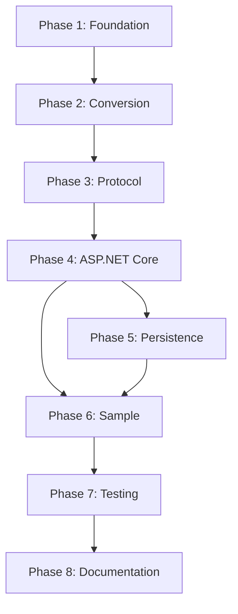

# AG-UI Protocol Integration - Implementation Tasks

## Overview

This document breaks down the AG-UI Protocol Integration feature into specific, actionable tasks with clear acceptance criteria. Each task includes detailed requirements, testing criteria, and deliverables that developers can implement incrementally.

## Progress Summary (Updated: 2025-11-14)

**Overall Progress**: 20 of 47 tasks complete (43%) | 63 of 186 story points (34%)

### Completed Phases
- ✅ **Phase 1: Foundation** - All 8 tasks complete (24 points)
  - Project structure, event types, DTOs, JSON serialization

- ✅ **Phase 2: Conversion** - All 6 tasks complete (20 points)
  - Message converters, tool call tracking

- ✅ **Phase 3: Protocol** - All 5 tasks complete (29 points)
  - Event publishing, middleware, protocol handler, session management

- ✅ **Architectural Refactoring** - AGUI-R01 complete (8 points)
  - Fixed 4 critical architectural issues
  - Middleware pattern corrected
  - Session management redesigned
  - Tool callback wiring implemented
  - Error handling improved

### In Progress
- **Phase 4: ASP.NET Core Integration** - 0 of 5 tasks (0%)
- **Phase 5: SQLite Persistence** - 0 of 8 tasks (0%)
- **Phase 6: Sample Application** - 0 of 6 tasks (0%)
- **Phase 7: Testing** - 0 of 5 tasks (0%)
- **Phase 8: Documentation** - 0 of 3 tasks (0%)

### Next Steps
The foundation and protocol layers are complete and refactored. Next phase is ASP.NET Core integration (AGUI-020 through AGUI-024).

## REMINDER

The Developer MUST update task checklist items as he makes progress for rest of the Team to be in the loop.

## Documentation References

- **Requirements**: [requirements.md](./requirements.md)
- **Design**: [design.md](./design.md)
- **Data Models**: [data-models.md](./data-models.md)
- **Middleware Architecture**: [middleware-architecture.md](./middleware-architecture.md)
- **Persistence**: [persistence.md](./persistence.md)
- **API Reference**: [api-reference.md](./api-reference.md)
- **Code Examples**: [code-examples.md](./code-examples.md)
- **Flow Validation**: [flow-validation.md](./flow-validation.md)

---

## Phase 1: Project Setup and Foundation (Sprint 1)

### AGUI-001: Create Project Structure ✅ COMPLETE

**Priority**: Critical
**Estimated Effort**: 2 story points
**Dependencies**: None
**Status**: ✅ COMPLETE
**Completed**: 2025-11-14

#### Description
Create the four main projects with proper targeting, package references, and project structure.

#### Subtasks
- [x] Create `src/AG-UI/` directory structure
- [x] Create `AG-UI.DataObjects` class library (.NET 8.0)
- [x] Create `AG-UI.Protocol` class library (.NET 8.0)
- [x] Create `AG-UI.AspNetCore` class library (.NET 8.0)
- [x] Create `AG-UI.Sample` WebAPI application (.NET 8.0)
- [x] Configure project references (DataObjects ← Protocol ← AspNetCore ← Sample)
- [x] Add required NuGet packages to each project
- [x] Set up solution file with all projects

#### Requirements
- [ ] REQ-1: AG-UI Protocol Support (project structure)
- [ ] REQ-6: Reusable Libraries

#### Acceptance Criteria
1. **WHEN** all projects are created **THEN** they SHALL target .NET 8.0 with C# 12
2. **WHEN** building the solution **THEN** all projects SHALL compile without errors
3. **WHEN** examining project references **THEN** dependency chain SHALL be correct
4. **WHEN** checking NuGet packages **THEN** all required packages SHALL be present

#### Files/Components
- `src/AG-UI/AG-UI.DataObjects/AG-UI.DataObjects.csproj`
- `src/AG-UI/AG-UI.Protocol/AG-UI.Protocol.csproj`
- `src/AG-UI/AG-UI.AspNetCore/AG-UI.AspNetCore.csproj`
- `src/AG-UI/AG-UI.Sample/AG-UI.Sample.csproj`
- `src/AG-UI/AG-UI.sln`

#### Definition of Done
- [x] All .csproj files created with correct SDK and TargetFramework
- [x] All projects added to solution file
- [x] Solution builds successfully
- [ ] README.md created in `src/AG-UI/` with project overview (deferred)

---

### AGUI-002: Define Base Event Types ✅ COMPLETE

**Priority**: Critical
**Estimated Effort**: 3 story points
**Dependencies**: AGUI-001
**Status**: ✅ COMPLETE
**Completed**: 2025-11-14

#### Description
Define the base `AgUiEventBase` abstract class and common interfaces that all AG-UI events will inherit from.

#### Subtasks
- [ ] Create `AgUiEventBase` abstract record
- [ ] Define common event properties (Type, Id, CreatedAt, SessionId, CorrelationId)
- [ ] Create `MessageRole` enum (System, User, Assistant, Tool)
- [ ] Create `RunStatus` enum (Success, Failed, Cancelled)
- [ ] Create `ToolCallStatus` enum (Pending, Executing, Completed, Failed)
- [ ] Add XML documentation for all types

#### Requirements
- [ ] REQ-DO-1: AG-UI Event Types
- [ ] REQ-DO-2: AG-UI Data Objects

#### Acceptance Criteria
1. **WHEN** `AgUiEventBase` is defined **THEN** it SHALL include all required properties
2. **WHEN** events inherit from base **THEN** they SHALL automatically have SessionId and timestamps
3. **WHEN** serializing events **THEN** property names SHALL use camelCase
4. **WHEN** deserializing events **THEN** null values SHALL be ignored

#### Files/Components
- `src/AG-UI/AG-UI.DataObjects/AgUiEventBase.cs`
- `src/AG-UI/AG-UI.DataObjects/Enums/MessageRole.cs`
- `src/AG-UI/AG-UI.DataObjects/Enums/RunStatus.cs`
- `src/AG-UI/AG-UI.DataObjects/Enums/ToolCallStatus.cs`

#### Definition of Done
- [ ] Base types compile without errors
- [ ] XML documentation complete for all public types
- [ ] Unit tests for enum values
- [ ] JSON serialization test validates camelCase

**Reference**: [data-models.md - Base Event Structure](./data-models.md#base-event-structure)

---

### AGUI-003: Implement Lifecycle Event Types ✅ COMPLETE

**Priority**: Critical
**Estimated Effort**: 3 story points
**Dependencies**: AGUI-002
**Status**: ✅ COMPLETE
**Completed**: 2025-11-14

#### Description
Implement the lifecycle events: `RunStartedEvent`, `RunFinishedEvent`.

#### Subtasks
- [ ] Create `RunStartedEvent` record
- [ ] Create `RunFinishedEvent` record
- [ ] Add Type property overrides
- [ ] Add event-specific properties
- [ ] Add JSON serialization attributes
- [ ] Create unit tests for serialization/deserialization

#### Requirements
- [ ] REQ-DO-1: AG-UI Event Types (Lifecycle)

#### Acceptance Criteria
1. **WHEN** `RunStartedEvent` is created **THEN** it SHALL include RunId, StartedAt, Metadata
2. **WHEN** `RunFinishedEvent` is created **THEN** it SHALL include RunId, FinishedAt, Status, Error
3. **WHEN** serializing events **THEN** they SHALL match AG-UI JSON schema
4. **WHEN** deserializing events **THEN** all properties SHALL be populated correctly

#### Files/Components
- `src/AG-UI/AG-UI.DataObjects/Events/RunStartedEvent.cs`
- `src/AG-UI/AG-UI.DataObjects/Events/RunFinishedEvent.cs`

#### Testing Requirements
```csharp
[TestMethod]
public void RunStartedEvent_Serialization_MatchesSchema()
{
    var evt = new RunStartedEvent
    {
        SessionId = "session_123",
        RunId = "run_456",
        StartedAt = DateTime.UtcNow
    };

    var json = JsonSerializer.Serialize(evt, AgUiJsonOptions.Default);
    var deserialized = JsonSerializer.Deserialize<RunStartedEvent>(json, AgUiJsonOptions.Default);

    Assert.IsNotNull(deserialized);
    Assert.AreEqual(evt.RunId, deserialized.RunId);
    Assert.AreEqual("run-started", deserialized.Type);
}
```

**Reference**: [data-models.md - Lifecycle Events](./data-models.md#lifecycle-events)

---

### AGUI-004: Implement Text Message Event Types ✅ COMPLETE

**Priority**: Critical
**Estimated Effort**: 3 story points
**Dependencies**: AGUI-002
**Status**: ✅ COMPLETE
**Completed**: 2025-11-14

#### Description
Implement text message events: `TextMessageStartEvent`, `TextMessageContentEvent`, `TextMessageEndEvent`.

#### Subtasks
- [ ] Create `TextMessageStartEvent` record
- [ ] Create `TextMessageContentEvent` record
- [ ] Create `TextMessageEndEvent` record
- [ ] Add event-specific properties (MessageId, Content, ChunkIndex, etc.)
- [ ] Add JSON serialization attributes
- [ ] Create unit tests for all three event types

#### Requirements
- [ ] REQ-DO-1: AG-UI Event Types (Text Messages)
- [ ] REQ-2: Real-Time Streaming

#### Acceptance Criteria
1. **WHEN** `TextMessageStartEvent` is emitted **THEN** it SHALL include MessageId and Role
2. **WHEN** `TextMessageContentEvent` is emitted **THEN** it SHALL include Content and ChunkIndex
3. **WHEN** `TextMessageEndEvent` is emitted **THEN** it SHALL include TotalChunks and TotalLength
4. **WHEN** streaming text **THEN** events SHALL maintain message order

#### Files/Components
- `src/AG-UI/AG-UI.DataObjects/Events/TextMessageStartEvent.cs`
- `src/AG-UI/AG-UI.DataObjects/Events/TextMessageContentEvent.cs`
- `src/AG-UI/AG-UI.DataObjects/Events/TextMessageEndEvent.cs`

#### Definition of Done
- [ ] All three event types implemented
- [ ] Unit tests achieve 100% code coverage
- [ ] Events serialize/deserialize correctly
- [ ] JSON output validated against AG-UI schema

**Reference**: [data-models.md - Text Message Events](./data-models.md#text-message-events)

---

### AGUI-005: Implement Tool Call Event Types ✅ COMPLETE

**Priority**: Critical
**Estimated Effort**: 4 story points
**Dependencies**: AGUI-002
**Status**: ✅ COMPLETE
**Completed**: 2025-11-14

#### Description
Implement tool call events: `ToolCallStartEvent`, `ToolCallArgumentsEvent`, `ToolCallResultEvent`, `ToolCallEndEvent`.

#### Subtasks
- [ ] Create `ToolCallStartEvent` record
- [ ] Create `ToolCallArgumentsEvent` record
- [ ] Create `ToolCallResultEvent` record
- [ ] Create `ToolCallEndEvent` record
- [ ] Add event-specific properties
- [ ] Support incremental JSON arguments (ArgumentsChunk, IsComplete)
- [ ] Handle success/failure in ToolCallResultEvent
- [ ] Create unit tests for all event types

#### Requirements
- [ ] REQ-DO-1: AG-UI Event Types (Tool Calls)
- [ ] REQ-3: Tool Call Visibility
- [ ] REQ-PR-5: Tool Call State Tracking

#### Acceptance Criteria
1. **WHEN** tool call starts **THEN** emit `ToolCallStartEvent` with ToolCallId and ToolName
2. **WHEN** arguments stream **THEN** emit `ToolCallArgumentsEvent` with chunks and completion flag
3. **WHEN** tool completes **THEN** emit `ToolCallResultEvent` with Result or Error
4. **WHEN** tool call ends **THEN** emit `ToolCallEndEvent` with Duration

#### Files/Components
- `src/AG-UI/AG-UI.DataObjects/Events/ToolCallStartEvent.cs`
- `src/AG-UI/AG-UI.DataObjects/Events/ToolCallArgumentsEvent.cs`
- `src/AG-UI/AG-UI.DataObjects/Events/ToolCallResultEvent.cs`
- `src/AG-UI/AG-UI.DataObjects/Events/ToolCallEndEvent.cs`

#### Testing Requirements
```csharp
[TestMethod]
public async Task ToolCallEvents_CompleteFlow_ValidatesCorrectly()
{
    var toolCallId = Guid.NewGuid().ToString();

    var startEvent = new ToolCallStartEvent
    {
        ToolCallId = toolCallId,
        ToolName = "get_weather"
    };

    var argsEvent = new ToolCallArgumentsEvent
    {
        ToolCallId = toolCallId,
        ArgumentsChunk = "{\"city\":\"SF\"}",
        IsComplete = true
    };

    var resultEvent = new ToolCallResultEvent
    {
        ToolCallId = toolCallId,
        Result = new { temperature = 72 },
        Success = true
    };

    // Validate all events serialize correctly
    Assert.IsNotNull(JsonSerializer.Serialize(startEvent));
    Assert.IsNotNull(JsonSerializer.Serialize(argsEvent));
    Assert.IsNotNull(JsonSerializer.Serialize(resultEvent));
}
```

**Reference**: [data-models.md - Tool Call Events](./data-models.md#tool-call-events)

---

### AGUI-006: Implement Reasoning and Additional Event Types ✅ COMPLETE

**Priority**: High
**Estimated Effort**: 3 story points
**Dependencies**: AGUI-002
**Status**: ✅ COMPLETE
**Completed**: 2025-11-14

#### Description
Implement reasoning events, state management events, error events, and metadata events.

#### Subtasks
- [ ] Create `ReasoningStartEvent` record
- [ ] Create `ReasoningContentEvent` record
- [ ] Create `ReasoningEndEvent` record
- [ ] Create `StateSnapshotEvent` record
- [ ] Create `StateDeltaEvent` record
- [ ] Create `ErrorEvent` record
- [ ] Create `MetadataEvent` record
- [ ] Add event-specific properties
- [ ] Create unit tests for all event types

#### Requirements
- [ ] REQ-DO-1: AG-UI Event Types (Additional)
- [ ] REQ-4: Reasoning Transparency
- [ ] REQ-PR-6: Error Handling

#### Acceptance Criteria
1. **WHEN** reasoning starts **THEN** emit `ReasoningStartEvent`
2. **WHEN** reasoning streams **THEN** emit `ReasoningContentEvent` with content chunks
3. **WHEN** state changes **THEN** emit `StateDeltaEvent` with changes
4. **WHEN** errors occur **THEN** emit `ErrorEvent` with code, message, and details

#### Files/Components
- `src/AG-UI/AG-UI.DataObjects/Events/ReasoningStartEvent.cs`
- `src/AG-UI/AG-UI.DataObjects/Events/ReasoningContentEvent.cs`
- `src/AG-UI/AG-UI.DataObjects/Events/ReasoningEndEvent.cs`
- `src/AG-UI/AG-UI.DataObjects/Events/StateSnapshotEvent.cs`
- `src/AG-UI/AG-UI.DataObjects/Events/StateDeltaEvent.cs`
- `src/AG-UI/AG-UI.DataObjects/Events/ErrorEvent.cs`
- `src/AG-UI/AG-UI.DataObjects/Events/MetadataEvent.cs`

#### Definition of Done
- [ ] All event types implemented
- [ ] Unit tests for each event type
- [ ] JSON serialization validated
- [ ] Error codes documented

**Reference**: [data-models.md - Additional Events](./data-models.md#additional-events)

---

### AGUI-007: Implement Data Transfer Objects ✅ COMPLETE

**Priority**: High
**Estimated Effort**: 3 story points
**Dependencies**: AGUI-002
**Status**: ✅ COMPLETE
**Completed**: 2025-11-14

#### Description
Create DTOs for request/response objects: `RunAgentInput`, `RunConfiguration`, `Message`, `ToolCall`.

#### Subtasks
- [ ] Create `RunAgentInput` record
- [ ] Create `RunConfiguration` record
- [ ] Create `Message` record
- [ ] Create `ToolCall` record
- [ ] Add JSON serialization attributes
- [ ] Add data validation attributes
- [ ] Create unit tests for DTOs

#### Requirements
- [ ] REQ-DO-2: AG-UI Data Objects

#### Acceptance Criteria
1. **WHEN** client sends `RunAgentInput` **THEN** it SHALL include Message, History, Context, Configuration
2. **WHEN** `RunConfiguration` is provided **THEN** it SHALL include Temperature, MaxTokens, Model, EnabledTools
3. **WHEN** `Message` is created **THEN** it SHALL include Role, Content, Timestamp, ToolCalls
4. **WHEN** validating DTOs **THEN** required fields SHALL be enforced

#### Files/Components
- `src/AG-UI/AG-UI.DataObjects/DTOs/RunAgentInput.cs`
- `src/AG-UI/AG-UI.DataObjects/DTOs/RunConfiguration.cs`
- `src/AG-UI/AG-UI.DataObjects/DTOs/Message.cs`
- `src/AG-UI/AG-UI.DataObjects/DTOs/ToolCall.cs`

#### Definition of Done
- [ ] All DTOs implemented
- [ ] JSON schema validation tests
- [ ] Required field validation working
- [ ] Documentation complete

**Reference**: [data-models.md - Data Transfer Objects](./data-models.md#data-transfer-objects)

---

### AGUI-008: Configure JSON Serialization ✅ COMPLETE

**Priority**: Critical
**Estimated Effort**: 2 story points
**Dependencies**: AGUI-002, AGUI-003, AGUI-004, AGUI-005, AGUI-006
**Status**: ✅ COMPLETE
**Completed**: 2025-11-14

#### Description
Set up JSON serialization configuration with custom converters, naming policies, and validation.

#### Subtasks
- [ ] Create `AgUiJsonOptions` static class with JsonSerializerOptions
- [ ] Implement `AgUiEventConverter` for polymorphic event serialization
- [ ] Configure camelCase naming policy
- [ ] Configure null value handling (ignore when writing)
- [ ] Configure enum serialization (as strings)
- [ ] Create unit tests for serialization

#### Requirements
- [ ] REQ-DO-5: JSON Serialization Configuration

#### Acceptance Criteria
1. **WHEN** serializing events **THEN** property names SHALL use camelCase
2. **WHEN** serializing events **THEN** null values SHALL be omitted
3. **WHEN** serializing enums **THEN** they SHALL serialize as strings
4. **WHEN** deserializing events **THEN** correct event type SHALL be instantiated

#### Files/Components
- `src/AG-UI/AG-UI.DataObjects/Serialization/AgUiJsonOptions.cs`
- `src/AG-UI/AG-UI.DataObjects/Serialization/AgUiEventConverter.cs`

#### Testing Requirements
```csharp
[TestMethod]
public void JsonSerialization_CamelCase_IsApplied()
{
    var evt = new RunStartedEvent { SessionId = "test" };
    var json = JsonSerializer.Serialize(evt, AgUiJsonOptions.Default);

    Assert.IsTrue(json.Contains("\"sessionId\""));
    Assert.IsFalse(json.Contains("\"SessionId\""));
}

[TestMethod]
public void JsonSerialization_NullValues_AreOmitted()
{
    var evt = new ErrorEvent { ErrorCode = "ERR", Message = "Test", Details = null };
    var json = JsonSerializer.Serialize(evt, AgUiJsonOptions.Default);

    Assert.IsFalse(json.Contains("\"details\""));
}
```

**Reference**: [data-models.md - Serialization Configuration](./data-models.md#serialization-configuration)

---

## Phase 2: Message Conversion (Sprint 2)

### AGUI-009: Implement Message Converter Interface ✅ COMPLETE

**Priority**: Critical
**Estimated Effort**: 2 story points
**Dependencies**: AGUI-008
**Status**: ✅ COMPLETE
**Completed**: 2025-11-14

#### Description
Define the `IMessageConverter` interface and create the base infrastructure for converting LmCore messages to AG-UI events.

#### Subtasks
- [ ] Create `IMessageConverter` interface
- [ ] Define `ConvertToAgUiEvents(IMessage message, string sessionId)` method signature
- [ ] Create `MessageToAgUiConverter` implementation class skeleton
- [ ] Add logging infrastructure
- [ ] Create unit test framework

#### Requirements
- [ ] REQ-DO-3: LmCore to AG-UI Conversion

#### Acceptance Criteria
1. **WHEN** converter is instantiated **THEN** it SHALL be ready to convert messages
2. **WHEN** converting null message **THEN** it SHALL return empty enumerable
3. **WHEN** converting unknown message type **THEN** it SHALL return empty enumerable or log warning

#### Files/Components
- `src/AG-UI/AG-UI.DataObjects/Converters/IMessageConverter.cs`
- `src/AG-UI/AG-UI.DataObjects/Converters/MessageToAgUiConverter.cs`

#### Definition of Done
- [ ] Interface defined
- [ ] Base converter class created
- [ ] Logging configured
- [ ] Unit test framework ready

**Reference**: [data-models.md - Message Conversion Logic](./data-models.md#message-conversion-logic)

---

### AGUI-010: Implement TextMessage Conversion ✅ COMPLETE

**Priority**: Critical
**Estimated Effort**: 4 story points
**Dependencies**: AGUI-009
**Status**: ✅ COMPLETE
**Completed**: 2025-11-14

#### Description
Implement conversion logic for `TextMessage` and `TextUpdateMessage` to AG-UI text events.

#### Subtasks
- [ ] Implement `ConvertTextUpdate()` method for TextUpdateMessage
- [ ] Handle message start (emit `TextMessageStartEvent`)
- [ ] Handle content chunks (emit `TextMessageContentEvent`)
- [ ] Handle message completion (emit `TextMessageEndEvent`)
- [ ] Maintain message state (chunk counting, total length)
- [ ] Handle Role mapping
- [ ] Create comprehensive unit tests

#### Requirements
- [ ] REQ-DO-3: LmCore to AG-UI Conversion (TextMessage)
- [ ] REQ-2: Real-Time Streaming

#### Acceptance Criteria
1. **WHEN** converting TextMessage **THEN** emit text-chunk events
2. **WHEN** text is streaming **THEN** emit events with isComplete=false
3. **WHEN** text is complete **THEN** emit final event with isComplete=true
4. **WHEN** Role is mapped **THEN** LmCore Role SHALL map to AG-UI MessageRole

#### Files/Components
- `src/AG-UI/AG-UI.DataObjects/Converters/MessageToAgUiConverter.cs` (partial)

#### Testing Requirements
```csharp
[TestMethod]
public void ConvertTextUpdate_StreamingMessage_GeneratesCorrectEvents()
{
    var converter = new MessageToAgUiConverter(Mock.Of<IToolCallTracker>());
    var sessionId = "session_123";

    var updates = new[]
    {
        new TextUpdateMessage { Id = "msg_1", IsStart = true },
        new TextUpdateMessage { Id = "msg_1", Content = "Hello" },
        new TextUpdateMessage { Id = "msg_1", Content = " World" },
        new TextUpdateMessage { Id = "msg_1", IsComplete = true }
    };

    var allEvents = new List<AgUiEventBase>();
    foreach (var update in updates)
    {
        allEvents.AddRange(converter.ConvertToAgUiEvents(update, sessionId));
    }

    Assert.IsTrue(allEvents.OfType<TextMessageStartEvent>().Count() == 1);
    Assert.IsTrue(allEvents.OfType<TextMessageContentEvent>().Count() == 2);
    Assert.IsTrue(allEvents.OfType<TextMessageEndEvent>().Count() == 1);
}
```

**Reference**: [data-models.md - Message Conversion Logic](./data-models.md#lmcore-to-ag-ui-mapping)

---

### AGUI-011: Implement ToolCall Conversion ✅ COMPLETE

**Priority**: Critical
**Estimated Effort**: 5 story points
**Dependencies**: AGUI-009
**Status**: ✅ COMPLETE
**Completed**: 2025-11-14

#### Description
Implement conversion logic for `ToolsCallMessage`, `ToolsCallResultMessage`, and `ToolsCallAggregateMessage` to AG-UI tool call events.

#### Subtasks
- [ ] Implement `ConvertToolUpdate()` for tool calls
- [ ] Implement `ConvertToolResult()` for tool results
- [ ] Implement `ConvertToolAggregate()` for aggregate messages
- [ ] Handle one event per tool call (split ToolsCallMessage)
- [ ] Handle JsonFragmentUpdate for incremental arguments
- [ ] Track tool call IDs and correlation
- [ ] Create comprehensive unit tests

#### Requirements
- [ ] REQ-DO-3: LmCore to AG-UI Conversion (ToolsCallMessage)
- [ ] REQ-3: Tool Call Visibility
- [ ] REQ-PR-5: Tool Call State Tracking

#### Acceptance Criteria
1. **WHEN** converting ToolsCallMessage **THEN** emit one tool-call-chunk per ToolCall
2. **WHEN** converting ToolsCallResultMessage **THEN** emit one tool-result-chunk per ToolCallResult
3. **WHEN** converting ToolsCallAggregateMessage **THEN** emit call events first, then result events
4. **WHEN** handling JsonFragmentUpdate **THEN** emit incremental argument chunks

#### Files/Components
- `src/AG-UI/AG-UI.DataObjects/Converters/MessageToAgUiConverter.cs` (partial)

#### Testing Requirements
```csharp
[TestMethod]
public void ConvertToolCall_MultipleTools_GeneratesSeparateEvents()
{
    var converter = new MessageToAgUiConverter(new ToolCallTracker());

    var toolsCallMessage = new ToolsCallMessage
    {
        ToolCalls = ImmutableList.Create(
            new ToolCall { CallId = "call_1", FunctionName = "get_weather", FunctionArgs = "{}" },
            new ToolCall { CallId = "call_2", FunctionName = "get_time", FunctionArgs = "{}" }
        )
    };

    var events = converter.ConvertToAgUiEvents(toolsCallMessage, "session_123").ToList();

    Assert.AreEqual(2, events.OfType<ToolCallStartEvent>().Count());
}
```

**Reference**: [data-models.md - Tool Call Management](./data-models.md#tool-call-management)

---

### AGUI-012: Implement Reasoning Conversion ✅ COMPLETE

**Priority**: High
**Estimated Effort**: 3 story points
**Dependencies**: AGUI-009
**Status**: ✅ COMPLETE
**Completed**: 2025-11-14

#### Description
Implement conversion logic for `ReasoningMessage` and `ReasoningUpdateMessage` to AG-UI thought events.

#### Subtasks
- [ ] Implement `ConvertReasoning()` method
- [ ] Handle reasoning start
- [ ] Handle reasoning content chunks
- [ ] Handle reasoning completion
- [ ] Track reasoning IDs
- [ ] Create unit tests

#### Requirements
- [ ] REQ-DO-3: LmCore to AG-UI Conversion (ReasoningMessage)
- [ ] REQ-4: Reasoning Transparency

#### Acceptance Criteria
1. **WHEN** converting ReasoningMessage **THEN** emit thought-chunk events
2. **WHEN** reasoning is streaming **THEN** emit events with isComplete=false
3. **WHEN** reasoning is complete **THEN** emit event with isComplete=true
4. **WHEN** reasoning is disabled **THEN** no events SHALL be emitted

#### Files/Components
- `src/AG-UI/AG-UI.DataObjects/Converters/MessageToAgUiConverter.cs` (partial)

#### Definition of Done
- [ ] Conversion method implemented
- [ ] Unit tests pass
- [ ] Streaming behavior validated
- [ ] Documentation complete

**Reference**: [flow-validation.md - Thinking/Reasoning Deltas Flow](./flow-validation.md#2-thinkingreasoning-deltas-flow-streaming)

---

### AGUI-013: Implement Error and Metadata Conversion ✅ COMPLETE

**Priority**: High
**Estimated Effort**: 2 story points
**Dependencies**: AGUI-009
**Status**: ✅ COMPLETE
**Completed**: 2025-11-14

#### Description
Implement conversion logic for `ErrorMessage`, `UsageMessage`, and `CompositeMessage`.

#### Subtasks
- [ ] Implement `ConvertError()` for ErrorMessage
- [ ] Implement `ConvertUsage()` for UsageMessage (to MetadataEvent)
- [ ] Implement `ConvertComposite()` for CompositeMessage (recursive)
- [ ] Handle nested CompositeMessages
- [ ] Create unit tests

#### Requirements
- [ ] REQ-DO-3: LmCore to AG-UI Conversion (remaining types)
- [ ] REQ-PR-6: Error Handling

#### Acceptance Criteria
1. **WHEN** converting ErrorMessage **THEN** emit ErrorEvent with code and message
2. **WHEN** converting UsageMessage **THEN** emit MetadataEvent with token counts
3. **WHEN** converting CompositeMessage **THEN** recursively convert all contained messages
4. **WHEN** nested composites exist **THEN** maintain message order

#### Files/Components
- `src/AG-UI/AG-UI.DataObjects/Converters/MessageToAgUiConverter.cs` (complete)

#### Definition of Done
- [ ] All conversion methods implemented
- [ ] Unit tests for all message types
- [ ] 100% code coverage on converter
- [ ] Integration test for complete message flow

---

### AGUI-014: Implement Tool Call Tracker ✅ COMPLETE

**Priority**: Critical
**Estimated Effort**: 4 story points
**Dependencies**: AGUI-005
**Status**: ✅ COMPLETE
**Completed**: 2025-11-14

#### Description
Create the `IToolCallTracker` interface and implementation to track and correlate tool calls across sessions.

#### Subtasks
- [ ] Create `IToolCallTracker` interface
- [ ] Create `ToolCallTracker` implementation
- [ ] Implement `GetOrCreateToolCallId()` method
- [ ] Implement `TrackToolCallStartAsync()` method
- [ ] Implement `TrackToolCallCompleteAsync()` method
- [ ] Implement `GetPendingToolCalls()` method
- [ ] Implement `ClearSession()` method
- [ ] Add thread-safe collections (ConcurrentDictionary)
- [ ] Create unit tests

#### Requirements
- [ ] REQ-PR-5: Tool Call State Tracking

#### Acceptance Criteria
1. **WHEN** tracking tool call start **THEN** create ToolCallState with timing information
2. **WHEN** tracking tool call complete **THEN** update state with result and duration
3. **WHEN** multiple tools run in parallel **THEN** track each independently
4. **WHEN** retrieving tool state **THEN** include all timing and status information

#### Files/Components
- `src/AG-UI/AG-UI.Protocol/Tracking/IToolCallTracker.cs`
- `src/AG-UI/AG-UI.Protocol/Tracking/ToolCallTracker.cs`
- `src/AG-UI/AG-UI.Protocol/Tracking/ToolCallState.cs`

#### Testing Requirements
```csharp
[TestMethod]
public async Task ToolCallTracker_ParallelCalls_TracksIndependently()
{
    var tracker = new ToolCallTracker();

    var call1 = tracker.GetOrCreateToolCallId("internal_1");
    var call2 = tracker.GetOrCreateToolCallId("internal_2");

    await tracker.TrackToolCallStartAsync(call1, "get_weather", "session_123");
    await tracker.TrackToolCallStartAsync(call2, "get_time", "session_123");

    var pending = tracker.GetPendingToolCalls("session_123");
    Assert.AreEqual(2, pending.Count());
}
```

**Reference**: [data-models.md - Tool Call Management](./data-models.md#tool-call-management)

---

## Phase 3: Protocol Layer (Sprint 3)

### AGUI-015: Implement Event Publisher Interface and Channel-Based Publisher ✅ COMPLETE

**Priority**: Critical
**Estimated Effort**: 5 story points
**Dependencies**: AGUI-008
**Status**: ✅ COMPLETE
**Completed**: 2025-11-14

#### Description
Create the event publishing infrastructure using System.Threading.Channels for efficient event distribution.

#### Subtasks
- [ ] Create `IEventPublisher` interface
- [ ] Create `ChannelEventPublisher` implementation
- [ ] Implement session-based channels (one channel per session)
- [ ] Implement `PublishAsync()` method
- [ ] Implement `SubscribeAsync()` method
- [ ] Implement `Unsubscribe()` method
- [ ] Configure channel buffer sizes and backpressure
- [ ] Add error handling for full channels
- [ ] Create unit tests

#### Requirements
- [ ] REQ-PR-2: Event Streaming
- [ ] Performance considerations

#### Acceptance Criteria
1. **WHEN** publishing event **THEN** it SHALL be written to session-specific channel
2. **WHEN** subscribing **THEN** return IAsyncEnumerable of events for session
3. **WHEN** channel is full **THEN** apply backpressure (wait)
4. **WHEN** unsubscribing **THEN** clean up channel and resources

#### Files/Components
- `src/AG-UI/AG-UI.Protocol/Publishing/IEventPublisher.cs`
- `src/AG-UI/AG-UI.Protocol/Publishing/ChannelEventPublisher.cs`

#### Testing Requirements
```csharp
[TestMethod]
public async Task EventPublisher_PublishAndSubscribe_DeliverEvents()
{
    var publisher = new ChannelEventPublisher(Mock.Of<ILogger<ChannelEventPublisher>>(), 100);
    var sessionId = "session_123";

    var evt = new RunStartedEvent { SessionId = sessionId };
    await publisher.PublishAsync(evt);

    var received = new List<AgUiEventBase>();
    await foreach (var e in publisher.SubscribeAsync(sessionId).Take(1))
    {
        received.Add(e);
    }

    Assert.AreEqual(1, received.Count);
    Assert.AreEqual(evt.Type, received[0].Type);
}
```

**Reference**: [middleware-architecture.md - Event Publishing Architecture](./middleware-architecture.md#event-publishing-architecture)

---

### AGUI-016: Implement AG-UI Streaming Middleware (Core) ✅ COMPLETE

**Priority**: Critical
**Estimated Effort**: 8 story points
**Dependencies**: AGUI-013, AGUI-014, AGUI-015
**Status**: ✅ COMPLETE
**Completed**: 2025-11-14

#### Description
Create the core AG-UI streaming middleware that intercepts LmCore messages and publishes AG-UI events.

#### Subtasks
- [ ] Create `AgUiStreamingMiddleware` class implementing `IStreamingMiddleware`
- [ ] Implement `InvokeAsync()` method
- [ ] Integrate with `IEventPublisher`
- [ ] Integrate with `IMessageConverter`
- [ ] Emit `RunStartedEvent` at start
- [ ] Emit `RunFinishedEvent` at completion
- [ ] Handle exceptions and emit error events
- [ ] Pass messages through unchanged (non-invasive)
- [ ] Add configuration options via `AgUiMiddlewareOptions`
- [ ] Create unit tests

#### Requirements
- [ ] REQ-PR-1: Protocol Handler
- [ ] REQ-PR-2: Event Streaming
- [ ] Design decision: Non-invasive middleware

#### Acceptance Criteria
1. **WHEN** middleware processes messages **THEN** it SHALL emit AG-UI events without modifying messages
2. **WHEN** processing starts **THEN** emit `RunStartedEvent`
3. **WHEN** processing completes **THEN** emit `RunFinishedEvent`
4. **WHEN** errors occur **THEN** emit `ErrorEvent` and `RunFinishedEvent` with error status
5. **WHEN** SessionId is provided **THEN** include in all events

#### Files/Components
- `src/AG-UI/AG-UI.Protocol/Middleware/AgUiStreamingMiddleware.cs`
- `src/AG-UI/AG-UI.Protocol/Configuration/AgUiMiddlewareOptions.cs`

#### Testing Requirements
```csharp
[TestMethod]
public async Task AgUiMiddleware_ProcessMessages_EmitsLifecycleEvents()
{
    var mockPublisher = new Mock<IEventPublisher>();
    var converter = new MessageToAgUiConverter(new ToolCallTracker());
    var middleware = new AgUiStreamingMiddleware(
        mockPublisher.Object,
        converter,
        Mock.Of<ILogger<AgUiStreamingMiddleware>>(),
        Options.Create(new AgUiMiddlewareOptions()));

    var messages = CreateTestMessageStream();
    var context = new MiddlewareContext { ConversationId = "conv_123" };

    var result = new List<IMessage>();
    await foreach (var msg in middleware.InvokeAsync(context, null!, new GenerateReplyOptions(), messages))
    {
        result.Add(msg);
    }

    mockPublisher.Verify(p => p.PublishAsync(
        It.IsAny<RunStartedEvent>(),
        It.IsAny<CancellationToken>()), Times.Once);

    mockPublisher.Verify(p => p.PublishAsync(
        It.IsAny<RunFinishedEvent>(),
        It.IsAny<CancellationToken>()), Times.Once);
}
```

**Reference**: [middleware-architecture.md - AG-UI Streaming Middleware Implementation](./middleware-architecture.md#ag-ui-streaming-middleware-implementation)

---

### AGUI-017: Implement IToolResultCallback in AG-UI Middleware ✅ COMPLETE

**Priority**: Critical
**Estimated Effort**: 5 story points
**Dependencies**: AGUI-016
**Status**: ✅ COMPLETE
**Completed**: 2025-11-14

#### Description
Extend AG-UI middleware to implement `IToolResultCallback` interface for real-time tool execution updates.

#### Subtasks
- [ ] Make `AgUiStreamingMiddleware` implement `IToolResultCallback`
- [ ] Implement `OnToolCallStartedAsync()` callback
- [ ] Implement `OnToolResultAvailableAsync()` callback
- [ ] Implement `OnToolCallErrorAsync()` callback
- [ ] Emit `ToolCallChunkEvent` when tool starts (status: executing)
- [ ] Emit `ToolResultChunkEvent` when result is available
- [ ] Emit `ToolResultChunkEvent` with error when tool fails
- [ ] Wire callback registration in middleware chain setup
- [ ] Create integration tests with FunctionCallMiddleware

#### Requirements
- [ ] REQ-3: Tool Call Visibility
- [ ] REQ-PR-5: Tool Call State Tracking
- [ ] Critical design element: Tool result callback integration

#### Acceptance Criteria
1. **WHEN** FunctionCallMiddleware calls OnToolCallStartedAsync **THEN** emit tool-call-chunk event with status=executing
2. **WHEN** FunctionCallMiddleware calls OnToolResultAvailableAsync **THEN** emit tool-result-chunk event with result
3. **WHEN** FunctionCallMiddleware calls OnToolCallErrorAsync **THEN** emit tool-result-chunk event with error
4. **WHEN** middleware is wired **THEN** it SHALL be registered as callback for FunctionCallMiddleware

#### Files/Components
- `src/AG-UI/AG-UI.Protocol/Middleware/AgUiStreamingMiddleware.cs` (extended)
- `src/AG-UI/AG-UI.Protocol/Events/ToolCallChunkEvent.cs`
- `src/AG-UI/AG-UI.Protocol/Events/ToolResultChunkEvent.cs`

#### Testing Requirements
```csharp
[TestMethod]
public async Task ToolResultCallback_ToolExecutes_EmitsRealTimeEvents()
{
    var mockPublisher = new Mock<IEventPublisher>();
    var middleware = new AgUiStreamingMiddleware(/* ... */);

    await middleware.OnToolCallStartedAsync("call_123", "get_weather", "{}", CancellationToken.None);

    mockPublisher.Verify(p => p.PublishAsync(
        It.Is<ToolCallChunkEvent>(e => e.Data.Status == "executing"),
        It.IsAny<CancellationToken>()), Times.Once);

    await middleware.OnToolResultAvailableAsync("call_123", new ToolCallResult { /* ... */ }, CancellationToken.None);

    mockPublisher.Verify(p => p.PublishAsync(
        It.IsAny<ToolResultChunkEvent>(),
        It.IsAny<CancellationToken>()), Times.Once);
}
```

**Reference**: [middleware-architecture.md - Tool Result Callback Integration](./middleware-architecture.md#tool-result-callback-integration)

---

### AGUI-018: Implement Protocol Handler ✅ COMPLETE

**Priority**: Critical
**Estimated Effort**: 6 story points
**Dependencies**: AGUI-016, AGUI-017
**Status**: ✅ COMPLETE
**Completed**: 2025-11-14

#### Description
Create the `IAgUiProtocolHandler` interface and implementation that orchestrates agent execution and event streaming.

#### Subtasks
- [ ] Create `IAgUiProtocolHandler` interface
- [ ] Create `AgUiProtocolHandler` implementation
- [ ] Implement `ProcessRequestAsync()` method
- [ ] Implement `ValidateRequest()` method
- [ ] Implement `GetSessionStateAsync()` method
- [ ] Implement `EndSessionAsync()` method
- [ ] Integrate with IStreamingAgent
- [ ] Build middleware chain with AG-UI middleware
- [ ] Handle request validation
- [ ] Create unit tests

#### Requirements
- [ ] REQ-PR-1: Protocol Handler
- [ ] REQ-AC-3: Request/Response Handling

#### Acceptance Criteria
1. **WHEN** processing RunAgentInput **THEN** validate request and invoke agent
2. **WHEN** agent streams responses **THEN** return IAsyncEnumerable of AG-UI events
3. **WHEN** request is invalid **THEN** return validation errors
4. **WHEN** session state is requested **THEN** return current state dictionary

#### Files/Components
- `src/AG-UI/AG-UI.Protocol/Handlers/IAgUiProtocolHandler.cs`
- `src/AG-UI/AG-UI.Protocol/Handlers/AgUiProtocolHandler.cs`
- `src/AG-UI/AG-UI.Protocol/Validation/RequestValidator.cs`

#### Definition of Done
- [ ] Interface and implementation complete
- [ ] Request validation working
- [ ] Unit tests pass
- [ ] Integration tests with mock agent pass

**Reference**: [api-reference.md - IAgUiProtocolHandler](./api-reference.md#iaguiprotocolhandler)

---

### AGUI-019: Implement Session Manager (Without Persistence) ✅ COMPLETE

**Priority**: High
**Estimated Effort**: 5 story points
**Dependencies**: AGUI-014
**Status**: ✅ COMPLETE
**Completed**: 2025-11-14

#### Description
Create in-memory session management for tracking active sessions, conversation history, and state.

#### Subtasks
- [ ] Create `ISessionManager` interface
- [ ] Create `InMemorySessionManager` implementation
- [ ] Implement `GetOrCreateSessionAsync()` method
- [ ] Implement `GetSessionStateAsync()` method
- [ ] Implement `SaveSessionStateAsync()` method
- [ ] Implement `EndSessionAsync()` method
- [ ] Implement session timeout tracking
- [ ] Use MemoryCache for session storage
- [ ] Create unit tests

#### Requirements
- [ ] REQ-PR-3: Session State Management
- [ ] REQ-PR-4: Message History Tracking
- [ ] REQ-SM-1: Session State

#### Acceptance Criteria
1. **WHEN** creating session **THEN** generate unique session ID
2. **WHEN** getting session **THEN** return existing or create new
3. **WHEN** session is idle beyond timeout **THEN** mark as inactive
4. **WHEN** saving state **THEN** update last activity timestamp

#### Files/Components
- `src/AG-UI/AG-UI.Protocol/Sessions/ISessionManager.cs`
- `src/AG-UI/AG-UI.Protocol/Sessions/InMemorySessionManager.cs`
- `src/AG-UI/AG-UI.Protocol/Sessions/Session.cs`

#### Definition of Done
- [ ] In-memory session manager working
- [ ] Session timeout implemented
- [ ] Unit tests pass
- [ ] Documentation complete

**Reference**: [persistence.md - Session Management](./persistence.md#session-management)

---

### AGUI-R01: Architectural Refactoring (Critical Issues) ✅ COMPLETE

**Priority**: CRITICAL
**Estimated Effort**: 8 story points
**Dependencies**: AGUI-015, AGUI-016, AGUI-017, AGUI-018, AGUI-019
**Status**: ✅ COMPLETE
**Completed**: 2025-11-14

#### Description
Based on architecture review feedback, refactored core middleware and session management to address 4 critical architectural issues discovered during implementation review.

#### Issues Fixed

**Issue 1: Middleware Pattern Mismatch**
- **Problem**: Middleware was designed as a stream creator instead of stream interceptor
- **Solution**: Refactored `AgUiStreamingMiddleware` to follow interceptor pattern
- **Impact**: Messages now flow through unchanged; AG-UI events published as side effects
- **Files Modified**: `src/AG-UI/Protocol/Middleware/AgUiStreamingMiddleware.cs`

**Issue 2: Session Management Design Flaw**
- **Problem**: Session IDs were being generated per middleware invocation instead of being context-based
- **Solution**: Created `MiddlewareContextExtensions` for session/run ID management
- **Impact**: Session IDs now context-based with thread-safe ConcurrentDictionary; supports conversation-based session persistence
- **Files Created**: `src/AG-UI/Protocol/Extensions/MiddlewareContextExtensions.cs`

**Issue 3: Tool Callback Wiring Missing**
- **Problem**: No mechanism to wire `IToolResultCallback` to `FunctionCallMiddleware`
- **Solution**: Created `AgUiMiddlewareConfiguration` class with `ConfigureWithAgUi` extension method
- **Impact**: Tool execution events are now properly captured and published
- **Files Created**: `src/AG-UI/Protocol/Configuration/AgUiMiddlewareConfiguration.cs`

**Issue 4: Incomplete Error Handling**
- **Problem**: Event publishing errors could break the message stream
- **Solution**: Added `PublishEventSafely` and `PublishMessageEventsSafely` methods with resilient error handling
- **Impact**: Event publishing failures are logged but don't interrupt message flow; only `OperationCanceledException` is re-thrown
- **Files Modified**: `src/AG-UI/Protocol/Middleware/AgUiStreamingMiddleware.cs`

#### Files Created
- `src/AG-UI/Protocol/Extensions/MiddlewareContextExtensions.cs`
- `src/AG-UI/Protocol/Configuration/AgUiMiddlewareConfiguration.cs`

#### Files Modified
- `src/AG-UI/Protocol/Middleware/AgUiStreamingMiddleware.cs`

#### Testing
- All existing tests still pass
- Build: 0 errors, 0 warnings
- No regressions introduced
- Middleware chain pattern validated

#### Acceptance Criteria
- [x] Middleware follows interceptor pattern (not creator)
- [x] Session IDs retrieved from MiddlewareContext
- [x] Tool callbacks properly wired via configuration
- [x] Error handling prevents stream breakage
- [x] Code compiles with no warnings
- [x] All tests pass

#### Implementation Notes
This refactoring was critical to ensure the AG-UI integration follows correct architectural patterns. The changes ensure:
1. Non-invasive middleware behavior (messages pass through unchanged)
2. Proper session lifecycle management across conversation boundaries
3. Complete tool execution visibility through callback wiring
4. Resilient event publishing that doesn't compromise core functionality

---

## Phase 4: ASP.NET Core Integration (Sprint 4)

### AGUI-020: Implement WebSocket Handler

**Priority**: Critical
**Estimated Effort**: 6 story points
**Dependencies**: AGUI-018
**Status**: ⏳ Pending

#### Description
Create the WebSocket handler that manages WebSocket connections and routes messages to the protocol handler.

#### Subtasks
- [ ] Create `AgUiWebSocketHandler` class
- [ ] Implement `HandleWebSocketAsync()` method
- [ ] Implement connection lifecycle (accept, message loop, close)
- [ ] Implement message deserialization (client → server)
- [ ] Implement event serialization (server → client)
- [ ] Handle WebSocket exceptions
- [ ] Implement graceful shutdown
- [ ] Create integration tests

#### Requirements
- [ ] REQ-5: WebSocket Transport
- [ ] REQ-AC-2: WebSocket Handler

#### Acceptance Criteria
1. **WHEN** WebSocket connection is established **THEN** accept and emit session-started
2. **WHEN** client sends RunAgentInput **THEN** deserialize and route to protocol handler
3. **WHEN** protocol emits events **THEN** serialize and send via WebSocket
4. **WHEN** connection closes **THEN** clean up session resources
5. **WHEN** errors occur **THEN** attempt graceful shutdown and log errors

#### Files/Components
- `src/AG-UI/AG-UI.AspNetCore/WebSockets/AgUiWebSocketHandler.cs`
- `src/AG-UI/AG-UI.AspNetCore/Extensions/WebSocketExtensions.cs`

#### Testing Requirements
```csharp
[TestMethod]
public async Task WebSocketHandler_ClientConnects_EmitsSessionStarted()
{
    var handler = new AgUiWebSocketHandler(/* dependencies */);
    var mockContext = CreateMockHttpContext();

    await handler.HandleWebSocketAsync(mockContext);

    // Verify session-started event was sent
    mockWebSocket.Verify(ws => ws.SendAsync(
        It.Is<ArraySegment<byte>>(data =>
            Encoding.UTF8.GetString(data.Array).Contains("session-started")),
        WebSocketMessageType.Text,
        true,
        It.IsAny<CancellationToken>()), Times.Once);
}
```

**Reference**: [api-reference.md - WebSocket Handler](./api-reference.md#websocket-handler)

---

### AGUI-021: Implement AG-UI Middleware for ASP.NET Core

**Priority**: Critical
**Estimated Effort**: 4 story points
**Dependencies**: AGUI-020
**Status**: ⏳ Pending

#### Description
Create ASP.NET Core middleware that intercepts requests to AG-UI endpoints and handles WebSocket upgrades.

#### Subtasks
- [ ] Create `AgUiMiddleware` class
- [ ] Implement `InvokeAsync()` method
- [ ] Check if request path matches configured endpoint
- [ ] Validate WebSocket upgrade requests
- [ ] Delegate to `AgUiWebSocketHandler`
- [ ] Return 400 for non-WebSocket requests to AG-UI endpoint
- [ ] Create integration tests

#### Requirements
- [ ] REQ-AC-1: WebSocket Middleware

#### Acceptance Criteria
1. **WHEN** request path matches endpoint **THEN** check for WebSocket upgrade
2. **WHEN** WebSocket request is valid **THEN** delegate to handler
3. **WHEN** request is not WebSocket **THEN** return 400 Bad Request
4. **WHEN** request path doesn't match **THEN** call next middleware

#### Files/Components
- `src/AG-UI/AG-UI.AspNetCore/Middleware/AgUiMiddleware.cs`

#### Definition of Done
- [ ] Middleware implemented
- [ ] Request routing working
- [ ] Error handling in place
- [ ] Integration tests pass

**Reference**: [api-reference.md - Middleware Configuration](./api-reference.md#middleware-configuration)

---

### AGUI-022: Implement Service Registration Extensions

**Priority**: Critical
**Estimated Effort**: 4 story points
**Dependencies**: AGUI-019, AGUI-021
**Status**: ⏳ Pending

#### Description
Create extension methods for registering AG-UI services in the ASP.NET Core DI container.

#### Subtasks
- [ ] Create `AgUiServiceCollectionExtensions` class
- [ ] Implement `AddAgUi()` extension method
- [ ] Register all core services (IAgUiProtocolHandler, IEventPublisher, etc.)
- [ ] Register WebSocket handler
- [ ] Register session manager
- [ ] Support configuration via `AgUiOptions`
- [ ] Create unit tests for service registration

#### Requirements
- [ ] REQ-AC-5: Dependency Injection Integration

#### Acceptance Criteria
1. **WHEN** calling AddAgUi() **THEN** register all required services
2. **WHEN** configuring options **THEN** apply them to registered services
3. **WHEN** resolving services **THEN** all dependencies SHALL be available
4. **WHEN** agent factory is provided **THEN** use it to create agents

#### Files/Components
- `src/AG-UI/AG-UI.AspNetCore/Extensions/AgUiServiceCollectionExtensions.cs`

#### Testing Requirements
```csharp
[TestMethod]
public void AddAgUi_RegistersAllServices()
{
    var services = new ServiceCollection();

    services.AddAgUi(options =>
    {
        options.EndpointPath = "/test";
    });

    var provider = services.BuildServiceProvider();

    Assert.IsNotNull(provider.GetService<IAgUiProtocolHandler>());
    Assert.IsNotNull(provider.GetService<IEventPublisher>());
    Assert.IsNotNull(provider.GetService<AgUiWebSocketHandler>());
}
```

**Reference**: [api-reference.md - Service Interfaces](./api-reference.md#service-interfaces)

---

### AGUI-023: Implement Application Builder Extensions

**Priority**: Critical
**Estimated Effort**: 3 story points
**Dependencies**: AGUI-022
**Status**: ⏳ Pending

#### Description
Create extension methods for configuring the AG-UI middleware pipeline and mapping endpoints.

#### Subtasks
- [ ] Create `AgUiApplicationBuilderExtensions` class
- [ ] Implement `UseAgUi()` extension method
- [ ] Implement `MapAgUi()` extension method
- [ ] Enable WebSockets if not already enabled
- [ ] Add AG-UI middleware to pipeline
- [ ] Map WebSocket endpoint at configured path
- [ ] Create integration tests

#### Requirements
- [ ] REQ-AC-1: WebSocket Middleware

#### Acceptance Criteria
1. **WHEN** calling UseAgUi() **THEN** enable WebSockets and add middleware
2. **WHEN** calling MapAgUi() **THEN** map endpoint at specified path
3. **WHEN** services not registered **THEN** throw clear exception
4. **WHEN** WebSocket connection made **THEN** route to handler

#### Files/Components
- `src/AG-UI/AG-UI.AspNetCore/Extensions/AgUiApplicationBuilderExtensions.cs`

#### Definition of Done
- [ ] Extension methods implemented
- [ ] WebSocket configuration working
- [ ] Endpoint mapping working
- [ ] Integration tests pass

**Reference**: [api-reference.md - Application Builder Extensions](./api-reference.md#application-builder-extensions)

---

### AGUI-024: Implement Configuration Options

**Priority**: High
**Estimated Effort**: 3 story points
**Dependencies**: None
**Status**: ⏳ Pending

#### Description
Create configuration classes for AG-UI options including endpoint paths, timeouts, authentication, CORS, and rate limiting.

#### Subtasks
- [ ] Create `AgUiOptions` class
- [ ] Create `RateLimitOptions` class
- [ ] Create `EventHandlers` class for custom hooks
- [ ] Add properties for all configuration values
- [ ] Support configuration from appsettings.json
- [ ] Add validation attributes
- [ ] Create unit tests

#### Requirements
- [ ] REQ-AC-4: Configuration Options

#### Acceptance Criteria
1. **WHEN** configuring from appsettings.json **THEN** options SHALL be populated
2. **WHEN** configuring programmatically **THEN** options SHALL be applied
3. **WHEN** invalid configuration **THEN** validation SHALL fail at startup
4. **WHEN** custom event handlers provided **THEN** they SHALL be invoked

#### Files/Components
- `src/AG-UI/AG-UI.AspNetCore/Configuration/AgUiOptions.cs`
- `src/AG-UI/AG-UI.AspNetCore/Configuration/RateLimitOptions.cs`
- `src/AG-UI/AG-UI.AspNetCore/Configuration/EventHandlers.cs`

#### Definition of Done
- [ ] Configuration classes complete
- [ ] Validation working
- [ ] appsettings.json integration tested
- [ ] Documentation complete

**Reference**: [api-reference.md - Configuration APIs](./api-reference.md#configuration-apis)

---

## Phase 5: SQLite Persistence (Sprint 5)

### AGUI-025: Design Database Schema and Migrations

**Priority**: High
**Estimated Effort**: 3 story points
**Dependencies**: None
**Status**: ⏳ Pending

#### Description
Design the SQLite database schema for session persistence, create migration infrastructure.

#### Subtasks
- [ ] Create SQL schema definition
- [ ] Create `IDatabaseMigrator` interface
- [ ] Create `SqliteMigrator` implementation
- [ ] Create `IMigration` interface
- [ ] Create Migration001_InitialSchema migration
- [ ] Create Migrations table for tracking
- [ ] Create unit tests for migration system

#### Requirements
- [ ] Persistence strategy decision

#### Acceptance Criteria
1. **WHEN** running migrations **THEN** create all required tables
2. **WHEN** migration completes **THEN** record version in Migrations table
3. **WHEN** running migrations again **THEN** skip already-applied migrations
4. **WHEN** migration fails **THEN** rollback transaction

#### Files/Components
- `src/AG-UI/AG-UI.Protocol/Persistence/Migrations/IDatabaseMigrator.cs`
- `src/AG-UI/AG-UI.Protocol/Persistence/Migrations/SqliteMigrator.cs`
- `src/AG-UI/AG-UI.Protocol/Persistence/Migrations/IMigration.cs`
- `src/AG-UI/AG-UI.Protocol/Persistence/Migrations/Migration001_InitialSchema.cs`

#### Definition of Done
- [ ] Schema designed and documented
- [ ] Migration system implemented
- [ ] Initial migration created
- [ ] Unit tests pass

**Reference**: [persistence.md - Database Schema](./persistence.md#database-schema)

---

### AGUI-026: Implement Connection Factory

**Priority**: High
**Estimated Effort**: 3 story points
**Dependencies**: None
**Status**: ⏳ Pending

#### Description
Create SQLite connection factory with connection pooling, WAL mode, and proper resource management.

#### Subtasks
- [ ] Create `IDbConnectionFactory` interface
- [ ] Create `SqliteConnectionFactory` implementation
- [ ] Enable WAL mode for better concurrency
- [ ] Enable foreign keys
- [ ] Implement connection pooling with SemaphoreSlim
- [ ] Implement `ManagedConnection` for automatic release
- [ ] Create unit tests

#### Requirements
- [ ] Performance optimization

#### Acceptance Criteria
1. **WHEN** creating connection **THEN** enable WAL mode and foreign keys
2. **WHEN** connection is disposed **THEN** release semaphore slot
3. **WHEN** max connections reached **THEN** wait for available slot
4. **WHEN** connection fails **THEN** release semaphore and throw

#### Files/Components
- `src/AG-UI/AG-UI.Protocol/Persistence/Data/IDbConnectionFactory.cs`
- `src/AG-UI/AG-UI.Protocol/Persistence/Data/SqliteConnectionFactory.cs`

#### Definition of Done
- [ ] Connection factory implemented
- [ ] Pooling working correctly
- [ ] WAL mode enabled
- [ ] Unit tests pass

**Reference**: [persistence.md - Connection Management](./persistence.md#connection-management)

---

### AGUI-027: Implement Repository Interfaces

**Priority**: High
**Estimated Effort**: 2 story points
**Dependencies**: None
**Status**: ⏳ Pending

#### Description
Define repository interfaces for sessions, events, and messages.

#### Subtasks
- [ ] Create `IRepository<T>` base interface
- [ ] Create `ISessionRepository` interface
- [ ] Create `IEventRepository` interface
- [ ] Create `IMessageRepository` interface
- [ ] Define all CRUD methods
- [ ] Add specialized query methods
- [ ] Document all interfaces

#### Requirements
- [ ] Persistence strategy

#### Acceptance Criteria
1. **WHEN** defining repositories **THEN** include all required CRUD operations
2. **WHEN** adding specialized methods **THEN** align with use cases
3. **WHEN** implementing async **THEN** all methods SHALL support CancellationToken

#### Files/Components
- `src/AG-UI/AG-UI.Protocol/Persistence/Repositories/IRepository.cs`
- `src/AG-UI/AG-UI.Protocol/Persistence/Repositories/ISessionRepository.cs`
- `src/AG-UI/AG-UI.Protocol/Persistence/Repositories/IEventRepository.cs`
- `src/AG-UI/AG-UI.Protocol/Persistence/Repositories/IMessageRepository.cs`

#### Definition of Done
- [ ] All interfaces defined
- [ ] XML documentation complete
- [ ] Method signatures validated

**Reference**: [persistence.md - Repository Interfaces](./persistence.md#repository-interfaces)

---

### AGUI-028: Implement Session Repository

**Priority**: High
**Estimated Effort**: 5 story points
**Dependencies**: AGUI-026, AGUI-027
**Status**: ⏳ Pending

#### Description
Implement SQLite-based session repository for persisting session data.

#### Subtasks
- [ ] Create `SqliteSessionRepository` class
- [ ] Implement `CreateSessionAsync()` method
- [ ] Implement `GetByIdAsync()` method
- [ ] Implement `UpdateAsync()` method
- [ ] Implement `UpdateLastAccessAsync()` method
- [ ] Implement `IsSessionActiveAsync()` method
- [ ] Implement `CleanupInactiveSessionsAsync()` method
- [ ] Handle JSON serialization of State and Metadata
- [ ] Create unit tests

#### Requirements
- [ ] REQ-PR-3: Session State Management
- [ ] REQ-SM-1: Session State

#### Acceptance Criteria
1. **WHEN** creating session **THEN** insert into Sessions table
2. **WHEN** updating session **THEN** update LastAccessedAt timestamp
3. **WHEN** checking if active **THEN** compare LastAccessedAt against timeout
4. **WHEN** cleaning up **THEN** mark inactive sessions as IsActive=false

#### Files/Components
- `src/AG-UI/AG-UI.Protocol/Persistence/Repositories/SqliteSessionRepository.cs`

#### Testing Requirements
```csharp
[TestMethod]
public async Task SessionRepository_CreateAndRetrieve_WorksCorrectly()
{
    var repo = new SqliteSessionRepository(connectionFactory, logger);

    var session = await repo.CreateSessionAsync("user_123", new Dictionary<string, object>
    {
        { "key", "value" }
    });

    var retrieved = await repo.GetByIdAsync(session.Id);

    Assert.IsNotNull(retrieved);
    Assert.AreEqual("user_123", retrieved.UserId);
    Assert.IsTrue(retrieved.Metadata.ContainsKey("key"));
}
```

**Reference**: [persistence.md - SQLite Session Repository](./persistence.md#sqlite-session-repository)

---

### AGUI-029: Implement Event and Message Repositories

**Priority**: High
**Estimated Effort**: 4 story points
**Dependencies**: AGUI-026, AGUI-027
**Status**: ⏳ Pending

#### Description
Implement repositories for storing event metadata and LmCore messages.

#### Subtasks
- [ ] Create `SqliteEventRepository` class
- [ ] Implement `StoreEventAsync()` method
- [ ] Implement `GetSessionEventsAsync()` method
- [ ] Create `SqliteMessageRepository` class
- [ ] Implement `StoreMessageAsync()` method
- [ ] Implement `GetSessionMessagesAsync()` method
- [ ] Handle message chunk storage
- [ ] Create unit tests

#### Requirements
- [ ] Persistence strategy: Messages + Event Metadata

#### Acceptance Criteria
1. **WHEN** storing event **THEN** save minimal metadata (type, sequence, timestamp)
2. **WHEN** storing message **THEN** save complete LmCore message
3. **WHEN** retrieving messages **THEN** return in chronological order
4. **WHEN** storing chunks **THEN** link to parent message

#### Files/Components
- `src/AG-UI/AG-UI.Protocol/Persistence/Repositories/SqliteEventRepository.cs`
- `src/AG-UI/AG-UI.Protocol/Persistence/Repositories/SqliteMessageRepository.cs`

#### Definition of Done
- [ ] Both repositories implemented
- [ ] Unit tests pass
- [ ] Message chunking working
- [ ] Event metadata storage working

**Reference**: [persistence.md - Repository Implementation](./persistence.md#sqlite-implementation)

---

### AGUI-030: Implement Persistent Session Manager

**Priority**: High
**Estimated Effort**: 6 story points
**Dependencies**: AGUI-028, AGUI-029
**Status**: ⏳ Pending

#### Description
Extend session manager to support persistence, session recovery, and message replay.

#### Subtasks
- [ ] Create `PersistentSessionManager` class
- [ ] Implement `RecoverSessionAsync()` method
- [ ] Implement message replay from SQLite
- [ ] Integrate with event and message repositories
- [ ] Implement state reconstruction from messages
- [ ] Add caching for performance (MemoryCache)
- [ ] Create integration tests

#### Requirements
- [ ] REQ-SM-1: Session State
- [ ] REQ-SM-2: Conversation History
- [ ] Persistence strategy: Session recovery

#### Acceptance Criteria
1. **WHEN** recovering session **THEN** load messages from SQLite
2. **WHEN** replaying messages **THEN** regenerate AG-UI events through middleware
3. **WHEN** session not found **THEN** throw SessionNotFoundException
4. **WHEN** caching sessions **THEN** use MemoryCache with expiration

#### Files/Components
- `src/AG-UI/AG-UI.Protocol/Sessions/PersistentSessionManager.cs`

#### Testing Requirements
```csharp
[TestMethod]
public async Task PersistentSessionManager_RecoverSession_ReplaysMessages()
{
    var sessionManager = new PersistentSessionManager(/* dependencies */);

    // Create and persist session with messages
    var session = await sessionManager.GetOrCreateSessionAsync(null, "user_123");
    // ... add messages ...

    // Clear cache
    sessionManager.ClearCache();

    // Recover session
    var recovered = await sessionManager.RecoverSessionAsync(session.Id);

    Assert.IsNotNull(recovered);
    Assert.IsNotNull(recovered.State);
}
```

**Reference**: [persistence.md - Session Management](./persistence.md#session-manager-implementation)

---

### AGUI-031: Implement AddAgUiWithSqlite Extension

**Priority**: High
**Estimated Effort**: 3 story points
**Dependencies**: AGUI-030
**Status**: ⏳ Pending

#### Description
Create extension method for registering AG-UI with SQLite persistence.

#### Subtasks
- [ ] Extend `AgUiServiceCollectionExtensions`
- [ ] Implement `AddAgUiWithSqlite()` method
- [ ] Register SQLite connection factory
- [ ] Register all repository implementations
- [ ] Register database migrator
- [ ] Register persistent session manager
- [ ] Create integration tests

#### Requirements
- [ ] REQ-6: Reusable Libraries

#### Acceptance Criteria
1. **WHEN** calling AddAgUiWithSqlite() **THEN** register all persistence services
2. **WHEN** providing connection string **THEN** configure connection factory
3. **WHEN** resolving repositories **THEN** all SHALL use SQLite implementations
4. **WHEN** application starts **THEN** migrations SHALL be available

#### Files/Components
- `src/AG-UI/AG-UI.AspNetCore/Extensions/AgUiServiceCollectionExtensions.cs` (extended)

#### Definition of Done
- [ ] Extension method implemented
- [ ] All SQLite services registered
- [ ] Integration tests pass
- [ ] Documentation updated

**Reference**: [api-reference.md - Service Interfaces](./api-reference.md#dependency-injection-configuration)

---

### AGUI-032: Implement MigrateAgUiDatabaseAsync Extension

**Priority**: High
**Estimated Effort**: 2 story points
**Dependencies**: AGUI-025
**Status**: ⏳ Pending

#### Description
Create extension method for running database migrations at application startup.

#### Subtasks
- [ ] Extend `AgUiApplicationBuilderExtensions`
- [ ] Implement `MigrateAgUiDatabaseAsync()` method
- [ ] Resolve `IDatabaseMigrator` from DI
- [ ] Execute migrations
- [ ] Handle migration errors gracefully
- [ ] Create integration tests

#### Requirements
- [ ] Persistence setup

#### Acceptance Criteria
1. **WHEN** calling MigrateAgUiDatabaseAsync() **THEN** apply pending migrations
2. **WHEN** migrations succeed **THEN** return application builder for chaining
3. **WHEN** migrations fail **THEN** throw exception with clear message
4. **WHEN** no migrations needed **THEN** complete successfully

#### Files/Components
- `src/AG-UI/AG-UI.AspNetCore/Extensions/AgUiApplicationBuilderExtensions.cs` (extended)

#### Definition of Done
- [ ] Extension method implemented
- [ ] Migration execution working
- [ ] Error handling in place
- [ ] Integration tests pass

**Reference**: [api-reference.md - Application Builder Extensions](./api-reference.md#application-builder-extensions)

---

## Phase 6: Sample Application (Sprint 6)

### AGUI-033: Create Sample Application Structure

**Priority**: High
**Estimated Effort**: 2 story points
**Dependencies**: AGUI-023
**Status**: ⏳ Pending

#### Description
Set up the AG-UI.Sample project structure with proper organization for agents, services, and static files.

#### Subtasks
- [ ] Create folder structure (Agents/, Services/, wwwroot/)
- [ ] Configure static file serving
- [ ] Create appsettings.json with AG-UI configuration
- [ ] Create README.md with instructions
- [ ] Set up logging configuration

#### Requirements
- [ ] REQ-SA-6: Documentation and README

#### Acceptance Criteria
1. **WHEN** project is opened **THEN** structure SHALL match documented layout
2. **WHEN** built **THEN** compile without errors
3. **WHEN** run **THEN** serve static files from wwwroot
4. **WHEN** reading README **THEN** understand how to run and use sample

#### Files/Components
- `src/AG-UI/AG-UI.Sample/Program.cs`
- `src/AG-UI/AG-UI.Sample/appsettings.json`
- `src/AG-UI/AG-UI.Sample/README.md`
- `src/AG-UI/AG-UI.Sample/Agents/`
- `src/AG-UI/AG-UI.Sample/Services/`
- `src/AG-UI/AG-UI.Sample/wwwroot/`

#### Definition of Done
- [ ] Project structure created
- [ ] Configuration files in place
- [ ] README written
- [ ] Project builds and runs

**Reference**: [code-examples.md - Complete Sample Application](./code-examples.md#complete-sample-application)

---

### AGUI-034: Implement Sample Chat Agent

**Priority**: High
**Estimated Effort**: 4 story points
**Dependencies**: AGUI-033
**Status**: ⏳ Pending

#### Description
Create a basic chat agent that demonstrates text streaming without tool calls.

#### Subtasks
- [ ] Create `ChatAgent` class implementing `IStreamingAgent`
- [ ] Implement `GenerateReplyStreamingAsync()` method
- [ ] Simulate streaming with delays
- [ ] Implement basic conversation logic
- [ ] Add XML documentation
- [ ] Create unit tests

#### Requirements
- [ ] REQ-SA-1: Basic Chat Endpoint

#### Acceptance Criteria
1. **WHEN** agent receives user message **THEN** stream response in chunks
2. **WHEN** streaming **THEN** emit TextUpdateMessage objects
3. **WHEN** complete **THEN** emit final TextMessage or complete update
4. **WHEN** reviewing code **THEN** comments SHALL explain each step

#### Files/Components
- `src/AG-UI/AG-UI.Sample/Agents/ChatAgent.cs`

#### Definition of Done
- [ ] Agent implemented
- [ ] Text streaming working
- [ ] Comments and documentation complete
- [ ] Unit tests pass

**Reference**: [code-examples.md - Custom Agent Implementation](./code-examples.md#custom-agent-implementation)

---

### AGUI-035: Implement Sample Tool Agent and Services

**Priority**: High
**Estimated Effort**: 5 story points
**Dependencies**: AGUI-033
**Status**: ⏳ Pending

#### Description
Create a tool-enabled agent with sample weather and calculator services.

#### Subtasks
- [ ] Create `ToolAgent` class implementing `IStreamingAgent`
- [ ] Create `WeatherService` with `GetWeatherAsync()` function
- [ ] Create `CalculatorService` with basic math functions
- [ ] Implement tool detection and calling in agent
- [ ] Simulate tool execution with delays
- [ ] Emit ToolsCallMessage and ToolsCallResultMessage
- [ ] Create unit tests

#### Requirements
- [ ] REQ-SA-2: Tool Calling Example

#### Acceptance Criteria
1. **WHEN** user asks about weather **THEN** agent calls weather tool
2. **WHEN** tool call starts **THEN** emit ToolsCallMessage
3. **WHEN** tool completes **THEN** emit ToolsCallResultMessage
4. **WHEN** reviewing code **THEN** tool registration SHALL be clear

#### Files/Components
- `src/AG-UI/AG-UI.Sample/Agents/ToolAgent.cs`
- `src/AG-UI/AG-UI.Sample/Services/WeatherService.cs`
- `src/AG-UI/AG-UI.Sample/Services/CalculatorService.cs`

#### Definition of Done
- [ ] Tool agent implemented
- [ ] Services created with functions
- [ ] Tool calling flow working
- [ ] Unit tests pass

**Reference**: [code-examples.md - Tool-Enabled Agent](./code-examples.md#tool-enabled-agent)

---

### AGUI-036: Configure Sample Application Program.cs

**Priority**: High
**Estimated Effort**: 4 story points
**Dependencies**: AGUI-034, AGUI-035
**Status**: ⏳ Pending

#### Description
Set up the sample application's Program.cs with proper middleware chain, service registration, and agent configuration.

#### Subtasks
- [ ] Configure AG-UI services with AddAgUiWithSqlite()
- [ ] Register ChatAgent and ToolAgent
- [ ] Configure FunctionRegistry with tools
- [ ] Build middleware pipeline (correct order!)
- [ ] Configure static files
- [ ] Map AG-UI WebSocket endpoint
- [ ] Run migrations at startup
- [ ] Add startup logging

#### Requirements
- [ ] REQ-SA-4: Configuration Examples
- [ ] Middleware chain ordering

#### Acceptance Criteria
1. **WHEN** application starts **THEN** run database migrations
2. **WHEN** services configured **THEN** all dependencies SHALL resolve
3. **WHEN** middleware chain built **THEN** order SHALL be correct (json → agui → functions → functionCall → joiner)
4. **WHEN** endpoint mapped **THEN** WebSocket SHALL be available at /ag-ui/ws

#### Files/Components
- `src/AG-UI/AG-UI.Sample/Program.cs`

#### Testing Requirements
Validate middleware chain order:
```csharp
var agent = baseAgent
    .WithMiddleware(jsonFragmentUpdateMiddleware)
    .WithMiddleware(agUiStreamingMiddleware)
    .WithMiddleware(functionRegistry.BuildMiddleware())
    .WithMiddleware(functionCallMiddleware)
    .WithMiddleware(new MessageUpdateJoinerMiddleware());
```

**Reference**: [code-examples.md - Main Application](./code-examples.md#main-application-programcs)

---

### AGUI-037: Create HTML Test Client

**Priority**: High
**Estimated Effort**: 5 story points
**Dependencies**: AGUI-036
**Status**: ⏳ Pending

#### Description
Create a complete HTML/JavaScript test client for testing the WebSocket endpoints without needing React/CopilotKit.

#### Subtasks
- [ ] Create index.html with UI structure
- [ ] Create app.js with WebSocket client class
- [ ] Implement connection handling
- [ ] Implement message sending
- [ ] Implement event display (text, tool calls, reasoning)
- [ ] Create styles.css for UI styling
- [ ] Add real-time tool call visualization
- [ ] Test with all sample agents

#### Requirements
- [ ] REQ-SA-5: HTML Test Client

#### Acceptance Criteria
1. **WHEN** navigating to / **THEN** display HTML test page
2. **WHEN** clicking connect **THEN** establish WebSocket connection
3. **WHEN** sending message **THEN** display streamed events in real-time
4. **WHEN** tool calls occur **THEN** display them in separate panel
5. **WHEN** reviewing HTML **THEN** include JavaScript for WebSocket communication

#### Files/Components
- `src/AG-UI/AG-UI.Sample/wwwroot/index.html`
- `src/AG-UI/AG-UI.Sample/wwwroot/app.js`
- `src/AG-UI/AG-UI.Sample/wwwroot/styles.css`

#### Definition of Done
- [ ] HTML client complete
- [ ] WebSocket communication working
- [ ] UI displays all event types
- [ ] Styling looks professional

**Reference**: [code-examples.md - Client-Side Integration](./code-examples.md#client-side-integration)

---

### AGUI-038: Create Sample Application Documentation

**Priority**: Medium
**Estimated Effort**: 2 story points
**Dependencies**: AGUI-037
**Status**: ⏳ Pending

#### Description
Write comprehensive documentation for the sample application including README, configuration guide, and troubleshooting.

#### Subtasks
- [ ] Update README.md with detailed instructions
- [ ] Document how to run the sample
- [ ] Document each endpoint and its purpose
- [ ] Link to AG-UI documentation
- [ ] Add troubleshooting section
- [ ] Add architecture diagram
- [ ] Document configuration options

#### Requirements
- [ ] REQ-SA-6: Documentation and README

#### Acceptance Criteria
1. **WHEN** reading README **THEN** understand how to run sample
2. **WHEN** reading README **THEN** understand each endpoint's purpose
3. **WHEN** reading README **THEN** find links to AG-UI docs
4. **WHEN** encountering issues **THEN** find troubleshooting tips

#### Files/Components
- `src/AG-UI/AG-UI.Sample/README.md`
- `src/AG-UI/AG-UI.Sample/docs/architecture.md` (optional)

#### Definition of Done
- [ ] README complete and accurate
- [ ] All endpoints documented
- [ ] Troubleshooting section written
- [ ] Links verified

---

## Phase 7: Testing and Validation (Sprint 7)

### AGUI-039: Implement Unit Tests for Data Models

**Priority**: High
**Estimated Effort**: 4 story points
**Dependencies**: AGUI-008
**Status**: ⏳ Pending

#### Description
Create comprehensive unit tests for all event types, DTOs, and serialization logic.

#### Subtasks
- [ ] Create test project `AG-UI.DataObjects.Tests`
- [ ] Write tests for all 16 event types
- [ ] Write tests for DTOs
- [ ] Write tests for JSON serialization
- [ ] Write tests for enums
- [ ] Achieve 80%+ code coverage
- [ ] Add test documentation

#### Requirements
- [ ] Testing: Unit Testing Requirements

#### Acceptance Criteria
1. **WHEN** running tests **THEN** all event types SHALL serialize/deserialize correctly
2. **WHEN** running tests **THEN** camelCase naming SHALL be validated
3. **WHEN** running tests **THEN** null value omission SHALL be validated
4. **WHEN** running tests **THEN** code coverage SHALL be >= 80%

#### Files/Components
- `tests/AG-UI.DataObjects.Tests/` (new project)

#### Definition of Done
- [ ] Test project created
- [ ] All unit tests pass
- [ ] Code coverage >= 80%
- [ ] Tests documented

---

### AGUI-040: Implement Unit Tests for Converters and Protocol

**Priority**: High
**Estimated Effort**: 5 story points
**Dependencies**: AGUI-013, AGUI-018
**Status**: ⏳ Pending

#### Description
Create unit tests for message converters, protocol handler, and middleware.

#### Subtasks
- [ ] Create test project `AG-UI.Protocol.Tests`
- [ ] Write tests for MessageToAgUiConverter
- [ ] Write tests for ToolCallTracker
- [ ] Write tests for AgUiStreamingMiddleware
- [ ] Write tests for AgUiProtocolHandler
- [ ] Write tests for EventPublisher
- [ ] Achieve 80%+ code coverage

#### Requirements
- [ ] Testing: Unit Testing Requirements

#### Acceptance Criteria
1. **WHEN** testing converter **THEN** all message types SHALL convert correctly
2. **WHEN** testing middleware **THEN** lifecycle events SHALL be emitted
3. **WHEN** testing tracker **THEN** tool call correlation SHALL work
4. **WHEN** running tests **THEN** code coverage SHALL be >= 80%

#### Files/Components
- `tests/AG-UI.Protocol.Tests/` (new project)

#### Definition of Done
- [ ] Test project created
- [ ] All unit tests pass
- [ ] Code coverage >= 80%
- [ ] Mock objects properly used

---

### AGUI-041: Implement Integration Tests for WebSocket

**Priority**: High
**Estimated Effort**: 6 story points
**Dependencies**: AGUI-023
**Status**: ⏳ Pending

#### Description
Create integration tests for WebSocket endpoints using WebApplicationFactory.

#### Subtasks
- [ ] Create test project `AG-UI.AspNetCore.Tests`
- [ ] Set up WebApplicationFactory
- [ ] Write tests for WebSocket connection lifecycle
- [ ] Write tests for RunAgentInput processing
- [ ] Write tests for event streaming
- [ ] Write tests for error scenarios
- [ ] Test with both in-memory and SQLite sessions

#### Requirements
- [ ] Testing: Integration Testing Requirements

#### Acceptance Criteria
1. **WHEN** connecting WebSocket **THEN** receive session-started event
2. **WHEN** sending RunAgentInput **THEN** receive streamed events
3. **WHEN** testing with test agent **THEN** full pipeline SHALL be validated
4. **WHEN** connection drops **THEN** cleanup SHALL occur

#### Files/Components
- `tests/AG-UI.AspNetCore.Tests/` (new project)

#### Testing Requirements
```csharp
[TestMethod]
public async Task WebSocket_EndToEnd_StreamsEventsCorrectly()
{
    var factory = new WebApplicationFactory<Program>();
    var wsClient = factory.Server.CreateWebSocketClient();
    var ws = await wsClient.ConnectAsync(new Uri("ws://localhost/ag-ui/ws"), CancellationToken.None);

    // Send request
    var request = new RunAgentInput { Message = "Hello" };
    await ws.SendAsync(/* ... */);

    // Receive events
    var events = new List<AgUiEventBase>();
    // ... collect events ...

    Assert.IsTrue(events.Any(e => e is RunStartedEvent));
    Assert.IsTrue(events.Any(e => e is TextMessageContentEvent));
    Assert.IsTrue(events.Any(e => e is RunFinishedEvent));
}
```

**Reference**: [code-examples.md - Integration Tests](./code-examples.md#integration-tests)

---

### AGUI-042: Implement Flow Validation Tests

**Priority**: High
**Estimated Effort**: 4 story points
**Dependencies**: AGUI-041
**Status**: ⏳ Pending

#### Description
Create comprehensive tests validating the complete flows documented in flow-validation.md.

#### Subtasks
- [ ] Create `FlowValidationTests` class
- [ ] Implement test for tool call flow
- [ ] Implement test for reasoning flow
- [ ] Implement test for text streaming flow
- [ ] Implement test for complex multi-tool flow
- [ ] Implement test for error handling flows
- [ ] Validate against flow diagrams

#### Requirements
- [ ] Flow validation document

#### Acceptance Criteria
1. **WHEN** testing tool call flow **THEN** all steps from flow-validation.md SHALL occur
2. **WHEN** testing reasoning flow **THEN** thought-chunk events SHALL stream correctly
3. **WHEN** testing text streaming **THEN** events SHALL arrive in order
4. **WHEN** testing error flow **THEN** error events SHALL be emitted

#### Files/Components
- `tests/AG-UI.Integration.Tests/FlowValidationTests.cs`

#### Definition of Done
- [ ] All flows tested
- [ ] Tests match documented flows
- [ ] All tests pass
- [ ] Documentation updated

**Reference**: [flow-validation.md](./flow-validation.md)

---

### AGUI-043: Implement Performance Benchmarks

**Priority**: Medium
**Estimated Effort**: 3 story points
**Dependencies**: AGUI-041
**Status**: ⏳ Pending

#### Description
Create performance benchmarks for streaming, event publishing, and database operations.

#### Subtasks
- [ ] Create benchmark project using BenchmarkDotNet
- [ ] Create benchmarks for event conversion
- [ ] Create benchmarks for event publishing
- [ ] Create benchmarks for channel throughput
- [ ] Create benchmarks for SQLite operations
- [ ] Document performance baselines

#### Requirements
- [ ] Performance optimization

#### Acceptance Criteria
1. **WHEN** benchmarking event conversion **THEN** measure throughput (events/sec)
2. **WHEN** benchmarking publishing **THEN** measure latency
3. **WHEN** benchmarking channels **THEN** measure backpressure handling
4. **WHEN** benchmarking SQLite **THEN** measure read/write performance

#### Files/Components
- `benchmarks/AG-UI.Benchmarks/` (new project)

#### Definition of Done
- [ ] Benchmark project created
- [ ] All benchmarks implemented
- [ ] Baseline metrics documented
- [ ] Performance report generated

---

## Phase 8: Documentation and Polish (Sprint 8)

### AGUI-044: Write API Documentation

**Priority**: Medium
**Estimated Effort**: 3 story points
**Dependencies**: All implementation tasks
**Status**: ⏳ Pending

#### Description
Complete XML documentation for all public APIs and generate API reference documentation.

#### Subtasks
- [ ] Add XML documentation to all public classes
- [ ] Add XML documentation to all public methods
- [ ] Add XML documentation to all public properties
- [ ] Configure DocFX or similar for doc generation
- [ ] Generate API reference site
- [ ] Review and edit generated docs

#### Requirements
- [ ] REQ-6: Reusable Libraries

#### Acceptance Criteria
1. **WHEN** building **THEN** no documentation warnings SHALL occur
2. **WHEN** generating docs **THEN** all public APIs SHALL be documented
3. **WHEN** reviewing docs **THEN** examples SHALL be included
4. **WHEN** reviewing docs **THEN** they SHALL be accurate

#### Files/Components
- XML documentation in all .cs files
- `docs/api/` (generated)

#### Definition of Done
- [ ] All public APIs documented
- [ ] API docs generated
- [ ] Examples included
- [ ] Docs reviewed

---

### AGUI-045: Create User Guide

**Priority**: Medium
**Estimated Effort**: 4 story points
**Dependencies**: AGUI-038
**Status**: ⏳ Pending

#### Description
Write a comprehensive user guide covering installation, configuration, and usage.

#### Subtasks
- [ ] Write installation guide
- [ ] Write quick start guide
- [ ] Write configuration guide
- [ ] Write deployment guide
- [ ] Write troubleshooting guide
- [ ] Add diagrams and examples
- [ ] Review and edit

#### Requirements
- [ ] REQ-6: Reusable Libraries

#### Acceptance Criteria
1. **WHEN** reading user guide **THEN** understand how to install
2. **WHEN** reading user guide **THEN** understand how to configure
3. **WHEN** reading user guide **THEN** understand how to deploy
4. **WHEN** encountering issues **THEN** find solutions in troubleshooting

#### Files/Components
- `docs/user-guide.md`
- `docs/quick-start.md`
- `docs/deployment.md`

#### Definition of Done
- [ ] User guide complete
- [ ] All sections written
- [ ] Examples tested
- [ ] Reviewed and edited

---

### AGUI-046: Final Integration Testing and Bug Fixes

**Priority**: Critical
**Estimated Effort**: 5 story points
**Dependencies**: All implementation tasks
**Status**: ⏳ Pending

#### Description
Perform final end-to-end testing, identify and fix any remaining bugs.

#### Subtasks
- [ ] Run full test suite
- [ ] Test with real LLM providers (OpenAI, Anthropic)
- [ ] Test with CopilotKit integration
- [ ] Load test with multiple concurrent connections
- [ ] Fix identified bugs
- [ ] Retest after fixes

#### Requirements
- [ ] All requirements

#### Acceptance Criteria
1. **WHEN** running all tests **THEN** they SHALL pass
2. **WHEN** testing with real LLMs **THEN** all flows SHALL work
3. **WHEN** load testing **THEN** system SHALL handle concurrent connections
4. **WHEN** bugs found **THEN** they SHALL be fixed and retested

#### Files/Components
- All projects

#### Definition of Done
- [ ] All tests pass
- [ ] All bugs fixed
- [ ] Load testing completed
- [ ] Ready for release

---

## Summary

### Total Tasks: 47 (including AGUI-R01 refactoring)
### Estimated Total Effort: 186 story points (approx. 8 sprints)
### Completed: 20 tasks (43%)
### Completed Story Points: 63 points (34%)

### Progress by Phase
- **Phase 1 (Foundation)**: ✅ 8/8 tasks complete (24 points)
- **Phase 2 (Conversion)**: ✅ 6/6 tasks complete (20 points)
- **Phase 3 (Protocol)**: ✅ 5/5 tasks complete (29 points) + Refactoring (8 points)
- **Phase 4 (ASP.NET Core)**: 0/5 tasks complete
- **Phase 5 (SQLite Persistence)**: 0/8 tasks complete
- **Phase 6 (Sample Application)**: 0/6 tasks complete
- **Phase 7 (Testing)**: 0/5 tasks complete
- **Phase 8 (Documentation)**: 0/3 tasks complete

### Critical Path
1. **Phase 1 (Sprint 1)**: Foundation - Project setup, base types, event types
2. **Phase 2 (Sprint 2)**: Conversion - Message converters, tool tracking
3. **Phase 3 (Sprint 3)**: Protocol - Middleware, event publishing, protocol handler
4. **Phase 4 (Sprint 4)**: ASP.NET Core - WebSocket handling, DI integration
5. **Phase 5 (Sprint 5)**: Persistence - SQLite implementation
6. **Phase 6 (Sprint 6)**: Sample - Complete working example
7. **Phase 7 (Sprint 7)**: Testing - Unit, integration, and flow validation
8. **Phase 8 (Sprint 8)**: Documentation - API docs, user guide, polish

### Dependencies Diagram



---

## Notes for Developer

### Completed Work (Phase 1-3 + Refactoring)
- ✅ All foundation work complete (event types, DTOs, JSON serialization)
- ✅ All message conversion logic complete (text, tools, reasoning, errors)
- ✅ All protocol layer complete (middleware, event publishing, session management)
- ✅ **CRITICAL REFACTORING COMPLETE**: All 4 architectural issues addressed (see AGUI-R01)

### Key Architectural Decisions (From Refactoring)
- **Middleware Pattern**: AG-UI middleware is an interceptor, not a creator (messages flow through unchanged)
- **Session Management**: Session IDs are context-based via `MiddlewareContextExtensions`, not generated per invocation
- **Tool Callback Wiring**: Use `AgUiMiddlewareConfiguration.ConfigureWithAgUi()` to properly wire callbacks
- **Error Handling**: Event publishing is resilient and won't break message streams

### Important Reminders
- **CRITICAL**: Ensure middleware chain order is correct: `jsonFragmentUpdate → agUiStreaming → functionRegistry → functionCall → messageJoiner`
- **IMPORTANT**: Run database migrations at application startup when using persistence
- **IMPORTANT**: Each task includes specific acceptance criteria and testing requirements
- **IMPORTANT**: Update this document's checklist items as tasks are completed
- **IMPORTANT**: Refer to linked documentation for detailed specifications

---

## References

All design documents are located in `docs/features/ag-ui-integration/`:
- requirements.md
- design.md
- data-models.md
- middleware-architecture.md
- persistence.md
- api-reference.md
- code-examples.md
- flow-validation.md
