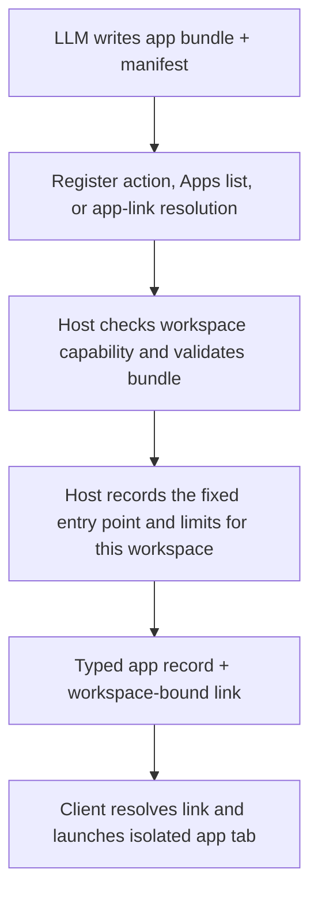

# Plan: Let the LLM create and share Mini Web Apps

**Done when:** In a capable workspace, an LLM creates a small CGI app, registers it, sends an Open app link, and the client opens it. In an incapable workspace, the Mini Web App mode, registration surface, and app routes are absent.

## Key dots

- Gate Mini Web Apps by workspace capability. Assume entitlement is granted for now. Hide the builder mode and registration tool, and reject app routes, when the runtime gate fails.
- The LLM writes an app bundle and `mini-web-app.json` manifest in its workspace. Listing apps or resolving an app link automatically registers valid manifests. No user approval step is added.
- Keep app code and data in the writable workspace. Execute its registered entry point inside that workspace's sandbox, so edits and local storage take effect on later requests.
- The same manifest flow works for API and CLI providers. Listing or opening a link validates and registers it, so the LLM needs no separate registration tool.
- Return a typed `kind: "mini-web-app"` record with workspace ID. The LLM shares `[Open Budget Explorer](#mini-app?workspace=WORKSPACE_ID&app=budget-explorer)`. The server compares that workspace ID with the conversation's persisted workspace and reauthorizes before resolving or launching; the client does the same check for clear feedback.
- Links open the current registration. The launch ticket and grant pin the registered entry point and limits for the life of an open app instance; workspace code and data remain live. The LLM never receives a ticket or app-origin URL.
- Add a **Mini Web App Builder** mode with the workspace tools and a short recipe: create the bundle, implement CGI, exercise GET/POST/assets/fetch, register, then return the link.

The runtime gate requires a resolved sandbox session, protocol v4, HTTPS, and enforced identity. Registration reads bounded manifest bytes through the gateway, rejects unsafe paths and symlinks, and records the fixed entry point. The agent rechecks the executable path when each request starts. Each request runs in the authorized workspace sandbox, with resource limits. Code changes in that workspace intentionally affect later requests.

## Flow

## Proof

1. Manual browser run: ask the builder mode for a tiny app; inspect the returned link, Apps list, page, asset, form, and `fetch()` result. Save screenshots of registration and running app.
2. Server checks: invalid manifest, path escape, symlink, oversized manifest, unregistered ID, wrong workspace, missing protocol, and capability-off all fail before execution. An open instance keeps its registered entry point and limits; changes to workspace code or data affect its next request.
3. Client checks: a link with a wrong workspace or absent app fails; a same-workspace link to a valid manifest is intentionally accepted. A typed record opens through the existing ticket flow. Record that the current gateway image must be upgraded to protocol v4 before claiming live executable streaming.

## Material risks

- Auto-registration runs LLM-authored code from a writable workspace. Keep the existing sandbox isolation, workspace binding, fixed registered entry point, and resource limits. A writer to that workspace can change the app's behavior; that is part of this feature.
- The current sample has no trusted wildcard HTTPS app origin and its installed gateway agent uses protocol v1. Browser UI and mocked browser tests alone cannot prove the full running flow.

**Now / next:** Build the smallest manifest-to-link slice, then manually exercise it in the Codex in-app browser and report exactly which steps ran live.
