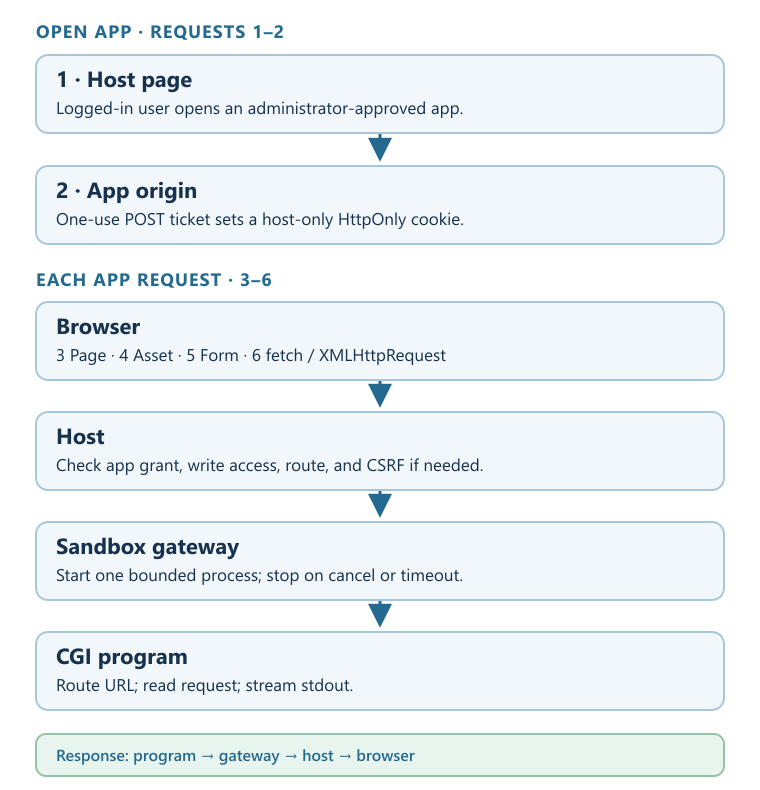

# Plan: Run approved browser apps inside a sandbox

**Outcome:** A user can open an administrator-approved app from a conversation workspace. Each browser request starts a short-lived sandbox process and streams its response into an isolated app tab.

**Done when:** A logged-in user opens a small app that renders HTML, serves a relative asset, accepts a form, answers `fetch()` and XMLHttpRequest, streams a slow response, and leaves no process running after each request. An anonymous caller cannot launch it.

## Key dots

- Keep the existing file preview for static files. Add an **Apps** entry in the workspace inspector and an app tab with Reload, status, and a clear failure/retry state.
- Register approved app IDs on the host. Each entry pins an executable from a read-only sandbox image or mount, fixed arguments, a working directory, and resource limits. A browser request never supplies a command or environment variable.
- Give each open conversation/app instance its own app origin and grant. Require an authenticated host user and conversation **write** access on every request because even a GET starts code. Disable app execution when identity enforcement is off. Keep host credentials and the existing read-only file grant out of this route.
- Give the sandbox gateway a request-scoped streaming execution API. Extend the .NET sandbox client to pass bounded request data in, receive stdout chunks with backpressure, capture stderr separately, and terminate the process tree on cancellation or timeout.
- Translate a small CGI-like contract: method/path/query/content metadata and bounded body to stdin; `Status` and `Content-Type` plus optional app-local redirect from stdout headers; stdout body to the HTTP response. Reject other program headers.
- Start with GET and POST, HTML, forms, JSON via `fetch()` or XMLHttpRequest, and ordinary streamed HTTP responses. Pass the route path to the program so it can dispatch handlers and serve relative static assets itself. No WebSocket or SSE connections; no persistent app process.

## Proof

1. Gateway contract tests show progressive bytes, separate stderr, header and body limits, cancellation, timeout, and process cleanup.
2. Host tests show only configured apps run; anonymous callers and read-only viewers are refused; grants cannot cross conversations or apps; and program headers cannot override security policy.
3. A real browser test shows HTML, relative assets served by the program, form submission, `fetch()`, XMLHttpRequest, and progressive text in the app tab. A static file preview still behaves as before.

## Material risks

- The current SDK waits for command completion before downloading stdout/stderr; the gateway and SDK both need new streaming and remote cancellation contracts.
- Interactive app pages need an origin distinct from both the host and other app instances while remaining on the same HTTPS site as the host. Deployment needs a same-site wildcard app hostname and TLS. The feature stays disabled when that origin is absent.
- A writable program would make the allowlist meaningless. Approved executable code must come from a read-only image or mount; workspace data may remain writable.
- Browser output already sent cannot be replaced with an error if the process fails later. The connection must end, the failure must be logged, and the next navigation must offer a retry.

**Now / next:** Review this design; after approval, build the smallest end-to-end app before broadening the CGI contract.

## Design reference

### What the user sees

```text
Workspace inspector                  Main workspace tab
┌─────────────────────────────┐      ┌─────────────────────────────────────┐
│ Files                       │      │ Budget explorer      Sandbox app   │
│ Apps                        │      │ Reload                         ×   │
│  • Budget explorer  [Open]  │ ───▶ │ ─────────────────────────────────── │
│  • Report builder   [Open]  │      │ [app's HTML, forms and charts]      │
└─────────────────────────────┘      │ [app's progress appears here]       │
                                     └─────────────────────────────────────┘
```

The app tab belongs to the existing workspace tab region. Its header names the app and shows Starting, Ready, or Unavailable. The iframe owns the app content; the host owns Reload, Close, and retry after a failed launch. A plain HTML file still opens the existing Rendered/Source preview. Apps appear only where the administrator enabled them and the user has write access.

### Numbered browser requests

These are example requests for one app opening. Requests 4–6 can arrive in any order after the page loads.

1. **Launch:** The logged-in host page posts to `/api/conversations/{thread}/apps/{app}/launch`. The host returns a one-use ticket and a fresh app origin. No sandbox process starts.
2. **Grant:** The browser posts the ticket into the iframe at `https://<instance>.apps.example/_launch`. That origin sets its HttpOnly grant cookie and redirects to `/`. No sandbox process starts.
3. **Page:** The iframe gets `/`. Sandbox process 1 returns HTML.
4. **Asset:** The page gets `/assets/chart.js`. Sandbox process 2 routes that relative path and returns JavaScript.
5. **Form:** The page posts to `/filters`. Sandbox process 3 handles a CSRF-checked form and returns HTML or an app-local redirect.
6. **Data:** The page calls `fetch('/data')` or XMLHttpRequest. Sandbox process 4 returns JSON or progressively streamed text. A POST also needs the CSRF token.

The hostname above is illustrative. Deployment supplies the same-site HTTPS wildcard domain.



### How requests 3–6 reach the program

Each navigation, form, `fetch()`, or XMLHttpRequest follows this path. The host passes the URL path after the app root as CGI `PATH_INFO`; the program chooses a handler and may emit a static asset response. The program exits after the response. State that must survive another request lives in the workspace, not process memory. App-generated URLs and relative assets stay under the app route.

### Browser boundary

Each open conversation/app instance gets an opaque hostname under a configured **same-site HTTPS wildcard** domain, distinct from the chat host and every other app instance. This keeps its host-only cookie eligible even when third-party cookies are blocked. The host embeds it in an iframe with scripts and forms allowed, and same-origin allowed **only because its origin differs from the host**. That lets in-app XMLHttpRequest use its own origin without credentialed `Origin: null` CORS. The app origin exposes only app routes, never the chat API or raw workspace route.

To launch, a **logged-in** host user with conversation write access obtains a short-lived, one-use ticket bound to the conversation, app, principal, and new origin. The host page submits that ticket by POST into the app iframe. The app origin validates it, sets its own host-only `HttpOnly; Secure` grant cookie, then redirects the iframe to the app's root. The ticket never appears in a URL; there is no URL-token fallback. Every later request rechecks the grant-derived principal and conversation write permission. Anonymous development mode cannot enable this feature. The app grant is scoped to this instance, expires no later than the host login credential when that expiry is known, and has its own short maximum lifetime; reopening starts a new instance.

The host also mints a CSRF token bound to the same instance and passes it to the CGI program as one fixed request variable. The approved app must put it in each HTML form's hidden field and expose it to its own JavaScript for XMLHttpRequest's `X-CSRF-Token` header. The host validates it on POST before starting the program. A small app template/helper should show both uses. The token is never sent in a URL or cookie. The app route rejects cross-site GETs before execution using Fetch Metadata with an Origin/Referer fallback; the one-use launch POST is the narrow exception. A cross-site page must not be able to start an app through an image, link, or form.

Program responses cannot set cookies or change CSP, CORS, framing, or security headers. The host sets `no-store`, `nosniff`, a restricted CSP for the app origin, and an app-local `form-action`/`connect-src`. Redirects, if supported, stay under that app's route. The host supplies only a fixed set of CGI variables; it does not forward ambient host credentials or arbitrary HTTP headers.

### Build order

1. **Gateway and SDK:** add a bounded stream of stdout chunks and a terminal result, with stderr captured separately and remote process-tree cancellation. Done: a slow fixture emits visible chunks before exit and is killed when the request ends.
2. **Host route and policy:** register an immutable app entry, create a per-instance origin, exchange a one-use POST ticket for an app cookie, authorize each request, check POST CSRF and cross-site GETs, parse bounded CGI headers, and stream the body. Done: an unregistered command, read-only viewer, and external page cannot start a process; the app opens without a URL credential.
3. **Client slice:** list approved apps and open one in the existing tab region on its own origin. Include a minimal CGI app template that returns CSRF tokens in forms and JavaScript. Done: HTML, form, `fetch()`, XMLHttpRequest, and relative assets work in a real browser, including with third-party cookies blocked.
4. **Failure pass:** enforce request/output/time/concurrency limits, report startup failures before headers, handle late failures, and verify cleanup. Done: no orphaned process remains after disconnect, timeout, or tab close.

### Explicit non-goals for the first release

No browser-supplied executable path or arguments. No WebSocket, SSE, long-lived service, terminal emulation, public sharing, or automatic app discovery from workspace files.

### Grounding

- Existing read-only preview: `samples/LmStreaming.Sample/Controllers/FileBrowserController.cs`, `FileBrowser/WorkspaceGrantService.cs`, `FileBrowser/WorkspaceContentTypes.cs`, and `ClientApp/src/components/ArtifactPreviewModal.vue`.
- Existing execution: `src/Sandbox/SandboxClient.Command.cs` waits for a terminal operation and downloads full stdout/stderr artifacts; cancellation does not terminate the remote process.
- Protocol and browser rules: [CGI/1.1](https://www.rfc-editor.org/info/rfc3875/), [HTML iframe sandbox rules](https://html.spec.whatwg.org/multipage/iframe-embed-object.html), [ASP.NET Core response flushing](https://learn.microsoft.com/en-us/aspnet/core/fundamentals/middleware/request-response), and [OWASP CSRF guidance](https://cheatsheetseries.owasp.org/cheatsheets/Cross-Site_Request_Forgery_Prevention_Cheat_Sheet.html).
