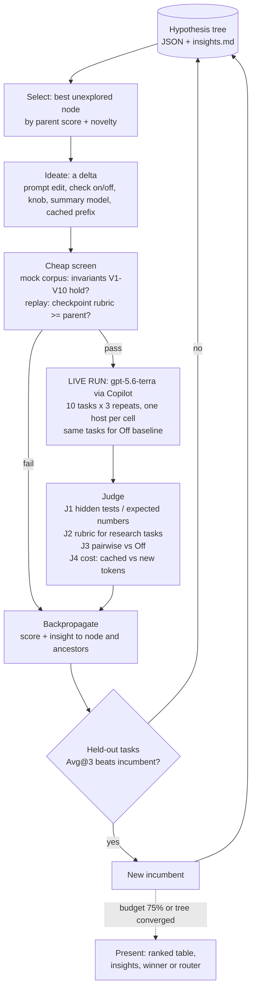

# Compaction Strategy Research — Hypothesis-Tree Refinement

**Method:** *Toward Generalist Autonomous Research via Hypothesis-Tree Refinement* (Arbor, arXiv 2606.11926). Every candidate compaction strategy is a **tree node** = ⟨hypothesis, insight, metadata⟩. The loop is Observe → Ideate → Select → Dispatch → Backpropagate → Decide. Insights from every run (win or lose) are written back to the tree so later hypotheses build on them.

**Goal:** find the best compaction algorithm — prompts, runtime checks, knobs, summary model, summary-call shape — by **real job outcome** on `gpt-5.6-terra` (Copilot), then present the winner, then clean up and commit.

**Not the goal (yet):** production-quality code for every variant. Experiments live on a research branch; only the winner gets productionised.

**Spec:** `docs/superpowers/specs/2026-09-15-compaction-strategy-eval-design.md` · **Ledger:** `.claude/scratchpad/conversation_memories/compaction-tests/eval/`

## The research loop



**Real vs mock:** every score comes from real `gpt-5.6-terra` runs. The mock corpus is only a free gate that stops a broken variant before it spends money; it never scores a strategy.

## Seed tree (round one)

```
root: Off (no compaction)  ── baseline every cell is compared against
└─ H0  today's Compact (prompt v0, no checks)
   ├─ H1  prompt family: v1 essence-only · v2 + tool-call essence · v3 + open-question focus · v4 + direction/next-step
   ├─ H2  runtime checks: RC1 dedupe reads/skills · RC2 keep shell errors · RC3 pin open agent questions
   ├─ H3  summary call: Cold (own prompt) vs CachedPrefix (agent's own request + 1 turn)
   ├─ H4  summary model: terra vs cheaper gpt-5.6-sol / luna
   └─ H5  knobs: keep-turns 1/3/6 · earlier vs later cut
   (round two ideates combinations from the insights, e.g. H1.v3 + H2.RC3 for collaboration tasks)
```

## Task suite (real runs)

| Family | # | Score |
|---|---|---|
| Implement in Node/Python, no deps | 3 | hidden tests |
| Data analysis on vendored GitHub CSVs | 3 | expected numbers |
| LLM research prompts | 2 | rubric + pairwise vs Off |
| Agent collaboration: delegate, question asked early answered late, steer, board update | 2 | deterministic: answer delivered, board correct |

Each task forces ≥2 compactions. 2 tasks held out for the merge gate.

## Phases

| Phase | What | Done when |
|---|---|---|
| **0 Scaffold** (research branch) | minimum plumbing to vary a strategy: prompt file knob, `Checks` flags, cached-prefix summarizer, summary model knob, per-cell host in TodoEval.Runner, shadow prices + context windows for gpt-5.6-*, cost reader | one 2-cell live smoke run scores and costs |
| **1 Baseline** | Off vs H0 on all 10 tasks × 3 | baseline table + noise estimate |
| **2 Rounds** | coordinator runs the loop over H1–H5, then combinations | tree converged or 75% budget (HITL to continue) |
| **3 Present** | ranked table, insights, winner **or** router rule (e.g. by task family), evidence per cell | you pick what ships |
| **4 Productionise** | clean up the winner only: tests, corpus scenarios, docs, PR | CI green, PR for review |

## Budget — $2000 (raised from $200 at approval, 2026-09-16)

Live runs ~85% · replay recordings ~10% · LLM judge ~5%. Warn at 75%, stop for HITL before exceeding. Allows ~5 repeats per cell and deeper round-two combinations. Copilot has no documented rate limit: 2 parallel runs, retry-exhausted 429 = invalid cell, re-run unscored.

## Risks

- Noise: 3 repeats may not separate close variants → Avg@3 + pairwise, and only held-out tasks decide.
- CachedPrefix saving is a belief until J4 shows `cached_tokens` on the summary call.
- Copilot enterprise plan gating; verified live for terra/luna logs.

## Rules

Real runs only on `gpt-5.6-*` (Copilot), no Anthropic · no AI signatures · no push/PR without approval · `SKIP_PRIORITY_TESTS=1` on commits, check `core.bare` after · no v2 files.
