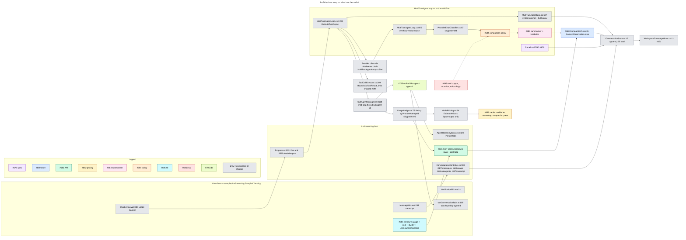
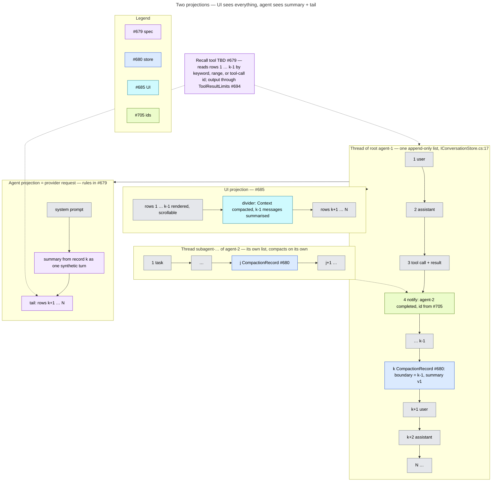
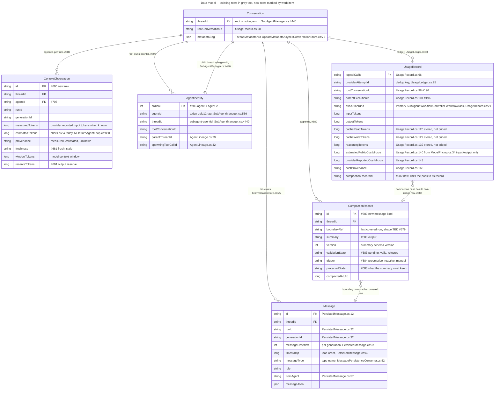
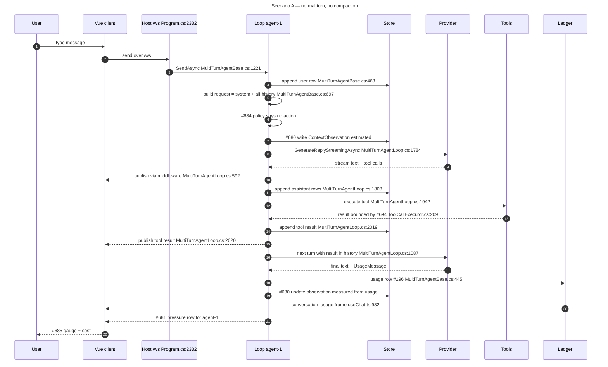
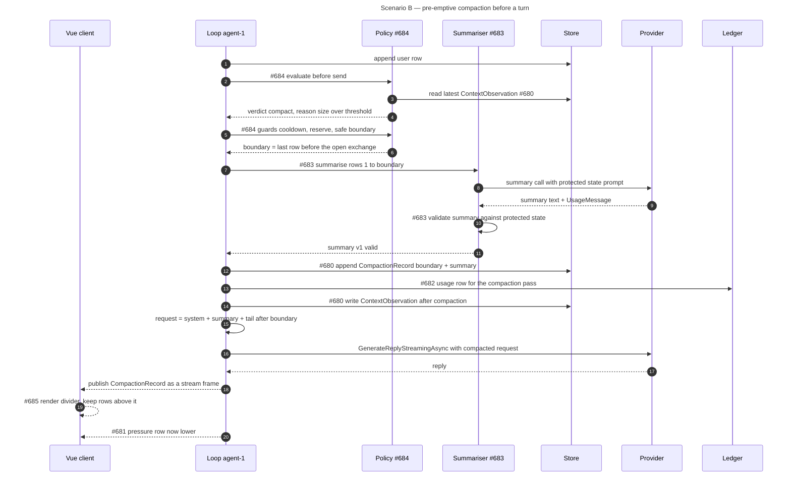
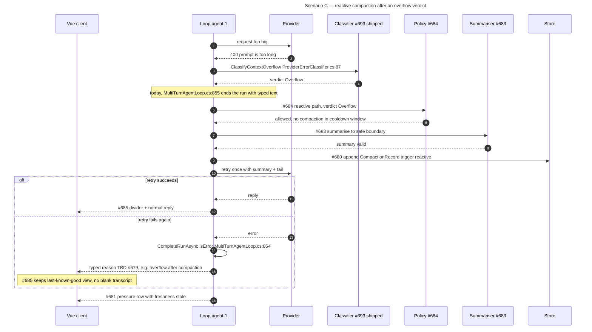
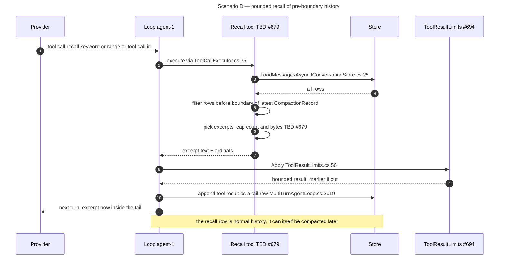
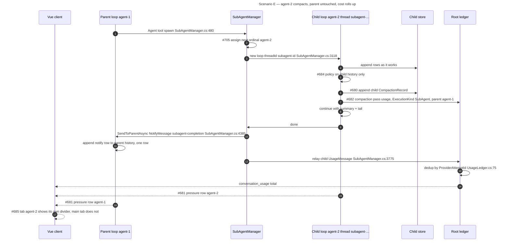
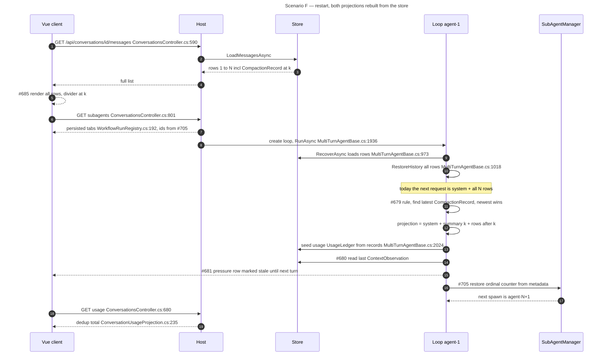
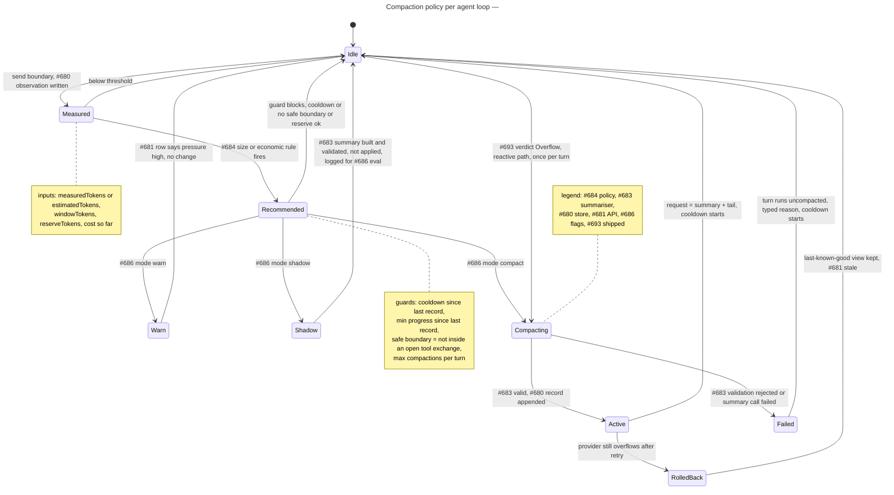

# Conversation context in LmMultiTurn — today and under #678

Visual explainer for the product owner. Read the pictures first. This atlas documents the **current state** at origin/main `51da4814` (plus #705 at `8f9ba200`, which only changed agent-id text). Every `file:line` is real at that revision.
Nothing here proposes new design. Where the constraints file leaves something open the node says **TBD (#679)**; those items are resolved in the companion spec [`2026-09-02-context-cost-compaction-contracts-design.md`](./2026-09-02-context-cost-compaction-contracts-design.md).

## Work-item colour key (used in every diagram that touches them)

| Colour | Item | One line |
|---|---|---|
| purple | **#679** | Spec: contracts, vocabulary, who owns state |
| blue | **#680** | Store: append-only compaction record + context observation rows |
| green | **#681** | API: per-agent pressure rows + conversation cost total (dedup) |
| amber | **#682** | Pricing: cache read/write, reasoning, the compaction pass itself |
| pink | **#683** | Summariser + validation + protected state |
| orange | **#684** | Policy: size, economic, cooldown, reserve, safe boundary; warn / shadow / compact |
| cyan | **#685** | LmStreaming UI: gauge, cost, divider, unknown/partial/stale |
| red | **#686** | Eval corpus, mutation proof, rollout flags |
| lime | **#705** | Ordinal agent ids `agent-1, agent-2 …` persisted per root conversation |
| grey | shipped / unchanged | #693 overflow verdict, #694 ToolResultLimits, #196 usage lineage, #670 baseline (open, upstream) |

## Today in one paragraph

The loop keeps the whole history in memory (`MultiTurnAgentBase.cs:162`). Every turn sends **system prompt + all of it** (`MultiTurnAgentBase.cs:697`, used at `MultiTurnAgentLoop.cs:1727`). Every message is appended to `IConversationStore` fire-and-forget (`MultiTurnAgentBase.cs:463` → `:878`). Nothing measures size before sending. The only size estimate is `chars / 4`, computed **after** a failure (`MultiTurnAgentLoop.cs:807-830`). The UI reloads the full list from `GET /api/conversations/{id}/messages` (`ConversationsController.cs:590`). There is no compaction record, no context observation, no pressure API, and no recall tool.

---

## 1. Architecture map

The boxes are the real components. Colour = the work item that changes the box. Grey boxes do not change. The loop is the centre: it owns history, builds the request, runs tools, and relays sub-agents.

**What to look at**
- `REQ` is the seam. Today it returns system prompt + every message. #679 defines the new rule; the loop applies it.
- `CATCH` → `CLASS` is shipped (#693). It only labels the error. #684 turns the verdict into an action.
- `CREC` sits beside the store, not inside the message list. #680 makes it an appended record.
- `LEDGER` already dedups per provider attempt. #681 adds per-agent rows; #682 adds the missing price categories.
- `SAM` names children `subagent-<guid12>-<tag>` today (`SubAgentManager.cs:536`). #705 gives them `agent-N`.
- `REQ` also calls `ReportContextLoadedAsync` (`MultiTurnAgentBase.cs:2543`). That reports discovered context *blocks*, not token size. It is not a pressure measure.

---

## 2. Two projections over one history

One persisted list per thread. The store loads it ordered by timestamp (`IConversationStore.cs:25`). A compaction is one more appended row, never an edit. The UI shows all of it. The agent gets a summary plus the tail after the boundary.

**What to look at**
- The store never shrinks. Rows 1 … k-1 stay. The record at k is the only new thing.
- "Ordinal" today = load order by timestamp. There is no sequence column (`PersistedMessage.cs:42` Timestamp, `:37` MessageOrderIdx is per generation only). What the boundary points at is **TBD (#679)**.
- A second compaction appends k2 > k. Its summary covers 1 … k2-1, including record k. Newest wins (constraints §3).
- Row 4 is a `NotifyMessage` kind `subagent-completion` (`NotifyMessage.cs:15`). It is the only thing the parent keeps from agent-2.
- The recall result lands in the tail as a normal tool result (`MultiTurnAgentLoop.cs:2019`). It is persisted like any row.

---

## 3. Data model

Today the store has `PersistedMessage` rows and a `ThreadMetadata` property bag. Usage has its own records with lineage (#196). The three new shapes are `CompactionRecord`, `ContextObservation`, and `AgentIdentity`. Field names below are placeholders until #679 fixes them.

**What to look at**
- `Message` is unchanged. `CompactionRecord` is a new `messageType` in the same list (#680). That keeps `LoadMessagesAsync` the single read path.
- `ContextObservation` is the row #681 reads. `provenance` and `freshness` are what the UI turns into unknown / partial / stale (#685).
- `UsageRecord` already stores cache and reasoning tokens. `ModelPricing.EstimateMicros` (`ModelPricing.cs:34`) ignores them. That gap is #682.
- `AgentIdentity.ordinal` is the key every row, tab, and tool target will use (#705). Today the key is the guid id.
- Hard constraint from `research-705-agent-ids.md` §5: thread ids are a **DB-wide** key. `subagent-agent-1` from two conversations would collide. The ordinal is the display and target id; the thread id still needs a root scope. Also: today the agent id is rebuilt by stripping the `subagent-` prefix (`SubAgentProvenance.TryProject`), nothing persists it as a field.
- Which of these live in the message list vs the metadata bag vs a new table is **TBD (#679)**.

---

## 4. Scenario A — normal turn, no compaction

This is today's path, plus one new write. The loop sends the whole history. The observation row is the only addition.

**What to look at**
- Steps 4 to 8 are today's request build. Nothing measures size before step 8.
- Step 7 is new (#680). Step 19 upgrades it once the provider reports real input tokens.
- Tool results are already bounded (#694). Compaction does not need to shrink them again.
- Step 22 is the only new stream frame (#681). The existing `conversation_usage` frame stays.

---

## 5. Scenario B — pre-emptive compaction before a turn

The policy runs before the request goes out. The summariser writes a record. The request then uses summary + tail. The UI shows a divider. History is untouched.

**What to look at**
- Steps 2 to 6 are pure decision (#684). They read rows, never write them.
- Step 12 is the one durable write. It is an append (`IConversationStore.cs:17`), never `ReplaceMessageAsync`.
- Step 13 is why #682 exists. The pass costs tokens. It gets its own row, not folded into the turn.
- Step 15 replaces `GetMessagesWithSystemPrompt` (`MultiTurnAgentBase.cs:697`) with the projection rule. That rule is #679.
- If step 10 rejects the summary, no record is written. The turn runs uncompacted. See the state machine in §10.

---

## 6. Scenario C — reactive: provider says overflow

Shipped today: the catch classifies the failure (`MultiTurnAgentLoop.cs:855`) and ends the run with a typed message. Planned: an `Overflow` verdict triggers one compaction and one retry. A second failure keeps the last-known-good view.

**What to look at**
- Steps 1 to 4 exist today. `LikelyOverflow` (transport abort on 100k+ est, `ProviderErrorClassifier.cs:49`) is weaker. Whether it also triggers a retry is **TBD (#679)**.
- Exactly one retry (constraints §7). The cooldown guard in step 7 stops a loop.
- The record in step 10 is the same shape as Scenario B. Only `trigger` differs.
- Last-known-good is a #678 acceptance criterion. The UI never drops what it already rendered.

---

## 7. Scenario D — agent recalls older history through a bounded tool

The agent only has the summary for rows before the boundary. A tool lets it fetch excerpts on demand. The store answers from rows 1 … k-1. The result is bounded twice: by the tool's own cap and by `ToolResultLimits` (#694).

**What to look at**
- The tool reads the store, not the in-memory list. Today the store has no range query; `LoadMessagesAsync` returns everything. A bounded read is part of #680 or **TBD (#679)**.
- The summary may carry an index of headings + ordinals so the model knows what to ask for (constraints §5). Format is **TBD (#679)**.
- The 4 MiB default (`ToolResultLimits.cs:50`) is far too big for a recall. The tool needs a much smaller cap. That number is **TBD (#679)**.
- The excerpt becomes a tail row. It is persisted. The UI shows it as a normal tool pill.

---

## 8. Scenario E — sub-agent compacts on its own

Each child is a full `MultiTurnAgentLoop` with its own thread and store (`SubAgentManager.cs:3118`, `:2643`). The child runs the same policy on its own history. The parent only ever receives the completion notification. Usage rolls up per agent, then dedups to one total.

**What to look at**
- Step 11 is the whole parent-side effect. One `NotifyMessage`. Parent history has no idea agent-2 compacted.
- Steps 5 to 8 run inside the child. Same code, different thread id. No new sub-agent code path.
- Step 13 is shipped (#196). #681 adds the per-agent rows in steps 15 and 16; the total in step 14 already exists.
- Step 2 is #705. Today the id is `guid12-tag` (`SubAgentManager.cs:536`). Tabs key on it (`useConversationTabs.ts:105`).
- The child's usage relay stamps `ParentExecutionId` (`UsageRecordMapper.cs:58`). The compaction row in step 7 must do the same (#682).

---

## 9. Scenario F — restart / rehydrate

After a restart the UI reloads everything from the store. The loop restores history in `RunAsync` (`MultiTurnAgentBase.cs:1977`). Today it restores the full list and sends all of it. Planned: it rebuilds summary + tail from the latest record. The #705 counter comes back from persisted metadata.

**What to look at**
- Steps 1 to 5 are today's path. The only UI change is the divider (#685).
- Step 10 keeps loading everything. That is fine. The projection in step 13 is built in memory from the same list.
- Step 16 is the "stale" state (#685). No fresh measurement exists until a turn runs.
- Step 17 is the #705 restore. Where the counter lives (metadata bag `IConversationStore.cs:76` vs a row) is **TBD (#705 / #679)**.
- Replay must produce both projections deterministically (constraints §8). #686 proves it with a corpus.

---

## 10. Policy state machine — one agent loop

One instance per loop. It runs at every send boundary (pre-turn and between tool turns). Rollout flags (#686) pick the mode: `off`, `warn`, `shadow`, `compact`. Guards are read from the latest observation and the last record.

**What to look at**
- `Measured` is the only state that writes without deciding. Every turn passes through it (#680).
- `Recommended` → `Idle` is where the death-spiral guard lives (prior art, Codex). Cooldown and min-progress are #684.
- `Shadow` is how #686 proves value before anyone sees a divider. Same summariser, nothing applied.
- `Failed` never leaves a half record. Either the record is appended or nothing is.
- `Idle` → `Compacting` on an `Overflow` verdict is Scenario C. It skips `Recommended` because the provider already decided.

---

## 11. Work-item ↔ component matrix

| Item | Client | Host API | Loop | Store | Provider / pricing | Sub-agents | Tests / evals |
|---|---|---|---|---|---|---|---|
| **#679** spec | names the UI states | names the row shapes | projection rule that replaces `MultiTurnAgentBase.cs:697`; tail rules; recall tool name and caps | boundary reference semantics; record vs metadata placement | none | child compacts independently, parent sees one notify | acceptance criteria for #686 |
| **#680** store | — | — | write observation at `MultiTurnAgentLoop.cs:1727` before send; append record | new `messageType` for `CompactionRecord`; `ContextObservation` rows; `MessagePersistenceConverter.cs:52`; keep `IConversationStore.cs:17` append-only; bounded pre-boundary read for recall | — | child store via `SubAgentManager.cs:2643` gets the same kinds | replay determinism tests |
| **#681** API | consumes new rows | new route beside `ConversationsController.cs:680`; new `/ws` frame beside `conversation_usage`; per-agent rows + dedup total via `ConversationUsageProjection.cs:235` | publish pressure frame after each turn | reads latest observation per thread | — | one row per `agent-N` | frame contract tests like `types/messages.ts:453` |
| **#682** pricing | cost label in banner | — | usage row for the compaction pass | `UsageRecord.compactionRecordId` | `ModelPricing.cs:9` gains cache read/write and reasoning rates; `ModelPricing.cs:34 EstimateMicros` uses `UsageRecord.cs:126-132`; `UsageLedger.cs:182` | child pass row carries `ParentExecutionId` like `UsageRecordMapper.cs:58` | category-complete pricing tests |
| **#683** summariser | — | — | new component called from the policy; builds summary; validates protected state; produces summary v1 | writes nothing itself, hands record to #680 | summary call is a normal provider call through `MultiTurnAgentLoop.cs:594` chain or a side agent | same component in child loops | validation corpus, rejected-summary tests |
| **#684** policy | — | — | new evaluate step before `MultiTurnAgentLoop.cs:1784`; between tool turns in `MultiTurnAgentLoop.cs:1087`; reactive branch in `MultiTurnAgentLoop.cs:855` catch; retry once | reads last record for cooldown | reuses `ProviderErrorClassifier.cs:87` verdict; reserve = output budget | runs unchanged inside child loops | guard tests, cooldown mutation |
| **#685** UI | `MessageList.vue:233` divider row; `ChatLayout.vue:927` gauge + cost; `NotificationPill.vue:22` new kind; `SubAgentTranscript.vue` per-tab divider; unknown / partial / stale states; `conversationsApi.ts:54` handles new kind | — | — | — | — | tab per `agent-N` shows its own state | Playwright with mock providers |
| **#686** proof | — | — | mode flag read at the policy entry | corpus of stored threads | — | child + parent corpus | eval corpus, mutation rounds, rollout flags `off / warn / shadow / compact` |
| **#705** ids | `useConversationTabs.ts:105` key; `SubAgentListPanel.vue` labels | `ConversationsController.cs:801` and `:837` accept `agent-N`; `WorkflowRunRegistry.cs:108` persisted tabs | tool targets accept `agent-N` | counter in metadata bag `IConversationStore.cs:76` or a row, TBD | — | `SubAgentManager.cs:536` id generation; `:4440` thread id from ordinal | restart restores counter |
| shipped #693 | — | — | `ProviderErrorClassifier.cs:10-105`; `MultiTurnAgentLoop.cs:855` | — | — | — | classifier tests |
| shipped #694 | — | — | `ToolCallExecutor.cs:209`; `ToolCallResultBuilder.cs:42` | keeps oversized results out of history | `MessageMapper.cs:26` clamp | — | limit tests |
| shipped #196 | `useChat.ts:932` | `ConversationsController.cs:680` | `MultiTurnAgentBase.cs:445` | usage records | `UsageRecord.cs:61` | `SubAgentManager.cs:3775` relay | — |
| open #670 baseline | — | — | — | — | — | — | upstream measurement baseline, not in this tree |

---

## Undecided items collected (all TBD #679)

- Boundary reference: timestamp, row id, or a new sequence column.
- Where the record lives: message list (one `messageType`) vs a separate table.
- Recall tool: name, query kinds, per-call cap, whether the summary carries an index.
- Tail rules: corrections, unresolved exchanges, exact syntax, tool adjacency.
- Does `LikelyOverflow` trigger the reactive path, or only `Overflow`.
- Typed reason vocabulary for failed / rolled-back compaction.
- Where the #705 counter is persisted, and how the child thread id stays globally unique once the agent id is `agent-N` (root scope in the thread id, per `research-705-agent-ids.md` §5).

## Seams checked (no repository file was modified)

`src/LmMultiTurn/MultiTurnAgentBase.cs`, `src/LmMultiTurn/MultiTurnAgentLoop.cs`, `src/LmMultiTurn/ProviderErrorClassifier.cs`, `src/LmMultiTurn/Persistence/IConversationStore.cs`, `src/LmMultiTurn/Persistence/PersistedMessage.cs`, `src/LmMultiTurn/Persistence/MessagePersistenceConverter.cs`, `src/LmMultiTurn/SubAgents/SubAgentManager.cs`, `src/LmMultiTurn/AgentLineage.cs`, `src/LmMultiTurn/UsageAccounting/*.cs`, `src/LmMultiTurn/Lifecycle/RenderedContextBlock.cs`, `src/LmCore/Messages/*.cs`, `src/LmCore/Models/UsageRecord.cs`, `src/LmCore/Models/ModelPricing.cs`, `src/LmCore/Middleware/ToolCallExecutor.cs`, `src/OpenAiResponsesProvider/Agents/MessageMapper.cs`, `samples/LmStreaming.Sample/Program.cs`, `samples/LmStreaming.Sample/Controllers/ConversationsController.cs`, `samples/LmStreaming.Sample/Services/{AgentHierarchyService,WorkflowRunRegistry,WorkspaceTranscriptMirror,ConversationTranscriptWriter}.cs`, `samples/LmStreaming.Sample/ClientApp/src/{composables/useChat.ts,composables/useConversationTabs.ts,api/conversationsApi.ts,api/subAgentsApi.ts,components/MessageList.vue,components/NotificationPill.vue,components/ChatLayout.vue,components/SubAgentListPanel.vue,components/SubAgentTranscript.vue,types/messages.ts}`.

Sibling file `research-679-compaction-seams.md` did not exist when this was written. Re-check before merging file:line references. Sibling `research-705-agent-ids.md` did exist; its line references for `SubAgentManager.cs` (`:536`, `:2643`, `:3118`, `:3775`, `:4385`, `:4440`), `useConversationTabs.ts:105`, `WorkflowRunRegistry.cs:108/:192`, and `AgentHierarchyService.cs:179` agree with this file.

Render check: all 10 diagrams parsed and rendered with mermaid 11.4.1 (`mermaid.parse` + `mermaid.render` each ok in a local harness, zero blank messages). Gotcha found on the way: in a `sequenceDiagram` a bare `#` starts a comment and silently blanks the rest of the message, so the six sequence diagrams write work items as `#35;684` (renders as `#684`). Flowchart quoted labels, `erDiagram`, and `stateDiagram-v2` take a bare `#` fine.
