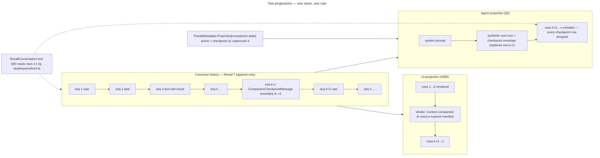
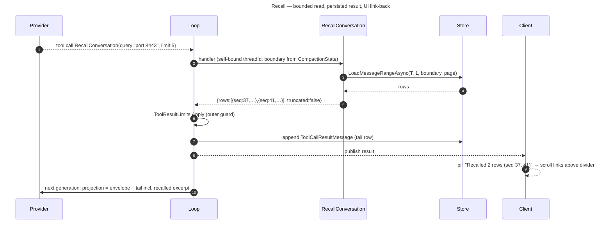

# Context, Cost, and Compaction Contracts for Framework-Owned LmMultiTurn Loops

**Status:** Proposed (issue #679; parent #678)
**Date:** 2026-09-02

Every `file:line` below is from origin/main `51da4814` plus #705 (`8f9ba200`). Two cited files are not in this tree yet: `ProviderErrorClassifier.cs` lands with PR #707 (#693) and `ToolResultLimits.cs` with PR #706 (#694). Those references are marked **(PR #707)** / **(PR #706)**.

Pictures of today's flow live in the companion atlas [`2026-09-02-context-atlas-current-state.md`](./2026-09-02-context-atlas-current-state.md). This spec refers to them by title. New diagrams here show the target state.

## Problem

A `MultiTurnAgentLoop` keeps its whole history in memory (`MultiTurnAgentBase.cs:162`) and sends **system prompt + all of it** on every turn (`MultiTurnAgentBase.cs:697-708`, consumed at `MultiTurnAgentLoop.cs:1727`). Nothing measures the request before dispatch. The only size estimate is `chars / 4`, computed after a failure (`MultiTurnAgentLoop.cs:815-831`), and the only reaction is an annotated error (`:851-862`). There is no compaction record, no per-agent context observation, no pressure API, and no way for the model to reach back into history it can no longer see.

The owner's requirement (2026-09-02, verbatim intent): the conversation must **continue** after compaction. The human keeps seeing everything. The agent restarts from a compacted context behind the scenes. The agent may query the older conversation. See §1 for the two projections that resolve this.

Related shipped foundations: #196 usage lineage (ADR 0003), #251 transcript mirror (ADR 0011/0013), lifecycle events (ADR 0002/0007). Related in flight: #693 overflow verdict (PR #707), #694 tool-result bounds (PR #706), #705 ordinal agent ids (`8f9ba200`), #670 measurement baseline (open, upstream).

## Goals

1. One persisted, append-only transcript; two deterministic projections over it (UI: everything; agent: checkpoint + tail).
2. A durable, versioned, reversible compaction checkpoint that never deletes or rewrites history.
3. A bounded recall tool so the agent can query pre-checkpoint history with provenance the UI can show.
4. Per-generation context observations and category-complete cost, per agent, rolled up to the root conversation without a second ledger.
5. Just-in-time policy (warn / shadow / compact) with cooldown, reserve, and safe-boundary guards; no background work.
6. Exclusion by construction for Claude Agent SDK, Codex, and Copilot loops.
7. Rollout controls and proof (#686) before live compaction is on by default.

## Non-goals

- Provider-native compaction or transport of opaque provider state (Anthropic `compact_20260112`, OpenAI `/responses/compact`).
- Compacting `ClaudeAgentLoop`, `CodexAgentLoop`, `CopilotAgentLoop` (`src/LmMultiTurn/ClaudeAgentLoop.cs:28`, `CodexAgentLoop.cs:19`, `CopilotAgentLoop.cs:22`).
- A repository-wide operation WAL, writer-freeze epoch, or generic side-effect reconciliation (#678 non-goals; workshop boundary 6).
- A tree of summaries as the memory strategy. One chain, newest wins; raw history stays reachable.
- Deleting, editing, or re-persisting canonical rows.
- Replacing #670's measurement baseline or #306's tenant-admin usage view.

# 0. Glossary

| Term | Meaning | Not to be confused with |
|---|---|---|
| **Canonical history** | The append-only `PersistedMessage` rows of one thread (`IConversationStore.cs:17,25`). Authoritative for audit, recovery, the mirror, and the UI. | The in-memory `ConversationHistory` copy (`MultiTurnAgentBase.cs:162`). |
| **Execution view** | The message list a provider request is built from. Today `GetMessagesWithSystemPrompt()`; after this spec, `AgentContextProjection` (§2). | Canonical history. |
| **Semantic context checkpoint** | A validated, versioned manifest + narrative that stands in for rows `≤ boundary` in the execution view (§3). | A Claude Agent SDK **file-history checkpoint** (workspace snapshot for rewind). Different object, different store, different purpose. |
| **Boundary** | `(Seq, MessageId)` of the last canonical row a checkpoint covers (§2.2). | The `ReplayTruncated` buffer cut for reconnecting clients (delivery, not compaction). |
| **Protected tail** | Rows `> boundary`, sent verbatim (§2.4). | Tool-result truncation by `ToolResultLimits` **(PR #706)** — applied at write time, before any of this. |
| **Context observation** | A per-generation record of estimated/measured request size vs capacity (§4). | `context_loaded` (`LifecycleEventTypes.cs:26`), which reports discovered context files by bytes+hash, not tokens. |
| **Provenance** | For a number: `Measured` (provider reported), `Estimated` (local heuristic), `Unavailable`. For cost: `ProviderReported`, `PublicEstimate`, `Unavailable` (`UsageRecord.cs:6`). | Completeness. |
| **Completeness** | Whether every part is known: `Complete`, `Partial` (some category unknown), `InProgress` (`UsageCompleteness`, `ConversationUsageAggregate.cs:7-17`). | Freshness. |
| **Freshness** | `Fresh` (observation belongs to the latest completed generation), `Stale` (older, e.g. after restart before any turn), `None`. | Cache temperature. |
| **Cache temperature** | `Hot` / `Cold` / `Unknown`, derived from durable activity vs the model's cache TTL (§4.4). Marks expected prompt-cache reuse. Never starts work. | Context pressure. |
| **Decision** | Output of one policy evaluation: `NoAction`, `Warn`, `Shadow`, `Compact`, `Skipped(reason)`, `Failed(reason)` (§5). | Checkpoint state. |
| **Checkpoint state** | `Prepared`, `Validated`, `Committed`, `Active`, `Rejected`, `Superseded`, `RolledBack` (§3.5). | Decision. |
| **Failure vocabulary** | Typed reasons in §5.6. Every skip/failure carries one. | Free-text error messages. |
| **Cut-blocking / protected / reconstructable** | State classes for restart/recovery (§2.6). | — |

# 1. Two Projections Over One Transcript

## 1.1 Invariants

I1. Canonical history is append-only. The only mutation is `ReplaceMessageAsync` for deferred-tool placeholders (`IConversationStore.cs:42`, `MultiTurnAgentBase.cs:737-763`). Compaction adds rows and metadata; it never edits or deletes rows.
I2. The UI projection is the full row list, in `Seq` order, including checkpoint rows rendered as dividers (§7.2).
I3. The agent projection is `system + [active checkpoint envelope] + tail + [ephemeral instruction]`, where tail = rows with `Seq > boundary` **minus every `CompactionCheckpointMessage` row**. The active checkpoint is rendered once, as the synthetic envelope (§2.3), in place of its own row. Superseded and rolled-back checkpoint rows are dropped silently. In mode `Compact`, tool results in the tail are shown through the view shaping of §2.7 (clear watermark and per-result cap). The projection is a pure function of (canonical rows, active checkpoint pointer, clear watermark, view cap). Replaying the store produces the same projection (§8).
I3a. The filter lives in `AgentContextProjection.Build` (§2.1), not in the store. `GetHistorySnapshot()` contains checkpoint rows: commit appends one (§3.5), and after a restart `RecoverAsync` restores every row (`MultiTurnAgentBase.cs:1018`) before `OnHistoryRestoredAsync` (`:1028`) rebuilds state from all of them.
I4. Restart rehydration, deferred replacement, run-ledger reconciliation, the mirror, and diagnostics read canonical history only (`MultiTurnAgentBase.cs:973-1034`). They never read the agent projection.
I5. Checkpoints are versioned and reversible. Deactivating a checkpoint restores raw-history request construction without touching rows.
I6. A tool call and its result are always on the same side of a boundary (§2.4 R1).

## 1.2 Target-state picture



Compare with today's "Two projections — UI sees everything, agent sees summary + tail" diagram: the only structural additions are `Seq`, the metadata pointer, and the tool. Note the checkpoint row at `seq k+1` sits inside the `> k` range but is never dispatched: `Build` drops all checkpoint rows and renders the active one as the envelope (I3).

# 2. Agent Projection and Boundary

## 2.1 The seam

One method builds every request: `ExecuteTurnAsync` materializes `messagesToSend` at `MultiTurnAgentLoop.cs:1727`, runs the deferral scan (`:1736-1762`), appends the ephemeral continuation instruction (`:1770-1773`), reports context (`:1778`), and dispatches (`:1784`). `ExecuteTurnAsync` runs once per generation, so pre-turn and between-tool-turn evaluation are the same seam. The wrap-up turn is the second dispatch (`:1355-1360`).

Decision: replace `GetMessagesWithSystemPrompt()` (`MultiTurnAgentBase.cs:697`) with a projection object on `MultiTurnAgentLoop` only. The base class keeps the old method for the CLI loops.

```csharp
// src/LmMultiTurn/Compaction/AgentContextProjection.cs (new)
internal sealed class AgentContextProjection
{
    /// Builds the execution view. Pure: (history snapshot, active checkpoint) -> messages.
    /// 1. Drops every CompactionCheckpointMessage row: active, superseded, rolled back.
    ///    The snapshot contains them (commit appends the row, §3.5; restart restores all
    ///    rows, MultiTurnAgentBase.cs:1018-1028). The store does not filter.
    /// 2. With an active checkpoint: drops rows with Seq <= Boundary.Seq and inserts one
    ///    synthetic Role.User TextMessage rendered from the checkpoint in their place
    ///    (never persisted, never published).
    /// 3. Without one: system + every non-checkpoint row, byte-for-byte today's
    ///    GetMessagesWithSystemPrompt() output (§12.2 asserts this).
    public IReadOnlyList<IMessage> Build(
        string? systemPrompt,
        IReadOnlyList<IMessage> history,           // GetHistorySnapshot()
        CompactionCheckpoint? active,              // from CompactionState (§3.5)
        CheckpointRenderOptions render);

    /// The rows the model currently sees, for #685's "what the agent sees" view. Content-free.
    public ExecutionViewDescriptor Describe(IReadOnlyList<IMessage> history, CompactionCheckpoint? active);
}

public sealed record ExecutionViewDescriptor(
    string? ActiveCheckpointId,
    long? BoundarySeq,
    int RowsHidden,
    int RowsInTail,
    long EstimatedTokens);
```

`ExecuteTurnAsync` and `ExecuteWrapUpTurnAsync` both call `Build`. The deferral scan, `ReportContextLoadedAsync`, and the provider all keep reading the same materialized list (the existing discipline at `:1727`).

## 2.2 Boundary reference: a per-thread sequence number

Today rows are ordered by `(timestamp, message_order_idx)` (`SqliteSchemaInitializer.cs:27-30`); `Timestamp` is ms (`PersistedMessage.cs:42`) and `MessageOrderIdx` resets per generation (`:37`). That is not a total order. Only tool results have addressable ids (`MessagePersistenceConverter.cs:71-76`).

Decision: add `Seq` to `PersistedMessage`, assigned by the store on append, monotonic per thread, gap-free per store instance.

```csharp
// src/LmMultiTurn/Persistence/PersistedMessage.cs (additive)
public sealed record PersistedMessage
{
    // ...existing...
    /// Per-thread monotonic position assigned by the store on append. Null only for rows
    /// written before this field existed and not yet backfilled (§8.3).
    public long? Seq { get; init; }
}

// src/LmMultiTurn/Persistence/IConversationStore.cs (additive, default impls)
public interface IConversationStore
{
    /// Highest Seq in the thread, or 0 when empty. The message watermark for a checkpoint cut.
    Task<long> GetMessageWatermarkAsync(string threadId, CancellationToken ct = default);

    /// Bounded, ordered read for recall and for diagnostics. Never used by request assembly.
    Task<IReadOnlyList<PersistedMessage>> LoadMessageRangeAsync(
        string threadId, long fromSeqInclusive, long toSeqInclusive, int limit, CancellationToken ct = default);
}
```

`LoadMessagesAsync` keeps returning everything; its order becomes `ORDER BY seq` where present and `(timestamp, idx)` otherwise. `ReplaceMessageAsync` keeps the row's `Seq` (deferred replacement stays in place). Backfill rules are in §8.3.

The boundary is `(Seq, MessageId)`. `MessageId` is the tie-check: if a row with that `Seq` has a different id, the checkpoint is `Rejected(boundary_mismatch)`.

## 2.3 Rendering the checkpoint into the request

Decision: one synthetic `Role.User` `TextMessage` (like the wrap-up and continuation instructions at `:1355` and `:1770`), never added to history, never published. Providers already accept a user turn followed by another user-role row (Notify rows are user-role today, `NotifyMessage.cs:125`). No provider mapping changes.

Envelope (versioned; exact prose owned by #683):

```
<context-checkpoint version="1" id="cp-…" covers_seq="1-k" created_at="…">
## Current instruction (verbatim, seq N)               ← CurrentInstruction — always first when present
## Standing instructions (verbatim, oldest first)     ← ManifestSection.Instructions
## Goal and acceptance criteria                        ← Goals
## Decisions and approvals                             ← Decisions
## Open work (from the todo board when present)        ← Tasks
## Artifacts and evidence (paths, ids, hashes)         ← Artifacts
## Agents (agent-N: template, task, status, outcome)   ← Agents
## What happened (narrative, ≤ NarrativeTokenCap)      ← Narrative
## Index of compacted history (seq ranges → headline)  ← Index
Use RecallConversation to read any compacted range verbatim.
</context-checkpoint>
```

`Current instruction` is the mid-run case (§2.4 R2). It holds, verbatim and in `seq` order, the human rows of the current run that fall at or before the boundary: the instruction that started the run and any mid-run injections (`PendingInjections`, `MultiTurnAgentBase.cs:167`). It is rendered first so the model reads the live task before the summary. When the cut precedes the current run the list is empty and the section is omitted; those rows are then in the tail. Current run here = rows sharing the `RunId` of the last human row (the instruction run, §2.4 note). **Bound.** When these rows' text together exceeds half of `CheckpointTokenCap`, the largest rows, one at a time, are quoted as a deterministic trim until the rows fit: 70% of the kept text from the start, 30% from the end, around a marker line `[… N chars omitted; full text: RecallConversation seq S]`. One pure function computes it; the assembler writes it and V3 recomputes it. Without the bound a pasted prompt over the envelope cap failed V9 on every checkpoint, the fallback included, and every turn was refused.

Why user role, not assistant: Codex and the Claude API sample both use it; an assistant-authored "summary" invites the model to continue the summary instead of the task (prior-art drift finding).

## 2.4 Protected tail: cut selection and expansion rules

The policy proposes a candidate cut (§5.3). The cut only moves **earlier** until every rule holds. If it reaches the start of the thread, the decision is `Skipped(no_safe_boundary)`.

| Rule | Statement | Mechanical test |
|---|---|---|
| **R1 Turn boundary + tool adjacency** | The cut lies at a completed generation boundary. No `ToolCallMessage`/`ToolsCallMessage` and its `ToolCallResultMessage`/`ToolsCallResultMessage` are split. | Same id extractors `DropUnpairedToolMessages` uses (`MessagePersistenceConverter.cs:223-273`); the last row `≤ cut` must not be a tool call, and no result `> cut` may reference a call `≤ cut`. |
| **R2 Mid-run cut** | The cut may land inside the current run, at any completed tool-turn boundary that satisfies R1 and R6. One instruction followed by a hundred tool turns is the case compaction exists for (Claude Code and Codex both compact mid-task). The current run's instruction row and mid-run injections need not be in the tail: they travel verbatim in `CurrentInstruction` (§2.3, V3). | Candidate = any generation boundary of the current run; R1 tests it. |
| **R3 Current-run floor** | The tail keeps at least `MinTailTokens` of the current run (the run of the latest input row, see the note below), taken from its most recent rows. When the run is shorter than that, the whole run stays. | Estimator (§4.2) over rows of the current `RunId`, newest first. A checkpoint row counts nothing: it is never sent. |
| **R4 Corrections** | A run that received a mid-run injection (a human row other than an `AgentMessage` after an assistant row inside the same `RunId`), or a run that started while the previous run ended `Errored`/`Interrupted` (`RunLedgerEntry.cs:6-25`), is kept whole when it is one of the last `CorrectionLookbackRuns` runs. | Run ledger + row scan. |
| **R5 Human rows are never summarised** | Nothing in the tail is paraphrased. A human row appears in the envelope only as a verbatim quote with a `seq` ref (`CurrentInstruction`: whole row; `Instructions`/`Decisions`: substring), never as a paraphrase. A human row the manifest does not quote is reachable through `Index` and §6. Quotes are validated (§3.4). | Validation. |
| **R6 Cut-blocking state absent** | No deferred placeholder (`IsDeferred`), parked `Wait`, owed continuation, or interrupted turn exists anywhere (§2.6). | `_delayed.IsEmpty`, `RecoverOwedContinuationsAsync`-style scan, run ledger. |
| **R7 Size ceiling** | Tail ≤ `MaxTailTokens` is a preference, not a rule (R1–R6 win). The floor is R3. | Estimator (§4.2). |

Human input = `Role.User` rows that are not `NotifyMessage`, not a `CompactionCheckpointMessage` and not a tool result. An `AgentMessage` (stored as `Role.User`) is human input only when it is a directive, `DelegateTask` or `Steer`: those fall under R5 and are quoted in `CurrentInstruction`. A `DelegateTask` is a child thread's instruction. `Question`, `TaskUpdate`, `Response` and `DeliveryFailure` are content, like `NotifyMessage`: tail rows that are summarised and capped, never quoted whole. Quoting them whole once put ~3.6k tokens of agent chatter in every envelope. Two runs are kept apart. The **current run** for R3 is the run of the latest input row of any kind: a human row, any `AgentMessage`, or a `NotifyMessage`. A Workspace root is routinely woken only by its sub-agents, and that woken run keeps its floor. The **instruction run** is the run of the last human or directive row: `CurrentInstruction` (and V3's recomputation) quotes that run's human rows at or before the cut, so a cut inside a notification-woken run still carries the earlier instruction verbatim. No `AgentMessage` counts as an R4 injection: in a multi-agent run directives arrive after nearly every assistant row, so counting them would keep the run whole forever.

Sub-agent adjacency: a `subagent-completion` Notify (`NotifyMessage.cs:15`) may be compacted; the manifest's `Agents` section carries every agent's outcome (§3.2). A spawn whose agent is **non-terminal** is protected through the manifest roster, not the tail.

## 2.5 Chaining

A second checkpoint covers rows up to a new boundary `k2 > k1`, including the first checkpoint row. Newest wins. Input to the second summarization is `manifest(cp1)` (structured, merged field-by-field) + raw rows `k1+1…k2`, not `narrative(cp1)` re-summarized as a document. Only `Narrative` is regenerated, with `narrative(cp1)` as one input and a hard token cap. This is a chain, not a tree (#678 non-goal). Everything ever compacted stays reachable through §6.

**Human instructions carry forward.** Each build also carries, deterministically, two kinds of row into `Instructions`, whatever the summary quotes: the previous checkpoint's `CurrentInstruction` rows, and every human or directive row the new checkpoint covers. A row the new `CurrentInstruction` already quotes is skipped. Each carried row is quoted whole, or trimmed by the §2.3 bound. A carried quote replaces the other `Instructions` quotes of its seq. A model quote (`Instructions` or `Decisions`) of a row that `CurrentInstruction` or a carried quote shows trimmed is dropped: the duplicate of a pasted prompt alone broke V9. The drop is counted with the non-verbatim drops. Without the carry, a summary that skipped an earlier run's "do NOT modify tests/", or any fallback, lost it.

**Bounded growth.** Past `MaxIndexEntries` (60) the oldest adjacent index entries coalesce. A coalesced headline keeps at most 200 chars, its start and end around `…`. Its run ids name at most three runs, then `+N more`. After assembly, both the summarised build and the fallback run the §3.4 envelope budget.

## 2.6 Restart/recovery state classification

Source of truth for what restart rebuilds: `OnHistoryRestoredAsync` (`MultiTurnAgentLoop.cs:2956-3075`) and `RecoverAsync` (`MultiTurnAgentBase.cs:953-1058`).

| State | Where it lives | Class | Consequence for a cut |
|---|---|---|---|
| Deferred tool calls (`IsDeferred` result + its `ToolCallMessage`) | rows; rebuilt at `:2963-3016`; pre-send throw at `:1736-1762` | **cut-blocking** | R6: skip while any exist |
| Tool call/result pairing | rows; `DropUnpairedToolMessages :223` | **cut-blocking** | R1 |
| Parked `Wait` triggers | rows via deferred set; `:3048-3075` | **cut-blocking** | R6 |
| Owed continuations / `ResumeSentinel` (`ResumeSentinel.cs:11`) | derived from rows; `RecoverOwedContinuationsAsync :3132` | **cut-blocking** while owed; **reconstructable from raw** afterwards | R6; rehydration reads raw (I4) |
| Interrupted turn (`InterruptedTurnResume`, `:1770`) | in-flight | **cut-blocking** | policy never runs mid-turn; only at `:1727` |
| Spawn-suppression marker | metadata (`:3018-3022`) | **protected** (outside rows) | none |
| Parked recovery budget | metadata (`:3027`) | **protected** | none |
| Notify waits | separate store (`OnThreadRecoveredAsync`) | **protected** | none |
| `_latestRunId` | `ThreadMetadata.LatestRunId` | **protected** | none |
| Run ledger, accepted inputs, run lifecycle | separate tables/files | **protected** | none |
| Usage records + aggregate | `usage.records` / `usage.aggregate` (`ConversationUsageProjection.cs:22-25`) | **protected** | none |
| Todo board | `ConversationTodoProjection` metadata | **protected**; mirrored into manifest `Tasks` for the model | validation cross-checks ids |
| Live sub-agent roster | `SubAgentManager` state + child threads | **reconstructable from raw** for recovery; **manifest-protected** for the model | `Agents` section required when any child exists |
| Ordinal counter (#705) | `subagent_next_ordinal` metadata (`SubAgentOrdinalAllocator.cs:43`) | **protected** | none |

Rule: a cut is legal only when every cut-blocking state is absent. Protected state is untouched by design because it is not in the message list. Reconstructable state is rebuilt from raw rows, which the checkpoint never hides from rehydration (I4).

## 2.7 Tool-result view shaping (compaction phase 1)

Two view-only transforms of a tool result, applied by `AgentContextProjection.Build` through `ToolResultView` in mode `Compact` only (`Off`, `Warn` and `Shadow` never change the provider input). The canonical row is never edited (I1); deferred placeholders and multi-modal results are never rewritten.

- **Clear.** A result whose row has `Seq ≤ compaction.state.tool_results_cleared_through_seq` is shown as `[Tool result cleared … N characters, seq S, tool_call_id X. Read it with RecallConversation(seq=S) …]`, only when that is shorter than the result. The watermark is persisted (§3.5), only advances, and advances only when compaction acts: before summarizing, the policy clears all but the `ClearToolResultsKeepTurns` (default 3) most recent tool turns (a tool turn = the call and result rows of one generation). When the request then fits the cut target, no summary runs and the decision is `Compact(tool_results_cleared)`. No LLM call.
- **Trim.** A result longer than `cap = clamp(ToolResultViewCapRatio × usable × 4, ToolResultViewCapMinChars, ToolResultViewCapMaxChars)` chars (defaults 0.20, 4,000, 100,000; `usable = window − reserve`; unknown window → the ceiling) is shown as 70 % head + marker + 30 % tail within the cap. The marker names the elided and total characters and `RecallConversation(tool_call_id="X", offset=H)`. **Deviation from the phase 1 brief:** the marker names the `tool_call_id`, not the `Seq` — an in-memory row has no `Seq` until reconciliation, so a seq in the marker would change the bytes between turns and break replay determinism. A cleared row is always reconciled, so the placeholder does name its seq.

Both transforms are pure functions of (row, seq, watermark, cap), so a restarted loop rebuilds the same bytes and the prompt-cache prefix survives. The cap is fixed per window; a model switch to a different window changes it (a deliberate re-shape).

# 3. Semantic Context Checkpoint (#683)

## 3.1 Persisted shape

Two durable artifacts, one write path:

1. A **message row** `CompactionCheckpointMessage` appended at commit. It gives the UI its divider position, the mirror a line (ADR 0011: new `$type`, no schema bump per `WorkspaceTranscriptLine.cs:52-56`), and an older binary a row it skips as unknown `$type` (`MultiTurnAgentBase.cs:1079`) — which is the rollback contract.
2. A **metadata property** `compaction.state` (JSON string, versioned, written with `UpdateMetadataAsync` `IConversationStore.cs:76`) holding the state machine and the active pointer. Template: `ConversationUsageProjection.SaveAsync` (`:52-100`): refuse newer schema, atomic RMW.

```csharp
// src/LmCore/Messages/CompactionCheckpointMessage.cs (new; $type "compaction_checkpoint")
public sealed record CompactionCheckpointMessage : IMessage, ICanGetText
{
    public required string CheckpointId { get; init; }          // "cp-{threadId-short}-{n}"
    public required int SchemaVersion { get; init; }            // 1
    public required CheckpointBoundary Boundary { get; init; }
    public string? SupersedesCheckpointId { get; init; }
    public required CompactionTrigger Trigger { get; init; }     // Preemptive | Reactive | Manual | Shadow
    public required ContextManifest Manifest { get; init; }
    public required string Narrative { get; init; }
    public required CheckpointStats Stats { get; init; }        // rows covered, est tokens before/after, summary usage attempt id
    public Role Role => Role.User;                              // never dispatched as-is; rendered by §2.3
    public string? FromAgent { get; init; }                     // agent-N or null for root
    public string? GenerationId { get; init; }
    public ImmutableDictionary<string, object>? Metadata { get; init; }
    public string GetText() => /* rendered envelope, for search and the mirror */;
}

public sealed record CheckpointBoundary(long Seq, string MessageId);

public sealed record ContextManifest
{
    public required IReadOnlyList<QuotedItem> CurrentInstruction { get; init; } // human rows of the current run with Seq <= boundary, whole text, seq order; empty when the cut precedes the run (§2.3)
    public required IReadOnlyList<QuotedItem> Instructions { get; init; }   // ordered, verbatim, seq refs
    public required IReadOnlyList<string> Goals { get; init; }
    public required IReadOnlyList<QuotedItem> Decisions { get; init; }      // approvals, constraints, prohibitions
    public required IReadOnlyList<TaskRef> Tasks { get; init; }             // ids from the todo board
    public required IReadOnlyList<ArtifactRef> Artifacts { get; init; }     // path/id + hash when known + seq of origin
    public required IReadOnlyList<AgentRef> Agents { get; init; }           // agent-N, template, task, status, outcome, threadId
    public required IReadOnlyList<IndexEntry> Index { get; init; }          // seq range -> headline, for RecallConversation
    public required RecoveryStateAtCut Recovery { get; init; }              // all zero by R6; recorded for audit
}
public sealed record QuotedItem(long Seq, string Quote);
public sealed record IndexEntry(long FromSeq, long ToSeq, string RunId, string Headline);
```

`ContextManifest` lives in `LmCore` (no dependencies, like `NotifyMessage`). The summarizer, validator, and policy live in `LmMultiTurn/Compaction/`.

## 3.2 Generation

`ICheckpointSummarizer` is called by the policy with `(manifest of previous checkpoint or empty, raw rows previousBoundary+1…cut, todo board snapshot, roster)`. It produces `ContextManifest` + `Narrative`. Default implementation: one provider call through the loop's `providerAgent` (the object passed to the ctor at `MultiTurnAgentLoop.cs:593`), **not** through `_agent`'s tool middleware, with a fixed prompt and no tools. Model = `CompactionOptions.SummaryModelId ?? DefaultOptions.ModelId`. The prompt lets the model quote only rows whose text it is shown in full: every tool call, tool result, checkpoint and truncated row is tagged `[not quotable]` on its line, and the rules say to copy only the text after the row's label.

The pass's `UsageMessage` is mapped with `UsageExecutionKind.Compaction` (§4.5). Latency is recorded in `CheckpointStats`.

## 3.3 Manifest sources (deterministic parts do not come from the model)

| Section | Source | Model involvement |
|---|---|---|
| `CurrentInstruction` | Deterministic: human rows of the current `RunId` with `Seq ≤ Boundary.Seq`, whole text | None |
| `Instructions`, `Decisions` | Model selects candidate rows; validator requires each quote to be a substring of the referenced row's text. The assembler drops a model quote that is not (past the boundary, no row, empty, not a substring) before validation, logging only its seq, so one bad quote does not reject the checkpoint. It also drops a model quote of a row shown trimmed elsewhere in the manifest. Carried human and directive rows are added deterministically (§2.5) | Selection only |
| `Goals` | Model | Free text, capped |
| `Tasks` | `ConversationTodoProjection` when the loop has a board; else model-extracted with `TaskRef.Id = null` | Structural copy |
| `Artifacts` | Tool call rows (`Write`/file tools by name) + model-named refs; hash when the sandbox file API can supply one | Union |
| `Agents` | `SubAgentManager` roster (`ListAgents`) + completion Notify rows. Only a `completed` or `error` agent has an outcome: a queued, running (a warm resume included) or stopped agent's last completion is a previous run's, so it shows none. The outcome is the result part of the agent's last completion Notify for its current task at or before the boundary (matched by its source call id, the agent id; a row without one by the block's `id="agent-N"` attribute), else the model's. Both bounded: at most 300 chars of `Task` and 600 of `Outcome`, as a §2.3 head and tail around a marker naming the row `RecallConversation` reads whole. For the outcome that row is the Notify. For the task it is that Notify, else the call that spawned the agent, both at or before the boundary. Text no row holds (a model's outcome, an unfound task) is cut to the same maximum around `…`. Without the bound six ~5k-char results broke V9 on every build, the fallback included. | Structural copy |
| `Index` | Deterministic: one entry per run (`RunId` groups), headline = model; coalesced entries bounded (§2.5) | Headline only |
| `Recovery` | Loop state at cut (`_delayed` empty, no owed continuation) | None |

## 3.4 Validation (gate before commit)

V1. `SchemaVersion` known. V2. `Boundary.MessageId` matches the row at `Boundary.Seq`. V3. Every `QuotedItem.Seq ≤ Boundary.Seq`. For `Instructions`/`Decisions` the quote is a substring of that row's text (`ICanGetText`), or exactly one elision of such a substring. That form is a non-empty head, exactly one §2.3 marker naming the quote's own seq and a count of at least 1, and a non-empty tail. Head and tail are verbatim in the row, and the tail starts exactly the marker's count after the head. Any other shape fails V3. It is what the envelope budget below writes; for `CurrentInstruction` it equals the whole text or that row's trim from the §2.3 bound for this cap (recomputed, never trusted from the assembler), and the list is exactly the human rows of the current run with `Seq ≤ Boundary.Seq`, in `seq` order (recomputed by the validator, not trusted from the summarizer). V4. Every `TaskRef.Id` resolves to the board when a board exists. V5. Every `AgentRef.AgentId` is `agent-N` (`SubAgentThreadIds.IsOrdinalAgentId`, `SubAgentThreadIds.cs:54`) and resolves to the roster or a legacy id in the persisted roster. V6. `Index` covers `1…Boundary.Seq` with no gaps. V7. `Narrative` ≤ `NarrativeTokenCap`. V8. `Recovery` reports zero cut-blocking items. V9. Rendered envelope ≤ `CheckpointTokenCap`.

Any failure → `Rejected(reason)` recorded in `compaction.state`, no row appended, current view retained (#683 AC 8), and a Warning log naming the rule and its detail (seqs, ids and sizes, never row text). Non-verbatim model quotes never reach V3 (§3.3); V3 still guards the assembled result, `CurrentInstruction` included.

**Envelope budget.** It exists for V9 alone, and it never turns another rule's failure into a pass. A narrative over `NarrativeTokenCap` skips it and fails V7 as before, so a misbehaving summary still backs off. Otherwise, while the rendered envelope exceeds `CheckpointTokenCap`, both the summarised build and the fallback shrink in this fixed order:
1. Coalesce the index to 8 entries.
2. Drop the oldest carried `Decisions`, then carried `Goals`, then carried `Artifacts`. This build's own model sections never drop.
3. Shrink every agent's `Task` and `Outcome` (§3.3) to one shared allowance, the largest that fits, down to the marker alone. Each is recomputed from its row, never from the shrunk text. It comes before the narrative and the instructions because everything it removes is verbatim in the row its marker names; the narrative is in no row, and instructions are the user's words. Text no row holds keeps its §3.3 maximum.
4. Trim the narrative from its start. It may trim a narrative that passes V7, or the previous narrative carried into a fallback. The fallback line stays whole.
5. Shrink every standing instruction to one shared allowance, never below 400 chars, in the elision form above. A quote shrunk twice still has one marker. A quote verbatim in its row is never read as that form, even when the row itself holds a marker naming its seq; it is trimmed afresh, so the count stays exact.
6. Drop standing instructions one at a time. First any standing quote of a row in `CurrentInstruction`: that section repeats the row and is never touched, so the drop loses nothing. Such a quote never counts as the newest user instruction, so a real earlier instruction cannot drop while its duplicate stays. Then oldest first, in three classes: quotes of non-human rows, then agent directives (`DelegateTask`, `Steer`), then user instructions. The newest user instruction is never dropped.
7. Coalesce the index to one entry.

`CurrentInstruction` is never touched beyond its §2.3 bound. A dropped instruction's seq stays inside an index span, so §6 still reads it. The shrink is logged as counts, agents shrunk included. Dropped instructions are logged as a Warning with their counts and seqs by class. Neither log carries text. The validator then checks the final envelope, so the elision forms still pass V3. If it is still over the cap, V9 rejects it with a Warning naming each section's tokens.

**Fallback checkpoint.** Only the fit check's escalation re-cut (§5.1) may use it. When that re-cut's summary fails (`summary_call_failed`, a timeout, or `validation_failed:Vn`), the pipeline builds the checkpoint with no model call. It uses the same assembly (§3.3) with every model section empty. `CurrentInstruction`, `Tasks`, `Agents`, `Index` (headlines `"{runId}: N rows"`), `Artifacts` and `Recovery` are still filled, and a previous checkpoint's sections still carry over. The narrative is the previous checkpoint's narrative, when there is one, then one fixed line: the covered turns were not summarised, and `RecallConversation` reads any of them by seq or `tool_call_id`. The previous narrative is the only summary of what the old checkpoint covered, so it is kept. If both together would break `NarrativeTokenCap`, the previous narrative loses its oldest part first (marked `…`); the fixed line stays whole and appears once on a chain of fallbacks. It passes V1–V9 unchanged, since no rule needs model content. V9 sizes the whole rendered envelope; the §2.3 bound keeps `CurrentInstruction` within half of it, so a pasted instruction over the envelope cap no longer fails the fallback. Carried human instructions (§2.5) are in the fallback too. The envelope budget (above) bounds what a long chain carries, so the fallback fails V9 only when the current instruction, the newest user instruction and this build's deterministic sections alone exceed the cap. That case is logged as a warning. The fallback checkpoint is otherwise valid, and commits and activates through the normal state machine. It is marked three ways: `stats.summary_fallback` on the row, `summary_fallback` on its `compaction.state` history entry, and `activeCheckpoint.summaryFallback` in the context report. Each holds the failure it replaced. The attempt's decision reason is `summary_fallback`. A fallback does not reset `consecutive_failures` or the failure backoff; a summary call it made and lost counts as a failure when the failure is model-caused (below). Manual and automatic non-emergency attempts never fall back; they fail as above.

**What backs off.** Only a failure that says the summary model is unhealthy starts or extends the failure backoff: `summary_call_failed` (no usable answer, a timeout) and `validation_failed:V7` (the narrative, which model output alone decides). Every other rule checks what the assembler builds from the rows: V1, V2, V4–V6 and V8 are deterministic, model quotes that would fail V3 are dropped before validation (§3.3), and V9 is the envelope's size. These fail the attempt without a backoff.

## 3.5 State machine and the watermark guard (#680)

```mermaid
---
title: Checkpoint commit with watermark guard
---
sequenceDiagram
  autonumber
  participant L as Loop (ExecuteTurnAsync :1727)
  participant PO as CompactionPolicy
  participant SM as Summarizer
  participant V as Validator
  participant S as IConversationStore
  L->>PO: Evaluate(observation, guards)
  PO-->>L: Compact(cut=k)
  L->>S: GetMessageWatermarkAsync(T) = w0 (w0 == in-memory last seq, else Skipped(watermark_drift))
  L->>S: UpdateMetadataAsync compaction.state += Prepared(cpId, boundary k, watermark w0)
  L->>SM: Summarize(prevManifest, rows ≤ k)
  SM-->>L: manifest + narrative (+ UsageMessage kind=Compaction)
  L->>V: Validate
  alt valid
    L->>S: UpdateMetadataAsync: if state.watermark == GetMessageWatermarkAsync(T) then Committed else Rejected(stale_watermark)
    L->>S: AppendMessagesAsync(CompactionCheckpointMessage) (gets seq k+1)
    L->>S: UpdateMetadataAsync: Active(cpId, rowSeq=k+1), previous -> Superseded
    L->>L: projection = system + envelope + rows > k
  else invalid
    L->>S: UpdateMetadataAsync: Rejected(reason); cooldown starts
    L->>L: projection unchanged (last-known-good)
  end
```

Why the guard can hold: the loop is the only writer to its own thread between `:1727` and `:1784` (single run per thread; injections queue in `PendingInjections`, `MultiTurnAgentBase.cs:167`, and are drained at turn boundaries). The guard protects against a second process (restart race, `SubAgentManager.RestartRunAsync`) appending concurrently. Idempotency: retrying `Committed → Active` with the same `cpId` is a no-op (#680 AC 4). A crash between `Committed` and the row append leaves `Committed` with no row; on restart the state loader sees no row for `cpId` and marks it `Rejected(row_missing)` — canonical history wins.

```csharp
// src/LmMultiTurn/Compaction/CompactionState.cs (metadata key "compaction.state")
public sealed record CompactionState
{
    public int SchemaVersion { get; init; } = 1;
    public string? ActiveCheckpointId { get; init; }
    public long? ActiveBoundarySeq { get; init; }
    public string? LastKnownGoodCheckpointId { get; init; }     // survives a RolledBack active
    public IReadOnlyList<CheckpointEntry> History { get; init; } = [];   // bounded (last 20)
    public long LastCheckpointGenerationOrdinal { get; init; }  // for cooldown
    public long? CooldownUntilGenerationOrdinal { get; init; }
}
public sealed record CheckpointEntry(
    string CheckpointId, CheckpointStatus Status, long BoundarySeq, long WatermarkAtPrepare,
    long? RowSeq, CompactionTrigger Trigger, string? Reason, DateTimeOffset At);
public enum CheckpointStatus { Prepared, Validated, Committed, Active, Rejected, Superseded, RolledBack }
```

Rollback (`Active → RolledBack`): triggered when the provider still overflows after a reactive compaction, or by the kill switch. The row stays. The UI keeps the divider (history is truth) with a "rolled back" badge. The next request uses `LastKnownGoodCheckpointId` if one exists, else raw history.

`compaction.state` also carries `tool_results_cleared_through_seq` (additive, schema version unchanged, omitted when null): the clear watermark of §2.7. It is written with `Math.Max` so it never moves back, and a loop that sees a newer value from another writer rebuilds its view before evaluating.

# 4. Context Observations and Cost (#680, #681, #682)

## 4.1 What is measured, per generation

```csharp
// src/LmCore/Models/ContextObservation.cs (new)
public sealed record ContextObservation
{
    public required string ThreadId { get; init; }
    public required string AgentId { get; init; }            // "root" or agent-N (AgentLineage.SubAgentId, :53)
    public required string RunId { get; init; }
    public required string GenerationId { get; init; }
    public required long GenerationOrdinal { get; init; }    // loop-local counter, for cooldown math
    public required DateTimeOffset ObservedAtUtc { get; init; }
    public required string EffectiveModelId { get; init; }
    public long EstimatedInputTokens { get; init; }          // pre-send, §4.2
    public long? MeasuredInputTokens { get; init; }          // post-response: input + cacheRead + cacheWrite of the generation's UsageRecord
    public MeasurementProvenance Provenance { get; init; }   // Measured | Estimated | Unavailable
    public long? WindowTokens { get; init; }                 // TokenLimits.MaxContextTokens (:14) via IModelCapacityResolver
    public long ReserveTokens { get; init; }                 // §5.2
    public double? Utilization => WindowTokens is > 0 ? (double)(MeasuredInputTokens ?? EstimatedInputTokens) / (WindowTokens.Value - ReserveTokens) : null;
    public string? ActiveCheckpointId { get; init; }
    public long RowsInView { get; init; }
    public CompactionDecisionSummary? Decision { get; init; } // §5.5
}
```

Persistence: `ThreadMetadata.Properties["context.observations"]` (JSON string, ring of the last `ObservationHistoryLength` = 50) and `["context.latest"]`, written through `UpdateMetadataAsync` after each generation completes, same forward-compatibility rules as usage (§3.1 item 2). Observations are **not** message rows: they would double the transcript and the client skips such rows anyway (`useChat.ts:2031-2035`). The per-generation lifecycle event `context_measured` (new `LifecycleEventTypes` constant; payload = the observation, content-free) gives operators the full series without bloating metadata.

## 4.2 Estimation and capacity

- `IContextTokenEstimator` (new, `LmCore`): default = per-message text length / 4 + 12 tokens per message + tool-argument bytes / 4, applied to the **projection**, not to raw history. It replaces the failure-time estimate at `MultiTurnAgentLoop.cs:815-831`, which stays for logging. Providers with a count endpoint may implement it later; none does today (no `count_tokens` caller in `src/`).
- `IModelCapacityResolver` (new, `LmCore`, sibling of `IPricingResolver` `ModelPricing.cs:46`): `TokenLimits? Resolve(string modelId)`. `LmConfig` implements it over `ModelConfig.Capabilities.TokenLimits`; the sample wires it beside `PricingCatalog.AddConfiguredPricing` (`PricingCatalog.cs:79`). Unknown model → `WindowTokens = null`, `Provenance` stays as measured/estimated, utilization `null`, UI shows **unknown** (§7.1).

## 4.3 Per-agent rows and root rollup (#681)

Identity: `AgentExecutionRef(RootThreadId, ThreadId, AgentId, ParentAgentId, ExecutionKind)`. Sources: `AgentLineage.RootThreadId/SubAgentId` (`AgentLineage.cs:35,53`), thread id shape `subagent-{scope}-agent-N` (`SubAgentThreadIds.cs:66-78`), `UsageRecord.RootConversationId/ParentExecutionId/ExecutionKind` (`UsageRecord.cs:98-104`). Thread id == execution id today (`UsageRecordMapper.cs:51-58`); this spec keeps that.

#670 is open. Decision: `AgentExecutionRef` is defined here, in `LmCore`, and offered to #670 as the attribution key; #681 must not ship a second rollup. If #670 publishes a different key first, #681 adapts to it (decision Q5, §13).

Route: `GET /api/conversations/{threadId}/context` beside `/usage` (`ConversationsController.cs:680`), same `AuthorizeAsync(Read)`. Returns:

```jsonc
{
  "rootThreadId": "…", "schemaVersion": 1,
  "agents": [ { "agentId": "root", "threadId": "…", "observation": {…ContextObservation…}, "freshness": "Fresh|Stale|None",
                "cacheTemperature": "Hot|Cold|Unknown", "compaction": { "state": "Active|None|Rejected|RolledBack", "checkpointId": "…", "reason": null },
                "usage": { "inputTokens": 0, "cacheReadTokens": 0, "cacheWriteTokens": 0, "outputTokens": 0, "reasoningTokens": 0,
                           "cost": { "preferredMicros": 0, "provenance": "ProviderReported|PublicEstimate|Unavailable", "completeness": "Complete|Partial|Unavailable", "currency": "USD", "pricingSource": "…", "pricingVersion": "…" } } },
              { "agentId": "agent-1", … } ],
  "total": { "tokens": {…}, "cost": {…}, "completeness": "InProgress|Partial|Complete" }
}
```

Per-agent usage = `ConversationUsageAggregate.Fold` grouped by execution id instead of model (`ConversationUsageAggregate.cs:113-123` gains a `GroupBy` selector parameter; dedup by `ProviderAttemptId` unchanged). Total = existing folded aggregate (`ConversationUsageProjection.LoadAsync :235`). Child threads are found from the persisted roster (`sample.subAgentOf` in the sample; library fallback = the same paged `ListThreadsAsync` scan `SubAgentOrdinalAllocator` uses).

Default payload is content-free: counts, ratios, ids, statuses. No rendered prompt. `ContentFull` (`LifecycleVocabulary.cs:211`) keeps gating rendered text on lifecycle events; this route never carries it.

## 4.4 Cache temperature

`lastActivity = max(ThreadMetadata.LastUpdated, latest row Timestamp, latest run terminalAt)`; all durable. `Hot` when `now − lastActivity < CacheTtl` (default 5 min; `CompactionOptions.CacheTtl` per route for 1 h caches), else `Cold`; `Unknown` when the model's caching is off (`PromptCachingMode.Off`, `GenerateReplyOptions.cs:106`). Computed at read time; never persisted as truth; never triggers work (#684 AC 10).

## 4.5 Category-complete cost (#682)

```csharp
// src/LmCore/Models/ModelPricing.cs (additive; existing two rates stay)
public sealed record ModelPricing
{
    // existing: ModelId, PromptPerMillion, CompletionPerMillion, Currency, Source, Version
    public decimal? CacheReadPerMillion { get; init; }
    public decimal? CacheWrite5mPerMillion { get; init; }
    public decimal? CacheWrite1hPerMillion { get; init; }
    public decimal? ReasoningPerMillion { get; init; }        // null => billed as completion
    public CacheAccounting CacheAccounting { get; init; }     // SubsetOfInput (OpenAI) | Additive (Anthropic)
    public DateOnly? EffectiveDate { get; init; }

    public CostEstimate Estimate(UsageRecord r);              // returns micros + completeness + missing categories
}
public sealed record CostEstimate(long? Micros, CostCompleteness Completeness, IReadOnlyList<string> MissingCategories);
public enum CostCompleteness { Complete, Partial, Unavailable }
```

Rules: a category with tokens > 0 and no rate → `Partial` (never priced at the base rate, never zero). `UsageRecord` gains `CostCompleteness` and `CompactionCheckpointId` (nullable, additive). `UsageExecutionKind` gains `Compaction` (`UsageRecord.cs:21-37`); `UsageRecordMapper.FromUsageMessage` accepts it unchanged. Half-even micro rounding stays (`ModelPricing.cs:34-38`). Preferred display amount: provider-reported when present, else estimate, else unavailable (workshop decision 3). Cache-TTL split needs the provider to report it; when it does not, cache writes price at the 5 m rate and the estimate is `Partial(cache_write_ttl_unknown)`.

# 5. Just-in-Time Policy (#684)

## 5.1 Where it runs

Once per generation, inside `ExecuteTurnAsync` before `:1727` materializes the list — so both the pre-turn and the between-tool-turns cases are covered by one call. Never in the wrap-up turn (`:1355`), never on a timer, never on inactivity. Reactive path: in the catch at `:807` when the verdict is `Overflow` **(PR #707 `ProviderErrorClassifier.ClassifyContextOverflow`)**, run the fit check's escalation ladder below — clear, re-cut with `MinTailTokens = 1` and the fallback checkpoint, tighten the tool-result trims — aimed at `TargetRatio × min(window − reserve, estimate of the refused request)`, because the provider counted more than the estimate; then retry the same generation input. The built-in verdict (no host `IsContextOverflow`) is the classifier's `Overflow` alone, with no size gate: the fit check has just made the estimate fit, so a provider overflow is always an undercount. The classifier reads the message chain, and every sample-host client throws its non-success status from `HttpRetryHelper` with the response body in the message. So the overflow bodies of Anthropic ("prompt is too long"), OpenAI Chat and Responses (`context_length_exceeded`), Copilot (`model_max_prompt_tokens_exceeded`, "…too large for model context window") and OpenRouter ("maximum context length") all classify as `Overflow`. An overflow reported inside a 200 stream raises no exception and never reaches this path. That happens with the direct OpenAI Responses API's `error` / `response.failed` event, which `OpenAiResponsesAgent` skips, and with a mid-stream OpenRouter error chunk. A trim that misses the target is still kept when it fits `min(window − reserve, refused estimate) − 1`. Any step counts, not only a boundary advance: every view the ladder returns moved forward (clear watermark up, active boundary up, or a trim estimated under the refused request); each overflow in a run gets the ladder while every pass makes that progress. Repeated refusals of the same input need no count of their own: with no new rows clearing advances once, re-cuts count toward the fit re-cut guard, and each tightening lands under the target (under half its starting estimate) or at the floor, after which it cannot shrink. A ladder that moves nothing forward fails the run with `overflow_after_compaction`, which is also the run's error code. `LikelyOverflow` does not compact (Q1).

Today's "Compaction policy per agent loop — #684 with #686 flags" state diagram is the target state machine; this section fixes its inputs and thresholds.

**Post-cut fit check (phase 1).** In mode `Compact`, after the decision acted (or did not) and before the request is sent, the view is re-estimated. If it still exceeds `window − reserve` and the decision is not `disabled`, `provider_owned_session` or `unsafe_state`, the runtime escalates, cheapest first (under `unsafe_state` only steps (1) and (3) run: clearing and tightening are view-only, cut nothing and never split a tool turn): (1) advance the clear watermark to all but the latest tool turn; (2) cut again with target 0 and `MinTailTokens = 1` (R1, R2, R4–R7 unchanged). An unhealthy summarizer is never the reason a turn is refused. The re-cut runs during a failure backoff and after the pass's own summary failed. If the re-cut's summary fails, it activates the fallback checkpoint (§3.4). If the pass's own summary (automatic or manual) already failed, with no answer or any validation rule, the re-cut does not call the model again; it builds the fallback at once. During a failure backoff it does not call the model either (a backed-off model would cost `SummaryAttempts × SummaryTimeout` per generation): the fallback names the thread's newest model failure, or `failure_backoff` when none is recorded. The re-cut is bounded by progress, not by a count: at most once per generation, and each applied re-cut must advance the active boundary. It is refused only when it selects no cut or a cut that does not advance the boundary. Only a selected cut spends anything; a skipped re-cut (`no_safe_boundary`, `watermark_drift`) spends nothing. Fit re-cuts are exempt from `MaxCompactionsPerRun` and the thread rate limit (the policy's preemptive and economic attempts keep both). A runaway guard stops a run at **16 fit re-cuts**, logged at Warning. (3) Tighten the trim of the tool results the view still shows (past the clear watermark and the active boundary). R1 never splits a tool turn and (1) keeps the latest, so one wide parallel turn can outgrow the window alone. Each shown result keeps the same share of the length the view cap would show, so the tokens left for them (`limit − everything else`) are shared in proportion to size, never below `ToolResultViewCapMinChars` (4,000). The share is the largest, to 0.1%, whose measured view fits **0.85 × (window − reserve)** (or the ladder's own limit when lower, as on the reactive path). The headroom lets the next rows fit without a new trim or a re-cut; a trim filling the window would re-trim on the next row, change the bytes and shrink the view every turn. When even the floor misses 0.85, the floor is kept as long as it fits `window − reserve`. It is view-only: rows are untouched, the trim is head 70 / tail 30 with the same marker naming `tool_call_id` and `offset`. It is persisted as `compaction.state.tool_results_tightened { through_seq, parts_per_million }` rather than recomputed, because a share recomputed from a growing tail would re-trim the same results to new bytes on every request and miss the prompt cache. A share in force only shrinks; clearing past its seq makes it moot. If the view still does not fit (the floor does not fit either), the request is refused: `view_exceeds_window` when compaction acted or the re-cut was refused, otherwise `overflow_after_compaction`, published as `compaction_failed` and recorded as the generation's decision (`failed` with that reason and the size of the request the ladder left, the size the error names), so `/context`'s last decision names the refusal. The reactive path's terminal `overflow_after_compaction` is recorded the same way. A run whose every generation overflows by less than a generation keeps going, one re-cut per generation, up to the runaway guard. The harness never knowingly sends beyond the reserve.

## 5.2 Inputs

`observation` (§4.1) for the projection about to be sent — in phase 1 the policy's `tokens` is the message estimate **plus the tool definitions (name, description, parameter schema JSON) plus any ephemeral instruction**, and when the provider measured the previous request of the same view shape (same checkpoint, same clear watermark, no fewer messages) it is `max(char estimate, measured + estimate of what was appended)`; `reserve = DefaultOptions.MaxToken + ReserveMarginTokens`; `window` from §4.2; `state` (§3.5); `cacheTemperature` (§4.4); `mode` (§8.1).

## 5.3 Decision order (first match wins)

| # | Condition | Decision |
|---|---|---|
| 1 | mode `Off`, kill switch, or loop excluded (§9) | `Skipped(disabled)` / `Skipped(provider_owned_session)` |
| 2 | `window == null` | `Skipped(capacity_unknown)` + `Warn` if `EstimatedInputTokens > WarnAbsoluteTokens` |
| 3 | any cut-blocking state (§2.6) | `Skipped(unsafe_state)` |
| 4 | `tokens + reserve ≥ window × HardRatio` | `Compact(hard)` — economics ignored, cooldown ignored |
| 5 | cooldown active (generations or new-token floor) | `Skipped(cooldown)` |
| 6 | `utilization ≥ CompactRatio` and predicted savings ≥ `MinPredictedSavingsMicros` | `Compact(economic)` unless `cacheTemperature == Hot` and `utilization < HardRatio` → `Skipped(cache_hot)` |
| 7 | `utilization ≥ WarnRatio` | `Warn` |
| 8 | else | `NoAction` |

`Compact` in mode `Shadow` builds and validates the checkpoint, records `Shadow` in state history and the observation, and **does not** append a row or change the view. `Warn` records only.

Predicted savings (micros) = `(tokens − targetTokens) × ExpectedFutureGenerations × inputRate − summaryCost − cacheRewriteCost`, where `cacheRewriteCost = targetTokens × cacheWriteRate` when caching is on. `ExpectedFutureGenerations` is a configured hypothesis until #686 measures it.

Cut candidate: the latest completed generation boundary such that the projection after the cut ≈ `TargetRatio × (window − reserve)` — the tail gets that target minus the tool definitions and system prompt, and in a shaped view (§2.7) tail rows are measured as shown, not as stored; then §2.4 moves it earlier.

## 5.4 Thresholds (hypotheses — #686 sets defaults from repository evals)

| Knob | Hypothesis | Source |
|---|---|---|
| `WarnRatio / CompactRatio / HardRatio` | 0.70 / 0.80 / 0.90 | Codex 90 % effective limit; Claude Code 95 % "too late" finding |
| `TargetRatio` | 0.45 | leaves room for several tool turns |
| `ReserveMarginTokens` | 2,048 above `MaxToken` | OpenCode reserve = output budget |
| `MinTailTokens / MaxTailTokens` | 8k / 24k, each capped at `MinTailRatio / MaxTailRatio` (0.15 / 0.60) × usable | Codex ≤ 20k user tail; scaled so a 32k window still has a legal fitting cut |
| `NarrativeTokenCap / CheckpointTokenCap` | 2k / 6k; the checkpoint cap is `min(6k, max(1k, CheckpointTokenCapRatio (0.15) × usable))` | keeps the envelope small vs. a 200k window |
| `ToolResultViewCapRatio / MinChars / MaxChars` | 0.20 / 4,000 / 100,000 | §2.7 trim cap, chars via chars/4 |
| `ClearToolResultsKeepTurns` | 3 (null disables clearing) | §2.7 clear |
| `CooldownGenerations / CooldownNewTokens` | 3 / 10k | death-spiral guard (Codex #19116) |
| `MaxCompactionsPerRun` | 2 | gates the policy's pre-emptive and economic attempts in one run (every attempt counts). Fit-check and reactive re-cuts are not gated by it: §5.1's progress rule and the 16-re-cut runaway guard bound them |
| `ExpectedFutureGenerations` | 3 | economic guess |
| `CorrectionLookbackRuns` | 3 | R4 |
| `CacheTtl` | 5 min | Anthropic default |
| `WarnAbsoluteTokens` | 100k | today's inline constant `MultiTurnAgentLoop.cs:851` |

## 5.5 Every decision is recorded

`CompactionDecisionSummary(Decision, Reason, Utilization, Tokens, Window, Reserve, CacheTemperature, CooldownRemaining, PredictedSavingsMicros?, CutSeq?)` is stamped on the observation (§4.1) and emitted as lifecycle event `compaction_decided`. A `Compact` that reaches `Active` also emits `compaction_applied`; a `Rejected`/`RolledBack` emits `compaction_failed` with the typed reason.

## 5.6 Typed reason vocabulary

Skip: `disabled`, `provider_owned_session`, `capacity_unknown`, `unsafe_state`, `cooldown`, `cache_hot`, `no_safe_boundary`, `below_threshold`, `max_per_run`, `insufficient_gain`, `rate_limited`, `failure_backoff`.
Acted without a checkpoint: `tool_results_cleared` (§2.7).
Acted with a checkpoint built without its summary: `summary_fallback` (§3.4, §5.1 fit check).
Failure: `estimator_failed`, `summary_call_failed`, `validation_failed:{V1..V9}`, `stale_watermark`, `watermark_drift`, `boundary_mismatch`, `row_missing`, `persist_failed`, `overflow_after_compaction`, `view_exceeds_window` (§5.1 fit check), `killed`, `cancelled` (§5.7, status frame only).

The thread rate limit (`MaxCompactionsPerThreadWindow` within `ThreadCompactionWindow`) counts automatic attempts by `CheckpointEntry.prepared_at`, which no later status change rewrites; entries written before the field existed fall back to `at`. Manual attempts are never counted.

Failure retains the current or last-known-good view. When the failure is on the reactive path and the request still exceeds `window − reserve`, the run completes with `isError` and reason `overflow_after_compaction` — the harness never knowingly sends beyond reserve (#678 AC 7); today's `CompleteRunAsync(isError: true)` at `:864-873` is the exit.

Checkpoint stats compare like with like: `estimated_tokens_before` is the character estimate of the request at decision time (messages + tool definitions + ephemeral instruction), and `estimated_tokens_after` is the character estimate of the new view. The measured calibration of §5.2 drives the decision only, so "saved" never includes the heuristic's undercount.

## 5.7 Manual compaction

An operator — never the model — can ask for a compaction: the chat UI's "Compact now" button or an S2S client, both through one route. The runtime entry point is `IManualCompactionAgent.RequestCompactionAsync(focus?)` (`MultiTurnAgentLoop` implements it; Claude, Codex and Copilot loops do not).

**Route.** `POST /api/conversations/{id}/compaction` with body `{ "focus"?: string }`; `{}` and an empty body are accepted.

| Answer | When |
|---|---|
| `202 { requestId, status }` | accepted; `status` is `queued` (idle loop) or `running` (a run is active) |
| `409 { reason }` | `compaction_off` (mode not `Compact`, kill switch, no store, or a loop without a compaction runtime), `provider_owned_session`, `already_pending`, `in_progress`, `nothing_to_compact` (fewer than two rows after the active checkpoint, or an idle loop whose rows past it are all the tail R3 keeps), `no_safe_boundary` (on an idle loop something blocks a cut now: unsafe state, an open or deferred tool call, a protected run) |
| `403` | agent-owned thread, or the caller has no write access |
| `404` | unknown thread, byte-identical to the other conversation 404s |

`GET /api/conversations/capabilities` reports `manualCompaction: true` only when some route resolves to `Compact` and the kill switch is off.

**Request.** Refusals are synchronous. On an idle loop the cut rules (§2.4) are asked now, not by a later refused frame, and a skip refuses the request. The reason follows the cause. A blocker (`unsafe_state`, an open or deferred tool call, a protected run under R4) is `no_safe_boundary`: try again later. A skip R3 alone caused (every candidate past the active boundary lies in the tail R3 keeps, as right after a compaction) is `nothing_to_compact`. R3 is monotone, so a candidate R4 refuses is one R3 allowed; the selector reports a skip as tail-only when no candidate hit R6 or R4 and no call past the boundary lacks its result. A running loop's history is still moving, so only the row count is checked there. An accepted request is persisted as `compaction.state.pending_manual { request_id, focus?, requested_at }`, so eviction or restart does not lose it; the claim clears it in the same metadata write, so it runs once. A claimed request whose pass is cancelled before its checkpoint activates (the loop is stopped or disposed mid-summary) is written back with the same `request_id`, unless a newer request took its place, so the next loop over the thread runs it. It has not ended, so its live status is `requested` again, never `failed`/`cancelled`; only a request that could not be written back ends `failed` with reason `cancelled`. A UI Stop does not cancel a manual compaction (no user-cancel signal reaches the loop); only teardown cancels it, and teardown requeues it as `requested`.

**Execution.** An idle loop compacts right away with no provider call. An active run compacts before its next provider call. Manual bypasses the thresholds, cooldown, minimum-gain gate, failure backoff and thread rate limit; it still honours Off, the kill switch, a provider-owned session, unsafe state and one compaction at a time. The target is 0 (cover as much as the cut rules allow). A manual failure does not arm the automatic backoff, and a manual attempt that failed its summary is the pass's only summary: the automatic policy does not summarise again in the same pass. `focus` is trimmed, capped at 2,000 chars, passed to the summarizer in a delimited section (an embedded terminator is neutralised), and stored top-level on the checkpoint row as `focus`. The activated row is published live. The decision is recorded on an observation, so the report's last decision names it.

**Status frame.** Transient `{"$type":"compaction_status", threadId, agentId, requestId?, trigger: manual|preemptive|reactive, phase: requested|running|applied|refused|failed, reason?, checkpointId?, focus?}`. Manual attempts publish `requested` then `running` then one terminal phase; automatic attempts publish `running` once they are about to summarise, then one terminal phase. A pass cancelled after `running` (the run is stopped, or the loop is disposed) still publishes `failed` with reason `cancelled`, best-effort and without the cancelled token. Frames are not replayed, so a client must not stay busy on the terminal frame alone (a reconnect mid-compaction loses it); it leaves busy on another signal as well, such as run completion, the report from `GET …/context`, or a bounded timeout.

## 5.8 What operators and clients read

**Failure code.** A run refused for size (the fit check's `view_exceeds_window` or `overflow_after_compaction`, or the reactive path's `overflow_after_compaction`) completes with `RunCompletedMessage.ErrorCode` set to the refusal's typed reason. The `run_completed` lifecycle error carries the same value as `error.code`. Any other failure leaves both null or empty. The field is optional on the wire. Older rows and clients ignore it.

A sub-agent keeps the code of its terminal errored run as `SubAgentSnapshot.FailureCode`. It is set under the same lock as the terminal instant. A re-arm to Running or a restart clears it. `GET /api/conversations/{id}/subagents` reports `failureCode` and `terminalAtUtc`, flat and with `?recursive=true`. Persisted children carry the code in metadata key `sample.subAgentFailureCode`, which is removed when the snapshot has none. The chat client names it in the tab tooltip: `error (view_exceeds_window)`.

**One number.** With a compaction runtime enabled, a context observation's estimate is the policy's own request estimate (`CompactionRuntime.EstimateRequestTokens`). It counts tool definitions, skips encrypted reasoning and is calibrated by the last measurement. So the display and the fit check never disagree about one request. Without compaction, the host's `IContextTokenEstimator` is used. If there is none, `DefaultContextTokenEstimator` plus the loop's tool-definition tokens is used. The default estimator also skips encrypted reasoning, counting only per-message framing. A provider that bills a re-sent signed blob is corrected by the measured count and calibration, never by per-provider rules. The measured count is unchanged.

# 6. Recall Tool: querying compacted history

## 6.1 Contract

Name: `RecallConversation`. Registered by `MultiTurnAgentLoop` on its own registry **at construction, iff `CompactionOptions.Mode ≥ Warn`**, and never added or removed afterwards: the tool list is static for the life of the conversation. Rationale: the tools block is the first prompt-cache segment (`PromptCachingStrategy.cs:19` places a breakpoint on the last tool), so a tool list that changes between generations invalidates the cache and also confuses the model about what it can call. With no active checkpoint the tool answers `nothing_compacted` (below); hosts with the feature `Off` never see it. Self-bound to the loop's thread like `AgentTranscriptToolProvider` is bound to one viewer (`AgentTranscriptToolProvider.cs:15-25`). It is **not** inherited by children (`SubAgentOptions.NonInheritedToolNames :83`); a child loop registers its own instance over its own thread (`ChildToolProviderFactory :293` precedent). Cross-agent reads stay with `GetAgentTranscript`.

```csharp
// src/LmMultiTurn/Compaction/RecallConversationToolProvider.cs
public sealed class RecallConversationToolProvider : IFunctionProvider
{
    public const string ToolName = "RecallConversation";
    // args (snake_case JSON):
    //   query?: string            keyword/phrase, case-insensitive, over ICanGetText of rows
    //   from_seq?: long, to_seq?: long    inclusive; defaults 1 .. boundary
    //   tool_call_id?: string     returns that call and its result
    //   run_id?: string           one run (from the checkpoint Index)
    //   limit?: int               default 10, max 40 rows
    //   max_chars?: int           default 8000, max 32000 total; per-row cap 1500 then "…[truncated, seq N]"
    // result: { boundary_seq, matched, returned, truncated, rows: [ { seq, run_id, role, type, at, text, tool_call_id? } ], hint }
}
```

Scope rule: rows with `Seq ≤ ActiveBoundarySeq` of the **same thread**. With no active checkpoint the tool answers `{ "error": "nothing_compacted" }` (the model already sees everything). **Phase 1 exception — targeted reads:** `seq` (one row) or `tool_call_id`, optionally with `offset` (chars into each row's text), ignore the boundary and work without a checkpoint, because a cleared or trimmed result (§2.7) is in the tail but not fully in the view. A targeted read spends the whole `max_chars` budget on the row (no per-row cap) and reports `offset`, `total_chars` and `next_offset`. In mode `Compact` the whole JSON answer is kept under the view cap of §2.7, shrinking `max_chars` as needed. Reads use `LoadMessageRangeAsync` (§2.2); keyword search filters in memory over the range (v1; a store-side FTS is a later optimisation). Reasoning rows (`ReasoningMessage`) are excluded, matching `GetAgentTranscript`.

Output bound: the tool's own caps first, then `ToolResultLimits` **(PR #706)** as the outer guard.

## 6.2 Read-once, persisted as a tail row

The result is an ordinary `ToolCallResultMessage` appended to history (`MultiTurnAgentLoop.cs:2017-2021`). It lives in the tail, counts toward context, and can itself be compacted later. Nothing is re-inserted into the working context beyond that. No pinning in v1 (Q4). Cache: none beyond the store; recall of the same range twice costs two tool results, which the model can see in its own tail.

## 6.3 Provenance for the UI

The result JSON carries `rows[].seq`. #685 renders the tool pill as "Recalled k rows (seq a–b)" and links each `seq` to the corresponding row above the divider (scroll-to). No new frame: the tool result already reaches the client as a persisted row.



## 6.4 Index in the envelope

`Manifest.Index` (§3.1) is what makes the tool usable: one line per run, `seq a–b: headline`. Capped at 60 entries; older runs coalesce into one range per 10 runs. The envelope ends with the one-line instruction to use `RecallConversation`.

# 7. LmStreaming Surface (#685)

## 7.1 States that must be distinguishable from zero

`unknown` (no observation, or `window == null`), `partial` (cost completeness `Partial`), `stale` (freshness `Stale`), `unavailable` (pricing/estimator unavailable), `unsupported` (excluded loop, §9), `skipped(reason)`, `failed(reason)`, `rolled back`. Each has its own label and `aria-label`; a dash, never `0`.

## 7.2 Frames and rows

| Surface | Change | Wire |
|---|---|---|
| Persisted row | `compaction_checkpoint` `$type` added to `MessageType` (`types/messages.ts:6-35`) | flows through `/messages` (`ConversationsController.cs:590-632`) unchanged |
| Display | `DisplayItem` `notification` with `notifyKind: "compaction"` (`types/messages.ts:634-638`, `NotificationPill.vue:22`) rendered full-width as a divider; expand shows the manifest sections; badge for `RolledBack` | none |
| Live pressure | new transient `ContextPressureMessage` (`$type: context_pressure`, `ITransientMessage` like `ConversationUsageMessage`) published after each observation write, per agent thread | `/ws` and `/ws/subagent` pumps (`ChatWebSocketManager.cs:567`) |
| Authoritative | `GET /api/conversations/{id}/context` (§4.3) on load/reconnect; live frames only update, never replace, the authoritative snapshot (same rule as usage) | REST |
| Manual trigger | `POST /api/conversations/{id}/compaction` `{ "focus"?: string }` → `202 { requestId, status }` or `409 { reason }`; an active run applies it before its next provider call, an idle loop at once (§5.7) | REST (UI and S2S); `compaction_status` frame; UI button shown only when capabilities report `manualCompaction` |

## 7.3 Affordances

- **Per-agent gauge** in the usage banner (`ChatLayout.vue`, today's banner) and in each sub-agent tab: utilization bar, tokens/window, provenance glyph, freshness, temperature.
- **Compaction divider** in the timeline: "Context compacted — k rows, saved ~N tokens ▸". Expanding shows manifest sections; "rolled back" badge when applicable.
- **What the agent sees** toggle: dims rows `≤ boundary`, keeps them scrollable, shows the envelope preview at the divider. Derived client-side from the row list + `ActiveBoundarySeq`; no content route.
- **Recall pill** link-back (§6.3).
- Keyboard and screen-reader coverage per #685 AC 8; mobile width per AC 9.

# 8. Rollout, Safety, and Migration (#686)

## 8.1 Flags

```csharp
public sealed record CompactionOptions
{
    public CompactionMode Mode { get; init; } = CompactionMode.Off;      // Off | Warn | Shadow | Compact
    public IReadOnlyDictionary<string, CompactionMode>? ModeByRoute { get; init; }  // "{providerId}/{modelId}" overrides
    public bool KillSwitch { get; init; }                                // config; plus env LMMULTITURN_COMPACTION_DISABLED=1 read at policy entry
    public string? SummaryModelId { get; init; }
    // thresholds from §5.4, CacheTtl, ObservationHistoryLength, RecallLimits
}
```

Delivered through `SubAgentOptions.ForChildLoop()` (same path as `OrdinalAllocator`) so every owned loop in a hierarchy gets the same policy; a template may override `Mode` downward only.

## 8.2 Modes and metrics

`Warn` and `Shadow` are how value is proven before any divider is shown. Shadow records per decision: tokens before/after (estimated), rows covered, summary cost, validation outcome, latency. #686 replays the corpus in `Off`, `Shadow`, `Compact` and reports task success, protected-state retention (V1–V9 plus mutation fixtures), context reduction, total cost including compaction, latency, cache effects.

## 8.3 Migration and rollback

- `Seq` backfill: on first `AppendMessagesAsync` to a thread whose rows lack `Seq`, the store assigns `Seq` in current load order to existing rows in the same transaction (SQLite: `UPDATE … ORDER BY timestamp, message_order_idx, rowid`; File: rewrite once; InMemory: index). Idempotent. Until backfilled, `GetMessageWatermarkAsync` returns 0 and the policy answers `Skipped(unsafe_state)`.
- Existing conversations need nothing else. No checkpoint exists → raw history.
- Rollback to an older binary: the checkpoint row is skipped as unknown `$type` (`MultiTurnAgentBase.cs:1079`); `compaction.state` and `context.*` keys are ignored; requests are built from raw history. Nothing is deleted (#686 AC 11).
- Forward: an older runtime never overwrites a newer `compaction.state` schema (§3.1).

## 8.4 Kill switch semantics

Kill = `Skipped(disabled)` for new decisions **and** `Active → RolledBack` for the next request in every owned loop (rows untouched). Re-enable does not re-activate automatically; the next policy pass may compact again.

# 9. Supported and Excluded Paths

| Loop | Builds request from local history? | Compaction | Enforcement |
|---|---|---|---|
| `MultiTurnAgentLoop` (`MultiTurnAgentLoop.cs:53`) as primary, sub-agent (`SubAgentManager.cs:3144`), workflow controller, workflow task, continuation | yes (`:1727`) | supported | components are ctor parameters of this class only |
| `ClaudeAgentLoop` (`:28`) | no (`GetMessagesForClaudeSdk`, session in `ThreadMetadata.SessionMappings` `ThreadMetadata.cs:37`) | excluded | no hook on `MultiTurnAgentBase`; runtime guard: non-empty `SessionMappings` → `Skipped(provider_owned_session)` |
| `CodexAgentLoop` (`:19`), `CopilotAgentLoop` (`:22`) | no | excluded | same |
| Sample provider ids `codex`, `claude`, `codex-mock`, `claude-mock`, `copilot-mock` (`Program.cs:923`) | — | never routed to `MultiTurnAgentLoop` | existing switch |

Excluded loops still get **usage** rows (already do, #196) and appear in the #681 payload with `compaction: unsupported` and `context: unknown`.

# 10. Sub-Agents

- Each child is its own `MultiTurnAgentLoop` with its own thread and store (`SubAgentManager.cs:3144-3164`). It runs the same policy on its own history. The parent's row list is untouched; the parent still receives one `subagent-completion` Notify (`:4423-4441`). See today's "Scenario E — agent-2 compacts, parent untouched, cost rolls up".
- Ids: `AgentId = agent-N` (`SubAgentThreadIds.cs:47`), thread `subagent-{scope}-agent-N` (`:66`). Observations and checkpoint rows stamp `AgentId`; legacy ids pass through `TryGetAgentId` (`:94`).
- Compaction usage rows: `ExecutionKind = Compaction`, `ParentExecutionId = child thread id` (same convention as `BuildDescendantUsageRecord :4461-4471`), `CompactionCheckpointId` set. They fold into the root ledger like any descendant record.
- A parent's manifest `Agents` section lists children by `agent-N` with status from the roster; a child's manifest has an empty `Agents` list unless it spawned grandchildren.
- Restart: child recovery is unchanged (`RestartRunAsync` → `RecoverAsync`); the child's `compaction.state` rebuilds its projection.

# 11. Per-Child Contracts

Order: **Wave 1** #680 ∥ #682 → **Wave 2** #681 ∥ #683 → **Wave 3** #684 ∥ #685 → **Wave 4** #686. Items joined by ∥ can run concurrently in separate worktrees; they touch disjoint files except `UsageRecord.cs` (#682 owns it; #681 consumes).

## #680 Persist observations and guarded checkpoints

Owns: `PersistedMessage.Seq`; `IConversationStore.GetMessageWatermarkAsync`, `LoadMessageRangeAsync` (+ File/InMemory/Sqlite impls, schema column + index, backfill §8.3); `CompactionCheckpointMessage` + JSON converter registration (`IMessageJsonConverter`); `ContextManifest`, `ContextObservation` records; `CompactionState` + `CompactionStateProjection` (metadata RMW, guard, idempotent commit); `ContextObservationProjection` (ring + latest); mirror line for the new `$type` (no schema bump). Consumes: nothing new.

| #680 acceptance | Spec |
|---|---|
| watermark on every backend | §2.2 |
| activation only when watermark current; concurrent append rejects | §3.5 |
| idempotent commit retry | §3.5 |
| Prepared/Committed/Active/Failed/LKG distinguishable | §3.5 `CheckpointStatus` |
| newer schema preserved | §3.1, §8.3 |
| activity from durable state | §4.4 |
| raw rows append-only apart from deferred replacement | I1 |
| tests: in-memory/file/sqlite + restart + races | §12 |

## #682 Category-complete pricing

Owns: `ModelPricing` additive rates + `Estimate(UsageRecord)`; `CostEstimate`, `CostCompleteness`; `UsageRecord.CostCompleteness`, `CompactionCheckpointId`; `UsageExecutionKind.Compaction`; `UsageLedger.WithEstimatedCost` (`UsageLedger.cs:182`) switch to `Estimate`; `PricingConfigResolver` parsing of the new keys; sample `appsettings` pricing schema. Consumes: `UsageRecordMapper` unchanged.

| #682 acceptance | Spec |
|---|---|
| categories incl. cache TTL, reasoning, variants | §4.5 |
| both amounts queryable; preferred display | §4.5, §4.3 payload |
| currency/provenance/source/version/date | §4.5 `ModelPricing`, payload |
| integer micros, deterministic rounding | §4.5 |
| ambiguous → incomplete/unavailable, never zero | §4.5 rules, §7.1 |
| Anthropic additive vs OpenAI subset tests | `CacheAccounting` |

## #681 Per-agent pressure and totals

Owns: `AgentExecutionRef`; `IContextTokenEstimator` default; `IModelCapacityResolver` + LmConfig impl + sample wiring; observation write at the §5.1 seam (estimated) and after the generation's `UsageMessage` (measured); `context_measured` lifecycle event; `ContextPressureMessage` frame; `GET …/context`; `ConversationUsageAggregate.Fold` group-by selector. Consumes: #680 records/projections; #682 `CostEstimate`.

| #681 acceptance | Spec |
|---|---|
| per-loop fields (model, size, capacity/reserve, utilization, method, time, freshness, temperature, compaction state) | §4.1, §4.3 |
| dedup across execution kinds | §4.3 (`ProviderAttemptId`) |
| extends `UsageRecord`/aggregation, no second ledger | §4.3, §4.5 |
| survives reconnect/restart | metadata projections + REST |
| reuse per-thread authorization | `AuthorizeAsync` |
| content-free defaults; `ContentFull` unchanged | §4.3 |
| contract tests incl. compaction kind and #670 attribution | §12; Q5 |
| incomplete pricing stays explicit before #682 | `CostCompleteness` default `Partial` until #682 merges |

## #683 Checkpoint build and validation

Owns: `ICheckpointSummarizer` + default provider-call impl; manifest extraction (§3.3); validator V1–V9; envelope renderer (§2.3); `AgentContextProjection`; cut rules R1–R7 as a testable `CutSelector`; `RecallConversationToolProvider` (§6) — placed here because the `Index` and the tool are one contract. Consumes: #680 store APIs and records.

| #683 acceptance | Spec |
|---|---|
| manifest preserves instruction/control, goals, criteria, constraints, approvals | §3.1 sections, V3 |
| tasks, artifacts, lineage/outcomes, recovery state | §3.3, §2.6 |
| refs resolve and match hash/revision | V2–V6 |
| dispatch reads checkpoint+tail; recovery reads raw | I3, I4 |
| tail policy | §2.4 |
| current instruction verbatim across a mid-run cut | §2.3, R2, V3 |
| cut after fixed-point reconciliation at completed-turn boundary | R1, R6 |
| nothing cut-blocking crosses | §2.6 |
| invalid → LKG + typed reason | §3.4, §5.6 |
| generation usage/latency attributed | §3.2, §4.5 |
| mutation per protected class fails a fixture | §12 |

## #684 Policy

Owns: `CompactionPolicy` (§5.3), `CompactionOptions` (§8.1), integration at `:1727` and the reactive branch at `:807`, cooldown/economics, `compaction_decided/applied/failed` events, kill switch, exclusion guard (§9). Consumes: #680 state, #682 cost, #683 summarizer/validator/projection.

| #684 acceptance | Spec |
|---|---|
| decision records pressure, reserve, temperature, cooldown, eligibility | §5.5 |
| economic decision fields | §5.3 row 6 |
| warn/shadow do not change input | §5.3 |
| live activation only from valid LKG at reconciled boundary | §3.5, R1/R6 |
| ineligible → typed skip | §5.6 |
| failures retain view | §5.6 |
| never beyond reserve on failure | §5.6 last para |
| config knobs incl. per route/model and kill switch | §8.1, §5.4 |
| excluded loops cannot enable | §9 |
| no background job | §5.1 |
| defaults from repository eval | §5.4 |
| #616/#470 precedent only | no shared code |

## #685 LmStreaming UI

Owns: `MessageType.CompactionCheckpoint`, divider/notification rendering, gauges, `context_pressure` handling, `/context` client, "what the agent sees" toggle, recall link-back, manual trigger button, a11y, Playwright scenarios. Consumes: #681 route/frame, #682 cost fields; compaction status enriches once #684 lands (checkpoint rows already render from #680/#683 shadow output? — no: shadow appends no row; the divider first appears with #684 live mode).

| #685 acceptance | Spec |
|---|---|
| one row per owned agent + total | §4.3 |
| row fields | §4.3, §7.3 |
| temperature + compaction status/reason | §4.4, §5.6 |
| zero vs unknown/partial/stale/… | §7.1 |
| live == reload | §7.2 |
| no prompt content | §4.3 |
| auth failure reveals nothing | `AuthorizeAsync` |
| keyboard/screen reader | §7.3 |
| desktop + mobile | §7.3 |

## #686 Proof and rollout

Owns: corpus (§12.4), mode-matrix runner, mutation fixtures per protected class, race/restart/schema/unavailable cases, canary + kill-switch exercises, rollback proof, default-threshold report. Consumes: everything.

| #686 acceptance | Spec |
|---|---|
| corpus coverage list | §12.4 |
| Off/Shadow/Live on fingerprint-compatible inputs | §8.2 |
| reported metrics | §8.2 |
| zero invalid pairs / protected loss / cross-thread reads / raw loss | I1, I6, §6.1 scope, V1–V9 |
| compiling mutation per protected class | §12.3 |
| races, restart, schema, unavailable, failed compaction | §12.1–12.2 |
| canary per route + kill switch | §8.1, §8.4 |
| rollback keeps data | §8.3 |
| defaults cite observed results | §5.4 |

# 12. Test Strategy

## 12.1 Persistence (#680)

Watermark monotonic per backend; backfill idempotent; commit rejected when a row is appended between prepare and commit (inject via a second store handle); retry of `Committed→Active` no-op; newer `compaction.state` schema untouched by older code; `LoadMessageRangeAsync` bounds honoured; `ReplaceMessageAsync` keeps `Seq`; unknown `$type` skipped and pairing sweep unaffected.

## 12.2 Projection and policy (#683, #684)

Replay determinism: store → projection twice equals; after restart equals. Cut rules: one fixture per rule R1–R7 where a naive cut would violate it. R2 fixture: one instruction + 100 tool turns, cut lands at tool turn 60; assert `CurrentInstruction` equals the instruction row, tail = turns 61–100, and the envelope renders `Current instruction` first. R3 fixture: current run shorter than `MinTailTokens`; assert the whole run is in the tail and `CurrentInstruction` is empty. R2+R6 fixture: corpus (g) and (h) each combined with the R2 shape (instruction, deferred `AskUserQuestion` or parked `Wait` at turn 30, cut candidate at turn 60); assert the cut is refused at 60 and moves to the last boundary before turn 30, with `CurrentInstruction` still equal to the instruction row. Mutation for R5: a summarizer that paraphrases a human row must fail V3. Validation: one rejected fixture per V1–V9. Policy table: one case per row of §5.3, plus hard-threshold-overrides-cooldown and cache-hot-defers. Reactive: overflow → ladder → retry while each pass moves the view forward (§5.1) → a pass that moves nothing → `overflow_after_compaction` as `isError` and the run's error code; a provider that refuses every request stops within the progress bound (one clear, at most 16 re-cuts, halving trims). Exclusion: `ClaudeAgentLoop` with `SessionMappings` never constructs a policy (compile-time: no ctor parameter); runtime guard test on a `MultiTurnAgentLoop` whose metadata has session mappings.

## 12.3 Mutation proof (#683, #686)

For each protected class (Instructions, Decisions, Tasks, Artifacts, Agents, Recovery, tool pairing, deferred, parked wait, owed continuation): a compiling mutation that drops or bypasses it must fail exactly one named fixture. Green mutation = untested claim (house rule).

## 12.4 Corpus (#679 defines, #686 runs)

Fixed, fingerprinted threads under `tests/LmMultiTurn.Tests/Compaction/Corpus/`: (a) primary 40-turn tool-heavy; (b) primary with mid-run correction and an errored run; (c) primary spawning agent-1..agent-3 with one non-terminal at cut; (d) sub-agent thread that itself compacts; (e) workflow controller + two tasks; (f) continuation after interrupted stream; (g) deferred `AskUserQuestion` outstanding (must skip); (h) parked `Wait` (must skip); (i) restart mid-conversation; (j) recall round-trip; (k) legacy rows without `Seq`; (l) unknown model (capacity unknown); (m) unpriced category (partial cost). Baseline = `Off` mode run of the same corpus, archived with evaluator hash. #670's baseline artifacts are consumed for (a)–(e) token attribution when available; they are not a prerequisite for the fixtures existing.

## 12.5 UI (#685)

Vitest for `DisplayItem` mapping and state labels; Playwright with mock providers for divider, expand, gauge states, what-the-agent-sees toggle, recall link-back, manual trigger, keyboard path, mobile width.

# 13. Decisions (lead, 2026-09-02; owner may overturn)

| # | Decision | Why | Alternative kept for the record |
|---|---|---|---|
| Q1 | `LikelyOverflow` (transport abort + ≥100k est.) does **not** trigger reactive compaction. Warn + record; only `Overflow` compacts. | A transport abort is not proof; a wrong compaction costs a summary call and a cache. | Treat `LikelyOverflow` as `Overflow` after a second consecutive abort. |
| Q2 | Summary model = the loop's model (`SummaryModelId` override available). | Protected-state extraction quality matters more than the pass's cost, which is bounded and measured. | Cheaper tier by default, same-model on validation failure. |
| Q3 | Manual trigger (REST + UI button) ships in v1 behind the same mode flag. | Cheap; feeds the #686 corpus; operator escape hatch. | Defer to after shadow-mode data. |
| Q4 | Recall results are **not** pinned into the next checkpoint in v1. | Read-once keeps the model honest about cost; revisit with #686 data. | `pin: true` argument that copies the excerpt into the next manifest. |
| Q5 | `AgentExecutionRef` is defined here and offered to #670; #681 adapts if #670 publishes a different key first. | Thread id == execution id is already the de-facto key (`UsageRecordMapper.cs:51-58`). | Block #681 on #670. |
| Q6 | Observations persist as a metadata ring (50) + lifecycle event, not message rows. | Rows would double transcript size and the client skips them anyway. | `ContextObservationMessage` rows, skipped by `loadMessagesFromBackend`. |
