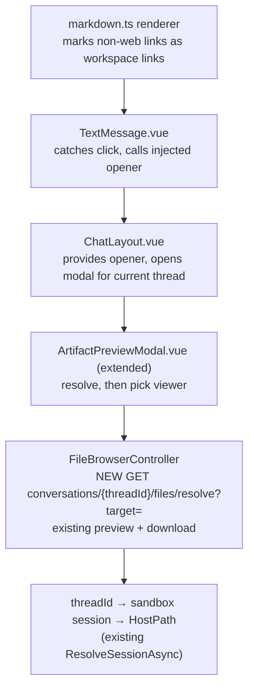
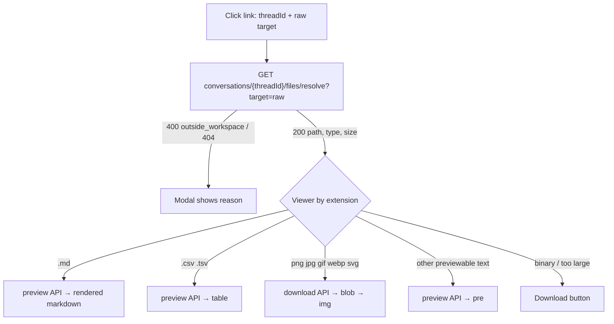

# Chat: copy message + file-link preview

**Outcome.** Each assistant text bubble gets a hover "Copy" button that copies the raw markdown. Clicking a
file link in an assistant message opens a preview modal: markdown rendered, CSV as a table, images shown,
other text as plain text, anything else as a Download button.

**Branch / worktree.** `feat/chat-copy-and-file-link-preview` in `.worktrees/WT5` (from `origin/main`).

**Your decisions (already made).** Copy per bubble, visible on hover. Preview in an in-app modal.
Viewers v1: markdown, CSV/TSV, images. Excel deferred.

---

## Part 1 — Copy message

- New small `CopyMessageButton.vue`. Placed inside `.text-bubble` in `MessageList.vue` (both render branches).
- Copies `item.content.text` — the model's original markdown, unchanged (links not rewritten).
- Shown on bubble hover and on keyboard focus. Hidden while that bubble is still streaming.
- Clipboard: `navigator.clipboard.writeText`. Fallback to a hidden textarea + `execCommand('copy')` when the
  page is not a secure context (http on a LAN IP). Button flips to "Copied" for ~1.5 s; shows "Copy failed" on error.
- Only assistant bubbles. User messages and thinking are unchanged.

**Done:** Vitest — button copies exact markdown; fallback path used when `navigator.clipboard` is missing;
not rendered while streaming.

---

## Part 2 — File-link preview

### Why resolve on the server

The model is told the workspace's **absolute host path** (`Program.cs BuildWorkspaceSuffix`). So links look like
`B:\ws\docs\a.md`, `file:///B:/ws/docs/a.md`, `/workspace/docs/a.md` or `docs/a.md`.
The file API only accepts **workspace-relative** `/` paths. The client does not know the host path.
The server does (`SandboxSession.HostPath`). So the server converts the link; the client never guesses.

Also: DOMPurify strips `file:` and `B:\` hrefs today. So the renderer must rewrite those links before sanitizing.

### How the server knows which sandbox

- Every file URL carries the **conversation id** in its path: `/api/conversations/{threadId}/files/...`.
  This is the existing file-browser contract.
- The client never sends a sandbox id. The server maps `threadId` → conversation → its workspace's sandbox
  session (existing `ResolveSessionAsync`, which also does the access check). That session gives `HostPath`.
- The rendered link carries the id too: `ChatLayout` provides `{ threadId }` (current conversation) to the
  message tree; `MessageList` passes it into the renderer. Sub-agent transcripts sit under the same provider,
  so their links use the parent conversation's workspace (sub-agents share it).
- New chat with no conversation yet → links render but the modal says "no workspace session yet".

### Who does what

### How a click moves

Example: model writes `[Report](B:\sandbox-workspaces\LmDotnetTools\docs\report.md)` with HostPath
`B:\sandbox-workspaces\LmDotnetTools`, in conversation `thread-123`. Renderer emits
`<a class="workspace-link" href="#workspace-file?thread=thread-123&target=B%3A%5C…report.md">`.
Click → `GET /api/conversations/thread-123/files/resolve?target=…` returns `{ path: "docs/report.md", type: "file", size: 812 }` → preview API → rendered markdown.

### Link classification (renderer)

- Web links (`http:`, `https:`) → **open in a new tab**: `target="_blank" rel="noopener noreferrer"`, set by a
  DOMPurify post-sanitize hook so raw model HTML can never choose its own `target`/`rel`. Applies to ALL
  markdown (chat, pending, preview modal). Fixes today's bug: links navigate the chat pane away.
- `mailto:`, `tel:` and in-page `#anchors` → unchanged.
- Workspace links are opt-in: `parseMarkdown(text, { workspaceLinks: { threadId } })`. Only assistant bubbles
  in `MessageList` pass it. `PendingMessage`, user messages and `ArtifactPreviewModal` keep plain links.
- With the option, every other href → workspace link. `href` becomes
  `#workspace-file?thread=<threadId>&target=<encoded original>` (safe; never leaves the page), plus class
  `workspace-link`. Both survive the existing DOMPurify allowlist. Click is intercepted; the modal opens.

### Server resolve rules (`WorkspaceLinkResolver`, pure static, unit-tested)

1. Drop `?query` and `#fragment`. Decode `file://` URIs and percent-encoding.
2. If absolute and under `HostPath` (drive letter case-insensitive; `\` or `/` in the HostPath part) → strip prefix.
   `/workspace/docs/a.md` resolves only when HostPath **is** `/workspace` (container backend). On the local
   Windows backend there is no `/workspace` mount, so it returns `outside_workspace`. Both cases get an xUnit row.
3. If relative → strip leading `./`.
4. Normalize separators to `/` **only** for the host-path-prefixed case (Windows host). A backslash in a relative
   path stays invalid, matching the existing controller rule.
5. Reject `..`, `.`, NUL, or an absolute path outside HostPath → `400 outside_workspace` / `invalid_path`.
6. Controller then runs the existing `ResolveTargetAsync` (real existence, type, size) and the same session/auth
   checks as `preview`. Returns `{ path, type, size }`.

### Viewers (extend existing `ArtifactPreviewModal.vue`, no new modal)

- Accepts either `path` (todo-board chips, unchanged) or `target` (chat links → resolve first).
- Markdown: existing `parseMarkdown` path. Links inside the previewed doc: out of scope v1.
- CSV/TSV: new `utils/delimitedText.ts` (RFC 4180 quotes, no dependency). Render first 1000 rows, say if truncated.
- Image: `downloadFileBlob` (new, reuses `downloadFile` internals), typed blob → object URL → ``, revoked on
  close. Refuse above 16 MiB → Download button. SVG only via `` (scripts do not run).
- Always a Download button in the modal footer.

---

## Build order

1. **Copy button** — `CopyMessageButton.vue`, `MessageList.vue`. Done: Vitest green.
2. **Resolver + endpoint** — `FileBrowser/WorkspaceLinkResolver.cs`, `FileBrowserController.Resolve`.
   Done: xUnit tables for Windows/POSIX/file-URI/relative/escape cases; controller test 200/400/404/409 no-session.
3. **Renderer link marking** — `utils/markdown.ts`. Done: Vitest proves each link shape gets `workspace-link` and
   web links do not; a `B:\` href is no longer stripped; href carries the thread id; without the option, no
   workspace links (modal + user-message links plain); http(s) links get `target=_blank` + `rel=noopener
   noreferrer` everywhere, and raw-HTML `target` is still dropped.
4. **Click → modal** — `TextMessage.vue` (inject opener), `ChatLayout.vue` (provide + modal state),
   `fileBrowserApi.ts` (`resolveWorkspaceLink`, `downloadFileBlob`). Done: Vitest click opens modal with target.
5. **Viewers** — `ArtifactPreviewModal.vue`, `utils/delimitedText.ts`. Done: Vitest per viewer + download button.
6. **Repeatable UI check** — add a mock-provider prompt to `PromptExamples.md` whose reply links `docs/x.md` and
   `data.csv`. Drive it from a `Browser.E2E.Tests` scenario (reusing `FileBrowserTests` workspace fixtures if they
   fit; else a `playwright-scripts/*.mjs`). Asserts: copy puts exact markdown on the clipboard; each link opens the
   right viewer. Done: passes twice in a row.
7. **Gates** — `npm run build` (type-check), Vitest, `dotnet test` sample tests, `dotnet csharpier check`.

## Limits / out of scope

- Plain paths not written as markdown links (e.g. `` `docs/a.md` `` in code) are not clickable in v1.
- Assumption to verify in step 4: sub-agents share the parent conversation's workspace. If not, their links
  show "not found" in v1.
- Excel viewer deferred (npm `xlsx@0.18.5` has 2 high CVEs; fixed builds only from cdn.sheetjs.com).
- Links to directories show "This is a folder" (no folder viewer).
