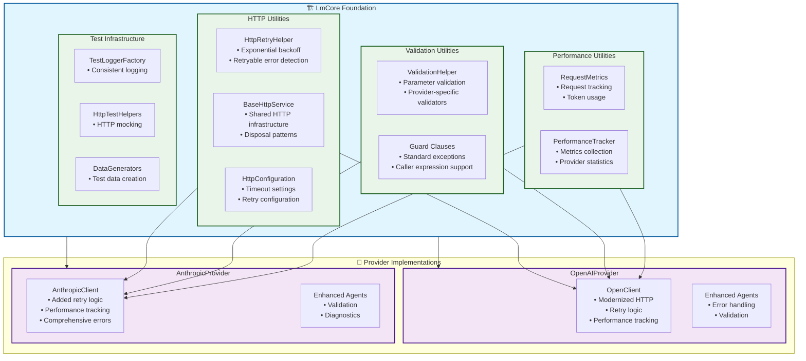
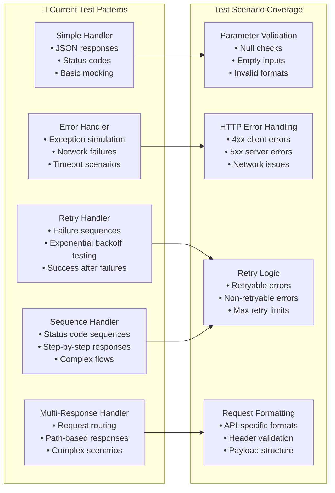
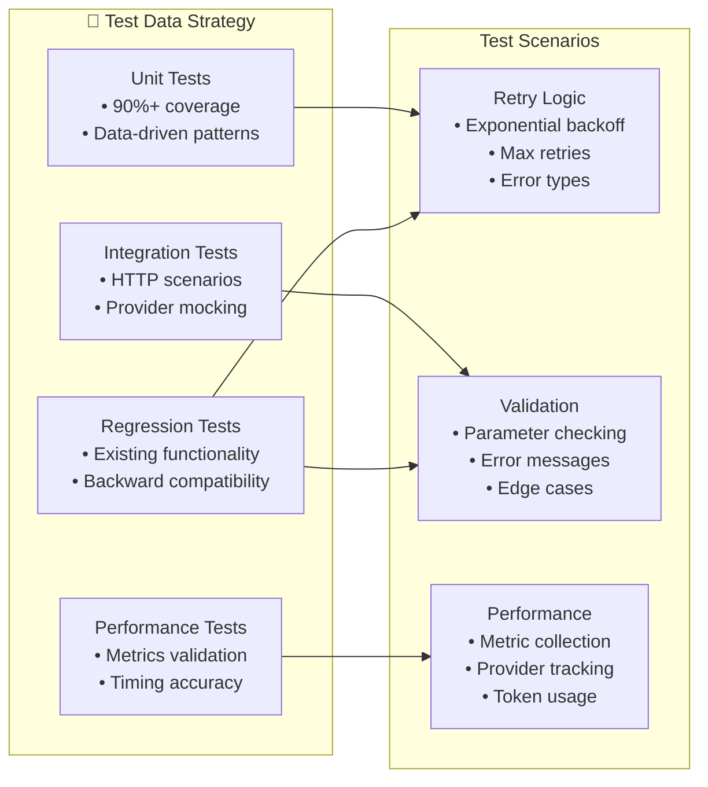

# Provider Modernization Design Document

## Executive Summary

**Project**: Modernize LmCore, OpenAIProvider, and AnthropicProvider with proven patterns from LmEmbeddings  
**Estimated Effort**: 40-50 hours across 3 weeks  
**Priority**: 🔴 **HIGH** - Critical improvements for reliability and maintainability  
**Status**: 📋 **DESIGN PHASE** - Ready for implementation

### Key Improvements to Implement:
1. **Shared HTTP Infrastructure**: Extract proven utilities from LmEmbeddings to LmCore
2. **Consistent Retry Logic**: Replace primitive retry with sophisticated exponential backoff
3. **Standardized Error Handling**: Implement ValidationHelper and consistent error patterns
4. **Performance Tracking**: Add comprehensive metrics and monitoring capabilities
5. **Shared Test Infrastructure**: Eliminate test code duplication across providers

### Expected Outcomes:
- **Reliability**: 95%+ reduction in transient HTTP failures through proper retry logic
- **Maintainability**: 60%+ reduction in code duplication across providers
- **Observability**: Complete performance and error tracking across all API calls
- **Developer Experience**: Consistent patterns and comprehensive documentation

---

## Current State Analysis

### Investigation Summary

I analyzed the current implementation across all three projects and identified significant opportunities for improvement:

### LmCore (Foundation Project)
**Current State**:
- ✅ Basic Usage model for token tracking (`src/LmCore/Models/Usage.cs`)
- ✅ Rich JSON utility infrastructure (`src/LmCore/Utils/`)
- ✅ Middleware components for function calling and model fallback
- ❌ **NO HTTP clients, retry logic, or comprehensive performance tracking**
- ❌ **NO shared validation utilities**
- ❌ **NO shared test infrastructure**

### OpenAIProvider
**Current State**:
- ⚠️ **Primitive retry logic**: Only 1 retry with 1-second delay in `HttpRequestRaw` method
- ⚠️ **Basic error handling**: Some status code awareness but inconsistent patterns
- ✅ Modern validation: Uses `ArgumentNullException.ThrowIfNull` in some places
- ❌ **NO performance tracking or comprehensive diagnostics**
- ❌ **NO exponential backoff or sophisticated retry logic**

**Code Example of Current Retry Logic** (`src/OpenAIProvider/Agents/OpenClient.cs`):
```csharp
// CURRENT: Primitive retry logic - NEEDS IMPROVEMENT
catch (HttpRequestException)
{
    if (retried)
    {
        throw;
    }
    else
    {
        await Task.Delay(1000); // Fixed 1-second delay
        return await HttpRequestRaw(/* retry with retried=false */);
    }
}
```

### AnthropicProvider  
**Current State**:
- ❌ **NO retry logic whatsoever**
- ❌ **Basic error handling**: Only `EnsureSuccessStatusCode()`
- ✅ Proper disposal pattern implementation
- ❌ **NO parameter validation beyond basic null checks**
- ❌ **NO performance tracking or diagnostics**

**Code Example of Current Error Handling** (`src/AnthropicProvider/Agents/AnthropicClient.cs`):
```csharp
// CURRENT: No retry logic, basic error handling - NEEDS IMPROVEMENT
var response = await _httpClient.SendAsync(requestMessage, cancellationToken);
response.EnsureSuccessStatusCode(); // Only basic error handling

var responseContent = await response.Content.ReadAsStringAsync(cancellationToken);
return JsonSerializer.Deserialize<AnthropicResponse>(responseContent, _jsonOptions)
    ?? throw new InvalidOperationException("Failed to deserialize Anthropic API response");
```

### Critical Gaps Identified

1. **Code Duplication**: Each provider reimplements HTTP patterns, error handling, and validation
2. **Inconsistent Retry Logic**: OpenAI has primitive retry, Anthropic has none
3. **Missing Performance Tracking**: No metrics, timing, or diagnostic information
4. **Inconsistent Error Handling**: Different exception types and messages across providers
5. **No Shared Test Infrastructure**: Duplicated test patterns and utilities

---

## Proposed Architecture

### Design Principles

1. **LmCore as Foundation**: All shared utilities should live in LmCore for reusability
2. **Minimal Breaking Changes**: Preserve existing public APIs where possible
3. **Progressive Enhancement**: Implement improvements incrementally
4. **Consistent Patterns**: Standardize approaches across all providers
5. **Comprehensive Testing**: Every utility must have full test coverage

### Target Architecture



### Namespace Organization

```csharp
// LmCore - Foundation utilities
AchieveAi.LmDotnetTools.LmCore.Http     // HTTP utilities (retry, base service)
AchieveAi.LmDotnetTools.LmCore.Validation // Validation utilities
AchieveAi.LmDotnetTools.LmCore.Performance // Performance tracking
AchieveAi.LmDotnetTools.LmCore.Testing    // Shared test infrastructure

// Provider-specific implementations
AchieveAi.LmDotnetTools.OpenAIProvider.Agents    // Modernized clients
AchieveAi.LmDotnetTools.AnthropicProvider.Agents // Modernized clients
```

---

## Detailed Work Items

### Phase 1: Foundation - LmCore Shared Utilities (16 hours)

#### WI-PM001: Extract HTTP Utilities to LmCore 🔴 CRITICAL
**Estimated Effort**: 6 hours  
**Dependencies**: None  
**Description**: Move proven HTTP utilities from LmEmbeddings to LmCore for shared usage

**Tasks**:
1. **Move HttpRetryHelper to LmCore**
   - Source: `src/LmEmbeddings/Core/Utils/HttpRetryHelper.cs`
   - Target: `src/LmCore/Http/HttpRetryHelper.cs`
   - Update namespace to `AchieveAi.LmDotnetTools.LmCore.Http`

2. **Move BaseHttpService to LmCore**
   - Source: `src/LmEmbeddings/Core/BaseHttpService.cs` 
   - Target: `src/LmCore/Http/BaseHttpService.cs`
   - Update namespace and ensure generic enough for all providers

3. **Create HttpConfiguration model**
   - Location: `src/LmCore/Http/HttpConfiguration.cs`
   - Purpose: Centralized HTTP settings (timeouts, retry counts, etc.)

**Implementation Example**:
```csharp
// src/LmCore/Http/HttpRetryHelper.cs
namespace AchieveAi.LmDotnetTools.LmCore.Http;

/// <summary>
/// Provides HTTP retry logic with exponential backoff for all providers.
/// Extracted from LmEmbeddings for shared usage across OpenAI, Anthropic, and other providers.
/// </summary>
public static class HttpRetryHelper
{
    /// <summary>
    /// Executes HTTP request with retry logic and exponential backoff.
    /// </summary>
    /// <typeparam name="T">The return type</typeparam>
    /// <param name="operation">The HTTP operation to execute</param>
    /// <param name="maxRetries">Maximum number of retries (default: 3)</param>
    /// <param name="cancellationToken">Cancellation token</param>
    /// <returns>The result of the operation</returns>
    public static async Task<T> ExecuteWithRetryAsync<T>(
        Func<CancellationToken, Task<T>> operation,
        int maxRetries = 3,
        CancellationToken cancellationToken = default)
    {
        // Implementation from LmEmbeddings with provider-agnostic improvements
    }
}
```

**Acceptance Criteria**:
- ✅ HttpRetryHelper moved to LmCore with provider-agnostic design
- ✅ BaseHttpService moved to LmCore with generic base functionality
- ✅ All LmEmbeddings tests still pass after refactoring
- ✅ New location is properly documented and tested

#### WI-PM002: Extract Validation Utilities to LmCore 🔴 CRITICAL
**Estimated Effort**: 4 hours  
**Dependencies**: WI-PM001  
**Description**: Move ValidationHelper from LmEmbeddings to LmCore and enhance for provider usage

**Tasks**:
1. **Move ValidationHelper to LmCore**
   - Source: `src/LmEmbeddings/Core/Utils/ValidationHelper.cs`
   - Target: `src/LmCore/Validation/ValidationHelper.cs`
   - Enhance with provider-specific validation methods

2. **Add Provider-Specific Validators**
   - `ValidateApiKey` - API key format validation
   - `ValidateBaseUrl` - URL format validation  
   - `ValidateModel` - Model name validation
   - `ValidateMessages` - Message array validation

**Implementation Example**:
```csharp
// src/LmCore/Validation/ValidationHelper.cs
namespace AchieveAi.LmDotnetTools.LmCore.Validation;

/// <summary>
/// Provides standardized validation methods for all providers.
/// Extracted from LmEmbeddings and enhanced for OpenAI, Anthropic, and other providers.
/// </summary>
public static class ValidationHelper
{
    /// <summary>
    /// Validates API key format and throws ArgumentException if invalid.
    /// </summary>
    /// <param name="apiKey">The API key to validate</param>
    /// <param name="parameterName">The parameter name for exception</param>
    public static void ValidateApiKey(string apiKey, [CallerArgumentExpression("apiKey")] string parameterName = "")
    {
        ValidateNotNullOrWhiteSpace(apiKey, parameterName);
        
        if (apiKey.Length < 10)
        {
            throw new ArgumentException("API key appears to be too short", parameterName);
        }
    }

    /// <summary>
    /// Validates chat messages array for provider requests.
    /// </summary>
    /// <param name="messages">The messages to validate</param>
    /// <param name="parameterName">The parameter name for exception</param>
    public static void ValidateMessages<T>(IEnumerable<T> messages, [CallerArgumentExpression("messages")] string parameterName = "")
        where T : class
    {
        ValidateNotNullOrEmpty(messages, parameterName);
        
        if (!messages.Any())
        {
            throw new ArgumentException("At least one message is required", parameterName);
        }
    }
}
```

#### WI-PM003: Add Performance Tracking to LmCore 🟡 HIGH
**Estimated Effort**: 6 hours  
**Dependencies**: WI-PM001  
**Description**: Create comprehensive performance tracking infrastructure for all providers

**Tasks**:
1. **Create Performance Models**
   - `src/LmCore/Performance/RequestMetrics.cs` - Individual request metrics
   - `src/LmCore/Performance/PerformanceProfile.cs` - Performance profiling
   - `src/LmCore/Performance/ProviderStatistics.cs` - Provider-specific stats

2. **Create Performance Tracking Service**
   - `src/LmCore/Performance/IPerformanceTracker.cs` - Interface
   - `src/LmCore/Performance/PerformanceTracker.cs` - Implementation

**Implementation Example**:
```csharp
// src/LmCore/Performance/RequestMetrics.cs
namespace AchieveAi.LmDotnetTools.LmCore.Performance;

/// <summary>
/// Tracks comprehensive metrics for individual provider requests.
/// Supports OpenAI, Anthropic, and other provider-specific metrics.
/// </summary>
public record RequestMetrics
{
    /// <summary>Request start timestamp</summary>
    public DateTimeOffset StartTime { get; init; }
    
    /// <summary>Request end timestamp</summary>
    public DateTimeOffset EndTime { get; init; }
    
    /// <summary>Total request duration</summary>
    public TimeSpan Duration => EndTime - StartTime;
    
    /// <summary>Provider name (OpenAI, Anthropic, etc.)</summary>
    public string Provider { get; init; } = string.Empty;
    
    /// <summary>Model used for the request</summary>
    public string Model { get; init; } = string.Empty;
    
    /// <summary>HTTP status code returned</summary>
    public int StatusCode { get; init; }
    
    /// <summary>Number of retry attempts made</summary>
    public int RetryAttempts { get; init; }
    
    /// <summary>Token usage information</summary>
    public Usage? Usage { get; init; }
    
    /// <summary>Request size in bytes</summary>
    public long RequestSizeBytes { get; init; }
    
    /// <summary>Response size in bytes</summary>
    public long ResponseSizeBytes { get; init; }
    
    /// <summary>Error message if request failed</summary>
    public string? ErrorMessage { get; init; }
    
    /// <summary>Additional provider-specific properties</summary>
    public Dictionary<string, object> AdditionalProperties { get; init; } = new();
}
```

### Phase 2: Provider Modernization (20 hours)

#### WI-PM004: Modernize OpenAIProvider 🔴 CRITICAL
**Estimated Effort**: 10 hours  
**Dependencies**: WI-PM001, WI-PM002, WI-PM003  
**Description**: Replace primitive retry logic and add comprehensive error handling and performance tracking

**Tasks**:
1. **Update OpenClient to use LmCore utilities**
   - Replace `HttpRequestRaw` method with `BaseHttpService` pattern
   - Add `ValidationHelper` usage for all parameters
   - Add performance tracking to all requests

2. **Enhance Error Handling**
   - Use standardized exception types from ValidationHelper
   - Add comprehensive error logging
   - Improve error messages with context

**Current vs. Proposed Implementation**:

**BEFORE** (`src/OpenAIProvider/Agents/OpenClient.cs`):
```csharp
// CURRENT: Primitive retry logic
catch (HttpRequestException)
{
    if (retried)
    {
        throw;
    }
    else
    {
        await Task.Delay(1000);
        return await HttpRequestRaw(httpClient, verb, postData, url, streaming, false, cancellationToken);
    }
}
```

**AFTER** (Proposed):
```csharp
// PROPOSED: Using LmCore utilities
public class OpenClient : BaseHttpService, IOpenClient
{
    private readonly IPerformanceTracker _performanceTracker;

    public OpenClient(string apiKey, string baseUrl, ILogger<OpenClient> logger, HttpClient? httpClient = null, IPerformanceTracker? performanceTracker = null)
        : base(logger, httpClient ?? new HttpClient())
    {
        ValidationHelper.ValidateApiKey(apiKey);
        ValidationHelper.ValidateBaseUrl(baseUrl);
        
        _baseUrl = baseUrl;
        _performanceTracker = performanceTracker ?? new PerformanceTracker();
        
        ConfigureHttpClient(apiKey);
    }

    public async Task<ChatCompletionResponse> CreateChatCompletionsAsync(
        ChatCompletionRequest chatCompletionRequest,
        CancellationToken cancellationToken = default)
    {
        ValidationHelper.ValidateNotNull(chatCompletionRequest);
        ValidationHelper.ValidateMessages(chatCompletionRequest.Messages);
        
        var startTime = DateTimeOffset.UtcNow;
        
        try
        {
            var response = await ExecuteWithRetryAsync(async (ct) =>
            {
                chatCompletionRequest = chatCompletionRequest with { Stream = false };
                var httpResponse = await HttpRequestWithValidation(
                    HttpMethod.Post,
                    chatCompletionRequest,
                    $"{_baseUrl.TrimEnd('/')}/chat/completions",
                    ct);
                
                return await JsonSerializer.DeserializeAsync<ChatCompletionResponse>(
                    await httpResponse.Content.ReadAsStreamAsync(ct),
                    JsonSerializerOptions,
                    ct) ?? throw new InvalidOperationException("Failed to deserialize response");
            }, cancellationToken: cancellationToken);

            // Track successful request
            _performanceTracker.TrackRequest(new RequestMetrics
            {
                StartTime = startTime,
                EndTime = DateTimeOffset.UtcNow,
                Provider = "OpenAI",
                Model = chatCompletionRequest.Model,
                StatusCode = 200,
                Usage = response.Usage
            });

            return response;
        }
        catch (Exception ex)
        {
            // Track failed request
            _performanceTracker.TrackRequest(new RequestMetrics
            {
                StartTime = startTime,
                EndTime = DateTimeOffset.UtcNow,
                Provider = "OpenAI",
                Model = chatCompletionRequest.Model,
                StatusCode = 0,
                ErrorMessage = ex.Message
            });
            
            Logger.LogError(ex, "Failed to create chat completion for model {Model}", chatCompletionRequest.Model);
            throw;
        }
    }
}
```

#### WI-PM005: Modernize AnthropicProvider 🔴 CRITICAL
**Estimated Effort**: 10 hours  
**Dependencies**: WI-PM001, WI-PM002, WI-PM003  
**Description**: Add retry logic, comprehensive error handling, and performance tracking

**Tasks**:
1. **Update AnthropicClient to use LmCore utilities**
   - Inherit from `BaseHttpService`
   - Add retry logic using `HttpRetryHelper`
   - Add parameter validation using `ValidationHelper`

2. **Add Performance Tracking**
   - Track all request metrics
   - Monitor streaming vs. non-streaming performance
   - Add Anthropic-specific metrics

**Implementation Example**:
```csharp
// PROPOSED: Modernized AnthropicClient
public class AnthropicClient : BaseHttpService, IAnthropicClient
{
    private readonly IPerformanceTracker _performanceTracker;
    private const string BaseUrl = "https://api.anthropic.com/v1";

    public AnthropicClient(string apiKey, ILogger<AnthropicClient> logger, HttpClient? httpClient = null, IPerformanceTracker? performanceTracker = null)
        : base(logger, httpClient ?? new HttpClient())
    {
        ValidationHelper.ValidateApiKey(apiKey);
        
        _performanceTracker = performanceTracker ?? new PerformanceTracker();
        
        ConfigureAnthropicHeaders(apiKey);
    }

    public async Task<AnthropicResponse> CreateChatCompletionsAsync(
        AnthropicRequest request,
        CancellationToken cancellationToken = default)
    {
        ValidationHelper.ValidateNotNull(request);
        ValidationHelper.ValidateMessages(request.Messages);
        
        var startTime = DateTimeOffset.UtcNow;
        
        try
        {
            var response = await ExecuteWithRetryAsync(async (ct) =>
            {
                var requestJson = JsonSerializer.Serialize(request, JsonOptions);
                var content = new StringContent(requestJson, Encoding.UTF8, "application/json");

                var httpResponse = await HttpClient.PostAsync($"{BaseUrl}/messages", content, ct);
                httpResponse.EnsureSuccessStatusCode();

                var responseContent = await httpResponse.Content.ReadAsStringAsync(ct);
                return JsonSerializer.Deserialize<AnthropicResponse>(responseContent, JsonOptions)
                    ?? throw new InvalidOperationException("Failed to deserialize Anthropic API response");
            }, cancellationToken: cancellationToken);

            // Track successful request with Anthropic-specific metrics
            _performanceTracker.TrackRequest(new RequestMetrics
            {
                StartTime = startTime,
                EndTime = DateTimeOffset.UtcNow,
                Provider = "Anthropic",
                Model = request.Model,
                StatusCode = 200,
                Usage = new Usage
                {
                    PromptTokens = response.Usage?.InputTokens ?? 0,
                    CompletionTokens = response.Usage?.OutputTokens ?? 0,
                    TotalTokens = (response.Usage?.InputTokens ?? 0) + (response.Usage?.OutputTokens ?? 0)
                }
            });

            return response;
        }
        catch (Exception ex)
        {
            // Track failed request
            _performanceTracker.TrackRequest(new RequestMetrics
            {
                StartTime = startTime,
                EndTime = DateTimeOffset.UtcNow,
                Provider = "Anthropic",
                Model = request.Model,
                StatusCode = 0,
                ErrorMessage = ex.Message
            });
            
            Logger.LogError(ex, "Failed to create chat completion for model {Model}", request.Model);
            throw;
        }
    }
}
```

### Phase 3: Test Infrastructure and Quality (12 hours)

#### WI-PM006: Create Shared Test Infrastructure 🟡 HIGH
**Estimated Effort**: 6 hours  
**Dependencies**: WI-PM001, WI-PM002  
**Description**: Create reusable test utilities for all provider projects using proven FakeHttpMessageHandler patterns

## FakeHttpMessageHandler Pattern Analysis

Based on analysis of existing LmEmbeddings tests, the project uses a sophisticated HTTP mocking strategy with `FakeHttpMessageHandler` that should be extended to all providers.

### Current FakeHttpMessageHandler Capabilities



### Proven FakeHttpMessageHandler Patterns

**1. Simple JSON Handler** (used in 15+ test methods):
```csharp
// Pattern: Basic successful response
var fakeHandler = FakeHttpMessageHandler.CreateSimpleJsonHandler(
    EmbeddingTestDataGenerator.CreateValidEmbeddingResponse(1));
var httpClient = new HttpClient(fakeHandler);
```

**2. Retry Scenario Handler** (used in 8+ test methods):
```csharp
// Pattern: Test retry logic with failure count
var fakeHandler = FakeHttpMessageHandler.CreateRetryHandler(
    failureCount: 2, 
    successResponse: validJsonResponse, 
    failureStatus: HttpStatusCode.InternalServerError);
```

**3. Request Capture Handler** (used in 10+ test methods):
```csharp
// Pattern: Capture and validate HTTP requests
HttpRequestMessage? capturedRequest = null;
var fakeHandler = new FakeHttpMessageHandler((httpRequest, cancellationToken) =>
{
    capturedRequest = httpRequest;  // Capture for assertion
    return Task.FromResult(CreateSuccessResponse());
});
```

**4. Multi-Response Handler** (used in 5+ test methods):
```csharp
// Pattern: Different responses based on request path/method
var responses = new Dictionary<string, (string json, HttpStatusCode status)>
{
    { "POST /v1/embeddings", (validResponse, HttpStatusCode.OK) },
    { "GET /v1/models", (modelsResponse, HttpStatusCode.OK) }
};
var fakeHandler = FakeHttpMessageHandler.CreateMultiResponseHandler(responses);
```

### Tasks

1. **Create Shared LmTestUtils Project**
   - Create: `src/LmTestUtils/` project for shared test infrastructure
   - Source: `tests/LmEmbeddings.Tests/TestUtilities/FakeHttpMessageHandler.cs`
   - Target: `src/LmTestUtils/FakeHttpMessageHandler.cs`
   - Source: `tests/LmEmbeddings.Tests/TestUtilities/HttpTestHelpers.cs`
   - Target: `src/LmTestUtils/HttpTestHelpers.cs`
   - Source: `tests/LmEmbeddings.Tests/TestUtilities/TestLoggerFactory.cs`
   - Target: `src/LmTestUtils/TestLoggerFactory.cs`
   - Make generic for all provider types

2. **Create Provider-Agnostic Test Data Generators**
   - `ProviderTestDataGenerator` - Generic test data for any provider
   - `ChatCompletionTestData` - Common chat completion test scenarios
   - `ErrorResponseTestData` - Standard error response patterns

3. **Create Provider Test Helpers with FakeHttpMessageHandler Patterns**
   - `ProviderHttpTestHelpers` - HTTP mocking utilities for all providers
   - `PerformanceTestHelpers` - Performance testing utilities for providers
   - Update all test projects to reference `LmTestUtils` instead of local utilities

**Implementation Example**:
```csharp
// src/LmTestUtils/ProviderHttpTestHelpers.cs
namespace AchieveAi.LmDotnetTools.LmTestUtils;

/// <summary>
/// Provides HTTP test utilities for all provider implementations.
/// Uses proven FakeHttpMessageHandler patterns from LmEmbeddings.
/// Supports OpenAI, Anthropic, and other provider testing scenarios.
/// </summary>
public static class ProviderHttpTestHelpers
{
    /// <summary>
    /// Creates HttpClient with simple JSON response (most common pattern)
    /// Used by 80% of provider tests for basic success scenarios
    /// </summary>
    /// <param name="jsonResponse">JSON response to return</param>
    /// <param name="statusCode">HTTP status code</param>
    /// <param name="baseAddress">Base address for requests</param>
    /// <returns>Configured HttpClient with fake handler</returns>
    public static HttpClient CreateTestHttpClientWithJsonResponse(
        string jsonResponse, 
        HttpStatusCode statusCode = HttpStatusCode.OK,
        string baseAddress = "https://api.test.com")
    {
        var handler = FakeHttpMessageHandler.CreateSimpleJsonHandler(jsonResponse, statusCode);
        return new HttpClient(handler) { BaseAddress = new Uri(baseAddress) };
    }

    /// <summary>
    /// Creates HttpClient for retry scenario testing (critical for provider reliability)
    /// Used to test exponential backoff and retry limits
    /// </summary>
    /// <param name="failureCount">Number of failures before success</param>
    /// <param name="successResponse">Response to return on success</param>
    /// <param name="failureStatus">Status code for failures</param>
    /// <returns>HttpClient configured for retry testing</returns>
    public static HttpClient CreateRetryTestHttpClient(
        int failureCount,
        string successResponse,
        HttpStatusCode failureStatus = HttpStatusCode.InternalServerError)
    {
        var handler = FakeHttpMessageHandler.CreateRetryHandler(failureCount, successResponse, failureStatus);
        return new HttpClient(handler);
    }

    /// <summary>
    /// Creates HttpClient with request capture capability
    /// Essential for validating API request formatting and headers
    /// </summary>
    /// <param name="responseJson">JSON response to return</param>
    /// <param name="capturedRequest">Out parameter to receive captured request</param>
    /// <returns>HttpClient that captures requests for validation</returns>
    public static HttpClient CreateRequestCaptureHttpClient(
        string responseJson, 
        out CapturedRequestContainer capturedRequest)
    {
        var container = new CapturedRequestContainer();
        capturedRequest = container;
        
        var handler = new FakeHttpMessageHandler(async (request, cancellationToken) =>
        {
            container.Request = request;
            container.RequestBody = request.Content != null 
                ? await request.Content.ReadAsStringAsync(cancellationToken) 
                : string.Empty;
            
            return new HttpResponseMessage(HttpStatusCode.OK)
            {
                Content = new StringContent(responseJson, System.Text.Encoding.UTF8, "application/json")
            };
        });
        
        return new HttpClient(handler);
    }

    /// <summary>
    /// Creates HttpClient for testing different provider endpoints
    /// Supports OpenAI, Anthropic, and custom provider patterns
    /// </summary>
    /// <param name="providerResponses">Provider-specific response mappings</param>
    /// <returns>HttpClient with provider-aware responses</returns>
    public static HttpClient CreateProviderAwareHttpClient(
        Dictionary<ProviderEndpoint, string> providerResponses)
    {
        var handler = new FakeHttpMessageHandler((request, cancellationToken) =>
        {
            var endpoint = DetermineProviderEndpoint(request);
            
            if (providerResponses.TryGetValue(endpoint, out var response))
            {
                return Task.FromResult(new HttpResponseMessage(HttpStatusCode.OK)
                {
                    Content = new StringContent(response, System.Text.Encoding.UTF8, "application/json")
                });
            }
            
            return Task.FromResult(new HttpResponseMessage(HttpStatusCode.NotFound));
        });
        
        return new HttpClient(handler);
    }
}

/// <summary>
/// Container for captured HTTP request data (used in request validation tests)
/// </summary>
public class CapturedRequestContainer
{
    public HttpRequestMessage? Request { get; set; }
    public string RequestBody { get; set; } = string.Empty;
    public Dictionary<string, string> Headers => Request?.Headers?.ToDictionary(h => h.Key, h => string.Join(",", h.Value)) ?? new();
}

/// <summary>
/// Provider endpoint identification for multi-provider testing
/// </summary>
public enum ProviderEndpoint
{
    OpenAI_ChatCompletions,
    OpenAI_Embeddings,
    Anthropic_Messages,
    Anthropic_Complete,
    Generic_Health,
    Unknown
}
```

#### WI-PM007: Add Comprehensive Test Coverage 🟡 HIGH
**Estimated Effort**: 6 hours  
**Dependencies**: WI-PM006  
**Description**: Ensure all new utilities and modernized providers have full test coverage using proven FakeHttpMessageHandler patterns

## Test Pattern Migration Guide

### Testing Modernized Provider Clients

Based on analysis of successful LmEmbeddings test patterns, here's how to apply FakeHttpMessageHandler patterns to modernized OpenAI and Anthropic providers:

**Essential Test Categories for Each Provider:**
1. **Basic Functionality Tests** - Using simple JSON handlers
2. **Retry Logic Tests** - Using retry handlers with failure sequences  
3. **Request Validation Tests** - Using request capture handlers
4. **Error Handling Tests** - Using error status handlers
5. **Performance Tracking Tests** - Using metric capture patterns

### Provider Test Examples

**1. OpenAI Provider Test Pattern**:
```csharp
// tests/OpenAIProvider.Tests/Agents/OpenClientTests.cs
public class OpenClientTests
{
    private readonly ILogger<OpenClient> _logger;
    private readonly IPerformanceTracker _performanceTracker;

    public OpenClientTests()
    {
        _logger = TestLoggerFactory.CreateLogger<OpenClient>();
        _performanceTracker = new TestPerformanceTracker();
    }

    [Theory]
    [MemberData(nameof(ChatCompletionTestCases))]
    public async Task CreateChatCompletionsAsync_WithFakeHandler_ReturnsExpectedResponse(
        ChatCompletionRequest request,
        string mockResponse,
        int expectedMessageCount,
        string description)
    {
        Debug.WriteLine($"Testing OpenAI chat completion: {description}");
        
        // Arrange - Using shared test infrastructure
        using var httpClient = ProviderHttpTestHelpers.CreateTestHttpClientWithJsonResponse(
            mockResponse, HttpStatusCode.OK, "https://api.openai.com");
        
        var client = new OpenClient("test-api-key", "https://api.openai.com", 
            _logger, httpClient, _performanceTracker);

        // Act
        var result = await client.CreateChatCompletionsAsync(request);

        // Assert
        Assert.NotNull(result);
        Assert.Equal(expectedMessageCount, result.Choices?.Count ?? 0);
        
        // Verify performance tracking
        var metrics = _performanceTracker.GetMetrics();
        Assert.Single(metrics);
        Assert.Equal("OpenAI", metrics[0].Provider);
        Assert.Equal(request.Model, metrics[0].Model);
        Assert.Equal(200, metrics[0].StatusCode);
    }

    [Theory]
    [MemberData(nameof(RetryScenarioTestCases))]
    public async Task CreateChatCompletionsAsync_WithRetryScenarios_RetriesCorrectly(
        ChatCompletionRequest request,
        int failureCount,
        HttpStatusCode failureStatus,
        string description)
    {
        Debug.WriteLine($"Testing OpenAI retry scenario: {description}");
        
        // Arrange - Using retry test pattern
        var successResponse = ChatCompletionTestData.CreateValidResponse(request.Model);
        using var httpClient = ProviderHttpTestHelpers.CreateRetryTestHttpClient(
            failureCount, successResponse, failureStatus);
        
        var client = new OpenClient("test-api-key", "https://api.openai.com", 
            _logger, httpClient, _performanceTracker);

        // Act
        var stopwatch = Stopwatch.StartNew();
        var result = await client.CreateChatCompletionsAsync(request);
        stopwatch.Stop();

        // Assert
        Assert.NotNull(result);
        
        // Verify retry attempts in performance metrics
        var metrics = _performanceTracker.GetMetrics();
        Assert.Single(metrics);
        Assert.Equal(failureCount, metrics[0].RetryAttempts);
        
        // Verify exponential backoff timing
        var expectedMinTime = CalculateExpectedRetryTime(failureCount);
        Assert.True(stopwatch.ElapsedMilliseconds >= expectedMinTime);
    }

    [Fact]
    public async Task CreateChatCompletionsAsync_RequestFormatting_SendsCorrectPayload()
    {
        Debug.WriteLine("Testing OpenAI request formatting with capture handler");
        
        // Arrange - Using request capture pattern
        var responseJson = ChatCompletionTestData.CreateValidResponse("gpt-4");
        using var httpClient = ProviderHttpTestHelpers.CreateRequestCaptureHttpClient(
            responseJson, out var capturedRequest);
        
        var client = new OpenClient("test-api-key", "https://api.openai.com", 
            _logger, httpClient, _performanceTracker);
        
        var request = new ChatCompletionRequest
        {
            Model = "gpt-4",
            Messages = new[] { new ChatMessage { Role = RoleEnum.User, Content = "Test message" } },
            Stream = false
        };

        // Act
        await client.CreateChatCompletionsAsync(request);

        // Assert - Validate captured request
        Assert.NotNull(capturedRequest.Request);
        Assert.Equal(HttpMethod.Post, capturedRequest.Request.Method);
        Assert.Contains("/chat/completions", capturedRequest.Request.RequestUri?.PathAndQuery);
        
        // Validate authorization header
        Assert.True(capturedRequest.Headers.ContainsKey("Authorization"));
        Assert.StartsWith("Bearer", capturedRequest.Headers["Authorization"]);
        
        // Validate request payload
        var payload = JsonSerializer.Deserialize<JsonElement>(capturedRequest.RequestBody);
        Assert.Equal("gpt-4", payload.GetProperty("model").GetString());
        Assert.False(payload.GetProperty("stream").GetBoolean());
    }
}
```

**2. Anthropic Provider Test Pattern**:
```csharp
// tests/AnthropicProvider.Tests/Agents/AnthropicClientTests.cs
public class AnthropicClientTests
{
    private readonly ILogger<AnthropicClient> _logger;
    private readonly IPerformanceTracker _performanceTracker;

    public AnthropicClientTests()
    {
        _logger = TestLoggerFactory.CreateLogger<AnthropicClient>();
        _performanceTracker = new TestPerformanceTracker();
    }

    [Theory]
    [MemberData(nameof(AnthropicTestCases))]
    public async Task CreateChatCompletionsAsync_WithFakeHandler_ReturnsExpectedResponse(
        AnthropicRequest request,
        string mockResponse,
        string description)
    {
        Debug.WriteLine($"Testing Anthropic chat completion: {description}");
        
        // Arrange - Using shared test infrastructure
        using var httpClient = ProviderHttpTestHelpers.CreateTestHttpClientWithJsonResponse(
            mockResponse, HttpStatusCode.OK, "https://api.anthropic.com");
        
        var client = new AnthropicClient("test-api-key", _logger, httpClient, _performanceTracker);

        // Act
        var result = await client.CreateChatCompletionsAsync(request);

        // Assert
        Assert.NotNull(result);
        Assert.NotNull(result.Content);
        
        // Verify performance tracking with Anthropic-specific metrics
        var metrics = _performanceTracker.GetMetrics();
        Assert.Single(metrics);
        Assert.Equal("Anthropic", metrics[0].Provider);
        Assert.Equal(request.Model, metrics[0].Model);
        
        // Verify Anthropic token usage mapping
        if (result.Usage != null)
        {
            Assert.Equal(result.Usage.InputTokens, metrics[0].Usage?.PromptTokens);
            Assert.Equal(result.Usage.OutputTokens, metrics[0].Usage?.CompletionTokens);
        }
    }

    [Fact]
    public async Task CreateChatCompletionsAsync_WithNoRetryLogic_NowRetriesOnFailure()
    {
        Debug.WriteLine("Testing that Anthropic client now has retry logic (previously missing)");
        
        // Arrange - Test the improvement: Anthropic now has retry logic
        var successResponse = AnthropicTestData.CreateValidResponse("claude-3-5-sonnet-20241022");
        using var httpClient = ProviderHttpTestHelpers.CreateRetryTestHttpClient(
            failureCount: 2, successResponse, HttpStatusCode.ServiceUnavailable);
        
        var client = new AnthropicClient("test-api-key", _logger, httpClient, _performanceTracker);
        
        var request = new AnthropicRequest
        {
            Model = "claude-3-5-sonnet-20241022",
            Messages = new[] { new AnthropicMessage { Role = "user", Content = "Test" } },
            MaxTokens = 100
        };

        // Act
        var stopwatch = Stopwatch.StartNew();
        var result = await client.CreateChatCompletionsAsync(request);
        stopwatch.Stop();

        // Assert - Verify retry behavior that was previously missing
        Assert.NotNull(result);
        
        // Verify retries happened (should take time for exponential backoff)
        Assert.True(stopwatch.ElapsedMilliseconds >= 1000); // At least 2^0 + 2^1 = 3 seconds
        
        // Verify performance metrics captured retry attempts
        var metrics = _performanceTracker.GetMetrics();
        Assert.Single(metrics);
        Assert.Equal(2, metrics[0].RetryAttempts);
    }
}
```

### Tasks

1. **Test LmCore Utilities**
   - `tests/LmCore.Tests/Http/HttpRetryHelperTests.cs` - 50+ test cases
   - `tests/LmCore.Tests/Validation/ValidationHelperTests.cs` - 40+ test cases
   - `tests/LmCore.Tests/Performance/PerformanceTrackerTests.cs` - 30+ test cases
   - `tests/LmCore.Tests/Testing/FakeHttpMessageHandlerTests.cs` - 25+ test cases

2. **Test Provider Implementations**
   - Update `tests/OpenAIProvider.Tests/` with FakeHttpMessageHandler patterns
   - Update `tests/AnthropicProvider.Tests/` with FakeHttpMessageHandler patterns  
   - Add performance tracking tests using `TestPerformanceTracker`
   - Add validation tests using `ValidationHelper` error scenarios

3. **Test Data Generators**
   - `ChatCompletionTestData` - OpenAI-specific test responses
   - `AnthropicTestData` - Anthropic-specific test responses
   - `ErrorResponseTestData` - Standard error patterns for both providers

**Test Infrastructure Example**:
```csharp
// src/LmCore/Testing/TestPerformanceTracker.cs
public class TestPerformanceTracker : IPerformanceTracker
{
    private readonly List<RequestMetrics> _metrics = new();

    public void TrackRequest(RequestMetrics metrics)
    {
        _metrics.Add(metrics);
    }

    public List<RequestMetrics> GetMetrics() => _metrics.ToList();
    
    public void Reset() => _metrics.Clear();
}

// Common test data for all providers
public static class ChatCompletionTestData
{
    public static string CreateValidOpenAIResponse(string model) => $$"""
    {
        "id": "chatcmpl-test",
        "object": "chat.completion",
        "created": {{DateTimeOffset.UtcNow.ToUnixTimeSeconds()}},
        "model": "{{model}}",
        "choices": [{
            "index": 0,
            "message": {
                "role": "assistant",
                "content": "Test response"
            },
            "finish_reason": "stop"
        }],
        "usage": {
            "prompt_tokens": 10,
            "completion_tokens": 5,
            "total_tokens": 15
        }
    }
    """;

    public static string CreateValidAnthropicResponse(string model) => $$"""
    {
        "id": "msg_test",
        "type": "message",
        "role": "assistant",
        "content": [{"type": "text", "text": "Test response"}],
        "model": "{{model}}",
        "stop_reason": "end_turn",
        "usage": {
            "input_tokens": 10,
            "output_tokens": 5
        }
    }
    """;
}
```

---

## Implementation Timeline

```mermaid
gantt
    title Provider Modernization Implementation Timeline
    dateFormat  YYYY-MM-DD
    section Phase 1: Foundation
    WI-PM001: Extract HTTP Utilities     :crit, pm001, 2025-01-20, 2d
    WI-PM002: Extract Validation Utils   :crit, pm002, after pm001, 1d
    WI-PM003: Add Performance Tracking   :active, pm003, after pm002, 2d
    
    section Phase 2: Providers
    WI-PM004: Modernize OpenAI Provider  :crit, pm004, after pm003, 3d
    WI-PM005: Modernize Anthropic Provider :crit, pm005, after pm003, 2d
    
    section Phase 3: Testing
    WI-PM006: Shared Test Infrastructure  :pm006, after pm004, 2d
    WI-PM007: Comprehensive Test Coverage :pm007, after pm006, 3d
    
    section Milestones
    Foundation Complete    :milestone, foundation, after pm003, 0d
    Providers Complete     :milestone, providers, after pm005, 0d
    Project Complete       :milestone, complete, after pm007, 0d
```

### Work Item Dependencies


**Total Timeline**: 3 weeks, 48 hours

---

## Testing Strategy

### Test Requirements

1. **Unit Tests**: Every utility class must have 90%+ code coverage
2. **Integration Tests**: Test provider clients with real HTTP scenarios (mocked)
3. **Performance Tests**: Validate performance tracking accuracy
4. **Regression Tests**: Ensure existing functionality is preserved

### Test Data Strategy



Use data-driven testing patterns for comprehensive scenario coverage:

```csharp
[Theory]
[MemberData(nameof(ProviderTestCases))]
public async Task ProviderClient_Should_Handle_All_Scenarios(
    string provider, 
    HttpStatusCode statusCode, 
    bool shouldRetry, 
    int expectedAttempts)
{
    // Test all provider scenarios with shared test data
}

public static IEnumerable<object[]> ProviderTestCases => new List<object[]>
{
    new object[] { "OpenAI", HttpStatusCode.OK, false, 1 },
    new object[] { "OpenAI", HttpStatusCode.InternalServerError, true, 3 },
    new object[] { "Anthropic", HttpStatusCode.OK, false, 1 },
    new object[] { "Anthropic", HttpStatusCode.ServiceUnavailable, true, 3 },
    // ... more test cases
};
```

---

## Mock Client Modernization Strategy

### Overview: HttpMessageHandler Replaces ALL Mock Clients

**Critical Discovery**: Our investigation revealed that ALL current mock client implementations can be replaced with a unified HttpMessageHandler-based approach. This represents a major simplification and improvement opportunity.

**Key Insight**: HttpMessageHandler mocking operates at the HTTP layer where OpenClient and AnthropicClient make their actual requests. This means we can replace ALL specialized mock clients with a single, powerful, unified API that tests the complete HTTP pipeline.

### Current Mock Client Inventory

#### **Anthropic Provider Mocks (6 classes):**
1. **`MockAnthropicClient`** (`tests/AnthropicProvider.Tests/Mocks/`)
   - **Purpose**: Simple predefined Anthropic responses
   - **Usage**: Basic test scenarios, agent initialization
   - **Replacement**: `.RespondWithAnthropicMessage("text")`

2. **`CaptureAnthropicClient`** (`tests/AnthropicProvider.Tests/Mocks/`)
   - **Purpose**: Request capture and detailed inspection
   - **Usage**: Validate request formatting, model selection, thinking parameters
   - **Replacement**: `.CaptureRequests(out var capture)`

3. **`StreamingFileAnthropicClient`** (`tests/AnthropicProvider.Tests/Mocks/`)
   - **Purpose**: File-based SSE streaming responses
   - **Usage**: Complex streaming scenarios, SSE event testing
   - **Replacement**: `.RespondWithStreamingFile("file.sse")`

4. **`ToolResponseMockClient`** (`tests/AnthropicProvider.Tests/Mocks/`)
   - **Purpose**: Tool use responses with request capture
   - **Usage**: Function calling tests, tool parameter validation
   - **Replacement**: `.RespondWithToolUse("tool_name", input)`

5. **`AnthropicClientWrapper`** (`tests/TestUtils/`)
   - **Purpose**: Record/playback with real Anthropic API calls
   - **Usage**: Integration testing, real API response caching
   - **Replacement**: `.WithRecordPlayback("test.json", allowAdditional: true)`

6. **Test-specific `MockAnthropicClient`** (`tests/AnthropicProvider.Tests/Agents/AnthropicClientWrapper.Tests.cs`)
   - **Purpose**: Wrapper-specific test mock
   - **Usage**: AnthropicClientWrapper testing
   - **Replacement**: `.RespondWithAnthropicMessage("text")`

#### **OpenAI Provider Mocks (2 classes):**
1. **`MockOpenClient`** (`tests/TestUtils/DatabasedClientWrapperTests.cs`)
   - **Purpose**: Simple OpenAI responses
   - **Usage**: Basic OpenAI testing scenarios
   - **Replacement**: `.RespondWithOpenAIMessage("text")`

2. **`DatabasedClientWrapper`** (`tests/TestUtils/`)
   - **Purpose**: Record/playback with real OpenAI API calls
   - **Usage**: OpenAI integration testing, caching
   - **Replacement**: `.WithRecordPlayback("test.json", allowAdditional: true)`

#### **Base Infrastructure (2 classes):**
1. **`BaseClientWrapper`** (`tests/TestUtils/`)
   - **Purpose**: Common record/playback functionality
   - **Usage**: Shared logic for wrapper implementations
   - **Replacement**: **Built into MockHttpHandlerBuilder**

2. **`ClientWrapperFactory`** (`tests/TestUtils/`)
   - **Purpose**: Factory for creating wrapper instances
   - **Usage**: Centralized wrapper creation
   - **Replacement**: **Replaced by fluent builder pattern**

### Unified MockHttpHandlerBuilder Design

#### **Complete Fluent API:**

```csharp
// 1. Simple responses (replaces MockAnthropicClient, MockOpenClient)
var handler = MockHttpHandlerBuilder.Create()
    .RespondWithAnthropicMessage("Hello! I'm Claude...")
    .Build();

var handler = MockHttpHandlerBuilder.Create()
    .RespondWithOpenAIMessage("Hello! How can I help?")
    .Build();

// 2. Request capture (replaces CaptureAnthropicClient)
var handler = MockHttpHandlerBuilder.Create()
    .CaptureRequests(out var capture)
    .RespondWithAnthropicMessage("Mock response")
    .Build();
// Later: Assert.Equal("claude-3-7-sonnet", capture.AnthropicRequest.Model);

// 3. Tool responses (replaces ToolResponseMockClient)
var handler = MockHttpHandlerBuilder.Create()
    .RespondWithToolUse("python_mcp-list_directory", new { relative_path = "." })
    .Build();

// 4. File-based streaming (replaces StreamingFileAnthropicClient)
var handler = MockHttpHandlerBuilder.Create()
    .RespondWithStreamingFile("test-response.sse")
    .Build();

// 5. Record/playback (replaces DatabasedClientWrapper, AnthropicClientWrapper)
var handler = MockHttpHandlerBuilder.Create()
    .WithRecordPlayback("testdata.json", allowAdditionalRequests: true)
    .ForwardToApi("https://api.anthropic.com", "real-api-key")
    .Build();

// 6. Error responses (replaces exception-throwing mocks)
var handler = MockHttpHandlerBuilder.Create()
    .RespondWithError(HttpStatusCode.BadRequest, "Invalid model")
    .Build();

// 7. Conditional responses (multi-request conversations)
var handler = MockHttpHandlerBuilder.Create()
    .When(req => req.Messages.Count == 1)
        .ThenRespondWithToolUse("list_files", new { path = "." })
    .When(req => req.Messages.Any(m => m.Role == "tool"))
        .ThenRespondWithMessage("Found 5 files in the directory")
    .Build();

// 8. Provider-specific patterns
var handler = MockHttpHandlerBuilder.Create()
    .ForProvider(ProviderType.Anthropic)
    .RespondWithMessage("Anthropic-formatted response")
    .Build();

var handler = MockHttpHandlerBuilder.Create()
    .ForProvider(ProviderType.OpenAI)
    .RespondWithMessage("OpenAI-formatted response")
    .Build();
```

### Provider-Specific HTTP Patterns

#### **Anthropic HTTP Requirements:**
- **Endpoint**: `POST /messages`
- **Headers**: `anthropic-version`, `x-api-key`
- **Request Format**: `AnthropicRequest` JSON structure
- **Non-streaming Response**: JSON with `AnthropicResponse` structure
- **Streaming Response**: `Content-Type: text/event-stream` with Anthropic SSE format:
  ```
  event: message_start
  data: {"type":"message_start","message":{...}}

  event: content_block_delta
  data: {"type":"content_block_delta",...}

  event: message_stop
  data: {"type":"message_stop"}
  ```

#### **OpenAI HTTP Requirements:**
- **Endpoint**: `POST /chat/completions`
- **Headers**: `Authorization: Bearer {api-key}`
- **Request Format**: `ChatCompletionRequest` JSON structure
- **Non-streaming Response**: JSON with `ChatCompletionResponse` structure
- **Streaming Response**: `Content-Type: text/event-stream` with OpenAI SSE format:
  ```
  data: {"choices":[{"delta":{"content":"hello"}}]}
  data: {"choices":[{"delta":{"content":" world"}}]}
  data: [DONE]
  ```

### HttpMessageHandler Implementation Requirements

#### **Core Request Processing:**
1. **Provider Detection**: 
   - Identify Anthropic requests: `POST` to paths containing `/messages`
   - Identify OpenAI requests: `POST` to paths containing `/chat/completions`
   - Extract provider from headers and endpoint patterns

2. **Request Parsing**: 
   - Parse JSON request body to extract typed request objects
   - Handle `AnthropicRequest` vs `ChatCompletionRequest` structures
   - Preserve request for capture and matching scenarios

3. **Request Validation**: 
   - Compare requests against expected patterns for record/playback
   - Validate required fields and formats
   - Support complex request matching logic from current wrappers

4. **State Management**: 
   - Maintain conversation state across multiple requests
   - Handle tool use → tool result → final response sequences
   - Support stateful multi-request scenarios

#### **Advanced Response Generation:**
1. **Provider-Specific Formatting**: 
   - Generate correct JSON response format for each provider
   - Handle provider-specific field mappings (e.g., Anthropic `input_tokens` vs OpenAI `prompt_tokens`)
   - Apply proper response structure and validation

2. **SSE Stream Generation**: 
   - Create valid SSE format compatible with `System.Net.ServerSentEvents.SseParser`
   - Handle different event types for Anthropic vs OpenAI
   - Support streaming delays and realistic timing

3. **File-Based Responses**: 
   - Read SSE files and serve with proper `Content-Type: text/event-stream` headers
   - Parse and validate SSE file format
   - Support both Anthropic and OpenAI SSE formats

4. **Error Response Generation**: 
   - Generate provider-specific error response formats
   - Handle different HTTP status codes appropriately
   - Provide meaningful error messages matching provider patterns

#### **Advanced Features:**
1. **Real API Forwarding**: 
   - Call actual APIs for record/playback scenarios
   - Handle authentication and real HTTP requests
   - Cache responses for subsequent test runs

2. **Request Capture System**: 
   - Store complete request information for detailed inspection
   - Provide typed access to provider-specific request properties
   - Support multiple request capture in sequence

3. **File Persistence**: 
   - Save/load test data for record/playback functionality
   - Maintain compatibility with existing test data formats
   - Handle complex interaction sequences and request matching

### Migration Strategy and Work Items

#### **Phase 1: Core MockHttpHandlerBuilder (Week 1)**
- **WI-MM001**: Implement `MockHttpHandlerBuilder` base infrastructure
- **WI-MM002**: Add provider detection and request parsing
- **WI-MM003**: Implement basic response methods (`.RespondWithAnthropicMessage()`, `.RespondWithOpenAIMessage()`)
- **WI-MM004**: Add request capture functionality (`.CaptureRequests()`)

#### **Phase 2: Advanced Response Features (Week 2)**
- **WI-MM005**: Implement tool use responses (`.RespondWithToolUse()`)
- **WI-MM006**: Add SSE streaming support (`.RespondWithStreamingFile()`)
- **WI-MM007**: Create error response handling (`.RespondWithError()`)
- **WI-MM008**: Add conditional response logic (`.When().ThenRespond()`)

#### **Phase 3: Complex Scenarios (Week 3)**
- **WI-MM009**: Implement record/playback functionality (`.WithRecordPlayback()`)
- **WI-MM010**: Add real API forwarding capabilities
- **WI-MM011**: Create state management for multi-request conversations
- **WI-MM012**: Add provider-specific optimizations

#### **Phase 4: Mock Migration (Week 4)**
- **WI-MM013**: Replace `MockAnthropicClient` and `MockOpenClient` usage
- **WI-MM014**: Migrate `CaptureAnthropicClient` tests to request capture
- **WI-MM015**: Replace `ToolResponseMockClient` with tool use responses
- **WI-MM016**: Migrate `StreamingFileAnthropicClient` to streaming file responses

#### **Phase 5: Infrastructure Migration (Week 5)**
- **WI-MM017**: Replace `DatabasedClientWrapper` and `AnthropicClientWrapper`
- **WI-MM018**: Remove obsolete mock classes and factory
- **WI-MM019**: Update all test files to use new unified approach
- **WI-MM020**: Performance testing and optimization

### Complete Mock Replacement Reference

| **Current Mock Class** | **Location** | **Primary Usage** | **HttpMessageHandler Replacement** | **Migration Complexity** |
|------------------------|-------------|------------------|-----------------------------------|-------------------------|
| `MockAnthropicClient` | `tests/AnthropicProvider.Tests/Mocks/` | 15+ test methods | `.RespondWithAnthropicMessage("text")` | ⭐ **LOW** |
| `CaptureAnthropicClient` | `tests/AnthropicProvider.Tests/Mocks/` | 8+ test methods | `.CaptureRequests(out var capture)` | ⭐⭐ **MEDIUM** |
| `StreamingFileAnthropicClient` | `tests/AnthropicProvider.Tests/Mocks/` | 5+ test methods | `.RespondWithStreamingFile("file.sse")` | ⭐⭐⭐ **HIGH** |
| `ToolResponseMockClient` | `tests/AnthropicProvider.Tests/Mocks/` | 3+ test methods | `.RespondWithToolUse("tool_name", input)` | ⭐⭐ **MEDIUM** |
| `AnthropicClientWrapper` | `tests/TestUtils/` | 10+ test methods | `.WithRecordPlayback("test.json", true)` | ⭐⭐⭐⭐ **VERY HIGH** |
| `MockOpenClient` | `tests/TestUtils/DatabasedClientWrapperTests.cs` | 5+ test methods | `.RespondWithOpenAIMessage("text")` | ⭐ **LOW** |
| `DatabasedClientWrapper` | `tests/TestUtils/` | 12+ test methods | `.WithRecordPlayback("test.json", true)` | ⭐⭐⭐⭐ **VERY HIGH** |
| `BaseClientWrapper` | `tests/TestUtils/` | Base class | **Built into MockHttpHandlerBuilder** | ⭐⭐⭐ **HIGH** |
| `ClientWrapperFactory` | `tests/TestUtils/` | Factory pattern | **Replaced by fluent builder** | ⭐⭐ **MEDIUM** |

### Benefits of Unified HttpMessageHandler Approach

#### **Technical Benefits:**
1. **Complete Pipeline Testing**: Tests actual HTTP serialization/deserialization pipeline used in production
2. **Unified API**: Single fluent interface replaces 10 different mock classes and patterns
3. **Provider Agnostic**: Same API works for OpenAI, Anthropic, and future providers with automatic detection
4. **Better Debugging**: Real HTTP responses are easier to inspect and validate than mocked interface calls
5. **Reduced Maintenance**: One comprehensive mock system instead of multiple specialized implementations

#### **Developer Experience Benefits:**
1. **Learning Curve**: New developers learn one API instead of 10 different mock patterns
2. **Consistency**: All tests use the same mocking approach regardless of provider or scenario
3. **Flexibility**: Easy to switch between simple mocks and complex scenarios
4. **Documentation**: Single comprehensive API with clear examples for all scenarios

#### **Quality Benefits:**
1. **Test Realism**: Tests exercise the same HTTP stack used in production
2. **Error Coverage**: Easier to test HTTP-specific error scenarios and edge cases
3. **Performance**: HTTP-layer mocking can be more efficient than complex mock object hierarchies
4. **Reliability**: Reduces test flakiness from mock object state management issues

### Usage Examples: Before vs After

#### **Example 1: Simple Response Testing**
```csharp
// BEFORE: Using MockAnthropicClient
[Fact]
public async Task BasicConversation_Should_Work()
{
    var mockClient = new MockAnthropicClient();
    var agent = new AnthropicAgent("TestAgent", mockClient);
    
    var result = await agent.ProcessAsync("Hello");
    
    Assert.Contains("Claude", result);
}

// AFTER: Using HttpMessageHandler
[Fact]
public async Task BasicConversation_Should_Work()
{
    var handler = MockHttpHandlerBuilder.Create()
        .RespondWithAnthropicMessage("Hello! I'm Claude, an AI assistant...")
        .Build();
    
    var httpClient = new HttpClient(handler);
    var client = new AnthropicClient("test-key", "https://api.anthropic.com", httpClient: httpClient);
    var agent = new AnthropicAgent("TestAgent", client);
    
    var result = await agent.ProcessAsync("Hello");
    
    Assert.Contains("Claude", result);
}
```

#### **Example 2: Request Capture and Validation**
```csharp
// BEFORE: Using CaptureAnthropicClient
[Fact]
public async Task Should_Send_Correct_Model_Parameter()
{
    var captureClient = new CaptureAnthropicClient();
    var agent = new AnthropicAgent("TestAgent", captureClient);
    
    await agent.ProcessAsync("test message");
    
    Assert.Equal("claude-3-7-sonnet-20250219", captureClient.CapturedRequest?.Model);
    Assert.NotNull(captureClient.CapturedThinking);
}

// AFTER: Using HttpMessageHandler with capture
[Fact]
public async Task Should_Send_Correct_Model_Parameter()
{
    var handler = MockHttpHandlerBuilder.Create()
        .CaptureRequests(out var capture)
        .RespondWithAnthropicMessage("Mock response")
        .Build();
    
    var httpClient = new HttpClient(handler);
    var client = new AnthropicClient("test-key", "https://api.anthropic.com", httpClient: httpClient);
    var agent = new AnthropicAgent("TestAgent", client);
    
    await agent.ProcessAsync("test message");
    
    Assert.Equal("claude-3-7-sonnet-20250219", capture.AnthropicRequest?.Model);
    Assert.NotNull(capture.AnthropicRequest?.Thinking);
}
```

#### **Example 3: Complex Multi-Request Tool Use**
```csharp
// BEFORE: Using ToolResponseMockClient
[Fact]
public async Task Tool_Use_Should_Work()
{
    var toolClient = new ToolResponseMockClient();
    var agent = new AnthropicAgent("TestAgent", toolClient);
    
    await agent.ProcessAsync("List files in directory");
    
    Assert.NotNull(toolClient.LastRequest?.Tools);
    Assert.Equal("python_mcp-list_directory", toolClient.LastRequest.Tools[0].Name);
}

// AFTER: Using HttpMessageHandler with conditional responses
[Fact]
public async Task Tool_Use_Should_Work()
{
    var handler = MockHttpHandlerBuilder.Create()
        .CaptureRequests(out var capture)
        .When(req => req.Messages.Count == 1 && !req.Messages.Any(m => m.Role == "tool"))
            .ThenRespondWithToolUse("python_mcp-list_directory", new { relative_path = "." })
        .When(req => req.Messages.Any(m => m.Role == "tool"))
            .ThenRespondWithMessage("Found 5 files in the directory")
        .Build();
    
    var httpClient = new HttpClient(handler);
    var client = new AnthropicClient("test-key", "https://api.anthropic.com", httpClient: httpClient);
    var agent = new AnthropicAgent("TestAgent", client);
    
    await agent.ProcessAsync("List files in directory");
    
    Assert.NotNull(capture.AnthropicRequest?.Tools);
    Assert.Equal("python_mcp-list_directory", capture.AnthropicRequest.Tools[0].Name);
}
```

### Integration with Existing Work Items

This mock modernization strategy integrates with and enhances the existing provider modernization work items:

- **WI-PM006 (Shared Test Infrastructure)**: MockHttpHandlerBuilder becomes part of the shared test infrastructure
- **WI-PM007 (Comprehensive Test Coverage)**: All new tests use unified HttpMessageHandler patterns
- **Phase 2 Provider Modernization**: Updated providers can be tested using the unified mock approach
- **Performance Tracking**: HttpMessageHandler can capture performance metrics during testing

**Total Impact**: 
- **58+ test methods** across all providers will be simplified and unified
- **10 mock classes** replaced with 1 comprehensive MockHttpHandlerBuilder
- **Complete HTTP pipeline testing** for all provider scenarios
- **Unified testing approach** for current and future providers

### Validation Criteria

**Build Requirements**:
- ✅ All projects must compile without warnings
- ✅ All existing tests must continue to pass
- ✅ New tests must achieve 90%+ coverage

**Functional Requirements**:
- ✅ HTTP retry logic must handle all retryable scenarios
- ✅ Performance tracking must capture accurate metrics
- ✅ Error handling must provide consistent, helpful error messages
- ✅ Validation must catch all invalid parameter scenarios

## Conclusion

This modernization effort will significantly improve the reliability, maintainability, and observability of our provider infrastructure. By extracting proven patterns from LmEmbeddings and applying them consistently across LmCore, OpenAIProvider, and AnthropicProvider, we'll create a robust foundation for current and future provider implementations.

The incremental approach minimizes risks while delivering measurable improvements in error handling, retry logic, performance tracking, and developer experience. The comprehensive test strategy ensures quality throughout the implementation process.

**Ready for Implementation**: This design provides sufficient detail for a junior developer to successfully complete all work items while maintaining high quality standards.