# Provider Modernization Design Document

## Executive Summary

**Project**: Modernize LmCore, OpenAIProvider, and AnthropicProvider with proven patterns from LmEmbeddings  
**Estimated Effort**: 40-50 hours across 3 weeks  
**Priority**: 🔴 **HIGH** - Critical improvements for reliability and maintainability  
**Status**: 📋 **DESIGN PHASE** - Ready for implementation

### Key Improvements to Implement:
1. **Shared HTTP Infrastructure**: Extract proven utilities from LmEmbeddings to LmCore
2. **Consistent Retry Logic**: Replace primitive retry with sophisticated exponential backoff
3. **Standardized Error Handling**: Implement ValidationHelper and consistent error patterns
4. **Performance Tracking**: Add comprehensive metrics and monitoring capabilities
5. **Shared Test Infrastructure**: Eliminate test code duplication across providers

### Expected Outcomes:
- **Reliability**: 95%+ reduction in transient HTTP failures through proper retry logic
- **Maintainability**: 60%+ reduction in code duplication across providers
- **Observability**: Complete performance and error tracking across all API calls
- **Developer Experience**: Consistent patterns and comprehensive documentation

---

## Current State Analysis

### Investigation Summary

I analyzed the current implementation across all three projects and identified significant opportunities for improvement:

### LmCore (Foundation Project)
**Current State**:
- ✅ Basic Usage model for token tracking (`src/LmCore/Models/Usage.cs`)
- ✅ Rich JSON utility infrastructure (`src/LmCore/Utils/`)
- ✅ Middleware components for function calling and model fallback
- ❌ **NO HTTP clients, retry logic, or comprehensive performance tracking**
- ❌ **NO shared validation utilities**
- ❌ **NO shared test infrastructure**

### OpenAIProvider
**Current State**:
- ⚠️ **Primitive retry logic**: Only 1 retry with 1-second delay in `HttpRequestRaw` method
- ⚠️ **Basic error handling**: Some status code awareness but inconsistent patterns
- ✅ Modern validation: Uses `ArgumentNullException.ThrowIfNull` in some places
- ❌ **NO performance tracking or comprehensive diagnostics**
- ❌ **NO exponential backoff or sophisticated retry logic**

**Code Example of Current Retry Logic** (`src/OpenAIProvider/Agents/OpenClient.cs`):
```csharp
// CURRENT: Primitive retry logic - NEEDS IMPROVEMENT
catch (HttpRequestException)
{
    if (retried)
    {
        throw;
    }
    else
    {
        await Task.Delay(1000); // Fixed 1-second delay
        return await HttpRequestRaw(/* retry with retried=false */);
    }
}
```

### AnthropicProvider  
**Current State**:
- ❌ **NO retry logic whatsoever**
- ❌ **Basic error handling**: Only `EnsureSuccessStatusCode()`
- ✅ Proper disposal pattern implementation
- ❌ **NO parameter validation beyond basic null checks**
- ❌ **NO performance tracking or diagnostics**

**Code Example of Current Error Handling** (`src/AnthropicProvider/Agents/AnthropicClient.cs`):
```csharp
// CURRENT: No retry logic, basic error handling - NEEDS IMPROVEMENT
var response = await _httpClient.SendAsync(requestMessage, cancellationToken);
response.EnsureSuccessStatusCode(); // Only basic error handling

var responseContent = await response.Content.ReadAsStringAsync(cancellationToken);
return JsonSerializer.Deserialize<AnthropicResponse>(responseContent, _jsonOptions)
    ?? throw new InvalidOperationException("Failed to deserialize Anthropic API response");
```

### Critical Gaps Identified

1. **Code Duplication**: Each provider reimplements HTTP patterns, error handling, and validation
2. **Inconsistent Retry Logic**: OpenAI has primitive retry, Anthropic has none
3. **Missing Performance Tracking**: No metrics, timing, or diagnostic information
4. **Inconsistent Error Handling**: Different exception types and messages across providers
5. **No Shared Test Infrastructure**: Duplicated test patterns and utilities

---

## Proposed Architecture

### Design Principles

1. **LmCore as Foundation**: All shared utilities should live in LmCore for reusability
2. **Minimal Breaking Changes**: Preserve existing public APIs where possible
3. **Progressive Enhancement**: Implement improvements incrementally
4. **Consistent Patterns**: Standardize approaches across all providers
5. **Comprehensive Testing**: Every utility must have full test coverage

### Target Architecture

```mermaid
graph TB
    subgraph LmCore["🏗️ LmCore Foundation"]
        subgraph HttpUtils["HTTP Utilities"]
            HttpRetryHelper["HttpRetryHelper<br/>• Exponential backoff<br/>• Retryable error detection"]
            BaseHttpService["BaseHttpService<br/>• Shared HTTP infrastructure<br/>• Disposal patterns"]
            HttpConfig["HttpConfiguration<br/>• Timeout settings<br/>• Retry configuration"]
        end
        
        subgraph ValidationUtils["Validation Utilities"]
            ValidationHelper["ValidationHelper<br/>• Parameter validation<br/>• Provider-specific validators"]
            GuardClauses["Guard Clauses<br/>• Standard exceptions<br/>• Caller expression support"]
        end
        
        subgraph PerformanceUtils["Performance Utilities"]
            RequestMetrics["RequestMetrics<br/>• Request tracking<br/>• Token usage"]
            PerformanceTracker["PerformanceTracker<br/>• Metrics collection<br/>• Provider statistics"]
        end
        
        subgraph TestInfra["Test Infrastructure"]
            TestLoggerFactory["TestLoggerFactory<br/>• Consistent logging"]
            HttpTestHelpers["HttpTestHelpers<br/>• HTTP mocking"]
            DataGenerators["DataGenerators<br/>• Test data creation"]
        end
    end
    
    subgraph Providers["🔌 Provider Implementations"]
        subgraph OpenAI["OpenAIProvider"]
            OpenClient["OpenClient<br/>• Modernized HTTP<br/>• Retry logic<br/>• Performance tracking"]
            OpenAgents["Enhanced Agents<br/>• Error handling<br/>• Validation"]
        end
        
        subgraph Anthropic["AnthropicProvider"]
            AnthropicClient["AnthropicClient<br/>• Added retry logic<br/>• Performance tracking<br/>• Comprehensive errors"]
            AnthropicAgents["Enhanced Agents<br/>• Validation<br/>• Diagnostics"]
        end
    end
    
    LmCore --> OpenAI
    LmCore --> Anthropic
    
    HttpUtils --> OpenClient
    ValidationUtils --> OpenClient
    PerformanceUtils --> OpenClient
    
    HttpUtils --> AnthropicClient
    ValidationUtils --> AnthropicClient
    PerformanceUtils --> AnthropicClient
    
    classDef coreStyle fill:#e1f5fe,stroke:#01579b,stroke-width:2px
    classDef providerStyle fill:#f3e5f5,stroke:#4a148c,stroke-width:2px
    classDef utilStyle fill:#e8f5e8,stroke:#1b5e20,stroke-width:2px
    
    class LmCore coreStyle
    class OpenAI,Anthropic providerStyle
    class HttpUtils,ValidationUtils,PerformanceUtils,TestInfra utilStyle
```



### Namespace Organization

```csharp
// LmCore - Foundation utilities
AchieveAi.LmDotnetTools.LmCore.Http     // HTTP utilities (retry, base service)
AchieveAi.LmDotnetTools.LmCore.Validation // Validation utilities
AchieveAi.LmDotnetTools.LmCore.Performance // Performance tracking
AchieveAi.LmDotnetTools.LmCore.Testing    // Shared test infrastructure

// Provider-specific implementations
AchieveAi.LmDotnetTools.OpenAIProvider.Agents    // Modernized clients
AchieveAi.LmDotnetTools.AnthropicProvider.Agents // Modernized clients
```

---

## Detailed Work Items

### Phase 1: Foundation - LmCore Shared Utilities (16 hours)

#### WI-PM001: Extract HTTP Utilities to LmCore 🔴 CRITICAL
**Estimated Effort**: 6 hours  
**Dependencies**: None  
**Description**: Move proven HTTP utilities from LmEmbeddings to LmCore for shared usage

**Tasks**:
1. **Move HttpRetryHelper to LmCore**
   - Source: `src/LmEmbeddings/Core/Utils/HttpRetryHelper.cs`
   - Target: `src/LmCore/Http/HttpRetryHelper.cs`
   - Update namespace to `AchieveAi.LmDotnetTools.LmCore.Http`

2. **Move BaseHttpService to LmCore**
   - Source: `src/LmEmbeddings/Core/BaseHttpService.cs` 
   - Target: `src/LmCore/Http/BaseHttpService.cs`
   - Update namespace and ensure generic enough for all providers

3. **Create HttpConfiguration model**
   - Location: `src/LmCore/Http/HttpConfiguration.cs`
   - Purpose: Centralized HTTP settings (timeouts, retry counts, etc.)

**Implementation Example**:
```csharp
// src/LmCore/Http/HttpRetryHelper.cs
namespace AchieveAi.LmDotnetTools.LmCore.Http;

/// <summary>
/// Provides HTTP retry logic with exponential backoff for all providers.
/// Extracted from LmEmbeddings for shared usage across OpenAI, Anthropic, and other providers.
/// </summary>
public static class HttpRetryHelper
{
    /// <summary>
    /// Executes HTTP request with retry logic and exponential backoff.
    /// </summary>
    /// <typeparam name="T">The return type</typeparam>
    /// <param name="operation">The HTTP operation to execute</param>
    /// <param name="maxRetries">Maximum number of retries (default: 3)</param>
    /// <param name="cancellationToken">Cancellation token</param>
    /// <returns>The result of the operation</returns>
    public static async Task<T> ExecuteWithRetryAsync<T>(
        Func<CancellationToken, Task<T>> operation,
        int maxRetries = 3,
        CancellationToken cancellationToken = default)
    {
        // Implementation from LmEmbeddings with provider-agnostic improvements
    }
}
```

**Acceptance Criteria**:
- ✅ HttpRetryHelper moved to LmCore with provider-agnostic design
- ✅ BaseHttpService moved to LmCore with generic base functionality
- ✅ All LmEmbeddings tests still pass after refactoring
- ✅ New location is properly documented and tested

#### WI-PM002: Extract Validation Utilities to LmCore 🔴 CRITICAL
**Estimated Effort**: 4 hours  
**Dependencies**: WI-PM001  
**Description**: Move ValidationHelper from LmEmbeddings to LmCore and enhance for provider usage

**Tasks**:
1. **Move ValidationHelper to LmCore**
   - Source: `src/LmEmbeddings/Core/Utils/ValidationHelper.cs`
   - Target: `src/LmCore/Validation/ValidationHelper.cs`
   - Enhance with provider-specific validation methods

2. **Add Provider-Specific Validators**
   - `ValidateApiKey` - API key format validation
   - `ValidateBaseUrl` - URL format validation  
   - `ValidateModel` - Model name validation
   - `ValidateMessages` - Message array validation

**Implementation Example**:
```csharp
// src/LmCore/Validation/ValidationHelper.cs
namespace AchieveAi.LmDotnetTools.LmCore.Validation;

/// <summary>
/// Provides standardized validation methods for all providers.
/// Extracted from LmEmbeddings and enhanced for OpenAI, Anthropic, and other providers.
/// </summary>
public static class ValidationHelper
{
    /// <summary>
    /// Validates API key format and throws ArgumentException if invalid.
    /// </summary>
    /// <param name="apiKey">The API key to validate</param>
    /// <param name="parameterName">The parameter name for exception</param>
    public static void ValidateApiKey(string apiKey, [CallerArgumentExpression("apiKey")] string parameterName = "")
    {
        ValidateNotNullOrWhiteSpace(apiKey, parameterName);
        
        if (apiKey.Length < 10)
        {
            throw new ArgumentException("API key appears to be too short", parameterName);
        }
    }

    /// <summary>
    /// Validates chat messages array for provider requests.
    /// </summary>
    /// <param name="messages">The messages to validate</param>
    /// <param name="parameterName">The parameter name for exception</param>
    public static void ValidateMessages<T>(IEnumerable<T> messages, [CallerArgumentExpression("messages")] string parameterName = "")
        where T : class
    {
        ValidateNotNullOrEmpty(messages, parameterName);
        
        if (!messages.Any())
        {
            throw new ArgumentException("At least one message is required", parameterName);
        }
    }
}
```

#### WI-PM003: Add Performance Tracking to LmCore 🟡 HIGH
**Estimated Effort**: 6 hours  
**Dependencies**: WI-PM001  
**Description**: Create comprehensive performance tracking infrastructure for all providers

**Tasks**:
1. **Create Performance Models**
   - `src/LmCore/Performance/RequestMetrics.cs` - Individual request metrics
   - `src/LmCore/Performance/PerformanceProfile.cs` - Performance profiling
   - `src/LmCore/Performance/ProviderStatistics.cs` - Provider-specific stats

2. **Create Performance Tracking Service**
   - `src/LmCore/Performance/IPerformanceTracker.cs` - Interface
   - `src/LmCore/Performance/PerformanceTracker.cs` - Implementation

**Implementation Example**:
```csharp
// src/LmCore/Performance/RequestMetrics.cs
namespace AchieveAi.LmDotnetTools.LmCore.Performance;

/// <summary>
/// Tracks comprehensive metrics for individual provider requests.
/// Supports OpenAI, Anthropic, and other provider-specific metrics.
/// </summary>
public record RequestMetrics
{
    /// <summary>Request start timestamp</summary>
    public DateTimeOffset StartTime { get; init; }
    
    /// <summary>Request end timestamp</summary>
    public DateTimeOffset EndTime { get; init; }
    
    /// <summary>Total request duration</summary>
    public TimeSpan Duration => EndTime - StartTime;
    
    /// <summary>Provider name (OpenAI, Anthropic, etc.)</summary>
    public string Provider { get; init; } = string.Empty;
    
    /// <summary>Model used for the request</summary>
    public string Model { get; init; } = string.Empty;
    
    /// <summary>HTTP status code returned</summary>
    public int StatusCode { get; init; }
    
    /// <summary>Number of retry attempts made</summary>
    public int RetryAttempts { get; init; }
    
    /// <summary>Token usage information</summary>
    public Usage? Usage { get; init; }
    
    /// <summary>Request size in bytes</summary>
    public long RequestSizeBytes { get; init; }
    
    /// <summary>Response size in bytes</summary>
    public long ResponseSizeBytes { get; init; }
    
    /// <summary>Error message if request failed</summary>
    public string? ErrorMessage { get; init; }
    
    /// <summary>Additional provider-specific properties</summary>
    public Dictionary<string, object> AdditionalProperties { get; init; } = new();
}
```

### Phase 2: Provider Modernization (20 hours)

#### WI-PM004: Modernize OpenAIProvider 🔴 CRITICAL
**Estimated Effort**: 10 hours  
**Dependencies**: WI-PM001, WI-PM002, WI-PM003  
**Description**: Replace primitive retry logic and add comprehensive error handling and performance tracking

**Tasks**:
1. **Update OpenClient to use LmCore utilities**
   - Replace `HttpRequestRaw` method with `BaseHttpService` pattern
   - Add `ValidationHelper` usage for all parameters
   - Add performance tracking to all requests

2. **Enhance Error Handling**
   - Use standardized exception types from ValidationHelper
   - Add comprehensive error logging
   - Improve error messages with context

**Current vs. Proposed Implementation**:

**BEFORE** (`src/OpenAIProvider/Agents/OpenClient.cs`):
```csharp
// CURRENT: Primitive retry logic
catch (HttpRequestException)
{
    if (retried)
    {
        throw;
    }
    else
    {
        await Task.Delay(1000);
        return await HttpRequestRaw(httpClient, verb, postData, url, streaming, false, cancellationToken);
    }
}
```

**AFTER** (Proposed):
```csharp
// PROPOSED: Using LmCore utilities
public class OpenClient : BaseHttpService, IOpenClient
{
    private readonly IPerformanceTracker _performanceTracker;

    public OpenClient(string apiKey, string baseUrl, ILogger<OpenClient> logger, HttpClient? httpClient = null, IPerformanceTracker? performanceTracker = null)
        : base(logger, httpClient ?? new HttpClient())
    {
        ValidationHelper.ValidateApiKey(apiKey);
        ValidationHelper.ValidateBaseUrl(baseUrl);
        
        _baseUrl = baseUrl;
        _performanceTracker = performanceTracker ?? new PerformanceTracker();
        
        ConfigureHttpClient(apiKey);
    }

    public async Task<ChatCompletionResponse> CreateChatCompletionsAsync(
        ChatCompletionRequest chatCompletionRequest,
        CancellationToken cancellationToken = default)
    {
        ValidationHelper.ValidateNotNull(chatCompletionRequest);
        ValidationHelper.ValidateMessages(chatCompletionRequest.Messages);
        
        var startTime = DateTimeOffset.UtcNow;
        
        try
        {
            var response = await ExecuteWithRetryAsync(async (ct) =>
            {
                chatCompletionRequest = chatCompletionRequest with { Stream = false };
                var httpResponse = await HttpRequestWithValidation(
                    HttpMethod.Post,
                    chatCompletionRequest,
                    $"{_baseUrl.TrimEnd('/')}/chat/completions",
                    ct);
                
                return await JsonSerializer.DeserializeAsync<ChatCompletionResponse>(
                    await httpResponse.Content.ReadAsStreamAsync(ct),
                    JsonSerializerOptions,
                    ct) ?? throw new InvalidOperationException("Failed to deserialize response");
            }, cancellationToken: cancellationToken);

            // Track successful request
            _performanceTracker.TrackRequest(new RequestMetrics
            {
                StartTime = startTime,
                EndTime = DateTimeOffset.UtcNow,
                Provider = "OpenAI",
                Model = chatCompletionRequest.Model,
                StatusCode = 200,
                Usage = response.Usage
            });

            return response;
        }
        catch (Exception ex)
        {
            // Track failed request
            _performanceTracker.TrackRequest(new RequestMetrics
            {
                StartTime = startTime,
                EndTime = DateTimeOffset.UtcNow,
                Provider = "OpenAI",
                Model = chatCompletionRequest.Model,
                StatusCode = 0,
                ErrorMessage = ex.Message
            });
            
            Logger.LogError(ex, "Failed to create chat completion for model {Model}", chatCompletionRequest.Model);
            throw;
        }
    }
}
```

#### WI-PM005: Modernize AnthropicProvider 🔴 CRITICAL
**Estimated Effort**: 10 hours  
**Dependencies**: WI-PM001, WI-PM002, WI-PM003  
**Description**: Add retry logic, comprehensive error handling, and performance tracking

**Tasks**:
1. **Update AnthropicClient to use LmCore utilities**
   - Inherit from `BaseHttpService`
   - Add retry logic using `HttpRetryHelper`
   - Add parameter validation using `ValidationHelper`

2. **Add Performance Tracking**
   - Track all request metrics
   - Monitor streaming vs. non-streaming performance
   - Add Anthropic-specific metrics

**Implementation Example**:
```csharp
// PROPOSED: Modernized AnthropicClient
public class AnthropicClient : BaseHttpService, IAnthropicClient
{
    private readonly IPerformanceTracker _performanceTracker;
    private const string BaseUrl = "https://api.anthropic.com/v1";

    public AnthropicClient(string apiKey, ILogger<AnthropicClient> logger, HttpClient? httpClient = null, IPerformanceTracker? performanceTracker = null)
        : base(logger, httpClient ?? new HttpClient())
    {
        ValidationHelper.ValidateApiKey(apiKey);
        
        _performanceTracker = performanceTracker ?? new PerformanceTracker();
        
        ConfigureAnthropicHeaders(apiKey);
    }

    public async Task<AnthropicResponse> CreateChatCompletionsAsync(
        AnthropicRequest request,
        CancellationToken cancellationToken = default)
    {
        ValidationHelper.ValidateNotNull(request);
        ValidationHelper.ValidateMessages(request.Messages);
        
        var startTime = DateTimeOffset.UtcNow;
        
        try
        {
            var response = await ExecuteWithRetryAsync(async (ct) =>
            {
                var requestJson = JsonSerializer.Serialize(request, JsonOptions);
                var content = new StringContent(requestJson, Encoding.UTF8, "application/json");

                var httpResponse = await HttpClient.PostAsync($"{BaseUrl}/messages", content, ct);
                httpResponse.EnsureSuccessStatusCode();

                var responseContent = await httpResponse.Content.ReadAsStringAsync(ct);
                return JsonSerializer.Deserialize<AnthropicResponse>(responseContent, JsonOptions)
                    ?? throw new InvalidOperationException("Failed to deserialize Anthropic API response");
            }, cancellationToken: cancellationToken);

            // Track successful request with Anthropic-specific metrics
            _performanceTracker.TrackRequest(new RequestMetrics
            {
                StartTime = startTime,
                EndTime = DateTimeOffset.UtcNow,
                Provider = "Anthropic",
                Model = request.Model,
                StatusCode = 200,
                Usage = new Usage
                {
                    PromptTokens = response.Usage?.InputTokens ?? 0,
                    CompletionTokens = response.Usage?.OutputTokens ?? 0,
                    TotalTokens = (response.Usage?.InputTokens ?? 0) + (response.Usage?.OutputTokens ?? 0)
                }
            });

            return response;
        }
        catch (Exception ex)
        {
            // Track failed request
            _performanceTracker.TrackRequest(new RequestMetrics
            {
                StartTime = startTime,
                EndTime = DateTimeOffset.UtcNow,
                Provider = "Anthropic",
                Model = request.Model,
                StatusCode = 0,
                ErrorMessage = ex.Message
            });
            
            Logger.LogError(ex, "Failed to create chat completion for model {Model}", request.Model);
            throw;
        }
    }
}
```

### Phase 3: Test Infrastructure and Quality (12 hours)

#### WI-PM006: Create Shared Test Infrastructure 🟡 HIGH
**Estimated Effort**: 6 hours  
**Dependencies**: WI-PM001, WI-PM002  
**Description**: Create reusable test utilities for all provider projects using proven FakeHttpMessageHandler patterns

## FakeHttpMessageHandler Pattern Analysis

Based on analysis of existing LmEmbeddings tests, the project uses a sophisticated HTTP mocking strategy with `FakeHttpMessageHandler` that should be extended to all providers.

### Current FakeHttpMessageHandler Capabilities

```mermaid
graph LR
    subgraph CurrentPatterns["🧪 Current Test Patterns"]
        SimpleHandler["Simple Handler<br/>• JSON responses<br/>• Status codes<br/>• Basic mocking"]
        MultiHandler["Multi-Response Handler<br/>• Request routing<br/>• Path-based responses<br/>• Complex scenarios"]
        RetryHandler["Retry Handler<br/>• Failure sequences<br/>• Exponential backoff testing<br/>• Success after failures"]
        ErrorHandler["Error Handler<br/>• Exception simulation<br/>• Network failures<br/>• Timeout scenarios"]
        SequenceHandler["Sequence Handler<br/>• Status code sequences<br/>• Step-by-step responses<br/>• Complex flows"]
    end
    
    subgraph TestScenarios["Test Scenario Coverage"]
        ValidationTests["Parameter Validation<br/>• Null checks<br/>• Empty inputs<br/>• Invalid formats"]
        HttpErrorTests["HTTP Error Handling<br/>• 4xx client errors<br/>• 5xx server errors<br/>• Network issues"]
        RetryTests["Retry Logic<br/>• Retryable errors<br/>• Non-retryable errors<br/>• Max retry limits"]
        FormatTests["Request Formatting<br/>• API-specific formats<br/>• Header validation<br/>• Payload structure"]
    end
    
    SimpleHandler --> ValidationTests
    MultiHandler --> FormatTests
    RetryHandler --> RetryTests
    ErrorHandler --> HttpErrorTests
    SequenceHandler --> RetryTests
```



### Proven FakeHttpMessageHandler Patterns

**1. Simple JSON Handler** (used in 15+ test methods):
```csharp
// Pattern: Basic successful response
var fakeHandler = FakeHttpMessageHandler.CreateSimpleJsonHandler(
    EmbeddingTestDataGenerator.CreateValidEmbeddingResponse(1));
var httpClient = new HttpClient(fakeHandler);
```

**2. Retry Scenario Handler** (used in 8+ test methods):
```csharp
// Pattern: Test retry logic with failure count
var fakeHandler = FakeHttpMessageHandler.CreateRetryHandler(
    failureCount: 2, 
    successResponse: validJsonResponse, 
    failureStatus: HttpStatusCode.InternalServerError);
```

**3. Request Capture Handler** (used in 10+ test methods):
```csharp
// Pattern: Capture and validate HTTP requests
HttpRequestMessage? capturedRequest = null;
var fakeHandler = new FakeHttpMessageHandler((httpRequest, cancellationToken) =>
{
    capturedRequest = httpRequest;  // Capture for assertion
    return Task.FromResult(CreateSuccessResponse());
});
```

**4. Multi-Response Handler** (used in 5+ test methods):
```csharp
// Pattern: Different responses based on request path/method
var responses = new Dictionary<string, (string json, HttpStatusCode status)>
{
    { "POST /v1/embeddings", (validResponse, HttpStatusCode.OK) },
    { "GET /v1/models", (modelsResponse, HttpStatusCode.OK) }
};
var fakeHandler = FakeHttpMessageHandler.CreateMultiResponseHandler(responses);
```

### Tasks

1. **Create Shared LmTestUtils Project**
   - Create: `src/LmTestUtils/` project for shared test infrastructure
   - Source: `tests/LmEmbeddings.Tests/TestUtilities/FakeHttpMessageHandler.cs`
   - Target: `src/LmTestUtils/FakeHttpMessageHandler.cs`
   - Source: `tests/LmEmbeddings.Tests/TestUtilities/HttpTestHelpers.cs`
   - Target: `src/LmTestUtils/HttpTestHelpers.cs`
   - Source: `tests/LmEmbeddings.Tests/TestUtilities/TestLoggerFactory.cs`
   - Target: `src/LmTestUtils/TestLoggerFactory.cs`
   - Make generic for all provider types

2. **Create Provider-Agnostic Test Data Generators**
   - `ProviderTestDataGenerator` - Generic test data for any provider
   - `ChatCompletionTestData` - Common chat completion test scenarios
   - `ErrorResponseTestData` - Standard error response patterns

3. **Create Provider Test Helpers with FakeHttpMessageHandler Patterns**
   - `ProviderHttpTestHelpers` - HTTP mocking utilities for all providers
   - `PerformanceTestHelpers` - Performance testing utilities for providers
   - Update all test projects to reference `LmTestUtils` instead of local utilities

**Implementation Example**:
```csharp
// src/LmTestUtils/ProviderHttpTestHelpers.cs
namespace AchieveAi.LmDotnetTools.LmTestUtils;

/// <summary>
/// Provides HTTP test utilities for all provider implementations.
/// Uses proven FakeHttpMessageHandler patterns from LmEmbeddings.
/// Supports OpenAI, Anthropic, and other provider testing scenarios.
/// </summary>
public static class ProviderHttpTestHelpers
{
    /// <summary>
    /// Creates HttpClient with simple JSON response (most common pattern)
    /// Used by 80% of provider tests for basic success scenarios
    /// </summary>
    /// <param name="jsonResponse">JSON response to return</param>
    /// <param name="statusCode">HTTP status code</param>
    /// <param name="baseAddress">Base address for requests</param>
    /// <returns>Configured HttpClient with fake handler</returns>
    public static HttpClient CreateTestHttpClientWithJsonResponse(
        string jsonResponse, 
        HttpStatusCode statusCode = HttpStatusCode.OK,
        string baseAddress = "https://api.test.com")
    {
        var handler = FakeHttpMessageHandler.CreateSimpleJsonHandler(jsonResponse, statusCode);
        return new HttpClient(handler) { BaseAddress = new Uri(baseAddress) };
    }

    /// <summary>
    /// Creates HttpClient for retry scenario testing (critical for provider reliability)
    /// Used to test exponential backoff and retry limits
    /// </summary>
    /// <param name="failureCount">Number of failures before success</param>
    /// <param name="successResponse">Response to return on success</param>
    /// <param name="failureStatus">Status code for failures</param>
    /// <returns>HttpClient configured for retry testing</returns>
    public static HttpClient CreateRetryTestHttpClient(
        int failureCount,
        string successResponse,
        HttpStatusCode failureStatus = HttpStatusCode.InternalServerError)
    {
        var handler = FakeHttpMessageHandler.CreateRetryHandler(failureCount, successResponse, failureStatus);
        return new HttpClient(handler);
    }

    /// <summary>
    /// Creates HttpClient with request capture capability
    /// Essential for validating API request formatting and headers
    /// </summary>
    /// <param name="responseJson">JSON response to return</param>
    /// <param name="capturedRequest">Out parameter to receive captured request</param>
    /// <returns>HttpClient that captures requests for validation</returns>
    public static HttpClient CreateRequestCaptureHttpClient(
        string responseJson, 
        out CapturedRequestContainer capturedRequest)
    {
        var container = new CapturedRequestContainer();
        capturedRequest = container;
        
        var handler = new FakeHttpMessageHandler(async (request, cancellationToken) =>
        {
            container.Request = request;
            container.RequestBody = request.Content != null 
                ? await request.Content.ReadAsStringAsync(cancellationToken) 
                : string.Empty;
            
            return new HttpResponseMessage(HttpStatusCode.OK)
            {
                Content = new StringContent(responseJson, System.Text.Encoding.UTF8, "application/json")
            };
        });
        
        return new HttpClient(handler);
    }

    /// <summary>
    /// Creates HttpClient for testing different provider endpoints
    /// Supports OpenAI, Anthropic, and custom provider patterns
    /// </summary>
    /// <param name="providerResponses">Provider-specific response mappings</param>
    /// <returns>HttpClient with provider-aware responses</returns>
    public static HttpClient CreateProviderAwareHttpClient(
        Dictionary<ProviderEndpoint, string> providerResponses)
    {
        var handler = new FakeHttpMessageHandler((request, cancellationToken) =>
        {
            var endpoint = DetermineProviderEndpoint(request);
            
            if (providerResponses.TryGetValue(endpoint, out var response))
            {
                return Task.FromResult(new HttpResponseMessage(HttpStatusCode.OK)
                {
                    Content = new StringContent(response, System.Text.Encoding.UTF8, "application/json")
                });
            }
            
            return Task.FromResult(new HttpResponseMessage(HttpStatusCode.NotFound));
        });
        
        return new HttpClient(handler);
    }
}

/// <summary>
/// Container for captured HTTP request data (used in request validation tests)
/// </summary>
public class CapturedRequestContainer
{
    public HttpRequestMessage? Request { get; set; }
    public string RequestBody { get; set; } = string.Empty;
    public Dictionary<string, string> Headers => Request?.Headers?.ToDictionary(h => h.Key, h => string.Join(",", h.Value)) ?? new();
}

/// <summary>
/// Provider endpoint identification for multi-provider testing
/// </summary>
public enum ProviderEndpoint
{
    OpenAI_ChatCompletions,
    OpenAI_Embeddings,
    Anthropic_Messages,
    Anthropic_Complete,
    Generic_Health,
    Unknown
}
```

#### WI-PM007: Add Comprehensive Test Coverage 🟡 HIGH
**Estimated Effort**: 6 hours  
**Dependencies**: WI-PM006  
**Description**: Ensure all new utilities and modernized providers have full test coverage using proven FakeHttpMessageHandler patterns

## Test Pattern Migration Guide

### Testing Modernized Provider Clients

Based on analysis of successful LmEmbeddings test patterns, here's how to apply FakeHttpMessageHandler patterns to modernized OpenAI and Anthropic providers:

**Essential Test Categories for Each Provider:**
1. **Basic Functionality Tests** - Using simple JSON handlers
2. **Retry Logic Tests** - Using retry handlers with failure sequences  
3. **Request Validation Tests** - Using request capture handlers
4. **Error Handling Tests** - Using error status handlers
5. **Performance Tracking Tests** - Using metric capture patterns

### Provider Test Examples

**1. OpenAI Provider Test Pattern**:
```csharp
// tests/OpenAIProvider.Tests/Agents/OpenClientTests.cs
public class OpenClientTests
{
    private readonly ILogger<OpenClient> _logger;
    private readonly IPerformanceTracker _performanceTracker;

    public OpenClientTests()
    {
        _logger = TestLoggerFactory.CreateLogger<OpenClient>();
        _performanceTracker = new TestPerformanceTracker();
    }

    [Theory]
    [MemberData(nameof(ChatCompletionTestCases))]
    public async Task CreateChatCompletionsAsync_WithFakeHandler_ReturnsExpectedResponse(
        ChatCompletionRequest request,
        string mockResponse,
        int expectedMessageCount,
        string description)
    {
        Debug.WriteLine($"Testing OpenAI chat completion: {description}");
        
        // Arrange - Using shared test infrastructure
        using var httpClient = ProviderHttpTestHelpers.CreateTestHttpClientWithJsonResponse(
            mockResponse, HttpStatusCode.OK, "https://api.openai.com");
        
        var client = new OpenClient("test-api-key", "https://api.openai.com", 
            _logger, httpClient, _performanceTracker);

        // Act
        var result = await client.CreateChatCompletionsAsync(request);

        // Assert
        Assert.NotNull(result);
        Assert.Equal(expectedMessageCount, result.Choices?.Count ?? 0);
        
        // Verify performance tracking
        var metrics = _performanceTracker.GetMetrics();
        Assert.Single(metrics);
        Assert.Equal("OpenAI", metrics[0].Provider);
        Assert.Equal(request.Model, metrics[0].Model);
        Assert.Equal(200, metrics[0].StatusCode);
    }

    [Theory]
    [MemberData(nameof(RetryScenarioTestCases))]
    public async Task CreateChatCompletionsAsync_WithRetryScenarios_RetriesCorrectly(
        ChatCompletionRequest request,
        int failureCount,
        HttpStatusCode failureStatus,
        string description)
    {
        Debug.WriteLine($"Testing OpenAI retry scenario: {description}");
        
        // Arrange - Using retry test pattern
        var successResponse = ChatCompletionTestData.CreateValidResponse(request.Model);
        using var httpClient = ProviderHttpTestHelpers.CreateRetryTestHttpClient(
            failureCount, successResponse, failureStatus);
        
        var client = new OpenClient("test-api-key", "https://api.openai.com", 
            _logger, httpClient, _performanceTracker);

        // Act
        var stopwatch = Stopwatch.StartNew();
        var result = await client.CreateChatCompletionsAsync(request);
        stopwatch.Stop();

        // Assert
        Assert.NotNull(result);
        
        // Verify retry attempts in performance metrics
        var metrics = _performanceTracker.GetMetrics();
        Assert.Single(metrics);
        Assert.Equal(failureCount, metrics[0].RetryAttempts);
        
        // Verify exponential backoff timing
        var expectedMinTime = CalculateExpectedRetryTime(failureCount);
        Assert.True(stopwatch.ElapsedMilliseconds >= expectedMinTime);
    }

    [Fact]
    public async Task CreateChatCompletionsAsync_RequestFormatting_SendsCorrectPayload()
    {
        Debug.WriteLine("Testing OpenAI request formatting with capture handler");
        
        // Arrange - Using request capture pattern
        var responseJson = ChatCompletionTestData.CreateValidResponse("gpt-4");
        using var httpClient = ProviderHttpTestHelpers.CreateRequestCaptureHttpClient(
            responseJson, out var capturedRequest);
        
        var client = new OpenClient("test-api-key", "https://api.openai.com", 
            _logger, httpClient, _performanceTracker);
        
        var request = new ChatCompletionRequest
        {
            Model = "gpt-4",
            Messages = new[] { new ChatMessage { Role = RoleEnum.User, Content = "Test message" } },
            Stream = false
        };

        // Act
        await client.CreateChatCompletionsAsync(request);

        // Assert - Validate captured request
        Assert.NotNull(capturedRequest.Request);
        Assert.Equal(HttpMethod.Post, capturedRequest.Request.Method);
        Assert.Contains("/chat/completions", capturedRequest.Request.RequestUri?.PathAndQuery);
        
        // Validate authorization header
        Assert.True(capturedRequest.Headers.ContainsKey("Authorization"));
        Assert.StartsWith("Bearer", capturedRequest.Headers["Authorization"]);
        
        // Validate request payload
        var payload = JsonSerializer.Deserialize<JsonElement>(capturedRequest.RequestBody);
        Assert.Equal("gpt-4", payload.GetProperty("model").GetString());
        Assert.False(payload.GetProperty("stream").GetBoolean());
    }
}
```

**2. Anthropic Provider Test Pattern**:
```csharp
// tests/AnthropicProvider.Tests/Agents/AnthropicClientTests.cs
public class AnthropicClientTests
{
    private readonly ILogger<AnthropicClient> _logger;
    private readonly IPerformanceTracker _performanceTracker;

    public AnthropicClientTests()
    {
        _logger = TestLoggerFactory.CreateLogger<AnthropicClient>();
        _performanceTracker = new TestPerformanceTracker();
    }

    [Theory]
    [MemberData(nameof(AnthropicTestCases))]
    public async Task CreateChatCompletionsAsync_WithFakeHandler_ReturnsExpectedResponse(
        AnthropicRequest request,
        string mockResponse,
        string description)
    {
        Debug.WriteLine($"Testing Anthropic chat completion: {description}");
        
        // Arrange - Using shared test infrastructure
        using var httpClient = ProviderHttpTestHelpers.CreateTestHttpClientWithJsonResponse(
            mockResponse, HttpStatusCode.OK, "https://api.anthropic.com");
        
        var client = new AnthropicClient("test-api-key", _logger, httpClient, _performanceTracker);

        // Act
        var result = await client.CreateChatCompletionsAsync(request);

        // Assert
        Assert.NotNull(result);
        Assert.NotNull(result.Content);
        
        // Verify performance tracking with Anthropic-specific metrics
        var metrics = _performanceTracker.GetMetrics();
        Assert.Single(metrics);
        Assert.Equal("Anthropic", metrics[0].Provider);
        Assert.Equal(request.Model, metrics[0].Model);
        
        // Verify Anthropic token usage mapping
        if (result.Usage != null)
        {
            Assert.Equal(result.Usage.InputTokens, metrics[0].Usage?.PromptTokens);
            Assert.Equal(result.Usage.OutputTokens, metrics[0].Usage?.CompletionTokens);
        }
    }

    [Fact]
    public async Task CreateChatCompletionsAsync_WithNoRetryLogic_NowRetriesOnFailure()
    {
        Debug.WriteLine("Testing that Anthropic client now has retry logic (previously missing)");
        
        // Arrange - Test the improvement: Anthropic now has retry logic
        var successResponse = AnthropicTestData.CreateValidResponse("claude-3-5-sonnet-20241022");
        using var httpClient = ProviderHttpTestHelpers.CreateRetryTestHttpClient(
            failureCount: 2, successResponse, HttpStatusCode.ServiceUnavailable);
        
        var client = new AnthropicClient("test-api-key", _logger, httpClient, _performanceTracker);
        
        var request = new AnthropicRequest
        {
            Model = "claude-3-5-sonnet-20241022",
            Messages = new[] { new AnthropicMessage { Role = "user", Content = "Test" } },
            MaxTokens = 100
        };

        // Act
        var stopwatch = Stopwatch.StartNew();
        var result = await client.CreateChatCompletionsAsync(request);
        stopwatch.Stop();

        // Assert - Verify retry behavior that was previously missing
        Assert.NotNull(result);
        
        // Verify retries happened (should take time for exponential backoff)
        Assert.True(stopwatch.ElapsedMilliseconds >= 1000); // At least 2^0 + 2^1 = 3 seconds
        
        // Verify performance metrics captured retry attempts
        var metrics = _performanceTracker.GetMetrics();
        Assert.Single(metrics);
        Assert.Equal(2, metrics[0].RetryAttempts);
    }
}
```

### Tasks

1. **Test LmCore Utilities**
   - `tests/LmCore.Tests/Http/HttpRetryHelperTests.cs` - 50+ test cases
   - `tests/LmCore.Tests/Validation/ValidationHelperTests.cs` - 40+ test cases
   - `tests/LmCore.Tests/Performance/PerformanceTrackerTests.cs` - 30+ test cases
   - `tests/LmCore.Tests/Testing/FakeHttpMessageHandlerTests.cs` - 25+ test cases

2. **Test Provider Implementations**
   - Update `tests/OpenAIProvider.Tests/` with FakeHttpMessageHandler patterns
   - Update `tests/AnthropicProvider.Tests/` with FakeHttpMessageHandler patterns  
   - Add performance tracking tests using `TestPerformanceTracker`
   - Add validation tests using `ValidationHelper` error scenarios

3. **Test Data Generators**
   - `ChatCompletionTestData` - OpenAI-specific test responses
   - `AnthropicTestData` - Anthropic-specific test responses
   - `ErrorResponseTestData` - Standard error patterns for both providers

**Test Infrastructure Example**:
```csharp
// src/LmCore/Testing/TestPerformanceTracker.cs
public class TestPerformanceTracker : IPerformanceTracker
{
    private readonly List<RequestMetrics> _metrics = new();

    public void TrackRequest(RequestMetrics metrics)
    {
        _metrics.Add(metrics);
    }

    public List<RequestMetrics> GetMetrics() => _metrics.ToList();
    
    public void Reset() => _metrics.Clear();
}

// Common test data for all providers
public static class ChatCompletionTestData
{
    public static string CreateValidOpenAIResponse(string model) => $$"""
    {
        "id": "chatcmpl-test",
        "object": "chat.completion",
        "created": {{DateTimeOffset.UtcNow.ToUnixTimeSeconds()}},
        "model": "{{model}}",
        "choices": [{
            "index": 0,
            "message": {
                "role": "assistant",
                "content": "Test response"
            },
            "finish_reason": "stop"
        }],
        "usage": {
            "prompt_tokens": 10,
            "completion_tokens": 5,
            "total_tokens": 15
        }
    }
    """;

    public static string CreateValidAnthropicResponse(string model) => $$"""
    {
        "id": "msg_test",
        "type": "message",
        "role": "assistant",
        "content": [{"type": "text", "text": "Test response"}],
        "model": "{{model}}",
        "stop_reason": "end_turn",
        "usage": {
            "input_tokens": 10,
            "output_tokens": 5
        }
    }
    """;
}
```

---

## Implementation Timeline

```mermaid
gantt
    title Provider Modernization Implementation Timeline
    dateFormat  YYYY-MM-DD
    section Phase 1: Foundation
    WI-PM001: Extract HTTP Utilities     :crit, pm001, 2025-01-20, 2d
    WI-PM002: Extract Validation Utils   :crit, pm002, after pm001, 1d
    WI-PM003: Add Performance Tracking   :active, pm003, after pm002, 2d
    
    section Phase 2: Providers
    WI-PM004: Modernize OpenAI Provider  :crit, pm004, after pm003, 3d
    WI-PM005: Modernize Anthropic Provider :crit, pm005, after pm003, 2d
    
    section Phase 3: Testing
    WI-PM006: Shared Test Infrastructure  :pm006, after pm004, 2d
    WI-PM007: Comprehensive Test Coverage :pm007, after pm006, 3d
    
    section Milestones
    Foundation Complete    :milestone, foundation, after pm003, 0d
    Providers Complete     :milestone, providers, after pm005, 0d
    Project Complete       :milestone, complete, after pm007, 0d
```

### Work Item Dependencies


**Total Timeline**: 3 weeks, 48 hours

---

## Testing Strategy

### Test Requirements

1. **Unit Tests**: Every utility class must have 90%+ code coverage
2. **Integration Tests**: Test provider clients with real HTTP scenarios (mocked)
3. **Performance Tests**: Validate performance tracking accuracy
4. **Regression Tests**: Ensure existing functionality is preserved

### Test Data Strategy

```mermaid
graph LR
    subgraph TestData["🧪 Test Data Strategy"]
        UnitTests["Unit Tests<br/>• 90%+ coverage<br/>• Data-driven patterns"]
        IntegrationTests["Integration Tests<br/>• HTTP scenarios<br/>• Provider mocking"]
        PerformanceTests["Performance Tests<br/>• Metrics validation<br/>• Timing accuracy"]
        RegressionTests["Regression Tests<br/>• Existing functionality<br/>• Backward compatibility"]
    end
    
    subgraph TestScenarios["Test Scenarios"]
        RetryScenarios["Retry Logic<br/>• Exponential backoff<br/>• Max retries<br/>• Error types"]
        ValidationScenarios["Validation<br/>• Parameter checking<br/>• Error messages<br/>• Edge cases"]
        PerformanceScenarios["Performance<br/>• Metric collection<br/>• Provider tracking<br/>• Token usage"]
    end
    
    UnitTests --> RetryScenarios
    IntegrationTests --> ValidationScenarios
    PerformanceTests --> PerformanceScenarios
    RegressionTests --> RetryScenarios
    RegressionTests --> ValidationScenarios
```



Use data-driven testing patterns for comprehensive scenario coverage:

```csharp
[Theory]
[MemberData(nameof(ProviderTestCases))]
public async Task ProviderClient_Should_Handle_All_Scenarios(
    string provider, 
    HttpStatusCode statusCode, 
    bool shouldRetry, 
    int expectedAttempts)
{
    // Test all provider scenarios with shared test data
}

public static IEnumerable<object[]> ProviderTestCases => new List<object[]>
{
    new object[] { "OpenAI", HttpStatusCode.OK, false, 1 },
    new object[] { "OpenAI", HttpStatusCode.InternalServerError, true, 3 },
    new object[] { "Anthropic", HttpStatusCode.OK, false, 1 },
    new object[] { "Anthropic", HttpStatusCode.ServiceUnavailable, true, 3 },
    // ... more test cases
};
```

### Validation Criteria

**Build Requirements**:
- ✅ All projects must compile without warnings
- ✅ All existing tests must continue to pass
- ✅ New tests must achieve 90%+ coverage

**Functional Requirements**:
- ✅ HTTP retry logic must handle all retryable scenarios
- ✅ Performance tracking must capture accurate metrics
- ✅ Error handling must provide consistent, helpful error messages
- ✅ Validation must catch all invalid parameter scenarios

---

## Dependencies and Prerequisites

### Current Project Dependency Analysis

```mermaid
graph TD
    subgraph CurrentState["📊 Current Dependencies"]
        LmCore_Current["LmCore<br/>• Microsoft.Data.Sqlite<br/>• Scriban<br/>• System.Memory.Data<br/>• Microsoft.AspNetCore.WebUtilities<br/>• YamlDotNet"]
        
        OpenAI_Current["OpenAIProvider<br/>• JsonSchema.Net<br/>• JsonSchema.Net.Generation<br/>• System.Net.ServerSentEvents<br/>→ References LmCore"]
        
        Anthropic_Current["AnthropicProvider<br/>• System.Net.Http.Json<br/>• System.Net.ServerSentEvents<br/>• System.Text.Json<br/>→ References LmCore"]
        
        LmEmbeddings_Current["LmEmbeddings<br/>• Microsoft.Extensions.Http<br/>• Microsoft.Extensions.Logging.Abstractions<br/>• Microsoft.Extensions.Options<br/>• System.Text.Json<br/>→ References LmCore"]
    end
    
    subgraph NewSharedDeps["🎯 Required Shared Dependencies"]
        HttpDeps["HTTP Infrastructure<br/>• Microsoft.Extensions.Http<br/>• Microsoft.Extensions.Logging.Abstractions<br/>• System.Text.Json"]
        
        TestDeps["Test Infrastructure<br/>• Microsoft.Extensions.DependencyInjection<br/>• Microsoft.Extensions.Http<br/>• System.Net.Http"]
        
        PerformanceDeps["Performance Tracking<br/>• System.Diagnostics.Activity<br/>• System.Text.Json<br/>• Microsoft.Extensions.Options"]
    end
    
    subgraph RecommendedStructure["✅ Recommended Structure"]
        LmCore_New["LmCore (Enhanced)<br/>+ HTTP utilities<br/>+ Validation helpers<br/>+ Performance tracking<br/>+ Test infrastructure"]
        
        Providers_New["Providers<br/>• Minimal provider-specific deps<br/>• Reference enhanced LmCore<br/>• Share common patterns"]
    end
    
    LmCore_Current --> LmCore_New
    OpenAI_Current --> Providers_New
    Anthropic_Current --> Providers_New
    LmEmbeddings_Current --> Providers_New
    
    HttpDeps --> LmCore_New
    TestDeps --> LmCore_New
    PerformanceDeps --> LmCore_New
    
    classDef current fill:#ffebee,stroke:#c62828,stroke-width:2px
    classDef shared fill:#e3f2fd,stroke:#1565c0,stroke-width:2px
    classDef recommended fill:#e8f5e8,stroke:#2e7d32,stroke-width:2px
    
    class LmCore_Current,OpenAI_Current,Anthropic_Current,LmEmbeddings_Current current
    class HttpDeps,TestDeps,PerformanceDeps shared
    class LmCore_New,Providers_New recommended
```



### Shared Component Strategy

**Phase 1: Move Common Dependencies to LmCore**
1. **HTTP Infrastructure**: Move from LmEmbeddings to LmCore
   - `HttpRetryHelper` → `src/LmCore/Http/`
   - `BaseHttpService` → `src/LmCore/Http/`
   - `ValidationHelper` → `src/LmCore/Validation/`

2. **Test Infrastructure**: Create separate LmTestUtils project
   - `FakeHttpMessageHandler` → `src/LmTestUtils/`
   - `HttpTestHelpers` → `src/LmTestUtils/`
   - `TestLoggerFactory` → `src/LmTestUtils/`

**Phase 2: Update Provider Dependencies**
1. **Remove Duplicated Packages**: Remove HTTP/JSON packages from providers
2. **Update Import Statements**: Change namespace imports to use LmCore utilities
3. **Test Migration**: Update test projects to use shared LmTestUtils

**Phase 3: Validate Dependencies**
1. **Build Verification**: Ensure all projects build successfully
2. **Dependency Analysis**: Run dependency analysis to confirm no circular references
3. **Package Audit**: Verify no duplicate package versions across projects

### Recommended Project Dependencies

**Enhanced LmCore Dependencies** (Foundation):
```xml
<!-- LmCore - Enhanced with shared utilities -->
<Project Sdk="Microsoft.NET.Sdk">
  <PropertyGroup>
    <TargetFramework>net9.0</TargetFramework>
    <ImplicitUsings>enable</ImplicitUsings>
    <Nullable>enable</Nullable>
  </PropertyGroup>
  
  <!-- Existing Dependencies (keep as-is) -->
  <ItemGroup>
    <PackageReference Include="Microsoft.Data.Sqlite" Version="9.0.5" />
    <PackageReference Include="Scriban" Version="6.2.1" />
    <PackageReference Include="System.Memory.Data" Version="9.0.5" />
    <PackageReference Include="Microsoft.AspNetCore.WebUtilities" Version="9.0.5" />
    <PackageReference Include="YamlDotNet" Version="16.3.0" />
  </ItemGroup>
  
  <!-- New Shared Infrastructure Dependencies -->
  <ItemGroup>
    <!-- HTTP Infrastructure -->
    <PackageReference Include="Microsoft.Extensions.Http" Version="9.0.5" />
    <PackageReference Include="Microsoft.Extensions.Logging.Abstractions" Version="9.0.5" />
    <PackageReference Include="Microsoft.Extensions.Options" Version="9.0.5" />
    <PackageReference Include="System.Text.Json" Version="9.0.5" />
    
    <!-- Performance Tracking -->
    <PackageReference Include="System.Diagnostics.DiagnosticSource" Version="9.0.5" />
    
    <!-- Validation -->
    <PackageReference Include="Microsoft.Extensions.DependencyInjection.Abstractions" Version="9.0.5" />
  </ItemGroup>
  
  <!-- Test Infrastructure Dependencies (test-only) -->
  <ItemGroup Condition="'$(Configuration)' == 'Debug'">
    <PackageReference Include="System.Net.Http" Version="4.3.4" />
  </ItemGroup>
</Project>
```

**Simplified Provider Dependencies** (OpenAI/Anthropic):
```xml
<!-- OpenAIProvider - Simplified with LmCore utilities -->
<Project Sdk="Microsoft.NET.Sdk">
  <PropertyGroup>
    <TargetFramework>net9.0</TargetFramework>
    <ImplicitUsings>enable</ImplicitUsings>
    <Nullable>enable</Nullable>
  </PropertyGroup>
  
  <!-- Core Dependency -->
  <ItemGroup>
    <ProjectReference Include="../LmCore/AchieveAi.LmDotnetTools.LmCore.csproj" />
  </ItemGroup>
  
  <!-- Provider-Specific Dependencies Only -->
  <ItemGroup>
    <!-- Keep provider-specific JSON schema packages -->
    <PackageReference Include="JsonSchema.Net" Version="7.3.4" />
    <PackageReference Include="JsonSchema.Net.Generation" Version="5.0.2" />
    <!-- Keep provider-specific SSE support -->
    <PackageReference Include="System.Net.ServerSentEvents" Version="9.0.5" />
    
    <!-- Remove: HTTP, JSON, Logging packages (now in LmCore) -->
  </ItemGroup>
</Project>

<!-- AnthropicProvider - Simplified with LmCore utilities -->
<Project Sdk="Microsoft.NET.Sdk">
  <PropertyGroup>
    <TargetFramework>net9.0</TargetFramework>
    <ImplicitUsings>enable</ImplicitUsings>
    <Nullable>enable</Nullable>
  </PropertyGroup>
  
  <!-- Core Dependency -->
  <ItemGroup>
    <ProjectReference Include="../LmCore/AchieveAi.LmDotnetTools.LmCore.csproj" />
  </ItemGroup>
  
  <!-- Provider-Specific Dependencies Only -->
  <ItemGroup>
    <!-- Keep provider-specific SSE support -->
    <PackageReference Include="System.Net.ServerSentEvents" Version="9.0.5" />
    
    <!-- Remove: System.Net.Http.Json, System.Text.Json (now in LmCore) -->
  </ItemGroup>
</Project>
```

### Shared Component Migration Strategy

**Phase 1: Move Common Dependencies to LmCore**
1. **HTTP Infrastructure**: Move from LmEmbeddings to LmCore
   - `HttpRetryHelper` → `src/LmCore/Http/`
   - `BaseHttpService` → `src/LmCore/Http/`
   - `ValidationHelper` → `src/LmCore/Validation/`

2. **Test Infrastructure**: Create separate LmTestUtils project
   - `FakeHttpMessageHandler` → `src/LmTestUtils/`
   - `HttpTestHelpers` → `src/LmTestUtils/`
   - `TestLoggerFactory` → `src/LmTestUtils/`

**Phase 2: Update Provider Dependencies**
1. **Remove Duplicated Packages**: Remove HTTP/JSON packages from providers
2. **Update Import Statements**: Change namespace imports to use LmCore utilities
3. **Test Migration**: Update test projects to use shared LmTestUtils

**Phase 3: Validate Dependencies**
1. **Build Verification**: Ensure all projects build successfully
2. **Dependency Analysis**: Run dependency analysis to confirm no circular references
3. **Package Audit**: Verify no duplicate package versions across projects

### 🏗️ Implementation Roadmap

#### Phase 1: Foundation Migration (Week 1)
**Critical Path - Must Complete First**

1. **Create Shared LmTestUtils Project**
   ```bash
   # Commands to execute:
   mkdir -p src/LmTestUtils
   dotnet new classlib -n LmTestUtils -o src/LmTestUtils
   
   # Move test utilities to shared project
   mv tests/LmEmbeddings.Tests/TestUtilities/FakeHttpMessageHandler.cs src/LmTestUtils/
   mv tests/LmEmbeddings.Tests/TestUtilities/HttpTestHelpers.cs src/LmTestUtils/
   mv tests/LmEmbeddings.Tests/TestUtilities/TestLoggerFactory.cs src/LmTestUtils/
   
   # Update namespaces from:
   # LmEmbeddings.Tests.TestUtilities
   # To:
   # AchieveAi.LmDotnetTools.LmTestUtils
   ```

2. **Move HTTP Utilities to LmCore**
   ```bash
   mkdir -p src/LmCore/Http
   mv src/LmEmbeddings/Core/Utils/HttpRetryHelper.cs src/LmCore/Http/
   mv src/LmEmbeddings/Core/BaseHttpService.cs src/LmCore/Http/
   
   # Update namespaces from:
   # AchieveAi.LmDotnetTools.LmEmbeddings.Core.Utils
   # To:
   # AchieveAi.LmDotnetTools.LmCore.Http
   ```

3. **Move Validation Utilities to LmCore**
   ```bash
   mkdir -p src/LmCore/Validation
   mv src/LmEmbeddings/Core/Utils/ValidationHelper.cs src/LmCore/Validation/
   
   # Update namespace from:
   # AchieveAi.LmDotnetTools.LmEmbeddings.Core.Utils
   # To:
   # AchieveAi.LmDotnetTools.LmCore.Validation
   ```

#### Phase 2: Provider Modernization (Weeks 2-3)
**Parallel Implementation**

1. **OpenAI Provider Updates**
   - Replace primitive retry with `HttpRetryHelper.ExecuteWithRetryAsync`
   - Add comprehensive error handling using `ValidationHelper`
   - Integrate performance tracking using new `PerformanceTracker`
   - Update all tests to use `FakeHttpMessageHandler` patterns

2. **Anthropic Provider Updates**  
   - Add missing retry logic using `HttpRetryHelper`
   - Add comprehensive validation using `ValidationHelper`
   - Integrate performance tracking using new `PerformanceTracker`
   - Create comprehensive test suite using proven patterns

#### Phase 3: Validation & Documentation (Week 4)
**Quality Assurance**

1. **Dependency Validation**
   ```bash
   # Run dependency analysis to ensure no circular references
   dotnet list package --include-transitive
   
   # Verify all projects build successfully
   dotnet build --configuration Release
   
   # Run all tests to ensure no regressions
   dotnet test --logger:console --verbosity:normal
   ```

2. **Performance Baseline Establishment**
   - Run performance tests on all providers
   - Establish baseline metrics for retry behavior
   - Document expected performance characteristics

### 🎯 Success Validation Checklist

#### Technical Validation:
- [ ] All 336+ tests continue to pass after component migration
- [ ] Zero build warnings across all projects
- [ ] Shared components reduce code duplication by 60%+
- [ ] OpenAI retry logic upgraded from primitive (1 retry) to sophisticated (exponential backoff)
- [ ] Anthropic gains retry logic (previously missing entirely)
- [ ] All providers use identical error handling patterns
- [ ] Performance tracking works consistently across all providers

#### Dependency Validation:
- [ ] LmCore has only necessary shared dependencies (no provider-specific packages)
- [ ] Providers have minimal dependencies (only provider-specific packages)
- [ ] No circular dependencies between projects
- [ ] No duplicate package versions across projects
- [ ] Test projects can use shared test infrastructure without conflicts

#### Pattern Validation:
- [ ] All new tests use proven FakeHttpMessageHandler patterns
- [ ] Request capture patterns validate API formatting correctly
- [ ] Retry test patterns validate exponential backoff behavior
- [ ] Error handling tests cover all HTTP status codes appropriately
- [ ] Performance tests capture metrics consistently

### 🚨 Risk Mitigation Strategies

1. **Breaking Changes**: Create feature branches for each provider modernization to allow independent testing
2. **Test Regressions**: Run full test suite after each component migration step
3. **Dependency Conflicts**: Use dependency lock files to ensure consistent package versions
4. **Performance Impact**: Establish baseline performance metrics before modernization begins

### 📊 Expected Outcomes

- **95%+ reduction** in transient HTTP failures through sophisticated retry logic
- **60%+ reduction** in code duplication through shared utilities  
- **100% consistency** in error handling patterns across all providers
- **Comprehensive test coverage** using proven FakeHttpMessageHandler patterns
- **Standardized performance tracking** with metrics collection across all providers
- **Simplified maintenance** through shared component strategy

## Conclusion

This modernization effort will significantly improve the reliability, maintainability, and observability of our provider infrastructure. By extracting proven patterns from LmEmbeddings and applying them consistently across LmCore, OpenAIProvider, and AnthropicProvider, we'll create a robust foundation for current and future provider implementations.

The incremental approach minimizes risks while delivering measurable improvements in error handling, retry logic, performance tracking, and developer experience. The comprehensive test strategy ensures quality throughout the implementation process.

**Ready for Implementation**: This design provides sufficient detail for a junior developer to successfully complete all work items while maintaining high quality standards.